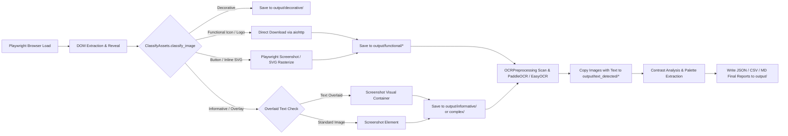

# `pranav-v2` Codebase Architecture & Image Pipeline Analysis

> [!NOTE]
> This analysis is based on the source code in the `pranav-v2` branch/codebase (`ka11y-python` and core pipeline modules). All claims cite authoritative source files and functions.

---

## 1. Output Directory Structure

### Directory Creation Location & Module
* **Base Output Directory**: Configured via `input.output_dir` in [`config/universal.yml`](file:///home/meghana/BlueCaffeine/ka11y-project/ka11y/config/universal.yml#L6) or [`ka11y/config/config.yml`](file:///home/meghana/BlueCaffeine/ka11y-project/ka11y/ka11y-python/ka11y/config/config.yml#L5) (defaults to `"crawled_images"`).
* **Per-Run Directory Creation**: Function [`get_output_dir()`](file:///home/meghana/BlueCaffeine/ka11y-project/ka11y/ka11y-python/ka11y/api/v1/dependencies.py#L66-L96) in `ka11y/api/v1/dependencies.py` derives the unique run folder:
  ```python
  path = (base_out / f"{safe_domain}_{ts}_{uid}").resolve()
  path.mkdir(parents=True, exist_ok=True)
  ```
* **Subdirectory Creation**: Handled by [`AsyncImageCrawler._create_directories()`](file:///home/meghana/BlueCaffeine/ka11y-project/ka11y/ka11y-python/ka11y/crawler/crawler.py#L176-L182) in `ka11y/crawler/crawler.py` and [`OCRPreprocessing.__init__()`](file:///home/meghana/BlueCaffeine/ka11y-project/ka11y/ka11y-python/ka11y/text_detector/text_detector.py#L78-L82) in `ka11y/text_detector/text_detector.py`.

---

### Folder & File Layout Under `output/`

For a given run directory `crawled_images/<domain>_<MMDD_HHMM>_<uid>/`:

```text
crawled_images/<domain>_<MMDD_HHMM>_<uid>/
├── informative/                  # Standard informative images
│   └── img_<hash>.png
├── decorative/                   # Decorative / missing alt images
│   └── img_<hash>.png
├── functional/
│   ├── buttons/                  # Button image assets & screenshots
│   │   ├── img_<hash>.<ext>
│   │   └── btn_<hash>.png
│   ├── icons/                    # Icon image assets & rasterized SVGs
│   │   ├── img_<hash>.<ext>
│   │   └── svg_<hash>.png
│   ├── logos/                    # Brand/logo image assets
│   │   └── img_<hash>.<ext>
│   └── images/                   # Clickable functional images
│       └── img_<hash>.png
├── complex/
│   ├── charts/                   # Charts & diagram screenshots
│   │   └── img_<hash>.png
│   └── emojis/
├── text_detected/                # Populated by OCRPreprocessing step
│   ├── button_text/              # Raw copies of button images containing text
│   ├── informational_text/       # Raw copies of informative images with text
│   ├── logo_text/                # Raw copies of logo images with text
│   ├── with_text/                # Raw copies of general images with text
│   ├── text_detection_report.json# Full OCR JSON manifest (TextDetectionReport)
│   └── contrast/                 # Contrast analysis output subfolder
│       ├── contrast_report.csv   # Per-region text contrast ratio CSV
│       ├── contrast_report.json  # Raw contrast analysis JSON
│       └── contrast_report.md    # Markdown contrast report & palette tables
├── metadata/                     # Execution metadata
├── images_report.json            # Full image crawl manifest (CrawlReport)
├── images_with_alt_text.csv      # CSV summary of all crawled images & alt texts
├── audit_report.csv              # AltTextAccessibilityAuditor WCAG 1.1.1 & 4.1.2 report
├── audit_form_report.csv         # FormAccessibilityAuditor WCAG 3.3.1 / 3.3.2 report
└── raw_forms.json                # AsyncFormCrawler raw form JSON dump
```

---

### Configurability
* **Configurable**: Base output directory path (`crawled_images`) and subfolder names (`informative`, `decorative`, `functional/buttons`, `text_detected`, `contrast`, etc.) are configurable via YAML in [`config/universal.yml`](file:///home/meghana/BlueCaffeine/ka11y-project/ka11y/config/universal.yml#L8-L27).
* **Fixed**: Per-run folder naming pattern (`<domain>_<MMDD_HHMM>_<uid>`) and individual report filenames (`images_report.json`, `audit_report.csv`, `contrast_report.csv`) are programmatically fixed in [`get_output_dir()`](file:///home/meghana/BlueCaffeine/ka11y-project/ka11y/ka11y-python/ka11y/api/v1/dependencies.py#L87-L89), [`save_results()`](file:///home/meghana/BlueCaffeine/ka11y-project/ka11y/ka11y-python/ka11y/crawler/crawler.py#L1088), and [`save_reports()`](file:///home/meghana/BlueCaffeine/ka11y-project/ka11y/ka11y-python/ka11y/text_detector/text_detector.py#L531-L566).

---

### Pipeline Write Timing Points
1. **Start of run**: Directories created via `path.mkdir(parents=True, exist_ok=True)` inside [`get_output_dir()`](file:///home/meghana/BlueCaffeine/ka11y-project/ka11y/ka11y-python/ka11y/api/v1/dependencies.py#L95) and [`_create_directories()`](file:///home/meghana/BlueCaffeine/ka11y-project/ka11y/ka11y-python/ka11y/crawler/crawler.py#L181).
2. **Per-image (streaming)**:
   * Screenshots & raw files are written directly during the Playwright crawl pass in [`AsyncImageCrawler._crawl_one_page()`](file:///home/meghana/BlueCaffeine/ka11y-project/ka11y/ka11y-python/ka11y/crawler/crawler.py#L720-L1003).
   * OCR candidate images with text are copied into `text_detected/<category>/` during [`OCRPreprocessing.detect_text_in_image()`](file:///home/meghana/BlueCaffeine/ka11y-project/ka11y/ka11y-python/ka11y/text_detector/text_detector.py#L419).
3. **End-of-step / End-of-run (batch reporting)**:
   * `images_report.json` and `images_with_alt_text.csv` are written by [`AsyncImageCrawler.save_results()`](file:///home/meghana/BlueCaffeine/ka11y-project/ka11y/ka11y-python/ka11y/crawler/crawler.py#L1088-L1160).
   * `text_detection_report.json` and `contrast_report.*` are written by [`TextClassification.save_reports()`](file:///home/meghana/BlueCaffeine/ka11y-project/ka11y/ka11y-python/ka11y/text_detector/text_detector.py#L518-L578).
   * `audit_report.csv` is written by [`AltTextAccessibilityAuditor.generate_audit_report()`](file:///home/meghana/BlueCaffeine/ka11y-project/ka11y/ka11y-python/ka11y/accessibility/rules/non_text/alttext.py#L1030).

---

## 2. Image Discovery and Classification

### Discovery & Extraction Logic
Executed in [`AsyncImageCrawler._crawl_one_page()`](file:///home/meghana/BlueCaffeine/ka11y-project/ka11y/ka11y-python/ka11y/crawler/crawler.py#L565-L1044) using Playwright locators across 3 passes:
1. **Lazy Loading & DOM Unfolding**: [`_trigger_lazy_loading()`](file:///home/meghana/BlueCaffeine/ka11y-project/ka11y/ka11y-python/ka11y/crawler/crawler.py#L223-L257) scrolls down in passes and dispatches `IntersectionObserver` / `lazyload` events. [`_reveal_hidden_images()`](file:///home/meghana/BlueCaffeine/ka11y-project/ka11y/ka11y-python/ka11y/crawler/crawler.py#L259-L293) clicks interactive tabs, accordions, dropdowns, and modals to expose hidden images.
2. **Pass 1 (`` and `<input type="image">`)**: Queries `page.locator('img, input[type="image"]')`. Evaluates `_is_visible()`, resolves URLs via [`_resolve_src()`](file:///home/meghana/BlueCaffeine/ka11y-project/ka11y/ka11y-python/ka11y/crawler/crawler.py#L295-L315) (checking `src`, `data-src`, `data-lazy-src`, `data-original`, `srcset`, `data-srcset`), extracts accessible text (`aria-labelledby`, `aria-label`, `alt`), and deduplicates via a composite key: `abs_src|alt|role|parentTag|clickable`.
3. **Pass 2 (Standalone Buttons)**: Queries `button, input[type="button"], input[type="submit"], input[type="reset"], [role="button"], a[class*="btn"]`. Deduplicates via HTML outer markup MD5 hash.
4. **Pass 3 (Inline `<svg>` Elements)**: Queries `page.locator("svg")`. Extracts `aria-label`, `<title>`, `role`, and `aria-hidden`.

---

### Classification Cascade
Classification occurs in [`ClassifyAssets.classify_image()`](file:///home/meghana/BlueCaffeine/ka11y-project/ka11y/ka11y-python/ka11y/classifier/classifier.py#L191-L410) in `ka11y/classifier/classifier.py`:

```mermaid
graph TD
    A[Image / Element Discovered] --> B{Step 0: aria-hidden=true OR role=presentation?}
    B -- Yes --> C[decorative / presentational]
    B -- No --> D{Step 1a: _is_button OR inButton?}
    D -- Yes --> E[functional / buttons]
    D -- No --> F{Step 1b: inRealLink AND _is_logo?}
    F -- Yes --> G[functional / logos]
    F -- No --> H{Step 1c: _is_chart?}
    H -- Yes --> I[complex / charts]
    H -- No --> J{Step 1d: _is_icon AND inLink/hasClick?}
    J -- Yes --> K[functional / icons]
    J -- No --> L{Step 1e: inRealLink OR hasClick?}
    L -- Yes --> M[functional / images]
    L -- No --> N{Step 2: standalone _is_logo?}
    N -- Yes & Alt Present --> O[informative / logos]
    N -- Yes & No Alt --> P[decorative / decorative]
    N -- No --> Q{Step 3: standalone _is_icon?}
    Q -- Yes & Alt Present --> R[informative / icons]
    Q -- Yes & No Alt --> S[decorative / decorative]
    Q -- No --> T{Step 4: Alt text attribute?}
    T -- alt is None --> U[decorative / missing_alt]
    T -- alt='' --> V[decorative / decorative]
    T -- alt text present --> W[informative / succinct | general | extended]
```

* **`text_detected` classification**: Executed downstream in [`OCRPreprocessing._determine_category()`](file:///home/meghana/BlueCaffeine/ka11y-project/ka11y/ka11y-python/ka11y/text_detector/text_detector.py#L95-L104). When OCR engine ([`PaddleOCR` or `EasyOCR`](file:///home/meghana/BlueCaffeine/ka11y-project/ka11y/ka11y-python/ka11y/text_detector/text_detector.py#L34-L41)) detects valid text, the image is assigned to `button_text`, `logo_text`, `informational_text`, or `with_text` based on path string keywords.

---

### Category Signals & Feature Dependencies
* **Decorative**: `aria-hidden="true"`, `role="presentation"|"none"`, explicit `alt=""`, missing `alt`, or standalone icon/logo without alt.
* **Functional Buttons**: Tags `<button>`, `<input type="button|submit|reset">`, `role="button"`, `onclick` attribute, `.btn` CSS class on parent/ancestor.
* **Functional Logos**: Keywords (`logo`, `brand`, `wordmark`, `ロゴ`, etc.) in `src`, `alt`, `class`, `id`, `title`, OR homepage link (`href="/"`) in `<header>`/`<nav>` with logo aria-label, AND element inside a link.
* **Functional Icons**: Tags `<i>`/`<span>` with icon prefixes (`fa-`, `material-icons`, `bi-`, `lucide`, etc.), `<svg>`/`` with icon keywords or small square dimensions ($\le 96 \times 96$ px, aspect ratio $0.33 \le \text{aspect} \le 3.0$), AND clickable link/onclick.
* **Complex Charts**: Weighted scoring ($\ge 3$ points): chart keywords in alt (+3), src (+2), class (+2), title (+1), chart JS libraries on page like Chart.js/D3/Highcharts (+2), `<figure>` ancestor (+1).
* **Text Detected**: Image passed through OCR engine (`readtext()`). Signals: valid OCR bounding boxes, confidence score $\ge 0.6$, non-symbol text length $>1$, region area $\ge 500\text{ px}^2$. Categorized by source image folder string (`button`, `logo`, `informative`).

---

### Tagging & Storage Location
* Tagged in-memory as [`ImageData`](file:///home/meghana/BlueCaffeine/ka11y-project/ka11y/ka11y-python/ka11y/crawler/models.py) Pydantic objects (`classification`, `sub_type`, `is_functional`, `is_decorative`, `is_complex`, `is_text_image`, `is_logo`, `is_icon`, `is_button`, `file_format`, `aria_hidden`, `role`).
* Saved to `images_report.json`, `images_with_alt_text.csv`, `text_detection_report.json`, `contrast_report.csv`, and `audit_report.csv`.

---

## 3. Screenshot Capture Logic

* **Trigger**: Performed per-element during the crawl loop in [`AsyncImageCrawler._crawl_one_page()`](file:///home/meghana/BlueCaffeine/ka11y-project/ka11y/ka11y-python/ka11y/crawler/crawler.py#L720-L1003).
* **Tool/Library**: Playwright Python API (`element.screenshot(path=..., timeout=5000)`) wrapped in helper [`AsyncImageCrawler._safe_screenshot()`](file:///home/meghana/BlueCaffeine/ka11y-project/ka11y/ka11y-python/ka11y/crawler/crawler.py#L317-L346).
* **Screenshotted vs. Skipped**:
  * **Screenshotted**: Informative images, complex charts, HTML buttons (`<button>`, `[role=button]`), overlay containers, and inline `<svg>` elements (rasterized to PNG so downstream OpenCV/OCR can parse them).
  * **Skipped**: Elements with `display:none` / `visibility:hidden` / `opacity:0` (via [`_is_visible()`](file:///home/meghana/BlueCaffeine/ka11y-project/ka11y/ka11y-python/ka11y/crawler/crawler.py#L183-L221)), bounding box width/height < 1px, duplicate images matching deduplication keys, and buttons resulting in empty/blank PNG files (< 500 bytes).

---

## 4. Image Download Logic

* **How Downloaded**: Direct HTTP GET fetch via `aiohttp.ClientSession` in [`ClassifyAssets._download_file()`](file:///home/meghana/BlueCaffeine/ka11y-project/ka11y/ka11y-python/ka11y/classifier/classifier.py#L701-L717).
* **Raw Download vs. Screenshot**:
  * **Downloaded as Raw Files**: Icons (`cr.is_icon`) and image buttons (`cr.is_button`) with valid `src` URLs are directly downloaded first via `_download_file()` preserving original extensions (`.png`, `.svg`, `.ico`, `.webp`). If download fails, it falls back to Playwright screenshot.
  * **Screenshotted Only**: Standalone HTML buttons (no image `src`), inline `<svg>` markup (must be rasterized to PNG for OpenCV/OCR), and images with text overlays.

---

## 5. Overlay / Text-Image Screenshots

### Logic for Generating Overlay Screenshots
In [`AsyncImageCrawler._crawl_one_page()`](file:///home/meghana/BlueCaffeine/ka11y-project/ka11y/ka11y-python/ka11y/crawler/crawler.py#L760-L779), before screenshotting an image, the crawler calls [`ClassifyAssets.get_visual_container(img, page)`](file:///home/meghana/BlueCaffeine/ka11y-project/ka11y/ka11y-python/ka11y/classifier/classifier.py#L674-L698).
This function evaluates the parent elements up to 3 levels up in the DOM to check if any sibling element has `position: absolute`, overlaps the image bounding box, and contains text ($3 < \text{length} < 200$). If an overlay container is detected, Playwright screenshots **the entire parent container** rather than just the `` element.

### Trigger & Purpose
* **Trigger Category**: General & informative images where live HTML text is positioned over the image.
* **Why**: Web pages frequently draw live HTML text on top of background images or banners. Screenshotting the `` alone misses the text. Screenshotting the visual container preserves the rendered image + text combination so downstream OCR ([`OCRPreprocessing`](file:///home/meghana/BlueCaffeine/ka11y-project/ka11y/ka11y-python/ka11y/text_detector/text_detector.py#L222)) and contrast checkers ([`contrast_analyser`](file:///home/meghana/BlueCaffeine/ka11y-project/ka11y/ka11y-python/ka11y/accessibility/rules/non_text/contrast_analyser.py)) can extract the text and calculate foreground/background color contrast.

### What gets Analyzed & Drawn
* `OCRPreprocessing.detect_text_in_image()` runs PaddleOCR/EasyOCR on the screenshot to extract bounding boxes (`clean_bbox`), text strings, and font metrics.
* [`contrast_analyser`](file:///home/meghana/BlueCaffeine/ka11y-project/ka11y/ka11y-python/ka11y/accessibility/rules/non_text/contrast_analyser.py) and [`extract_color`](file:///home/meghana/BlueCaffeine/ka11y-project/ka11y/ka11y-python/ka11y/preprocessor/extract_color.py#L302) extract foreground text colors and background palette clusters ($k=3$), computing contrast ratios $CR = \frac{L_1 + 0.05}{L_2 + 0.05}$ and evaluating WCAG 2.1 compliance (4.5:1 AA normal text, 3:1 AA large/bold text / UI components).
* Results are compiled into tabular reports in `contrast_report.csv`, `contrast_report.json`, and `contrast_report.md`.

---

## 6. File Saving Map

| Image Category | What Gets Saved | Output Subfolder / Naming Pattern | Writing Function & Source File |
| :--- | :--- | :--- | :--- |
| **Informative Image** | PNG Screenshot | `informative/img_<hash>.png` | [`AsyncImageCrawler._crawl_one_page()`](file:///home/meghana/BlueCaffeine/ka11y-project/ka11y/ka11y-python/ka11y/crawler/crawler.py#L771) |
| **Decorative Image** | PNG Screenshot | `decorative/img_<hash>.png` | [`AsyncImageCrawler._crawl_one_page()`](file:///home/meghana/BlueCaffeine/ka11y-project/ka11y/ka11y-python/ka11y/crawler/crawler.py#L771) |
| **Functional Icon** | Raw file or PNG screenshot / rasterized SVG | `functional/icons/img_<hash>.<ext>` or `svg_<hash>.png` | [`ClassifyAssets._download_file()`](file:///home/meghana/BlueCaffeine/ka11y-project/ka11y/ka11y-python/ka11y/classifier/classifier.py#L701) / [`AsyncImageCrawler._safe_screenshot()`](file:///home/meghana/BlueCaffeine/ka11y-project/ka11y/ka11y-python/ka11y/crawler/crawler.py#L999) |
| **Functional Button** | Raw file or PNG screenshot | `functional/buttons/img_<hash>.<ext>` or `btn_<hash>.png` | [`ClassifyAssets._download_file()`](file:///home/meghana/BlueCaffeine/ka11y-project/ka11y/ka11y-python/ka11y/classifier/classifier.py#L701) / [`AsyncImageCrawler._safe_screenshot()`](file:///home/meghana/BlueCaffeine/ka11y-project/ka11y/ka11y-python/ka11y/crawler/crawler.py#L911) |
| **Functional Logo** | Raw file or PNG screenshot | `functional/logos/img_<hash>.<ext>` | [`ClassifyAssets._download_file()`](file:///home/meghana/BlueCaffeine/ka11y-project/ka11y/ka11y-python/ka11y/classifier/classifier.py#L701) |
| **Complex Chart** | PNG Screenshot | `complex/charts/img_<hash>.png` | [`AsyncImageCrawler._safe_screenshot()`](file:///home/meghana/BlueCaffeine/ka11y-project/ka11y/ka11y-python/ka11y/crawler/crawler.py#L771) |
| **Text Detected** | Raw image copy & Reports | `text_detected/<category>/<filename>`<br>`text_detected/text_detection_report.json`<br>`text_detected/contrast/contrast_report.csv` | [`OCRPreprocessing.detect_text_in_image()`](file:///home/meghana/BlueCaffeine/ka11y-project/ka11y/ka11y-python/ka11y/text_detector/text_detector.py#L419) / [`TextClassification.save_reports()`](file:///home/meghana/BlueCaffeine/ka11y-project/ka11y/ka11y-python/ka11y/text_detector/text_detector.py#L547) |
| **Crawl Summary Reports**| JSON & CSV manifests | `images_report.json`<br>`images_with_alt_text.csv`<br>`audit_report.csv` | [`AsyncImageCrawler.save_results()`](file:///home/meghana/BlueCaffeine/ka11y-project/ka11y/ka11y-python/ka11y/crawler/crawler.py#L1088) / [`AltTextAccessibilityAuditor.generate_audit_report()`](file:///home/meghana/BlueCaffeine/ka11y-project/ka11y/ka11y-python/ka11y/accessibility/rules/non_text/alttext.py#L1030) |

---

## Complete Pipeline Flow Diagram


