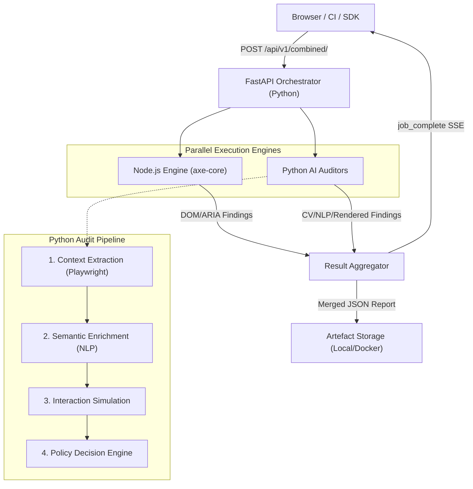

# ka11y — AI-Powered WCAG Accessibility Auditing

**ka11y** is a next-generation accessibility auditing platform that transcends traditional DOM-based scanning. By combining industry-standard DOM analysis with advanced Computer Vision (CV) and Natural Language Processing (NLP), ka11y detects complex accessibility violations that automated tools typically miss—such as descriptive alt-text accuracy, animated content controls, and interactive target sizes.

---

## 🏗 Architecture Overview

The system operates on a hybrid, parallel execution model. A central **Python FastAPI** orchestrator manages high-level job lifecycle and SSE (Server-Sent Events) broadcasting, while specialized engines handle different audit domains.

### System Flow


---

## 🚀 Key Features

- **Hybrid Auditing Engine:** Runs `axe-core` (Node.js) for DOM structure and ARIA semantics alongside **Python Auditors** for visual and behavioral checks.
- **AI-Powered Visual Analysis:** Uses OCR and Image Classification to verify if alt-text actually describes the image content (WCAG 1.1.1).
- **Behavioral Detection:** Identifies moving content like carousels and autoplay videos (WCAG 2.2.2).
- **Real-time Feedback:** Streams audit progress via **Server-Sent Events (SSE)**, allowing frontends to display live status cards for each stage.
- **Graceful Degradation:** If one engine fails or times out, the system returns partial results with warnings rather than a hard failure.

---

## 🛠 Tech Stack

### Backend (Orchestration & AI)
- **Framework:** [FastAPI](https://fastapi.tiangolo.com/) (Python 3.13+)
- **Automation:** [Playwright](https://playwright.dev/) (Browser orchestration & context extraction)
- **Computer Vision:** [EasyOCR](https://github.com/JaidedAI/EasyOCR), [OpenCV](https://opencv.org/)
- **NLP & ML:** [PyTorch](https://pytorch.org/), [Hugging Face Transformers](https://huggingface.co/docs/transformers/index), [SpaCy](https://spacy.io/), [Google Gemini AI](https://ai.google.dev/)
- **Audio/Speech:** [Faster-Whisper](https://github.com/SYSTRAN/faster-whisper)

### Backend (DOM Analysis)
- **Runtime:** Node.js
- **Engine:** [axe-core](https://github.com/dequelabs/axe-core)

### Frontend (SDK & Dashboard)
- **Library:** React (TypeScript)
- **Styling:** Tailwind CSS
- **Build Tool:** Vite
- **Package Manager:** Bun

### DevOps
- **Containerization:** Docker & Docker Compose
- **Configuration:** YAML-based universal config

---

## 📖 Solution Components

### 1. Unified Accessibility Pipeline
Instead of evaluating elements in isolation, `ka11y` uses a **Centralized Context Pipeline**. It extracts the full page state (DOM, CSS, ARIA, Bounding Boxes) once and feeds this "Rich Context" into multiple WCAG policies. This drastically reduces false positives in complex checks like **2.5.8 Target Size**.

### 2. Python AI Auditors
Specialized auditors handle criteria that require "human-like" understanding:
- **Alt-Text Auditor:** Compares the visible image content (via OCR/Classification) against the `alt` attribute.
- **Form Auditor:** Verifies visible labels and error identification (WCAG 3.3.1/3.3.2).
- **Motion Auditor:** Detects animated GIFs, CSS animations, and JS-driven layout shifts.

### 3. SSE Progress Bus
The system maintains an internal event bus. As each stage (axe-core, image-crawl, form-audit) starts or completes, an event is broadcast to all connected clients. This provides a responsive, "live" experience for long-running audits.

---

## 📂 Project Structure

- `ka11y-python/`: The core FastAPI application, AI auditors, and Playwright crawlers.
- `ka11y-node/`: Node.js microservice wrapping `axe-core` for standard DOM audits.
- `ka11y-frontend-sdk/`: A React-based UI components and hooks for integrating ka11y results.
- `ka11y-docs/`: Comprehensive technical documentation and WCAG mapping guides.
- `i18n/`: Multi-language support for audit findings (currently English, Japanese, German).

---

## 🔌 Combined Accessibility Endpoint

A combined endpoint is available to run Node and Python checks simultaneously on the same target URL:

### GET `/api/ka11y/combined?url=<target-url>`

**Response Format:**
```json
{
  "url": "https://example.com",
  "node_result": { ... },
  "python_result": { ... },
  "combined_summary": {
    "total_issues": 3,
    "critical": 1,
    "warnings": 2
  }
}
```

### Running Locally

1. **Start the Node service:**
   ```bash
   cd ka11y-node
   npm install
   npm run dev # Runs on port 3000 by default
   ```

2. **Start the Python service:**
   ```bash
   cd ka11y-python
   poetry install
   poetry run uvicorn ka11y.main:app --reload --port 8000
   ```

3. **Request Combined Results:**
   Send a `GET` request to `http://localhost:3000/api/ka11y/combined?url=https://example.com`.

