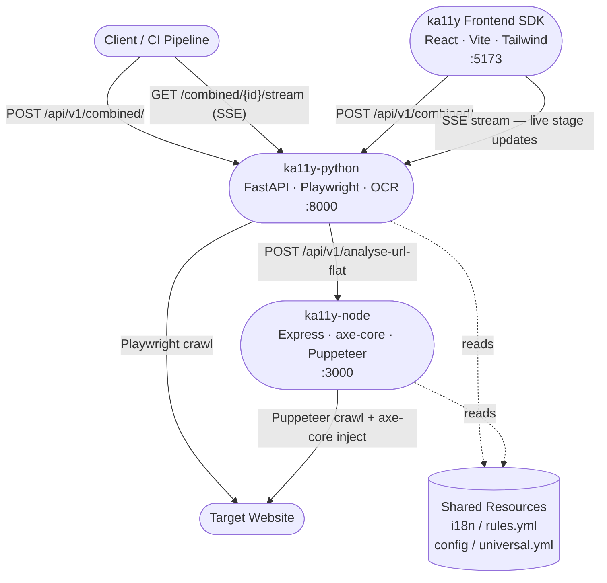
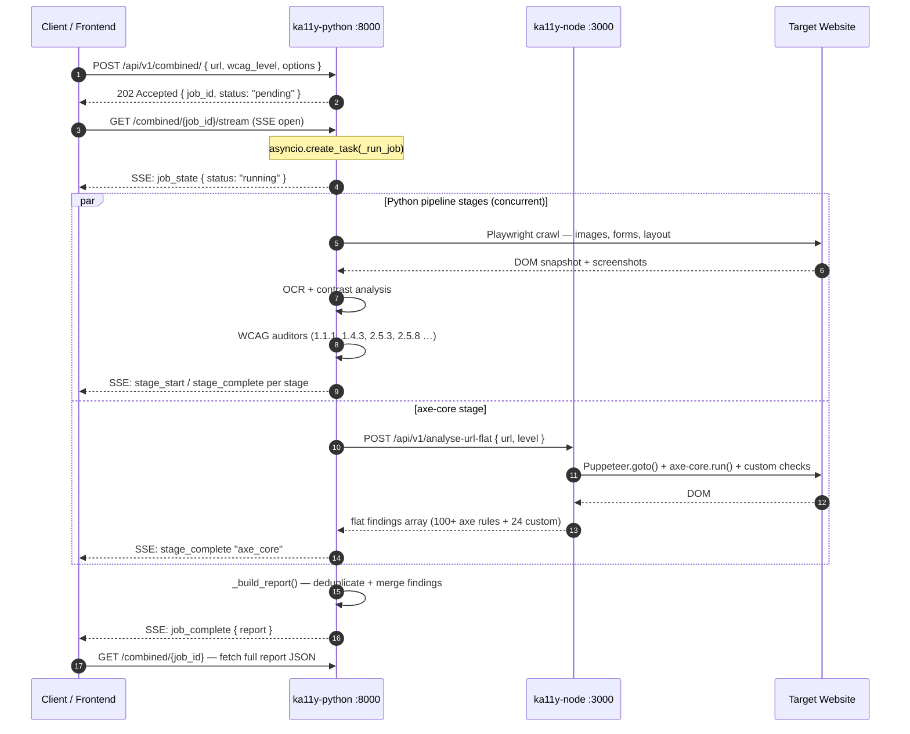
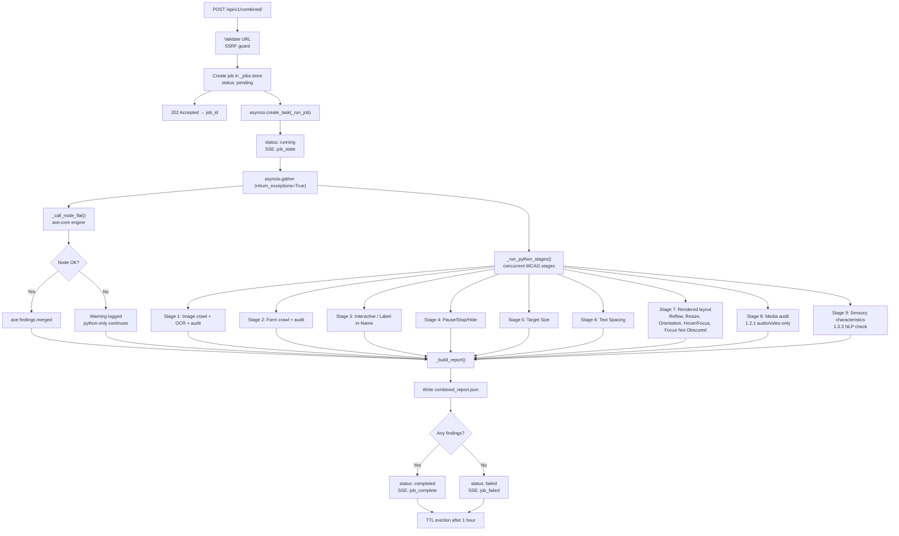
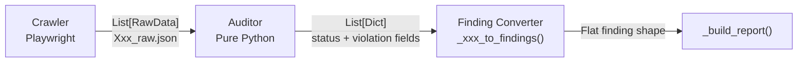
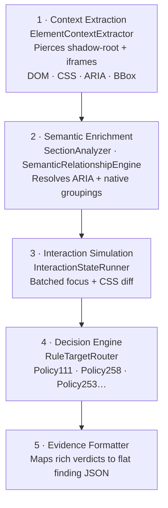
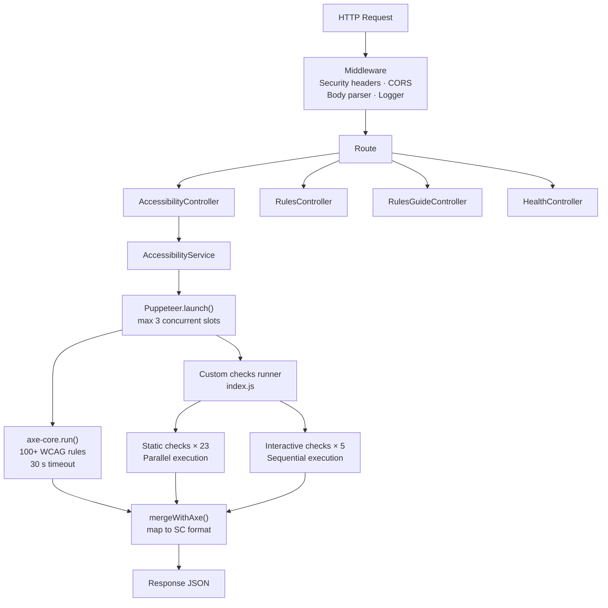
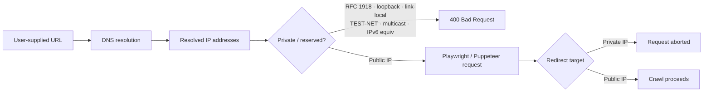

## Platform overview

ka11y is a **three-service platform** that automates WCAG 2.0 / 2.1 / 2.2 accessibility auditing for any live web URL. A React dashboard consumes the results in real time.



---

## Service responsibilities

<CardGroup cols={3}>
  <Card title="ka11y-python" icon="python">
    **Port 8000 · FastAPI**

    Core orchestration engine. Runs background audit jobs, crawls pages with Playwright, performs OCR + contrast analysis, and merges findings from the Node engine into a unified report.
  </Card>
  <Card title="ka11y-node" icon="node-js">
    **Port 3000 · Express**

    DOM accessibility engine. Injects axe-core into live pages via Puppeteer and runs 28 custom WCAG checks not covered by axe-core (focus traps, keyboard shortcuts, pointer cancellation, media captions, CSS background-image content, etc.).
  </Card>
  <Card title="ka11y-frontend-sdk" icon="react">
    **Port 5173 · React + Vite**

    Audit dashboard. Submits audit jobs, streams real-time stage progress via SSE, and renders violations, needs-review items, passes, contrast reports, and image visualisations.
  </Card>
</CardGroup>

---

## Audit request flow



---

## ka11y-python internals

### Job lifecycle



### Crawler → Auditor pattern (legacy stages)

For stages not in the Unified Pipeline, each rule follows a strict two-class separation:



The auditor never touches Playwright — it only processes the JSON the crawler writes. This keeps auditors fully unit-testable without a browser.

### Unified Accessibility Pipeline (primary path)

For rules that require shared DOM context (1.1.1, 2.5.3, 2.5.8, 1.4.5, etc.), a centralised five-stage pipeline eliminates false positives by giving all rules the same computed page state:



---

## ka11y-node internals

### Request flow



### Custom checks (28 rules beyond axe-core)

| Check | WCAG SC | Mode |
|---|---|---|
| custom-focus-visible | 2.4.7 | Interactive |
| custom-focus-appearance | 2.4.11 / 2.4.13 | Interactive |
| custom-keyboard-trap | 2.1.2 | Interactive |
| custom-on-focus | 3.2.1 | Interactive |
| custom-on-input | 3.2.2 | Interactive |
| custom-html-parsing | 4.1.1 | Static |
| custom-status-messages | 4.1.3 | Static |
| custom-character-key-shortcuts | 2.1.4 | Static |
| wcag-2.5.1-pointer-gestures | 2.5.1 | Static |
| custom-pointer-cancellation | 2.5.2 | Static |
| custom-dragging-movements | 2.5.7 | Static |
| custom-motion-actuation | 2.5.4 | Static |
| custom-consistent-help | 3.2.6 | Static |
| custom-error-suggestion | 3.3.3 | Static |
| custom-error-prevention | 3.3.4 | Static |
| custom-redundant-entry | 3.3.7 | Static |
| custom-accessible-auth | 3.3.8 | Static |
| custom-use-of-color | 1.4.1 | Static |
| custom-audio-transcript | 1.2.1 | Static |
| custom-audio-control | 1.4.2 | Static |
| custom-audio-description | 1.2.3 / 1.2.5 | Static |
| custom-captions-prerecorded | 1.2.2 | Static |
| custom-background-image-content | 1.1.1 / 1.4.5 | Static |
| custom-multiple-ways | 2.4.5 | Static |
| custom-meaningful-sequence | 1.3.2 | Static |
| custom-link-purpose | 2.4.9 | Static |
| custom-location | 2.4.8 | Static |
| custom-orientation | 1.3.4 | Static |
| custom-images-of-text | 1.4.5 | Static |
| custom-pronunciation | 3.1.6 | Static |

---

## WCAG coverage map

```mermaid
graph LR
    subgraph Python ["ka11y-python — 18 criteria"]
        P1["1.1.1 Non-text Content\nAlt text · OCR · Classification"]
        P2["1.2.1 Audio/Video-only\nMedia transcripts"]
        P3["1.3.3 Sensory Characteristics"]
        P4["1.3.4 Orientation"]
        P5["1.4.3 Contrast Minimum\nOCR-based pixel analysis"]
        P6["1.4.4 Resize Text\nPlaywright viewport scale"]
        P7["1.4.5 Images of Text"]
        P8["1.4.6 Contrast Enhanced AAA"]
        P9["1.4.10 Reflow · 320 px"]
        P10["1.4.12 Text Spacing"]
        P11["1.4.13 Hover/Focus Content"]
        P12["2.2.2 Pause Stop Hide"]
        P13["2.4.11 Focus Not Obscured Min"]
        P14["2.4.12 Focus Not Obscured Enh"]
        P15["2.5.3 Label in Name"]
        P16["2.5.8 Target Size Min"]
        P17["3.3.1 Error Identification"]
        P18["3.3.2 Labels or Instructions"]
    end

    subgraph Node ["ka11y-node — 100+ axe rules + 24 custom"]
        N1["1.1.1 · 1.2.x · 1.3.x image-alt…"]
        N2["1.4.1 Use of Colour"]
        N3["2.1.2 Keyboard Trap"]
        N4["2.1.4 Character Key Shortcuts"]
        N5["2.4.5 Multiple Ways"]
        N6["2.4.7 Focus Visible"]
        N7["2.4.8 Location"]
        N8["2.4.9 Link Purpose"]
        N9["2.5.2 Pointer Cancellation"]
        N10["2.5.7 Dragging Movements"]
        N11["3.1.6 Pronunciation"]
        N12["3.2.1 On Focus · 3.2.2 On Input"]
        N13["3.2.6 Consistent Help"]
        N14["3.3.4 Error Prevention"]
        N15["3.3.5 Error Suggestion"]
        N16["3.3.7 Redundant Entry"]
        N17["3.3.8 Accessible Auth"]
        N18["4.1.1 HTML Parsing"]
        N19["4.1.3 Status Messages"]
    end
```



---

## Finding schema

Every finding — from any source — uses the same flat structure. This enables uniform display in the dashboard regardless of which engine produced it.

```json
{
  "source":         "python | axe_core | custom",
  "rule_id":        "python_1_1_1_alt",
  "wcag_sc":        "1.1.1",
  "criterion_name": "Non-text Content",
  "level":          "A | AA | AAA",
  "level_label":    "Level A",
  "severity":       "critical | high | medium | low | null",
  "severity_label": "Critical",
  "status":         "fail | needs_review | pass",
  "status_label":   "Fail",
  "reason":         "Image is missing alt attribute.",
  "reason_code":    "fail_missing_alt",
  "suggested_fix":  "Add a descriptive alt attribute…",
  "element": {
    "html":      "",
    "tag":       "IMG",
    "selector":  "main > section:nth-child(2) > img",
    "page_url":  "https://example.com/"
  }
}
```

Pass findings carry `severity: null`, `severity_label: null`, `suggested_fix: null`, and `element: null`.

`severity`, `level`, `status`, `reason_code`, and `wcag_sc` are stable machine values that never change across languages — filter and group on those. `severity_label`, `level_label`, `status_label`, `criterion_name`, `reason`, and `suggested_fix` are universally localized: pick the language with `?lang=ja` (or `de`) and every one of these fields is rendered from `i18n/rules.yml` and the matching `i18n/locales/<lang>.yml` overlay.

---

## Deduplication model

When both engines report the same violation, Python findings take precedence. The dedup key is:

```
(wcag_sc, status, element_signature)
```

where `element_signature` resolves in priority order:

1. Page-aware CSS selector
2. `target` array (axe-core format)
3. `ref_id` / `element_id`
4. SHA-256 of `html` snippet

This prevents double-counting while preserving the richer Python evidence wherever available.

---

## Security controls

Both services implement SSRF protection independently to prevent audit requests from reaching internal infrastructure:



---

## Output directory structure

Each job writes artefacts to a timestamped, domain-keyed directory:

```
crawled_images/
└── example_com_0421_1430_combined/
    ├── combined_report.json          ← Final merged report (all findings)
    ├── images_report.json            ← Image crawler metadata
    ├── audit_report.csv              ← 1.1.1 / 4.1.2 / 1.4.5 / 1.4.11
    ├── text_detected/
    │   ├── text_detection_report.json  ← OCR + contrast results
    │   └── contrast/                   ← Per-image contrast artefacts
    ├── forms_raw.json
    ├── audit_form_report.csv          ← 3.3.1 / 3.3.2
    ├── interactive_elements_raw.json
    ├── audit_label_in_name_report.csv ← 2.5.3
    ├── moving_content_raw.json
    ├── audit_pause_stop_hide_report.csv ← 2.2.2
    ├── target_size_raw.json
    └── audit_target_size_report.csv   ← 2.5.8
```

---

## Technology stack

| Layer | Technology | Purpose |
|---|---|---|
| Python API | FastAPI 0.115 + uvicorn | Async HTTP server, SSE streaming |
| Browser automation (Python) | Playwright + Chromium | Live page crawling, screenshot, interaction simulation |
| OCR engine | EasyOCR / PaddleOCR | Text detection in images for contrast analysis |
| Node API | Express 4 | HTTP server for DOM checks |
| Browser automation (Node) | Puppeteer + Chromium | Live URL crawling, axe-core injection |
| DOM accessibility engine | axe-core 4.11 | 100+ automated WCAG rule checks |
| Frontend | React 18 + Vite + Tailwind + shadcn/ui | Audit dashboard with real-time SSE updates |
| i18n | Custom YAML loader | Multi-language WCAG rule descriptions (en, ja, …) |
| Containerisation | Docker (multi-stage) | Isolated deployments per service |

---

## API surface summary

### ka11y-python (:8000)

| Method | Path | Description |
|---|---|---|
| `POST` | `/api/v1/combined/` | Submit async audit job → `job_id` |
| `GET` | `/api/v1/combined/{job_id}` | Poll job status + fetch report |
| `GET` | `/api/v1/combined/{job_id}/stream` | SSE — real-time stage events |
| `GET` | `/api/v1/combined/{job_id}/image` | Serve image artefacts |
| `POST` | `/api/v1/crawl/` | Legacy single-pass crawl |
| `POST` | `/api/v1/pipeline/` | Full 13-stage pipeline |
| `POST` | `/api/v1/{rule_id}/run` | Run single WCAG rule audit |
| `POST` | `/api/v1/{rule_id}/analyse-url` | Single-page rule check |
| `GET` | `/api/v1/health` | Python service health |
| `GET` | `/api/v1/system/health` | Combined Python + Node health |

### ka11y-node (:3000)

| Method | Path | Description |
|---|---|---|
| `POST` | `/api/v1/analyze-accessibility` | Audit raw HTML string |
| `POST` | `/api/v1/analyse-url` | Crawl URL + full accessibility audit |
| `POST` | `/api/v1/analyse-url-flat` | Crawl URL + flat findings array |
| `POST` | `/api/v1/rules/:sc/analyse-url` | Audit URL for one WCAG SC |
| `GET` | `/api/v1/rules` | List axe-core rules by SC |
| `GET` | `/api/v1/rules/wcag` | WCAG rule definitions (i18n) |
| `GET` | `/api/v1/rules-guide` | Testing guidance for all rules |
| `GET` | `/api/v1/rules-guide/:ruleId` | Testing guidance for one rule |
| `GET` | `/api/v1/health` | Node service health |
| `GET` | `/api-docs` | Swagger UI |
