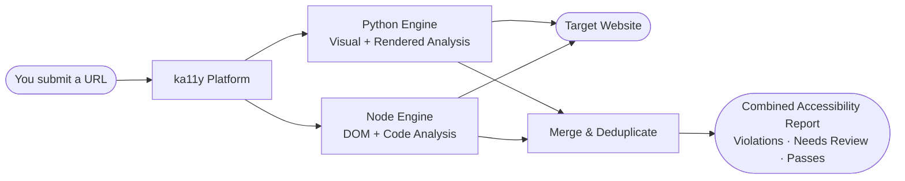
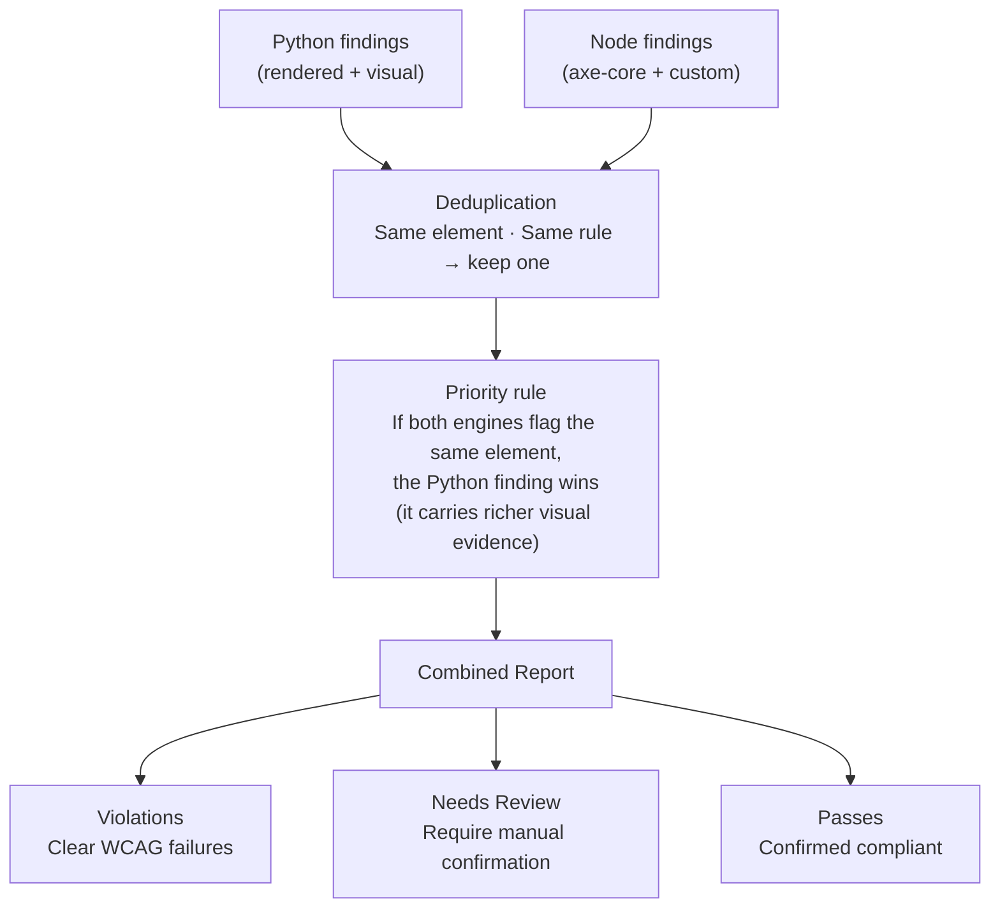
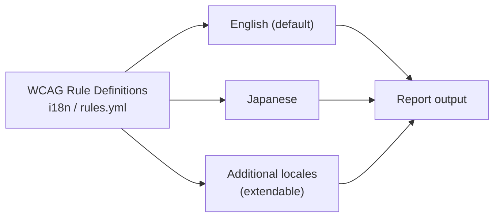
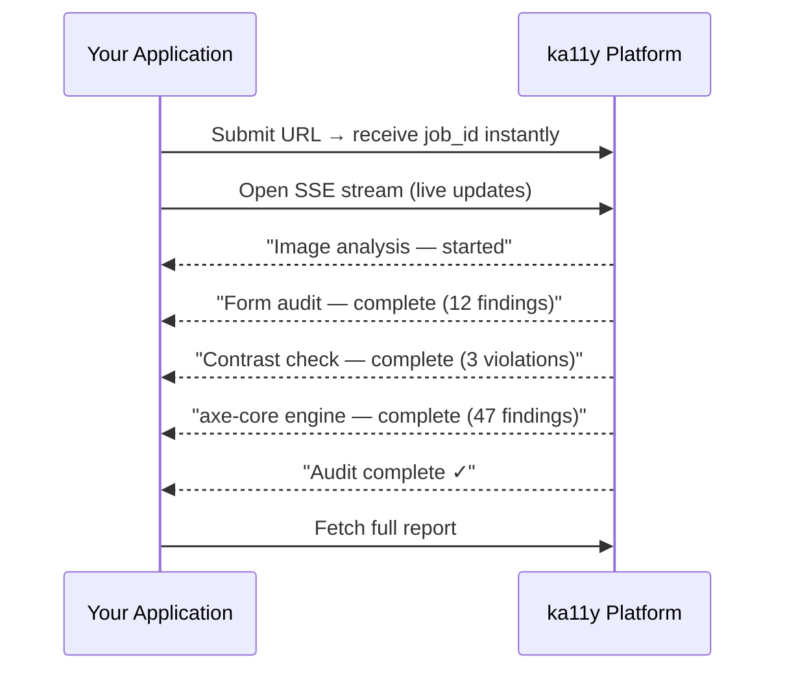

## What happens when you submit a URL

You provide a URL. ka11y launches two specialised engines simultaneously — one that analyses the **rendered visual page** and one that analyses the **underlying code structure**. Both engines crawl the same URL in parallel, then their findings are merged into a single unified report.



The two engines complement each other — neither alone gives the full picture. Together they cover **37 WCAG 2.1 / 2.2 success criteria** across conformance levels A, AA, and AAA.

---

## The two engines explained

### Engine 1 — Python (Visual analysis)

The Python engine launches a real Chromium browser, visits your URL, and analyses what a user actually **sees and experiences** on screen.

It captures screenshots of images, runs OCR (optical character recognition) to read text inside images, measures actual pixel colours to calculate contrast ratios, simulates viewport changes to test reflow and text resizing, and interacts with forms and interactive elements.

> Think of this engine as a human accessibility auditor who looks at the page visually — checking whether images are described, whether text is readable, whether buttons are large enough to tap, and whether the page holds together when zoomed.

**What it checks:**

| WCAG Criterion | Plain-English Description | Level |
|---|---|---|
| 1.1.1 Non-text Content | Every image has a meaningful description (not just a filename) | A |
| 1.2.1 Audio / Video Only | Pre-recorded audio has a transcript; silent video has a text alternative | A |
| 1.3.3 Sensory Characteristics | Instructions don't rely solely on shape, colour, or visual position | A |
| 1.3.4 Orientation | The page works in both portrait and landscape — not locked to one | AA |
| 1.4.3 Contrast (Minimum) | Text has at least 4.5 : 1 contrast against its background | AA |
| 1.4.4 Resize Text | Text can be scaled to 200% without losing content or function | AA |
| 1.4.5 Images of Text | Real text is used rather than images of text wherever possible | AA |
| 1.4.6 Contrast (Enhanced) | Text meets the stricter 7 : 1 contrast ratio | AAA |
| 1.4.10 Reflow | Content reflows cleanly at 320 px width — no horizontal scrolling | AA |
| 1.4.12 Text Spacing | Adjusting line height, letter spacing, and word spacing doesn't break the layout | AA |
| 1.4.13 Hover / Focus Content | Tooltips and pop-ups triggered by hover can be dismissed and remain visible | AA |
| 2.2.2 Pause, Stop, Hide | Moving or auto-playing content has controls to pause or stop it | A |
| 2.4.11 Focus Not Obscured (Min) | A focused element is never completely hidden behind sticky headers or overlays | AA |
| 2.4.12 Focus Not Obscured (Enh) | A focused element has at least 8 px visible — nothing obstructs it | AAA |
| 2.5.3 Label in Name | A button labelled "Submit form" is also announced as "Submit form" to screen readers — not something different | A |
| 2.5.8 Target Size (Minimum) | Interactive elements are at least 24 × 24 CSS pixels — easy to tap on touch devices | AA |
| 3.3.1 Error Identification | Form validation errors are described in text, not just indicated with colour | A |
| 3.3.2 Labels or Instructions | Every form field has a visible label or clear instructions | A |

---

### Engine 2 — Node (Code analysis)

The Node engine also visits your URL with a real browser (Puppeteer), but instead of looking at visual output it **inspects the page's code and DOM**. It injects the industry-standard axe-core library (used by Deque, Microsoft, Google, and others), which runs over 100 automated WCAG rule checks against the page structure. On top of axe-core, ka11y adds 28 of its own custom checks for rules axe-core doesn't cover — including media captions, audio-only transcripts, and a CSS `background-image` content scan that flags meaningful backgrounds with no accessible name.

> Think of this engine as a technical auditor who reads the source code — checking whether screen readers can understand the page, whether the keyboard can navigate every element, and whether the HTML structure is semantically correct.

**axe-core covers (selected examples):**

| WCAG Criterion | Plain-English Description | Level |
|---|---|---|
| 1.1.1 Non-text Content | `` tags have `alt` attributes present | A |
| 1.3.1 Info and Relationships | Headings, lists, and tables use correct HTML elements | A |
| 1.3.5 Identify Input Purpose | Form inputs declare their purpose (name, email, etc.) | AA |
| 2.4.1 Bypass Blocks | A skip-to-content link is present | A |
| 2.4.2 Page Titled | The page has a meaningful `<title>` | A |
| 2.4.3 Focus Order | Keyboard focus moves in a logical sequence | A |
| 2.4.6 Headings and Labels | Headings and labels are descriptive | AA |
| 4.1.2 Name, Role, Value | Every interactive element has an accessible name and role | A |
| + 90 more rules | Covering WCAG 2.0 A/AA/AAA, WCAG 2.1, WCAG 2.2 | A–AAA |

**ka11y custom checks on top of axe-core:**

| WCAG Criterion | Plain-English Description | Level |
|---|---|---|
| 2.4.7 Focus Visible | A visible focus indicator appears when tabbing through the page | AA |
| 2.1.2 Keyboard Trap | Keyboard focus cannot become trapped inside a component | A |
| 2.1.4 Character Key Shortcuts | Single-key shortcuts can be remapped or disabled | A |
| 3.2.1 On Focus | Moving focus to an element does not trigger unexpected navigation | A |
| 3.2.2 On Input | Changing an input value does not unexpectedly submit a form | A |
| 4.1.1 Parsing | No duplicate IDs or broken ARIA references in the HTML | A |
| 4.1.3 Status Messages | Success/error messages are announced to screen readers | AA |
| 1.4.1 Use of Colour | Colour is not the only means of conveying information | A |
| 2.5.2 Pointer Cancellation | Click/tap actions can be cancelled before release | A |
| 2.5.7 Dragging Movements | Drag-and-drop operations have a single-pointer alternative | AA |
| 3.2.6 Consistent Help | Help mechanisms (chat, phone, FAQ) appear in the same location on every page | A |
| 3.3.4 Error Prevention | High-stakes submissions (payments, legal) are reversible or require confirmation | AA |
| 3.3.8 Accessible Authentication | Login does not require solving a cognitive puzzle | AA |
| 2.4.5 Multiple Ways | Pages can be reached by more than one navigation path | AA |
| 1.3.2 Meaningful Sequence | Reading order matches the visual layout | A |
| 1.2.2 Captions (Prerecorded) | `<track kind="captions">` is present on prerecorded video | A |
| 1.2.3 / 1.2.5 Audio Description | Prerecorded video carries audio description or an alternative media track | A / AA |
| 1.4.2 Audio Control | Auto-playing audio longer than 3 seconds can be paused or muted | A |
| 1.1.1 / 1.4.5 Background image content | CSS `background-image` backgrounds carrying meaningful content or text have an accessible name (filename heuristic) | A / AA |
| + more | Covering pronunciation, orientation, images of text, audio transcripts | A–AAA |

---

## How the two reports become one

After both engines complete, ka11y merges their findings using a three-step process.



**Why deduplication matters:** Some rules — such as 1.1.1 (alt text) or 1.3.4 (orientation) — are checked by both engines. Without deduplication, the same issue would appear twice in the report. ka11y uses a fingerprint of the element and WCAG criterion to detect overlaps, so each issue appears exactly once.

**Why Python takes precedence on conflicts:** The Python engine has access to rendered pixel data and screenshots. For visual rules like contrast, its evidence is more accurate than axe-core's heuristic estimates.

---

## What the report contains

Every finding, regardless of source, looks the same:

| Field | What it tells you |
|---|---|
| WCAG Criterion | Which success criterion is affected (e.g. 1.4.3) |
| Level | Whether this is a Level A, AA, or AAA requirement |
| Severity | Critical / High / Medium / Low — based on user impact |
| Status | Fail · Needs Review · Pass |
| Reason | A plain-English description of what is wrong |
| Suggested Fix | A specific, actionable recommendation |
| Element | The exact HTML element on the page that failed |
| Source | Which engine detected it |

**Summary statistics** at the top of every report:

- Total findings broken down by status (violations / needs review / passes)
- Breakdown by severity (critical → low)
- Breakdown by WCAG conformance level (A / AA / AAA)
- Breakdown by WCAG success criterion

---

## Language support

ka11y ships with WCAG rule descriptions in **multiple languages**. The `lang` parameter on any audit request selects the language for criterion names, severity labels, and error descriptions in the report.



Both the Python and Node engines read from the **same shared i18n files**, so the language is consistent across findings from both sources.

To request a Japanese-language report:

```
POST /api/v1/combined/
{ "url": "https://example.com", "lang": "ja" }
```

---

## Delivery model — real-time vs. polling

Because a full audit can take 30–90 seconds (more pages = more time), ka11y uses an **asynchronous job model** with real-time progress streaming.



**Two ways to consume results:**

| Method | Use case |
|---|---|
| **SSE stream** (`/combined/{id}/stream`) | Live dashboards, progress indicators, real-time UI updates |
| **Polling** (`GET /combined/{id}`) | CI pipelines, batch scripts, webhook-style integrations |

---

## Coverage summary

| | Python Engine | Node Engine |
|---|---|---|
| **Technology** | Playwright (Chromium) | Puppeteer + axe-core |
| **Approach** | Visual / rendered analysis | DOM / code analysis |
| **WCAG criteria covered** | 18 | 100+ (axe) + 28 custom |
| **Contrast checking** | Pixel-accurate OCR measurement | Heuristic CSS estimation |
| **Form analysis** | Label presence, error messaging | Semantic correctness |
| **Keyboard testing** | Target size, focus obscured | Keyboard trap, focus visible, shortcuts |
| **Language support** | Yes — `lang` parameter | Yes — `lang` parameter |
| **Output format** | Flat finding JSON | Flat finding JSON (same schema) |
