> 生成日: 2026-04-08
> スコープ: `ka11y-node/src/custom-checks/`（カスタム WCAG チェック 24 件）+ `ka11y-node/src/services/`
> スタック: Node.js + Express + Puppeteer + axe-core

---

## アーキテクチャ & リクエストフロー

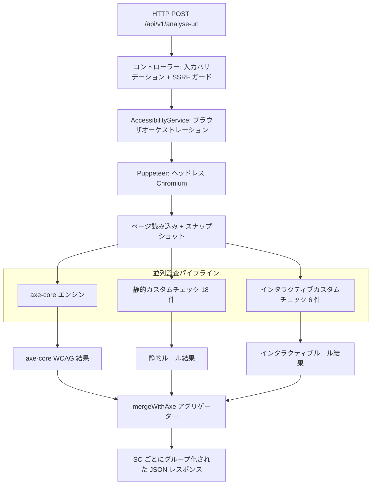
```mermaid
flowchart TD
    A["HTTP POST /api/v1/analyse-url"] --> B["コントローラー: 入力バリデーション + SSRF ガード"]
    B --> C["AccessibilityService: ブラウザオーケストレーション"]
    C --> D["Puppeteer: ヘッドレス Chromium"]
    D --> E["ページ読み込み + スナップショット"]

    subgraph "並列監査パイプライン"
        F["axe-core エンジン"]
        G["静的カスタムチェック 18 件"]
        H["インタラクティブカスタムチェック 6 件"]
    end

    E --> F
    E --> G
    E --> H

    F --> I["axe-core WCAG 結果"]
    G --> J["静的ルール結果"]
    H --> K["インタラクティブルール結果"]

    I & J & K --> L["mergeWithAxe アグリゲーター"]
    L --> M["SC ごとにグループ化された JSON レスポンス"]
```

### カスタムチェック実行モデル

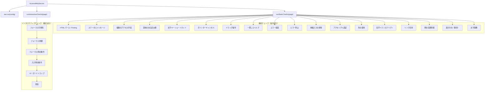
```mermaid
flowchart TD
    SVC["AccessibilityService"] --> AXE["axe.run(config)"]
    SVC --> STAT["runStaticChecks(page)"]
    SVC --> INTER["runInteractiveChecks(page)"]

    subgraph "静的チェック（並列実行）"
        S1["HTML パース / Parsing"]
        S2["ステータスメッセージ"]
        S3["複数のアクセス手段"]
        S4["意味のある読み順"]
        S5["文字キーショートカット"]
        S6["ポインターキャンセル"]
        S7["ドラッグ操作"]
        S8["一貫したヘルプ"]
        S9["エラー提案"]
        S10["エラー防止"]
        S11["重複入力の排除"]
        S12["アクセシブル認証"]
        S13["色の使用"]
        S14["音声トランスクリプト"]
        S15["リンク目的"]
        S16["現在位置情報"]
        S17["表示方向（静的）"]
        S18["文字画像"]
    end

    subgraph "インタラクティブチェック（順次実行）"
        I1["フォーカス可視性"]
        I2["フォーカス外観"]
        I3["フォーカス時の動作"]
        I4["入力時の動作"]
        I5["キーボードトラップ"]
        I6["発音"]
    end

    STAT --> S1 & S2 & S3 & S4 & S5 & S6 & S7 & S8 & S9 & S10 & S11 & S12 & S13 & S14 & S15 & S16 & S17 & S18
    INTER --> I1 --> I2 --> I3 --> I4 --> I5 --> I6
```

---

## ルール別解析

---

### 1.2.1 — 音声のみ・映像のみのコンテンツ（レベル A）
**チェック:** `audio-transcript.check.js`

#### フローチャート
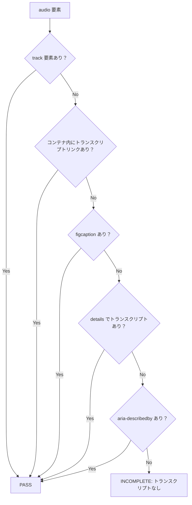
```mermaid
flowchart TD
    AUD["audio 要素"] --> TRK{"track 要素あり？"}
    TRK -- Yes --> PASS["PASS"]
    TRK -- No --> LNK{"コンテナ内にトランスクリプトリンクあり？"}
    LNK -- Yes --> PASS
    LNK -- No --> FIG{"figcaption あり？"}
    FIG -- Yes --> PASS
    FIG -- No --> DET{"details でトランスクリプトあり？"}
    DET -- Yes --> PASS
    DET -- No --> ARIA{"aria-describedby あり？"}
    ARIA -- Yes --> PASS
    ARIA -- No --> INC["INCOMPLETE: トランスクリプトなし"]
```

#### カバーするケース
| ケース | 検出方法 |
|------|-----------------|
| VTT / SRT トラック要素 | `<audio>` 内の `<track>` |
| トランスクリプトリンク | 兄弟/親アンカーの "transcript" キーワード |
| `<figcaption>` キャプション | figure 内の figcaption |
| 折りたたみ details | トランスクリプト内容の `
` |
| ARIA 説明参照 | `aria-describedby` → トランスクリプトブロック |

#### カバーできないケース
| ケース | 理由 |
|------|-----|
| アコーディオン内トランスクリプト | 非表示コンテンツを評価しない |
| 認証が必要なトランスクリプト | 外部リンク先を追わない |
| iframe 内トランスクリプト | クロスオリジン iframe アクセス不可 |

---

### 1.3.2 — 意味のある読み順（レベル A）
**チェック:** `meaningful-sequence.check.js`

#### フローチャート
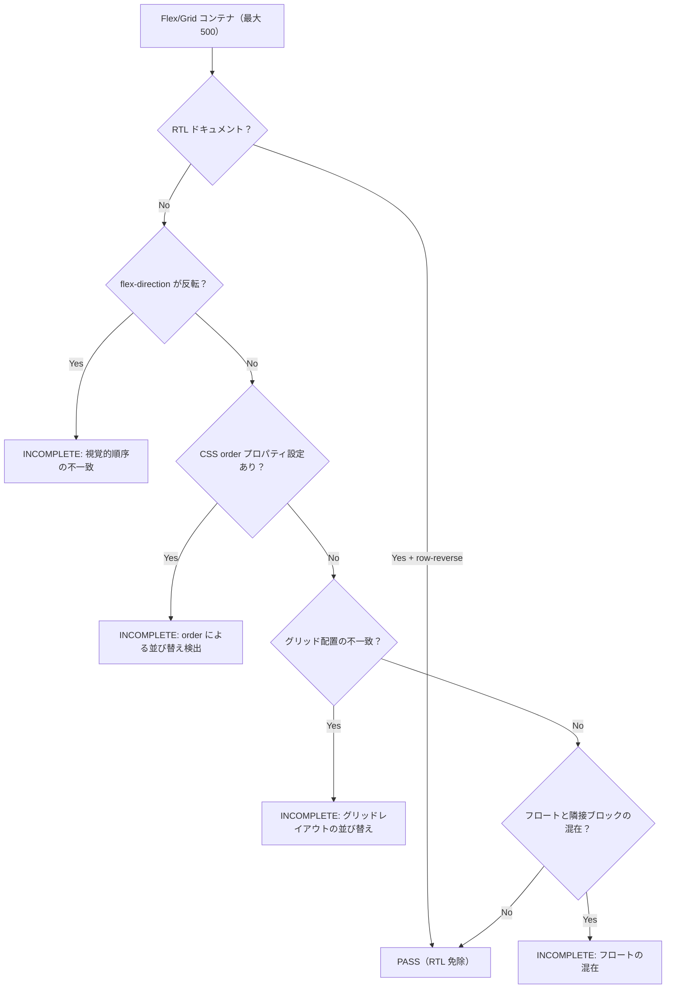
```mermaid
flowchart TD
    CONT["Flex/Grid コンテナ（最大 500）"] --> RTL{"RTL ドキュメント？"}
    RTL -- "Yes + row-reverse" --> PASS["PASS（RTL 免除）"]
    RTL -- No --> FLEX{"flex-direction が反転？"}
    FLEX -- Yes --> INC1["INCOMPLETE: 視覚的順序の不一致"]
    FLEX -- No --> ORD{"CSS order プロパティ設定あり？"}
    ORD -- Yes --> INC2["INCOMPLETE: order による並び替え検出"]
    ORD -- No --> GRID{"グリッド配置の不一致？"}
    GRID -- Yes --> INC3["INCOMPLETE: グリッドレイアウトの並び替え"]
    GRID -- No --> FLT{"フロートと隣接ブロックの混在？"}
    FLT -- Yes --> INC4["INCOMPLETE: フロートの混在"]
    FLT -- No --> PASS
```

#### カバーするケース
| ケース | 検出 |
|------|-----------|
| flex-direction 反転 | `row-reverse` / `column-reverse` 検出 |
| CSS `order` による並び替え | ゼロ以外の order 値をフラグ |
| グリッド列配置 | 明示的な `grid-column` / `grid-row` の不一致 |
| フロートの混在 | フロート + ブロックの兄弟要素 |
| RTL 免除 | `dir="rtl"` / `lang="ar/he/fa"` ページは `row-reverse` を免除 |

#### カバーできないケース
| ケース | 理由 |
|------|-----|
| 絶対位置による並び替え | Flex/Grid スキャン外 |
| CSS Transform による視覚的並び替え | Transform を検査しない |
| RTL 上の `column-reverse` | 依然として違反としてフラグ立て |

---

### 1.3.4 — 表示方向（レベル AA）
**チェック:** `orientation.check.js`

#### フローチャート
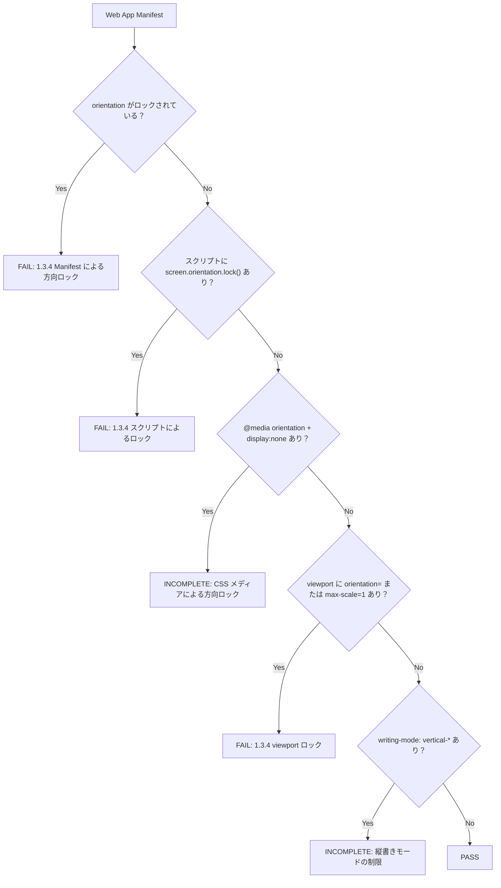
```mermaid
flowchart TD
    MAN["Web App Manifest"] --> MLOCK{"orientation がロックされている？"}
    MLOCK -- Yes --> FAIL1["FAIL: 1.3.4 Manifest による方向ロック"]
    MLOCK -- No --> SCRPT{"スクリプトに screen.orientation.lock() あり？"}
    SCRPT -- Yes --> FAIL2["FAIL: 1.3.4 スクリプトによるロック"]
    SCRPT -- No --> CSS{"@media orientation + display:none あり？"}
    CSS -- Yes --> INC["INCOMPLETE: CSS メディアによる方向ロック"]
    CSS -- No --> META{"viewport に orientation= または max-scale=1 あり？"}
    META -- Yes --> FAIL3["FAIL: 1.3.4 viewport ロック"]
    META -- No --> WM{"writing-mode: vertical-* あり？"}
    WM -- Yes --> INC2["INCOMPLETE: 縦書きモードの制限"]
    WM -- No --> PASS["PASS"]
```

#### カバーするケース
| ケース | 検出 |
|------|-----------|
| Manifest による方向ロック | `manifest.json` の `orientation` フィールド |
| スクリプトによる方向ロック | インラインスクリプトの `screen.orientation.lock()` |
| CSS メディア方向 | `@media (orientation)` による構造的コンテンツの非表示 |
| viewport ズームロック | `<meta viewport>` の `maximum-scale=1` |
| 縦書きモード | body の `writing-mode: vertical-*` |

#### カバーできないケース
| ケース | 理由 |
|------|-----|
| ページ読み込み後のプログラム的方向変更 | ページ読み込み時に検出不可 |
| 外部スクリプトによる方向ロック | インラインスクリプトのみスキャン |

---

### 1.4.1 — 色の使用（レベル A）
**チェック:** `use-of-color.check.js`

#### フローチャート
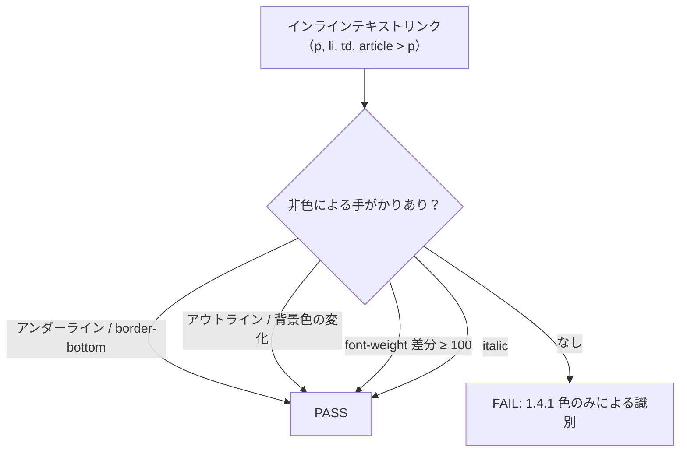
```mermaid
flowchart TD
    LNK["インラインテキストリンク（p, li, td, article > p）"] --> CUE{"非色による手がかりあり？"}
    CUE -- "アンダーライン / border-bottom" --> PASS["PASS"]
    CUE -- "アウトライン / 背景色の変化" --> PASS
    CUE -- "font-weight 差分 ≥ 100" --> PASS
    CUE -- "italic" --> PASS
    CUE -- "なし" --> FAIL["FAIL: 1.4.1 色のみによる識別"]
```

#### カバーするケース
- アンダーライン、border-bottom、アウトライン、背景色変化、font-weight 差分（≥100）、italic。
- アンカー以外の祖先要素のコンピューテッドスタイルとの比較。

#### カバーできないケース
- SVG テキスト要素内のリンク。
- Shadow DOM 内のリンク。
- Canvas 上のリンク。

---

### 1.4.5 — 文字画像（レベル AA）
**チェック:** `images-of-text.check.js`

#### フローチャート
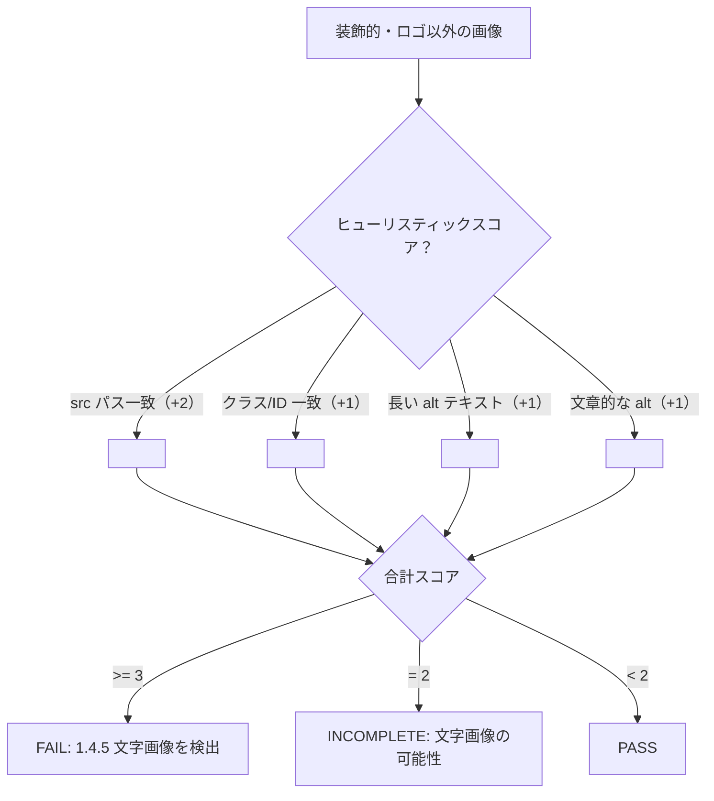
```mermaid
flowchart TD
    IMG["装飾的・ロゴ以外の画像"] --> SCORE{"ヒューリスティックスコア？"}
    SCORE -- "src パス一致（+2）" --> ADD1[" "]
    SCORE -- "クラス/ID 一致（+1）" --> ADD2[" "]
    SCORE -- "長い alt テキスト（+1）" --> ADD3[" "]
    SCORE -- "文章的な alt（+1）" --> ADD4[" "]
    ADD1 & ADD2 & ADD3 & ADD4 --> TOT{"合計スコア"}
    TOT -- ">= 3" --> FAIL["FAIL: 1.4.5 文字画像を検出"]
    TOT -- "= 2" --> INC["INCOMPLETE: 文字画像の可能性"]
    TOT -- "< 2" --> PASS["PASS"]
```

#### カバーするケース
| ケース | 検出 |
|------|-----------|
| テキスト画像ファイル名ヒューリスティック | `src` パスにテキスト画像キーワードを含む |
| alt テキスト長さシグナル | 長い、または文章的な alt テキスト |
| テキストコンテンツを含む CSS 背景画像 | background-image + テキストコンテンツ確認 |
| 画像コンテナ内の SVG `<text>` | SVG テキスト要素の検出 |

#### カバーできないケース
| ケース | 理由 |
|------|-----|
| 実際の OCR | ヒューリスティックのみ — ピクセル解析なし |
| デザイナーの意図の確認 | ロゴと文字画像を区別できない |
| 装飾的な背景オーバーレイ | スコアリングから除外 |

---

### 2.1.2 — キーボードトラップなし（レベル A）
**チェック:** `keyboard-trap.check.js` *(インタラクティブ)*

#### フローチャート
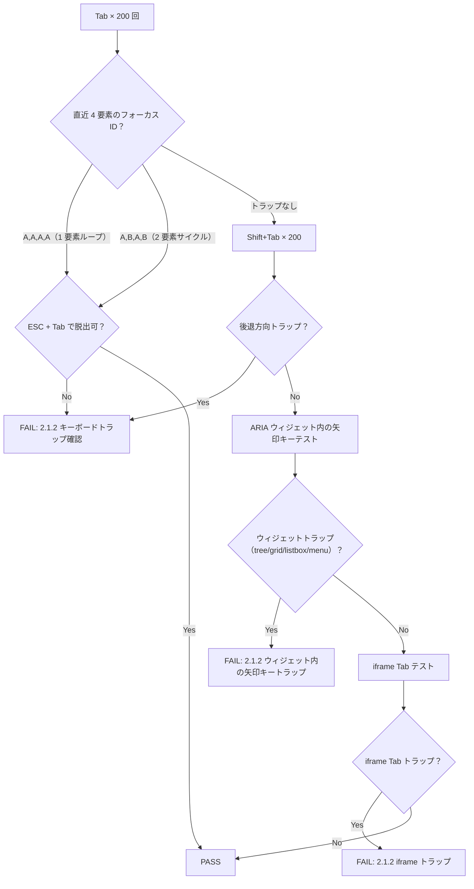
```mermaid
flowchart TD
    TAB["Tab × 200 回"] --> LAST4{"直近 4 要素のフォーカス ID？"}
    LAST4 -- "A,A,A,A（1 要素ループ）" --> ESC{"ESC + Tab で脱出可？"}
    LAST4 -- "A,B,A,B（2 要素サイクル）" --> ESC
    ESC -- No --> FAIL1["FAIL: 2.1.2 キーボードトラップ確認"]
    ESC -- Yes --> PASS["PASS"]
    LAST4 -- "トラップなし" --> SHIFT["Shift+Tab × 200"]
    SHIFT --> BACK{"後退方向トラップ？"}
    BACK -- Yes --> FAIL1
    BACK -- No --> ARROW["ARIA ウィジェット内の矢印キーテスト"]
    ARROW --> WT{"ウィジェットトラップ（tree/grid/listbox/menu）？"}
    WT -- Yes --> FAIL2["FAIL: 2.1.2 ウィジェット内の矢印キートラップ"]
    WT -- No --> IFR["iframe Tab テスト"]
    IFR --> IT{"iframe Tab トラップ？"}
    IT -- Yes --> FAIL3["FAIL: 2.1.2 iframe トラップ"]
    IT -- No --> PASS
```

#### カバーするケース
| ケース | 検出 |
|------|-----------|
| 1 要素 Tab トラップ | 4 要素サイクル検出（A,A,A,A） |
| 2 要素 Tab サイクル | パターン（A,B,A,B）検出 |
| 後退 Shift+Tab トラップ | 別途後退トラバーサル |
| ARIA ウィジェットの矢印トラップ | Tree、Grid、Listbox、Menu、Tablist、Radiogroup |
| iframe Tab トラップ | クロスフレーム Tab ナビゲーションテスト |
| Escape 確認 | トラップ確認前に ESC キー押下 |

#### カバーできないケース
| ケース | 理由 |
|------|-----|
| ESC で閉じるダイアログトラップ | ESC でトラップ脱出、違反としない |
| Shadow DOM トラップ | Closed Shadow DOM アクセス不可 |
| 動的フォーカス管理 | ページ読み込み後に追加されるフォーカスターゲット |

---

### 2.1.4 — 文字キーショートカット（レベル A）
**チェック:** `character-key-shortcuts.check.js`

#### フローチャート
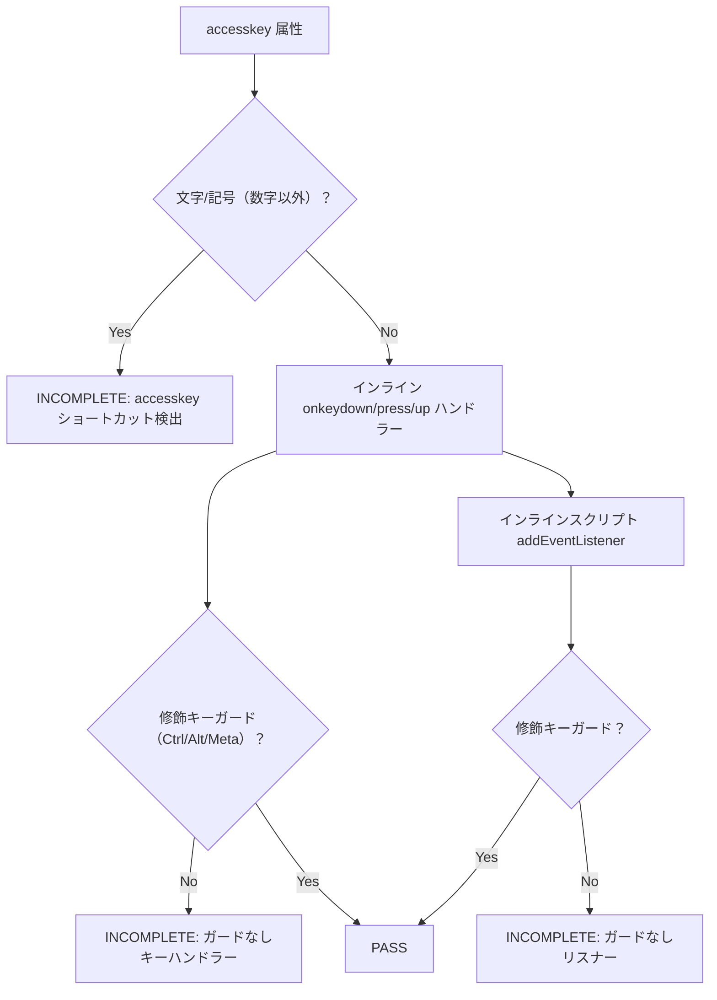
```mermaid
flowchart TD
    AK["accesskey 属性"] --> ALPH{"文字/記号（数字以外）？"}
    ALPH -- Yes --> INC1["INCOMPLETE: accesskey ショートカット検出"]
    ALPH -- No --> INL["インライン onkeydown/press/up ハンドラー"]
    INL --> GUARD{"修飾キーガード（Ctrl/Alt/Meta）？"}
    GUARD -- No --> INC2["INCOMPLETE: ガードなしキーハンドラー"]
    GUARD -- Yes --> PASS["PASS"]
    INL --> SCR["インラインスクリプト addEventListener"]
    SCR --> SGUARD{"修飾キーガード？"}
    SGUARD -- No --> INC3["INCOMPLETE: ガードなしリスナー"]
    SGUARD -- Yes --> PASS
```

#### カバーするケース
| ケース | 検出 |
|------|-----------|
| `accesskey` 使用 | 文字/記号の accesskey をフラグ |
| インラインキーハンドラー | `onkeydown`、`onkeypress`、`onkeyup` 確認 |
| スクリプト addEventListener | インライン `<script>` のキーボードリスナースキャン |
| 修飾キーガード | `ctrlKey`、`altKey`、`metaKey` 確認 |

#### カバーできないケース
| ケース | 理由 |
|------|-----|
| 動的に追加されたリスナー | ページ読み込み時の DOM のみ検査 |
| タイマーベースのキーボードイベント | 検査対象外 |

---

### 2.4.5 — 複数のアクセス手段（レベル AA）
**チェック:** `multiple-ways.check.js`

#### フローチャート
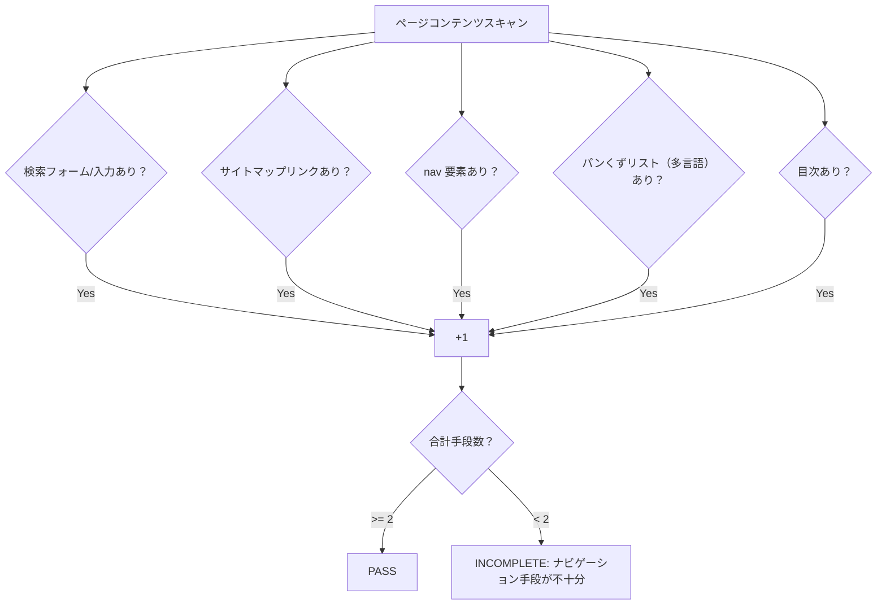
```mermaid
flowchart TD
    PAGE["ページコンテンツスキャン"] --> SRCH{"検索フォーム/入力あり？"}
    SRCH -- Yes --> +1
    PAGE --> SITE{"サイトマップリンクあり？"}
    SITE -- Yes --> +1
    PAGE --> NAV{"nav 要素あり？"}
    NAV -- Yes --> +1
    PAGE --> BRD{"パンくずリスト（多言語）あり？"}
    BRD -- Yes --> +1
    PAGE --> TOC{"目次あり？"}
    TOC -- Yes --> +1
    +1 --> COUNT{"合計手段数？"}
    COUNT -- ">= 2" --> PASS["PASS"]
    COUNT -- "< 2" --> INC["INCOMPLETE: ナビゲーション手段が不十分"]
```

#### カバーするケース
- 検索（`input[type="search"]`、`[role="search"]`）、サイトマップリンク、`<nav>` 要素、パンくずリスト（英語 + 日本語パターン）、目次。

#### カバーできないケース
- スキップリンクをナビゲーション手段として検出しない。
- 非同期で読み込まれる動的ナビゲーションメニュー。

---

### 2.4.7 — フォーカス可視性（レベル AA）
**チェック:** `focus-visible.check.js` *(インタラクティブ)*

#### フローチャート
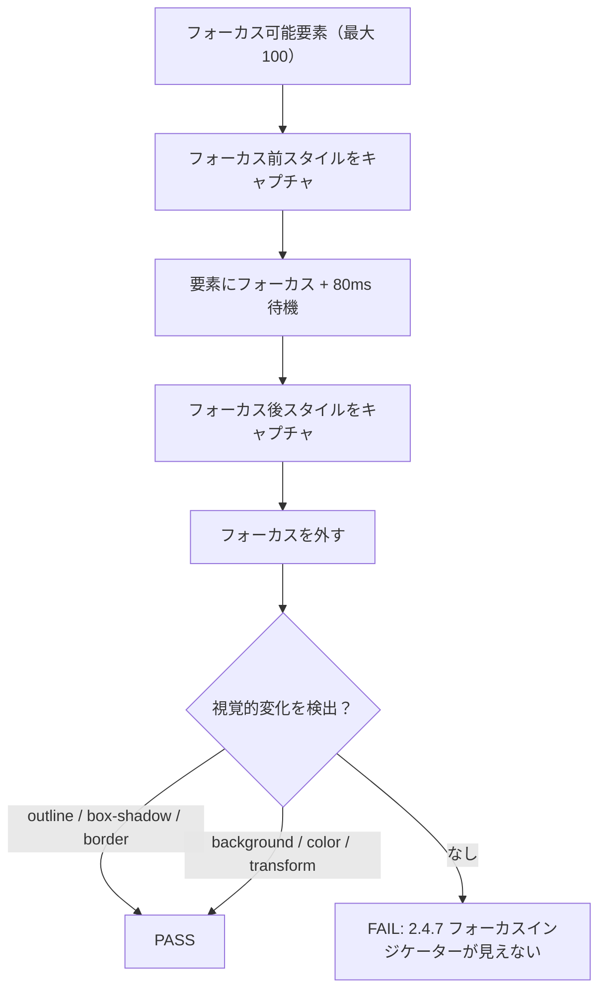
```mermaid
flowchart TD
    ELEM["フォーカス可能要素（最大 100）"] --> CAP1["フォーカス前スタイルをキャプチャ"]
    CAP1 --> FOC["要素にフォーカス + 80ms 待機"]
    FOC --> CAP2["フォーカス後スタイルをキャプチャ"]
    CAP2 --> BLR["フォーカスを外す"]
    BLR --> DIFF{"視覚的変化を検出？"}
    DIFF -- "outline / box-shadow / border" --> PASS["PASS"]
    DIFF -- "background / color / transform" --> PASS
    DIFF -- "なし" --> FAIL["FAIL: 2.4.7 フォーカスインジケーターが見えない"]
```

#### カバーするケース
| ケース | 検出 |
|------|-----------|
| アウトライン表示 | `outline` プロパティの差分 |
| ボックスシャドウ | `box-shadow` の差分 |
| ボーダー変化 | `border` の差分 |
| 背景色変化 | `background-color` / `background` の差分 |
| 文字色変化 | `color` の差分 |
| Transform 変化 | `transform` の差分 |

#### カバーできないケース
| ケース | 理由 |
|------|-----|
| 遅延付き CSS トランジション | 80ms 待機ウィンドウが遅いトランジションを捕捉できない場合がある |
| 親要素の `focus-within` | 要素自体ではなく親のスタイル変化 |
| 疑似要素インジケーター | `::before`/`::after` 注入フォーカススタイル |

---

### 2.4.8 — 現在位置情報（レベル AAA）
**チェック:** `location.check.js`

#### フローチャート
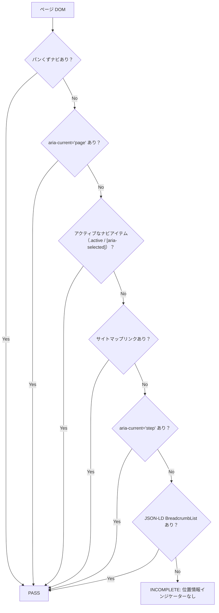
```mermaid
flowchart TD
    PAGE["ページ DOM"] --> BRD{"パンくずナビあり？"}
    BRD -- Yes --> PASS["PASS"]
    BRD -- No --> ARC{"aria-current='page' あり？"}
    ARC -- Yes --> PASS
    ARC -- No --> ACT{"アクティブなナビアイテム（.active / [aria-selected]）？"}
    ACT -- Yes --> PASS
    ACT -- No --> STM{"サイトマップリンクあり？"}
    STM -- Yes --> PASS
    STM -- No --> STP{"aria-current='step' あり？"}
    STP -- Yes --> PASS
    STP -- No --> JSN{"JSON-LD BreadcrumbList あり？"}
    JSN -- Yes --> PASS
    JSN -- No --> INC["INCOMPLETE: 位置情報インジケーターなし"]
```

#### カバーするケース
- パンくずナビ、`aria-current="page"`、アクティブなナビアイテム（`.active`、`[aria-selected]`）、サイトマップリンク、`aria-current="step"`、JSON-LD `BreadcrumbList`。

#### カバーできないケース
- ページタイトルのみによる暗黙的な位置情報。
- ARIA マークアップのない視覚的パンくずリスト。
- ナビゲーション後の動的な位置情報更新。

---

### 2.4.9 — リンクの目的（リンクのみ）（レベル AAA）
**チェック:** `link-purpose.check.js`

#### フローチャート
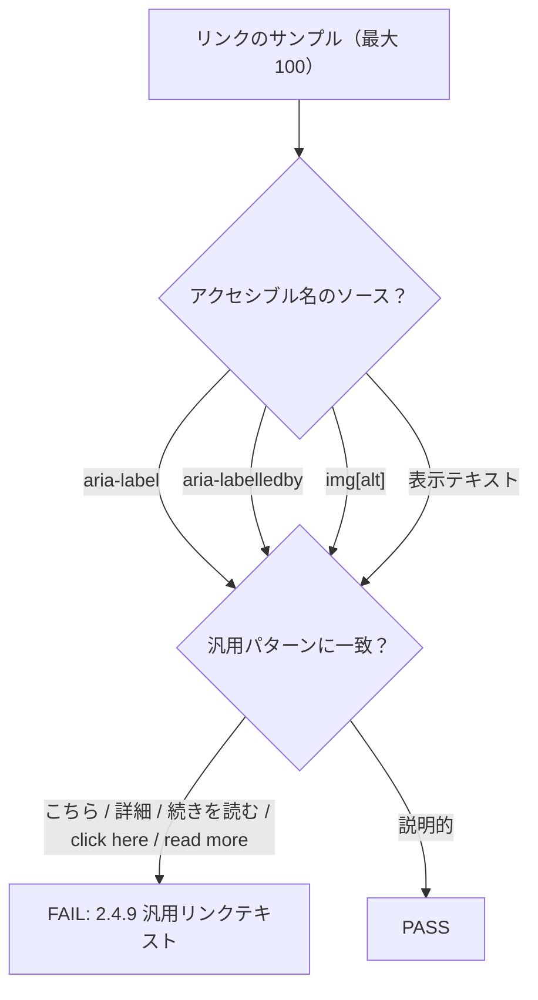
```mermaid
flowchart TD
    LNK["リンクのサンプル（最大 100）"] --> NAME{"アクセシブル名のソース？"}
    NAME -- "aria-label" --> CHK{"汎用パターンに一致？"}
    NAME -- "aria-labelledby" --> CHK
    NAME -- "img[alt]" --> CHK
    NAME -- "表示テキスト" --> CHK
    CHK -- "こちら / 詳細 / 続きを読む / click here / read more" --> FAIL["FAIL: 2.4.9 汎用リンクテキスト"]
    CHK -- "説明的" --> PASS["PASS"]
```

#### カバーするケース
| ケース | 検出 |
|------|-----------|
| 汎用英語パターン | "click here"、"read more"、"details"、"more"、"learn more" |
| 汎用日本語パターン | "こちら"、"詳細"、"もっと見る"、"続きを読む" |
| アクセシブル名の解決 | `aria-label` → `aria-labelledby` → `img[alt]` → 表示テキスト |

#### カバーできないケース
| ケース | 理由 |
|------|-----|
| `title` 属性のみ | アクセシブル名の解決順序に含まれない |
| 生成されたラベルを持つアイコンのみリンク | プログラム的ラベルを評価しない |
| 非表示コンテンツ内のリンク | 非表示コンテンツを除外 |

---

### 2.4.13 — フォーカスの外観（レベル AAA）
**チェック:** `focus-appearance.check.js` *(インタラクティブ)*

#### フローチャート
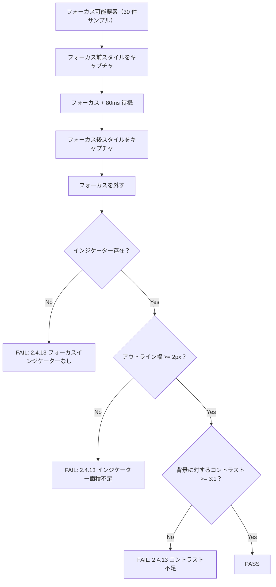
```mermaid
flowchart TD
    ELEM["フォーカス可能要素（30 件サンプル）"] --> CAP1["フォーカス前スタイルをキャプチャ"]
    CAP1 --> FOC["フォーカス + 80ms 待機"]
    FOC --> CAP2["フォーカス後スタイルをキャプチャ"]
    CAP2 --> BLR["フォーカスを外す"]
    BLR --> IND{"インジケーター存在？"}
    IND -- No --> FAIL1["FAIL: 2.4.13 フォーカスインジケーターなし"]
    IND -- Yes --> AREA{"アウトライン幅 >= 2px？"}
    AREA -- No --> FAIL2["FAIL: 2.4.13 インジケーター面積不足"]
    AREA -- Yes --> CONT{"背景に対するコントラスト >= 3:1？"}
    CONT -- No --> FAIL3["FAIL: 2.4.13 コントラスト不足"]
    CONT -- Yes --> PASS["PASS"]
```

#### カバーするケース
| ケース | 検出 |
|------|-----------|
| インジケーターの存在 | フォーカス後のスタイル差分 |
| 最小面積 | `outline-width` ≥ 2px |
| コントラスト比 | 背景に対する相対輝度 ≥ 3:1 |

#### カバーできないケース
| ケース | 理由 |
|------|-----|
| カスタム疑似要素インジケーター | `::before`/`::after` を検査しない |
| 3D Transform インジケーター | `transform` をコントラスト計算に含めない |
| フォーカス外れ後の状態 | 80ms 後のフォーカス外れ状態を見逃す |

---

### 2.5.2 — ポインターキャンセル（レベル A）
**チェック:** `pointer-cancellation.check.js`

#### フローチャート
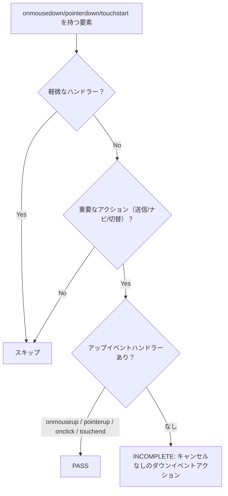
```mermaid
flowchart TD
    ELEM["onmousedown/pointerdown/touchstart を持つ要素"] --> TRIV{"軽微なハンドラー？"}
    TRIV -- Yes --> SKIP["スキップ"]
    TRIV -- No --> ACT{"重要なアクション（送信/ナビ/切替）？"}
    ACT -- No --> SKIP
    ACT -- Yes --> CANCEL{"アップイベントハンドラーあり？"}
    CANCEL -- "onmouseup / pointerup / onclick / touchend" --> PASS["PASS"]
    CANCEL -- "なし" --> INC["INCOMPLETE: キャンセルなしのダウンイベントアクション"]
```

#### カバーするケース
- 重要なハンドラーを持つ要素のポインターダウンアクション。
- マッチするアップイベントハンドラーによるキャンセル確認。
- 軽微なハンドラーのフィルタリング。

#### カバーできないケース
- イベントリスナースクリプト内のアクション（インライン属性のみスキャン）。
- タッチ特有のマルチジェスチャーキャンセル戦略。

---

### 2.5.7 — ドラッグ操作（レベル AA）
**チェック:** `dragging-movements.check.js`

#### フローチャート
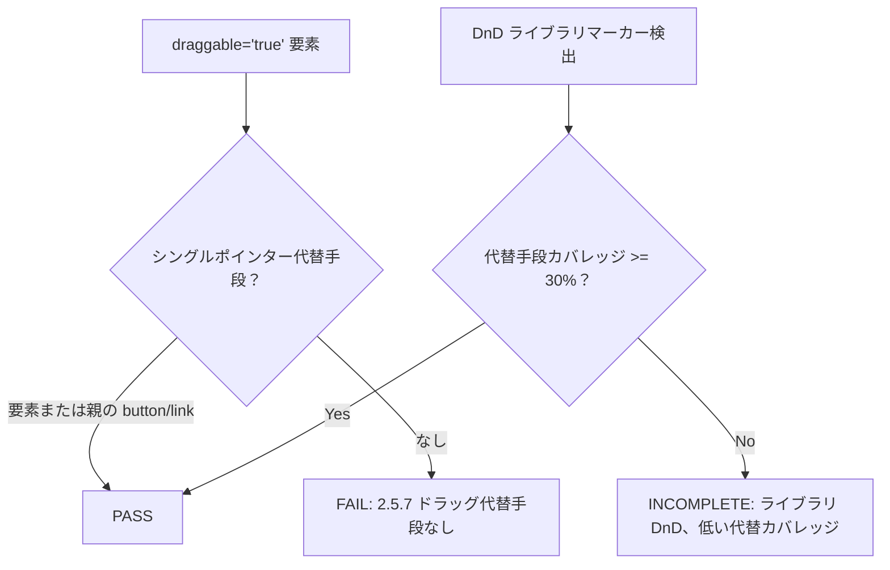
```mermaid
flowchart TD
    DRAG["draggable='true' 要素"] --> ALT{"シングルポインター代替手段？"}
    ALT -- "要素または親の button/link" --> PASS["PASS"]
    ALT -- "なし" --> FAIL["FAIL: 2.5.7 ドラッグ代替手段なし"]
    LIB["DnD ライブラリマーカー検出"] --> COV{"代替手段カバレッジ >= 30%？"}
    COV -- Yes --> PASS
    COV -- No --> INC["INCOMPLETE: ライブラリ DnD、低い代替カバレッジ"]
```

#### カバーするケース
| ケース | 検出 |
|------|-----------|
| ネイティブ `draggable="true"` | 直接的な属性チェック |
| react-beautiful-dnd | `[data-rbd-draggable-id]` マーカー |
| dnd-kit | `[data-dndkit-draggable]` マーカー |
| Sortable.js / jQuery UI | クラスパターン検出 |
| 代替 button/link | 兄弟/親 `<button>`/`<a>` チェック |

#### カバーできないケース
| ケース | 理由 |
|------|-----|
| Shadow DOM のドラッグハンドラー | DOM トラバーサルでアクセス不可 |
| `draggable` 属性なしのカスタムポインタードラッグ | 属性が存在しない |

---

### 3.1.6 — 発音（レベル AAA）
**チェック:** `pronunciation.check.js` *(インタラクティブ)*

#### フローチャート
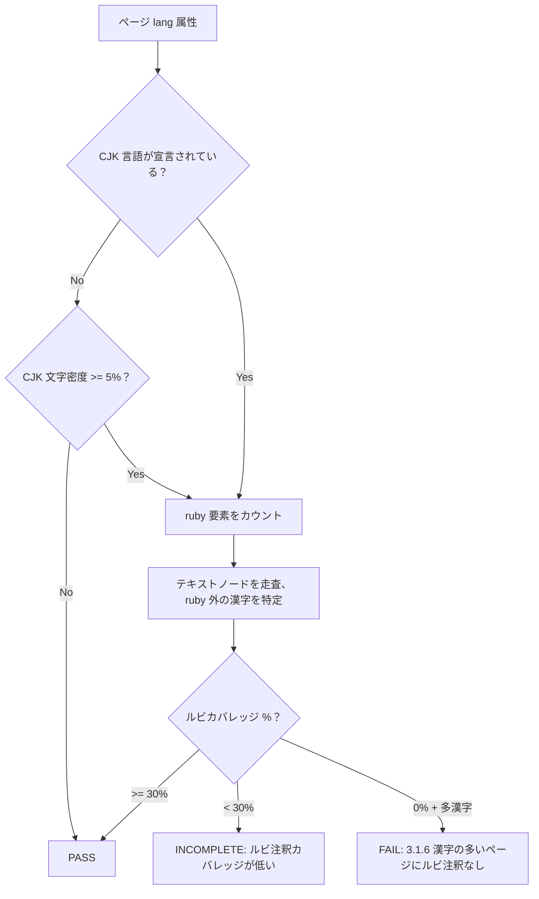
```mermaid
flowchart TD
    LANG["ページ lang 属性"] --> CJK{"CJK 言語が宣言されている？"}
    CJK -- No --> DENS{"CJK 文字密度 >= 5%？"}
    DENS -- No --> PASS["PASS"]
    DENS -- Yes --> RUBY["ruby 要素をカウント"]
    CJK -- Yes --> RUBY
    RUBY --> WALK["テキストノードを走査、ruby 外の漢字を特定"]
    WALK --> COV{"ルビカバレッジ %？"}
    COV -- ">= 30%" --> PASS
    COV -- "< 30%" --> INC["INCOMPLETE: ルビ注釈カバレッジが低い"]
    COV -- "0% + 多漢字" --> FAIL["FAIL: 3.1.6 漢字の多いページにルビ注釈なし"]
```

#### カバーするケース
| ケース | 検出 |
|------|-----------|
| CJK 言語検出 | `lang` 属性 + 文字密度ヒューリスティック |
| ルビ要素カウント | `<ruby>` 要素の存在 |
| 漢字特定 | CJK 統合漢字の Unicode 範囲 |
| カバレッジ計算 | 注釈付き漢字 / 総漢字数の比率 |
| セクションレベル CJK | サブセクションの `lang` 属性 |

#### カバーできないケース
| ケース | 理由 |
|------|-----|
| 表音文字（ひらがな）のふりがな | `<ruby>` タグなしの注釈 |
| SVG 内のルビ | SVG は DOM テキスト走査に含まれない |
| 動的なルビ挿入 | 読み込み後の注入を捕捉しない |

---

### 3.2.1 — フォーカス時の動作（レベル A）
**チェック:** `on-focus.check.js` *(インタラクティブ)*

#### フローチャート
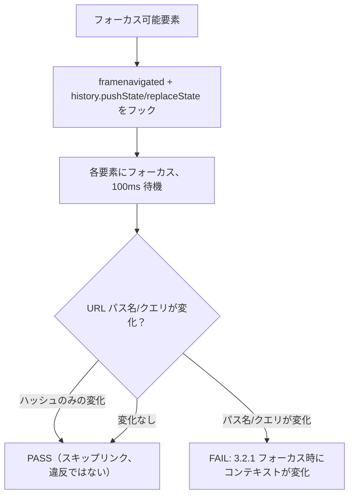
```mermaid
flowchart TD
    ELEM["フォーカス可能要素"] --> HOOK["framenavigated + history.pushState/replaceState をフック"]
    HOOK --> FOC["各要素にフォーカス、100ms 待機"]
    FOC --> NAV{"URL パス名/クエリが変化？"}
    NAV -- "ハッシュのみの変化" --> PASS["PASS（スキップリンク、違反ではない）"]
    NAV -- "パス名/クエリが変化" --> FAIL["FAIL: 3.2.1 フォーカス時にコンテキストが変化"]
    NAV -- "変化なし" --> PASS
```

#### カバーするケース
- フォーカスイベントのみで発生するナビゲーション。
- SPA の `pushState`/`replaceState` ナビゲーション検出。
- ハッシュのみの変化（スキップリンク）を適切に免除。

#### カバーできないケース
| ケース | 理由 |
|------|-----|
| フォーカス時のモーダル表示（URL 変化なし） | ナビゲーションではなくフラグ立てない |
| JavaScript のみのルート変更 | URL 変化のみ検出 |

---

### 3.2.2 — 入力時の動作（レベル A）
**チェック:** `on-input.check.js` *(インタラクティブ)*

#### フローチャート
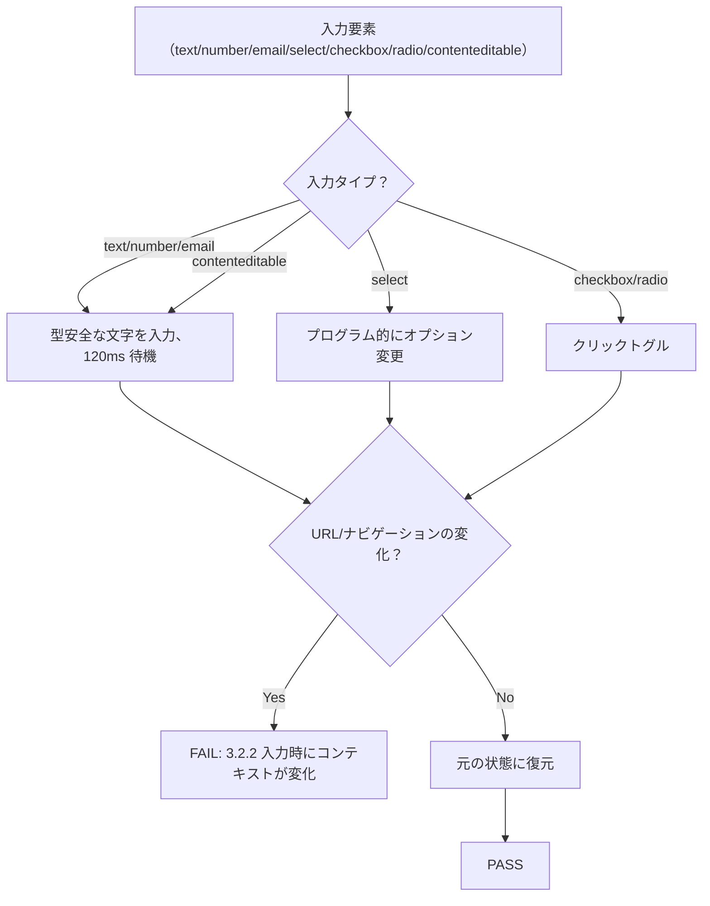
```mermaid
flowchart TD
    INP["入力要素（text/number/email/select/checkbox/radio/contenteditable）"] --> TYPE{"入力タイプ？"}
    TYPE -- "text/number/email" --> CHAR["型安全な文字を入力、120ms 待機"]
    TYPE -- "select" --> CHG["プログラム的にオプション変更"]
    TYPE -- "checkbox/radio" --> CLK["クリックトグル"]
    TYPE -- "contenteditable" --> CHAR
    CHAR & CHG & CLK --> NAV{"URL/ナビゲーションの変化？"}
    NAV -- Yes --> FAIL["FAIL: 3.2.2 入力時にコンテキストが変化"]
    NAV -- No --> REST["元の状態に復元"]
    REST --> PASS["PASS"]
```

#### カバーするケース
- テキスト、数値、メール入力（型安全な文字）。
- セレクトのオプション変更（プログラム的）。
- チェックボックスとラジオのクリックトグル。
- `contenteditable` への入力。
- URL 変化による SPA ナビゲーション検出。

#### カバーできないケース
| ケース | 理由 |
|------|-----|
| フィールド完了時の自動送信 | 単一文字では発生しない |
| URL 変化なしの JavaScript のみのフォーム送信 | URL 変化検出のみ |

---

### 3.2.6 — 一貫したヘルプ（レベル A）
**チェック:** `consistent-help.check.js`

#### フローチャート
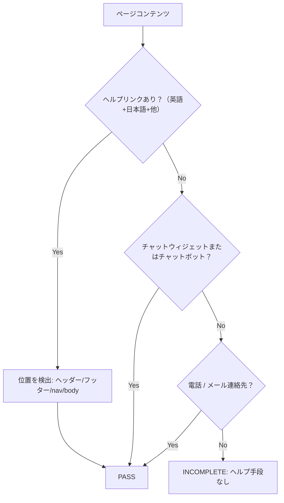
```mermaid
flowchart TD
    PAGE["ページコンテンツ"] --> HLP{"ヘルプリンクあり？（英語+日本語+他）"}
    HLP -- Yes --> LOC["位置を検出: ヘッダー/フッター/nav/body"]
    LOC --> PASS["PASS"]
    HLP -- No --> CHAT{"チャットウィジェットまたはチャットボット？"}
    CHAT -- Yes --> PASS
    CHAT -- No --> CONT{"電話 / メール連絡先？"}
    CONT -- Yes --> PASS
    CONT -- No --> INC["INCOMPLETE: ヘルプ手段なし"]
```

#### カバーするケース
| ケース | 検出 |
|------|-----------|
| ヘルプ/問い合わせ/サポートリンク | 多言語キーワードパターン |
| FAQ リンク | "FAQ"、"よくある質問" パターン |
| チャットウィジェット | 一般的なチャット SDK クラスマーカー |
| 電話/メール連絡先 | `href="tel:"`、`href="mailto:"` |
| 位置トラッキング | header、footer、nav、body の分類 |

#### カバーできないケース
| ケース | 理由 |
|------|-----|
| モーダルや非表示領域内のヘルプ | 表示 DOM スキャン外 |
| コンテキスト依存ヘルプ（ページ固有） | グローバル手段のみ検出 |

---

### 3.3.3 — エラー提案（レベル AA）
**チェック:** `error-suggestion.check.js`

#### フローチャート
```mermaid
flowchart TD
    ERR["エラー要素（role=alert, aria-live=assertive, aria-invalid, aria-errormessage）"] --> MSG{"エラーメッセージテキスト？"}
    MSG -- "簡潔すぎる: 'invalid' / 'error' / 'required'" --> FAIL["FAIL: 3.3.3 具体的な提案なし"]
    MSG -- "提案パターン: '入力してください'、'必要です'、数値範囲" --> PASS["PASS"]
    MSG -- "見つからない" --> INC["INCOMPLETE: エラー要素なし"]
```

#### カバーするケース
| ケース | 検出 |
|------|-----------|
| `role="alert"` メッセージ | 直接エラー要素クエリ |
| `aria-live="assertive"` | ライブリージョンエラー検出 |
| `aria-invalid` + `aria-describedby` | リンクされたエラーメッセージ抽出 |
| 提案パターン | "入力してください"、"必要です"、数値範囲 |
| 簡潔なエラー検出 | "invalid"、"error"、"required" のみ |

#### カバーできないケース
| ケース | 理由 |
|------|-----|
| サーバー送信後のエラー | ページ読み込み時に DOM にない |
| ツールチップベースのエラー | 動的ツールチップコンテンツ |
| 動的に挿入されるエラー | 静的チェック中にトリガーされない |

---

### 3.3.4 — エラー防止（レベル AA）
**チェック:** `error-prevention.check.js`

#### フローチャート
```mermaid
flowchart TD
    FORM["ページ上のフォーム"] --> RISK{"高リスクコンテキスト？"}
    RISK -- "金融 / 法的 / 破壊的アクションのキーワード" --> SAFE{"セーフガードあり？"}
    RISK -- "なし" --> PASS["PASS"]
    SAFE -- "確認テキスト / 確認チェックボックス / 確認ボタン / ステップ表示" --> PASS
    SAFE -- "なし" --> FAIL["FAIL: 3.3.4 エラー防止メカニズムなし"]
```

#### カバーするケース
| ケース | 検出 |
|------|-----------|
| 金融フォームの検出 | 見出し/ボタンのキーワードパターン（payment、purchase、checkout） |
| 法的フォームの検出 | "agreement"、"terms"、"contract" パターン |
| 破壊的アクションの検出 | "delete"、"remove"、"cancel account" パターン |
| 確認セーフガード | テキスト/ボタンの "review"、"confirm" |
| 確認チェックボックス | 送信ボタン近くの `input[type=checkbox]` |
| マルチステップ表示 | ステップ/進捗表示の存在 |

#### カバーできないケース
| ケース | 理由 |
|------|-----|
| モーダル内のセーフガード | 静的 DOM スキャン外 |
| 時間遅延確認 | 動的確認ダイアログ |

---

### 3.3.7 — 重複入力の排除（レベル A）
**チェック:** `redundant-entry.check.js`

#### フローチャート
```mermaid
flowchart TD
    FORMS["ページ上のフォーム"] --> PERS{"オートコンプリート付き個人データフィールド？"}
    PERS -- "複数フォーム、同一フィールド、再利用なし" --> RED{"再利用メカニズム？"}
    RED -- "same-as / copy-from コントロール" --> PASS["PASS"]
    RED -- "確認フィールド（confirm/re-enter）" --> PASS
    RED -- "なし" --> INC["INCOMPLETE: 重複入力の可能性"]
    PERS -- "単一フォームまたは異なるフィールド" --> PASS
```

#### カバーするケース
| ケース | 検出 |
|------|-----------|
| マルチフォームの個人データ | フォーム間のオートコンプリートトークンマッチング |
| 再利用コントロール | "same as billing"、"copy from" パターン |
| 確認フィールド | "confirm email"、"re-enter password" |
| プロセス分類 | checkout、account、application、booking |

#### カバーできないケース
| ケース | 理由 |
|------|-----|
| JavaScript ベースのプリフィル | 動的入力は静的 DOM にない |
| localStorage からの復元 | 検査しない |

---

### 3.3.8 — アクセシブル認証（最低限）（レベル AA）
**チェック:** `accessible-auth.check.js`

#### フローチャート
```mermaid
flowchart TD
    AUTH["認証フォームを検出（パスワードフィールド / ログインコンテキスト）"] --> CAP{"CAPTCHA あり？"}
    CAP -- No --> PASTE{"ペーストがブロックされている？"}
    CAP -- Yes --> ACAP{"アクセシブルな代替手段（音声/リンク）？"}
    ACAP -- Yes --> PASTE
    ACAP -- No --> FAIL1["FAIL: 3.3.8 アクセシブルな代替手段のない CAPTCHA"]
    PASTE -- "インラインのペーストブロック" --> FAIL2["FAIL: 3.3.8 ペーストの防止が認知機能を妨げる"]
    PASTE -- "addEventListener ペーストブロック" --> FAIL2
    PASTE -- No --> COG{"認知機能テスト？"}
    COG -- "代替手段なしの数学 / 視覚パズル" --> FAIL3["FAIL: 3.3.8 認知機能テスト"]
    COG -- No --> PK{"パスキー / WebAuthn オプション？"}
    PK -- Yes --> PASS["PASS（強化）"]
    PK -- No --> PASS
```

#### カバーするケース
| ケース | 検出 |
|------|-----------|
| Google / hCaptcha / Cloudflare CAPTCHA | SDK クラス/スクリプトマーカー |
| 画像ベース CAPTCHA | alt テキストパターン検出 |
| 音声 CAPTCHA の代替手段 | 近くの音声リンク |
| ペーストのブロック | インラインハンドラー + addEventListener スキャン |
| 数学 / 視覚パズル | ラベル/テキストの正規表現パターンマッチング |
| パスキー / WebAuthn | `credentials.create()` またはパスキーキーワード |

#### カバーできないケース
| ケース | 理由 |
|------|-----|
| カスタムの難読化 CAPTCHA | SDK マーカーが存在しない |
| WebAuthn 検出の精度 | JS API 呼び出しが常にインラインコードにあるとは限らない |

---

### 4.1.1 — 構文解析（レベル A）
**チェック:** `html-parsing.check.js`

#### フローチャート
```mermaid
flowchart TD
    DOM["ページ DOM"] --> DUP{"重複 ID あり？"}
    DUP -- Yes --> FAIL1["FAIL: 4.1.1 重複 ID 発見"]
    DUP -- No --> ARIA{"壊れた ARIA 参照？"}
    ARIA -- "aria-labelledby / aria-describedby / aria-controls / aria-owns が存在しない ID を参照" --> FAIL2["FAIL: 4.1.1 壊れた ARIA 参照"]
    ARIA -- "OK" --> ORPH{"孤立した label[for] あり？"}
    ORPH -- "一致する input なし" --> FAIL3["FAIL: 4.1.1 孤立したラベル"]
    ORPH -- "OK" --> PASS["PASS"]
```

#### カバーするケース
| ケース | 検出 |
|------|-----------|
| 重複 `id` 属性 | DOM 全体の `[id]` スキャン + Map |
| 壊れた `aria-labelledby` / `aria-describedby` | ID 参照の検証 |
| 壊れた `aria-controls` / `aria-owns` | ID 参照の検証 |
| 孤立した `<label for>` | 一致する input の存在チェック |

#### カバーできないケース
| ケース | 理由 |
|------|-----|
| 重複 ARIA ロール | スコープ外 |
| 不正な `aria-label` の値 | 構文的に検証しない |

---

### 4.1.3 — ステータスメッセージ（レベル AA）
**チェック:** `status-messages.check.js`

#### フローチャート
```mermaid
flowchart TD
    DOM["ページ DOM"] --> LR{"ライブリージョンあり？（aria-live, role=status/alert/log/timer）"}
    LR -- Yes --> CTX{"動的コンテキストを検出？"}
    CTX -- Yes --> ATM{"alert に aria-atomic=true？"}
    ATM -- Yes --> PASS["PASS"]
    ATM -- No --> INC1["INCOMPLETE: alert に aria-atomic がない"]
    CTX -- No --> PASS
    LR -- No --> DYN{"動的コンテキスト（フォーム、検索、カート、通知）？"}
    DYN -- Yes --> FAIL["FAIL: 4.1.3 動的コンテンツにライブリージョンなし"]
    DYN -- No --> PASS
```

#### カバーするケース
| ケース | 検出 |
|------|-----------|
| ライブリージョンの存在 | `[aria-live]`、`[role="status/alert/log/timer"]` |
| 動的コンテキストの検出 | フォーム、検索、カート、通知セレクター |
| `aria-atomic` の検証 | `role="alert"` 要素上 |
| インラインバリデーションエラー | `[aria-invalid]` + メッセージ要素 |

#### カバーできないケース
| ケース | 理由 |
|------|-----|
| ランタイムのみのステータス更新 | ページ読み込み時に DOM にない |
| 非同期更新（ページ読み込み後） | 静的スキャンのみ |

---

## カバレッジサマリー

| WCAG SC | 達成基準 | チェックファイル | パイプラインステージ | モード | 信頼度 |
|---------|-----------|------------|----------------|------|------------|
| 1.2.1 | 音声のみ・映像のみ | audio-transcript.check.js | 静的 | 静的 | 中 |
| 1.3.2 | 意味のある読み順 | meaningful-sequence.check.js | 静的 | 静的 | 中 |
| 1.3.4 | 表示方向 | orientation.check.js | 静的 | 静的 | 高 |
| 1.4.1 | 色の使用 | use-of-color.check.js | 静的 | 静的 | 高 |
| 1.4.5 | 文字画像 | images-of-text.check.js | 静的 | 静的 | 中 |
| 2.1.2 | キーボードトラップなし | keyboard-trap.check.js | インタラクティブ | インタラクティブ | 高 |
| 2.1.4 | 文字キーショートカット | character-key-shortcuts.check.js | 静的 | 静的 | 中 |
| 2.4.5 | 複数のアクセス手段 | multiple-ways.check.js | 静的 | 静的 | 中 |
| 2.4.7 | フォーカス可視性 | focus-visible.check.js | インタラクティブ | インタラクティブ | 高 |
| 2.4.8 | 現在位置情報 | location.check.js | 静的 | 静的 | 中 |
| 2.4.9 | リンクの目的（リンクのみ） | link-purpose.check.js | 静的 | 静的 | 高 |
| 2.4.13 | フォーカスの外観 | focus-appearance.check.js | インタラクティブ | インタラクティブ | 高 |
| 2.5.2 | ポインターキャンセル | pointer-cancellation.check.js | 静的 | 静的 | 中 |
| 2.5.7 | ドラッグ操作 | dragging-movements.check.js | 静的 | 静的 | 中 |
| 3.1.6 | 発音 | pronunciation.check.js | インタラクティブ | インタラクティブ | 高 |
| 3.2.1 | フォーカス時の動作 | on-focus.check.js | インタラクティブ | インタラクティブ | 高 |
| 3.2.2 | 入力時の動作 | on-input.check.js | インタラクティブ | インタラクティブ | 高 |
| 3.2.6 | 一貫したヘルプ | consistent-help.check.js | 静的 | 静的 | 中 |
| 3.3.3 | エラー提案 | error-suggestion.check.js | 静的 | 静的 | 高 |
| 3.3.4 | エラー防止 | error-prevention.check.js | 静的 | 静的 | 中 |
| 3.3.7 | 重複入力の排除 | redundant-entry.check.js | 静的 | 静的 | 中 |
| 3.3.8 | アクセシブル認証 | accessible-auth.check.js | 静的 | 静的 | 高 |
| 4.1.1 | 構文解析 | html-parsing.check.js | 静的 | 静的 | 高 |
| 4.1.3 | ステータスメッセージ | status-messages.check.js | 静的 | 静的 | 高 |
