> Generated: 2026-04-08
> Updated: 2026-04-23 — added 4 new static checks (1.2.2, 1.2.3, 1.4.2, background-image-content)
> Updated: 2026-04-24 — closed Node heuristic gaps for F30/F13/F81/F58/F60/G125/G126/G127/G164/F114
> Scope: `ka11y-node/src/custom-checks/` (28 custom WCAG checks) + `ka11y-node/src/services/`
> Stack: Node.js + Express + Puppeteer + axe-core

> Update 2026-04-13: custom checks now receive shared rule context (`lang` + shared config) from the service layer. Migrated checks read EN/JA heuristics and selected reason templates from `config/universal.yml` instead of hardcoded JS lists.
>
> Update 2026-04-14: flat and grouped Node result paths now both carry `lang`, and the mapped Node findings localize `criterion_name`, `reason`, and `suggested_fix` for Japanese. Best-practice metadata is loaded through the shared locale overlays in `i18n/locales/`.

---

## Architecture & Request Flow

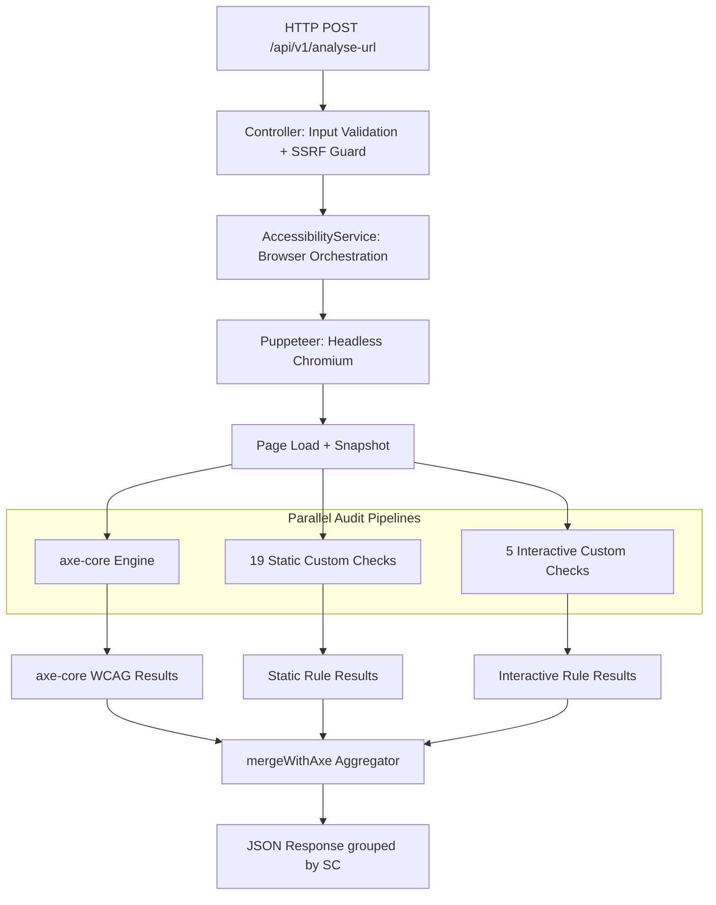
```mermaid
flowchart TD
    A["HTTP POST /api/v1/analyse-url"] --> B["Controller: Input Validation + SSRF Guard"]
    B --> C["AccessibilityService: Browser Orchestration"]
    C --> D["Puppeteer: Headless Chromium"]
    D --> E["Page Load + Snapshot"]

    subgraph "Parallel Audit Pipelines"
        F["axe-core Engine"]
        G["19 Static Custom Checks"]
        H["5 Interactive Custom Checks"]
    end

    E --> F
    E --> G
    E --> H

    F --> I["axe-core WCAG Results"]
    G --> J["Static Rule Results"]
    H --> K["Interactive Rule Results"]

    I & J & K --> L["mergeWithAxe Aggregator"]
    L --> M["JSON Response grouped by SC"]
```

### Custom Check Execution Model

```mermaid
flowchart TD
    SVC["AccessibilityService"] --> AXE["axe.run(config)"]
    SVC --> STAT["runStaticChecks(page)"]
    SVC --> INTER["runInteractiveChecks(page)"]

    subgraph "Static Checks (Parallel) — 23 checks"
        S1["HTML Parsing"]
        S2["Status Messages"]
        S3["Multiple Ways"]
        S4["Meaningful Sequence"]
        S5["Character Key Shortcuts"]
        S6["Pointer Cancellation"]
        S7["Dragging Movements"]
        S8["Consistent Help"]
        S9["Error Suggestion"]
        S10["Error Prevention"]
        S11["Redundant Entry"]
        S12["Accessible Auth"]
        S13["Use of Color"]
        S14["Audio Transcript"]
        S15["Captions Prerecorded ★"]
        S16["Audio Description ★"]
        S17["Audio Control ★"]
        S18["Link Purpose"]
        S19["Location"]
        S20["Orientation (Static)"]
        S21["Images of Text"]
        S22["Background Image Content ★"]
        S23["Pronunciation"]
        S24["Pointer Gestures ★"]
        S25["Motion Actuation ★"]
    end

    subgraph "Interactive Checks (Sequential) — 5 checks"
        I1["Focus Visible"]
        I2["Focus Appearance"]
        I3["On Focus"]
        I4["On Input"]
        I5["Keyboard Trap"]
    end

    STAT --> S1 & S2 & S3 & S4 & S5 & S6 & S7 & S8 & S9 & S10 & S11 & S12 & S13 & S14 & S15 & S16 & S17 & S18 & S19 & S20 & S21 & S22 & S23 & S24 & S25
    INTER --> I1 --> I2 --> I3 --> I4 --> I5
```

### Localization and Shared Config

Current Node output behavior:

- grouped and flat endpoints both accept `lang`
- WCAG names and suggested fixes come from shared `i18n/rules.yml` plus optional locale overlays
- axe-core summaries are normalized through the locale-aware mapper so Japanese failure summaries no longer leak English prefixes into `reason`
- migrated custom checks receive shared rule context and can read EN/JA heuristics and reason templates from `config/universal.yml`

This means Japanese Node findings now localize all user-facing finding text that is owned by the Node mapper:

- `criterion_name`
- `reason`
- `suggested_fix`

---

## Rule-by-Rule Analysis

---

### 1.2.1 — Audio-only and Video-only (Level A)
**Check:** `audio-transcript.check.js`

#### Flowchart
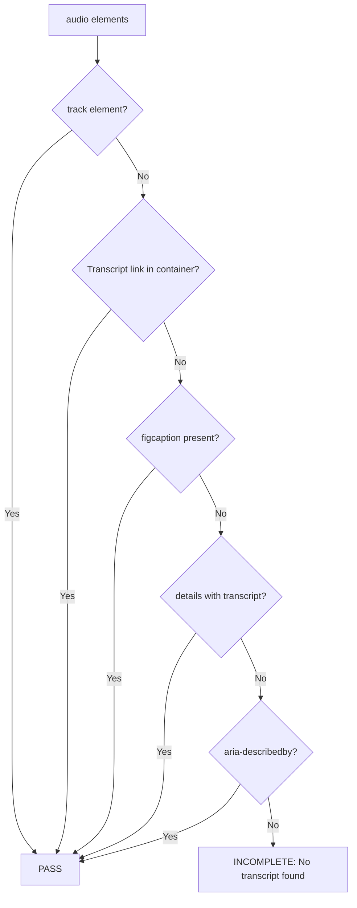
```mermaid
flowchart TD
    AUD["audio elements"] --> TRK{"track element?"}
    TRK -- Yes --> PASS["PASS"]
    TRK -- No --> LNK{"Transcript link in container?"}
    LNK -- Yes --> PASS
    LNK -- No --> FIG{"figcaption present?"}
    FIG -- Yes --> PASS
    FIG -- No --> DET{"details with transcript?"}
    DET -- Yes --> PASS
    DET -- No --> ARIA{"aria-describedby?"}
    ARIA -- Yes --> PASS
    ARIA -- No --> INC["INCOMPLETE: No transcript found"]
```

#### Cases Covered
| Case | Detection Method |
|------|-----------------|
| VTT / SRT track elements | `<track>` inside `<audio>` |
| Transcript links | Sibling/parent anchor with "transcript" keyword |
| Filename-only transcript labels | Flags links like `transcript.pdf` / `audio.vtt` as F30 risk |
| `<figcaption>` captions | Adjacent figcaption in figure |
| Collapsed details | `
` with transcript content |
| ARIA description | `aria-describedby` pointing to transcript block |

#### Cases Missed
| Case | Why |
|------|-----|
| Transcript quality/equivalence | Link/track presence is checked; content parity is not verified |
| Transcript behind auth | External link resolution not followed |
| Transcript inside iframe | Cross-origin iframe content inaccessible |

---

### 1.2.2 — Captions (Prerecorded) ★ New (Level A)
**Check:** `captions-prerecorded.check.js`

#### Flowchart
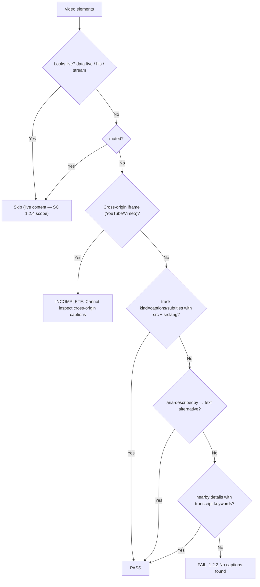
```mermaid
flowchart TD
    VID["video elements"] --> LIVE{"Looks live? data-live / hls / stream"}
    LIVE -- Yes --> SKIP["Skip (live content — SC 1.2.4 scope)"]
    LIVE -- No --> MUTED{"muted?"}
    MUTED -- Yes --> SKIP
    MUTED -- No --> CROSS{"Cross-origin iframe (YouTube/Vimeo)?"}
    CROSS -- Yes --> INC1["INCOMPLETE: Cannot inspect cross-origin captions"]
    CROSS -- No --> TRACK{"track kind=captions/subtitles with src + srclang?"}
    TRACK -- Yes --> PASS["PASS"]
    TRACK -- No --> ARIA{"aria-describedby → text alternative?"}
    ARIA -- Yes --> PASS
    ARIA -- No --> DET{"nearby details with transcript keywords?"}
    DET -- Yes --> PASS
    DET -- No --> FAIL["FAIL: 1.2.2 No captions found"]
```

#### Cases Covered
| Case | Detection |
|------|-----------|
| VTT / SRT caption track | `<track kind="captions">` or `kind="subtitles"` with `src` + `srclang` |
| ARIA text alternative | `aria-describedby` pointing to a valid text block |
| Collapsed transcript | `
` with caption/transcript keyword in text |
| Live content exemption | `data-live="true"`, HLS URL, `/stream/` in src — excluded |
| Cross-origin video players | Flagged INCOMPLETE (YouTube/Vimeo iframe — cannot inspect) |

#### Cases Missed
| Case | Why |
|------|-----|
| Cross-origin iframe captions | Same-origin restriction on iframe DOM access |
| Captions injected by JS after load | Static DOM snapshot only |
| Third-party caption overlays (Rev.com etc.) | External script; no DOM marker |

---

### 1.2.3 — Audio Description or Media Alternative ★ New (Level A)
**Check:** `audio-description.check.js`

#### Flowchart
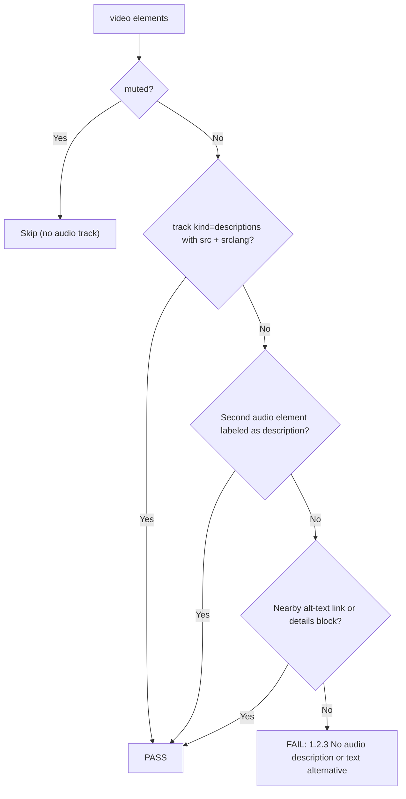
```mermaid
flowchart TD
    VID["video elements"] --> MUTED{"muted?"}
    MUTED -- Yes --> SKIP["Skip (no audio track)"]
    MUTED -- No --> DESC{"track kind=descriptions with src + srclang?"}
    DESC -- Yes --> PASS["PASS"]
    DESC -- No --> ALT{"Second audio element labeled as description?"}
    ALT -- Yes --> PASS
    ALT -- No --> TXT{"Nearby alt-text link or details block?"}
    TXT -- Yes --> PASS
    TXT -- No --> FAIL["FAIL: 1.2.3 No audio description or text alternative"]
```

#### Detection signals (in priority order)
| Signal | What is checked |
|--------|----------------|
| `<track kind="descriptions">` | Must have valid `src` + `srclang` attribute |
| Second `<audio>` / `<source>` | `data-kind` or `title` attribute contains "description" or "audio-desc" |
| Nearby text alternative | `<a>` with ALT_KEYWORDS in text, or `
` with transcript/description keyword |

ALT_KEYWORDS: `transcript`, `text version`, `full-text alternative`, `audio description`, `descriptive transcript`, `書き起こし`, `文字起こし`, `音声解説`, `音声ガイド`, `代替テキスト`

#### Cases Missed
| Case | Why |
|------|-----|
| Description on a separate page | External link resolution not followed |
| Audio description via third-party player | No DOM marker |
| Video-only content (1.2.1 scope) | Muted videos exempt from 1.2.3 |

---

### 1.4.2 — Audio Control ★ New (Level A)
**Check:** `audio-control.check.js`

#### Flowchart
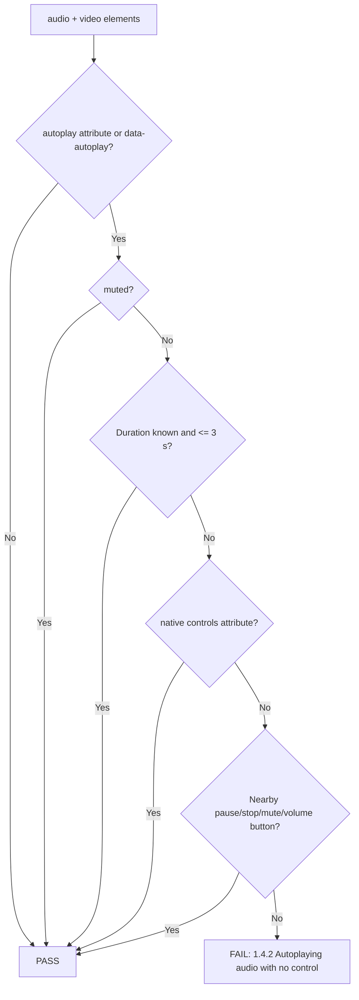
```mermaid
flowchart TD
    MEDIA["audio + video elements"] --> AUTO{"autoplay attribute or data-autoplay?"}
    AUTO -- No --> PASS["PASS"]
    AUTO -- Yes --> MUTED{"muted?"}
    MUTED -- Yes --> PASS
    MUTED -- No --> DUR{"Duration known and <= 3 s?"}
    DUR -- Yes --> PASS
    DUR -- No --> CTRL{"native controls attribute?"}
    CTRL -- Yes --> PASS
    CTRL -- No --> EXT{"Nearby pause/stop/mute/volume button?"}
    EXT -- Yes --> PASS
    EXT -- No --> FAIL["FAIL: 1.4.2 Autoplaying audio with no control"]
```

#### Exemption logic
| Exemption | Condition |
|-----------|-----------|
| Muted autoplay | `media.muted === true` — no audible audio |
| Short duration | `data-duration` or `media.duration` ≤ 3 seconds |
| Native controls | `controls` attribute present on the element |
| External control | Button/role="button" in nearest `figure/article/section` with pause/stop/mute/volume label — also matches JP: `一時停止`, `停止`, `音量`, `消音` |

#### Cases Missed
| Case | Why |
|------|-----|
| Autoplay triggered by JS after load | Attribute absent at snapshot time |
| Volume slider without text label | Control text pattern only — unlabeled sliders pass |
| Background music via Web Audio API | Not a `<audio>` / `<video>` element |

---

### 1.1.1 — Background Image Content ★ New supplemental (Level A)
**Check:** `background-image-content.check.js`
**SC:** 1.1.1 (also emits supplementary 1.4.5 hints)

This check is **supplemental to axe-core's 1.1.1 coverage**. It specifically targets CSS `background-image` URLs — a category that axe-core does not inspect.

#### Flowchart
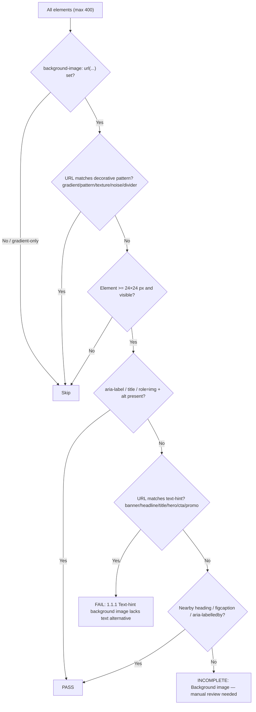
```mermaid
flowchart TD
    ALL["All elements (max 400)"] --> BG{"background-image: url(...) set?"}
    BG -- No / gradient-only --> SKIP["Skip"]
    BG -- Yes --> DECOR{"URL matches decorative pattern? gradient/pattern/texture/noise/divider"}
    DECOR -- Yes --> SKIP
    DECOR -- No --> SIZE{"Element >= 24×24 px and visible?"}
    SIZE -- No --> SKIP
    SIZE -- Yes --> NAME{"aria-label / title / role=img + alt present?"}
    NAME -- Yes --> PASS["PASS"]
    NAME -- No --> TEXT{"URL matches text-hint? banner/headline/title/hero/cta/promo"}
    TEXT -- Yes --> FAIL["FAIL: 1.1.1 Text-hint background image lacks text alternative"]
    TEXT -- No --> NEARBY{"Nearby heading / figcaption / aria-labelledby?"}
    NEARBY -- Yes --> PASS
    NEARBY -- No --> INC["INCOMPLETE: Background image — manual review needed"]
```

#### Cases Covered
| Case | Detection |
|------|-----------|
| Hero / banner images | URL keyword matching: `banner`, `headline`, `title`, `hero`, `cta`, `promo`, `masthead` |
| Decorative pattern exemption | URL keyword: `gradient`, `pattern`, `noise`, `texture`, `overlay`, `fade`, `divider` |
| ARIA text alternative | `aria-label`, `title`, `role="img"` + `aria-label` combo |
| Nearby semantic label | Adjacent heading, `<figcaption>`, or `aria-labelledby` reference |
| Inline data URIs | Always skipped — can't inspect content |

#### Cases Missed
| Case | Why |
|------|-----|
| Background images without keyword hints in URL | URL heuristic only — no pixel analysis |
| SVG data URIs with text | Skipped as data: URI |
| Images loaded via CSS custom property (`--bg-url`) | Computed style fallback doesn't resolve vars in all browsers |

---

### 1.3.2 — Meaningful Sequence (Level A)
**Check:** `meaningful-sequence.check.js`

#### Flowchart
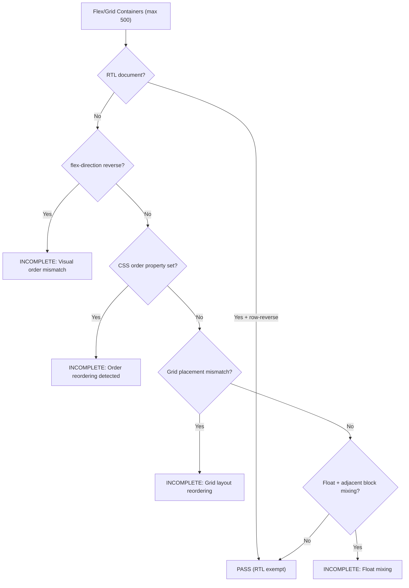
```mermaid
flowchart TD
    CONT["Flex/Grid Containers (max 500)"] --> RTL{"RTL document?"}
    RTL -- Yes + row-reverse --> PASS["PASS (RTL exempt)"]
    RTL -- No --> FLEX{"flex-direction reverse?"}
    FLEX -- Yes --> INC1["INCOMPLETE: Visual order mismatch"]
    FLEX -- No --> ORD{"CSS order property set?"}
    ORD -- Yes --> INC2["INCOMPLETE: Order reordering detected"]
    ORD -- No --> GRID{"Grid placement mismatch?"}
    GRID -- Yes --> INC3["INCOMPLETE: Grid layout reordering"]
    GRID -- No --> FLT{"Float + adjacent block mixing?"}
    FLT -- Yes --> INC4["INCOMPLETE: Float mixing"]
    FLT -- No --> PASS
```

#### Cases Covered
| Case | Detection |
|------|-----------|
| Flex direction reversal | `row-reverse` / `column-reverse` detected |
| CSS `order` reordering | Non-zero order values flagged |
| Grid column placement | Explicit `grid-column` / `grid-row` mismatch |
| Float mixing | Float + block siblings |
| RTL exemption | `dir="rtl"` or `lang="ar/he/fa"` pages exempt `row-reverse` |

#### Cases Missed
| Case | Why |
|------|-----|
| Absolute positioning reorder | Not in flex/grid scan scope |
| Transform-based visual reorder | CSS transforms not inspected |
| `column-reverse` on RTL | Still flagged as violation |

---

### 1.3.4 — Orientation (Level AA)
**Check:** `orientation.check.js`

#### Flowchart
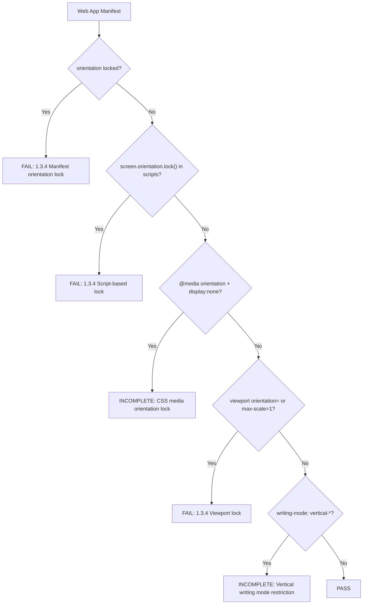
```mermaid
flowchart TD
    MAN["Web App Manifest"] --> MLOCK{"orientation locked?"}
    MLOCK -- Yes --> FAIL1["FAIL: 1.3.4 Manifest orientation lock"]
    MLOCK -- No --> SCRPT{"screen.orientation.lock() in scripts?"}
    SCRPT -- Yes --> FAIL2["FAIL: 1.3.4 Script-based lock"]
    SCRPT -- No --> CSS{"@media orientation + display:none?"}
    CSS -- Yes --> INC["INCOMPLETE: CSS media orientation lock"]
    CSS -- No --> META{"viewport orientation= or max-scale=1?"}
    META -- Yes --> FAIL3["FAIL: 1.3.4 Viewport lock"]
    META -- No --> WM{"writing-mode: vertical-*?"}
    WM -- Yes --> INC2["INCOMPLETE: Vertical writing mode restriction"]
    WM -- No --> PASS["PASS"]
```

#### Cases Covered
| Case | Detection |
|------|-----------|
| Manifest orientation lock | `manifest.json` `orientation` field |
| Script-based orientation lock | `screen.orientation.lock()` in inline scripts |
| CSS media orientation | `@media (orientation)` hiding structural content |
| Viewport zoom lock | `maximum-scale=1` in `<meta viewport>` |
| Vertical writing mode | `writing-mode: vertical-*` on body |

#### Cases Missed
| Case | Why |
|------|-----|
| Programmatic runtime orientation changes | Not detectable at page-load |
| External script orientation locks | Only inline scripts scanned |

---

### 1.4.1 — Use of Color (Level A)
**Check:** `use-of-color.check.js`

#### Flowchart
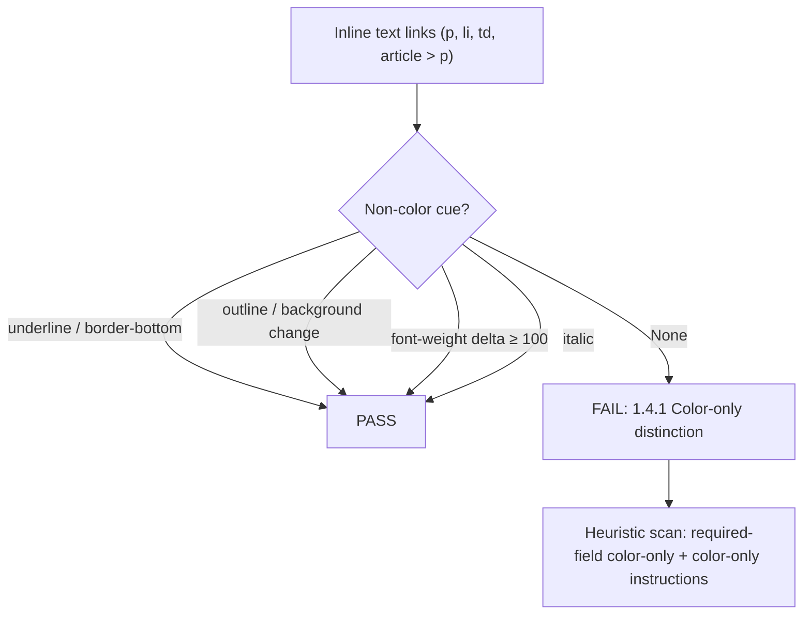
```mermaid
flowchart TD
    LNK["Inline text links (p, li, td, article > p)"] --> CUE{"Non-color cue?"}
    CUE -- "underline / border-bottom" --> PASS["PASS"]
    CUE -- "outline / background change" --> PASS
    CUE -- "font-weight delta ≥ 100" --> PASS
    CUE -- "italic" --> PASS
    CUE -- "None" --> FAIL["FAIL: 1.4.1 Color-only distinction"]
    FAIL --> NL["Heuristic scan: required-field color-only + color-only instructions"]
```

#### Cases Covered
- Underline, border-bottom, outline, background change, font-weight delta (≥100), italic.
- Comparison against non-anchor ancestor computed styles.
- Required-field color-only heuristic (no textual `required` / `必須` marker).
- Color-only instructional copy heuristic (state message tied only to color words).

#### Cases Missed
- Links inside shadow DOM.
- Links rendered on canvas.
- Chart/map legend semantics are still heuristic and can require manual review.

---

### 1.4.5 — Images of Text (Level AA)
**Check:** `images-of-text.check.js`

#### Flowchart
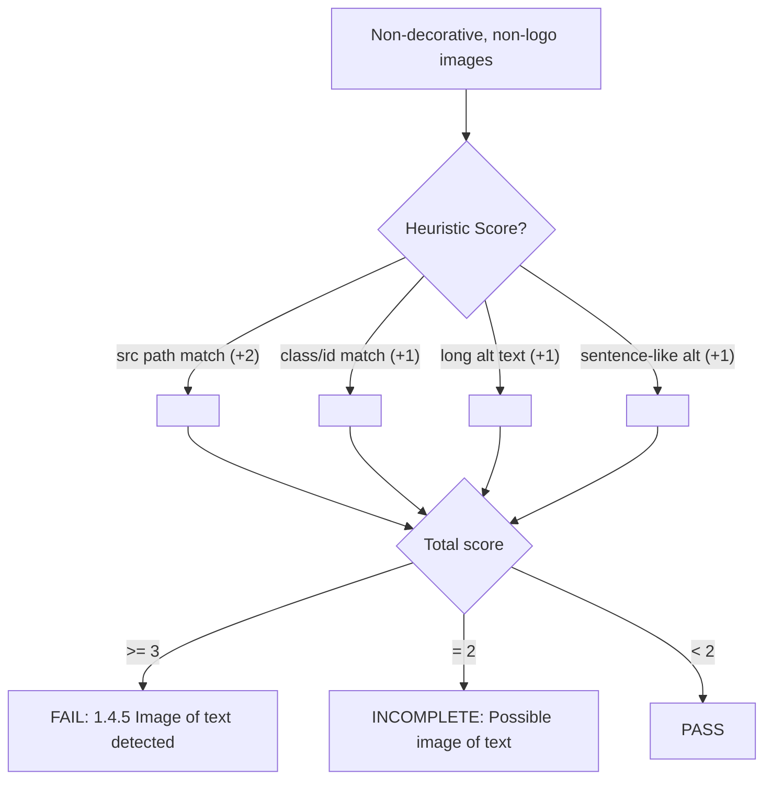
```mermaid
flowchart TD
    IMG["Non-decorative, non-logo images"] --> SCORE{"Heuristic Score?"}
    SCORE -- "src path match (+2)" --> ADD1[" "]
    SCORE -- "class/id match (+1)" --> ADD2[" "]
    SCORE -- "long alt text (+1)" --> ADD3[" "]
    SCORE -- "sentence-like alt (+1)" --> ADD4[" "]
    ADD1 & ADD2 & ADD3 & ADD4 --> TOT{"Total score"}
    TOT -- ">= 3" --> FAIL["FAIL: 1.4.5 Image of text detected"]
    TOT -- "= 2" --> INC["INCOMPLETE: Possible image of text"]
    TOT -- "< 2" --> PASS["PASS"]
```

#### Cases Covered
| Case | Detection |
|------|-----------|
| Text-image filename heuristics | `src` path contains text-image keywords |
| Alt-text length signals | Long or sentence-like alt text |
| CSS background images with text content | Background-image + text-content check |
| SVG `<text>` in image containers | SVG text element detection |

#### Cases Missed
| Case | Why |
|------|-----|
| Actual OCR | Heuristic only — no pixel analysis |
| Designer intent verification | Cannot distinguish deliberate logo from text image |
| Decorative background overlays | Excluded from scoring |

---

### 2.1.2 — No Keyboard Trap (Level A)
**Check:** `keyboard-trap.check.js` *(Interactive)*

#### Flowchart
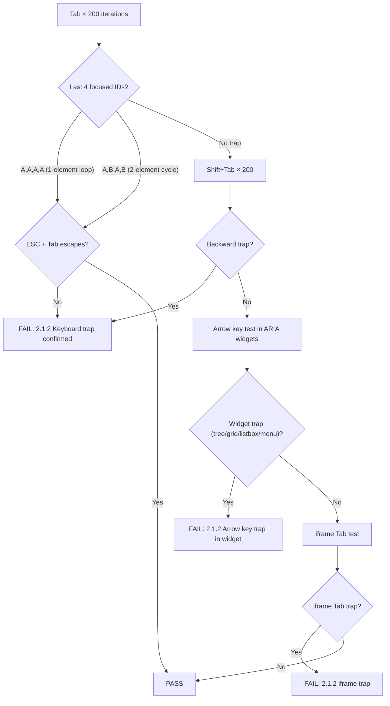
```mermaid
flowchart TD
    TAB["Tab × 200 iterations"] --> LAST4{"Last 4 focused IDs?"}
    LAST4 -- "A,A,A,A (1-element loop)" --> ESC{"ESC + Tab escapes?"}
    LAST4 -- "A,B,A,B (2-element cycle)" --> ESC
    ESC -- No --> FAIL1["FAIL: 2.1.2 Keyboard trap confirmed"]
    ESC -- Yes --> PASS["PASS"]
    LAST4 -- No trap --> SHIFT["Shift+Tab × 200"]
    SHIFT --> BACK{"Backward trap?"}
    BACK -- Yes --> FAIL1
    BACK -- No --> ARROW["Arrow key test in ARIA widgets"]
    ARROW --> WT{"Widget trap (tree/grid/listbox/menu)?"}
    WT -- Yes --> FAIL2["FAIL: 2.1.2 Arrow key trap in widget"]
    WT -- No --> IFR["iframe Tab test"]
    IFR --> IT{"iframe Tab trap?"}
    IT -- Yes --> FAIL3["FAIL: 2.1.2 iframe trap"]
    IT -- No --> PASS
```

#### Cases Covered
| Case | Detection |
|------|-----------|
| Single-element Tab trap | 4-element cycle detection (A,A,A,A) |
| Two-element Tab cycle | Pattern (A,B,A,B) detection |
| Backward Shift+Tab trap | Separate backward traversal |
| ARIA widget arrow traps | Tree, grid, listbox, menu, tablist, radiogroup |
| Iframe Tab traps | Cross-frame Tab navigation test |
| Escape verification | ESC key press before confirming trap |
| Modal no-escape trap (F85) | Visible dialog remains focused after Escape |
| Scripted key suppression (F58 heuristic) | Detects `preventDefault()` on Tab/Escape/Arrow handlers |
| Non-modal dismissibility (F60 heuristic) | Popup remains visible after Escape and has no close affordance |

#### Cases Missed
| Case | Why |
|------|-----|
| Framework-internal keyboard handlers | External bundled scripts may evade static snippet detection |
| Shadow DOM traps | Closed shadow DOM inaccessible |
| Dynamic focus management | Focus targets added after page load |

---

### 2.1.4 — Character Key Shortcuts (Level A)
**Check:** `character-key-shortcuts.check.js`

#### Flowchart
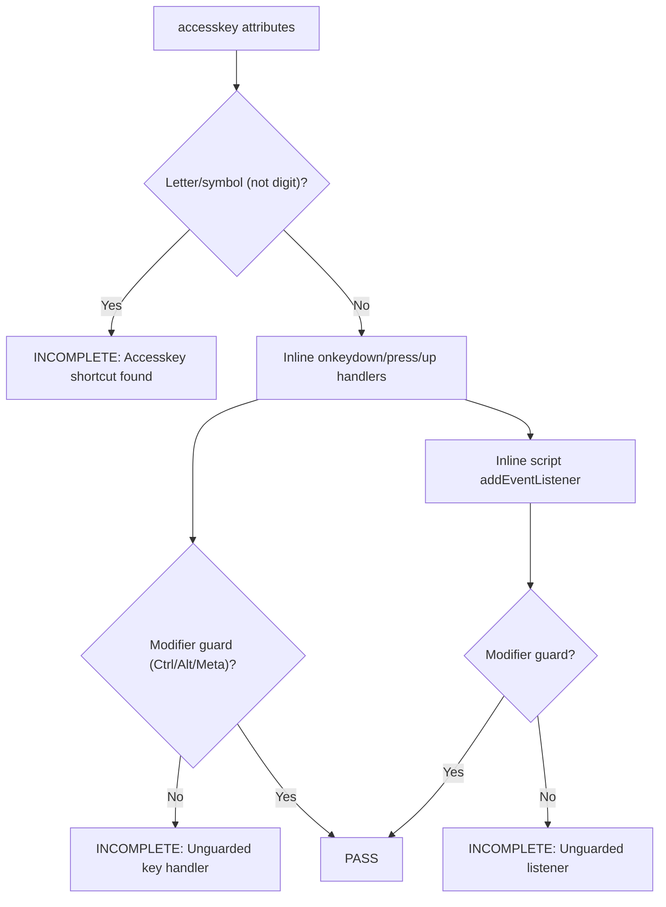
```mermaid
flowchart TD
    AK["accesskey attributes"] --> ALPH{"Letter/symbol (not digit)?"}
    ALPH -- Yes --> INC1["INCOMPLETE: Accesskey shortcut found"]
    ALPH -- No --> INL["Inline onkeydown/press/up handlers"]
    INL --> GUARD{"Modifier guard (Ctrl/Alt/Meta)?"}
    GUARD -- No --> INC2["INCOMPLETE: Unguarded key handler"]
    GUARD -- Yes --> PASS["PASS"]
    INL --> SCR["Inline script addEventListener"]
    SCR --> SGUARD{"Modifier guard?"}
    SGUARD -- No --> INC3["INCOMPLETE: Unguarded listener"]
    SGUARD -- Yes --> PASS
```

#### Cases Covered
| Case | Detection |
|------|-----------|
| `accesskey` usage | Letter/symbol accesskeys flagged |
| Inline key handlers | `onkeydown`, `onkeypress`, `onkeyup` checked |
| Script addEventListener | Inline `<script>` keyboard listener scan |
| Modifier guards | `ctrlKey`, `altKey`, `metaKey` checks |

#### Cases Missed
| Case | Why |
|------|-----|
| Dynamically-added listeners | Only inspects DOM at page-load |
| Timer-based keyboard events | Not inspected |

---

### 2.4.5 — Multiple Ways (Level AA)
**Check:** `multiple-ways.check.js`

#### Flowchart
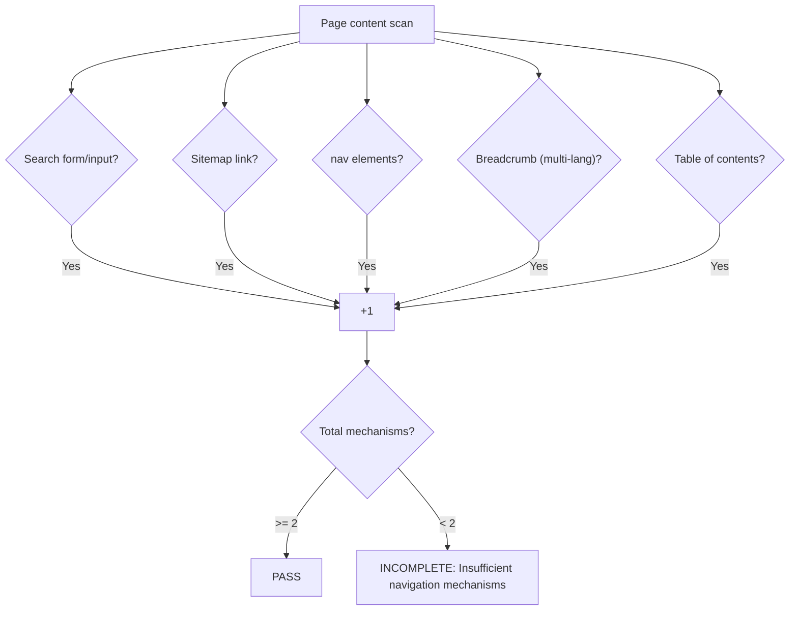
```mermaid
flowchart TD
    PAGE["Page content scan"] --> SRCH{"Search form/input?"}
    SRCH -- Yes --> +1
    PAGE --> SITE{"Sitemap link?"}
    SITE -- Yes --> +1
    PAGE --> NAV{"nav elements?"}
    NAV -- Yes --> +1
    PAGE --> BRD{"Breadcrumb (multi-lang)?"}
    BRD -- Yes --> +1
    PAGE --> TOC{"Table of contents?"}
    TOC -- Yes --> +1
    +1 --> COUNT{"Total mechanisms?"}
    COUNT -- ">= 2" --> PASS["PASS"]
    COUNT -- "< 2" --> INC["INCOMPLETE: Insufficient navigation mechanisms"]
```

#### Cases Covered
- Search (`input[type="search"]`, `[role="search"]`), sitemap link, `<nav>` elements, breadcrumbs (EN + JA patterns), table of contents.

#### Cases Missed
- Skip links as a navigation mechanism.
- Dynamic navigation menus loaded asynchronously.

---

### 2.4.7 — Focus Visible (Level AA)
**Check:** `focus-visible.check.js` *(Interactive)*

#### Flowchart
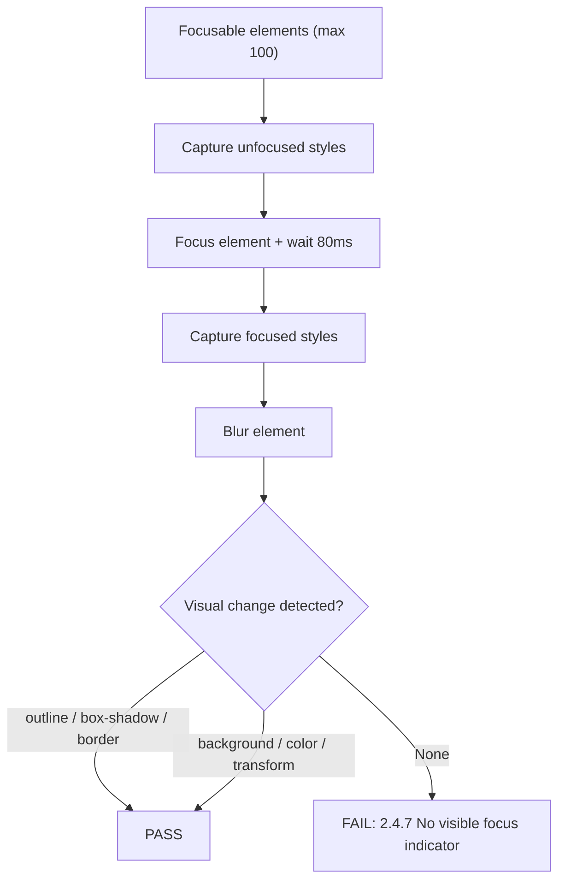
```mermaid
flowchart TD
    ELEM["Focusable elements (max 100)"] --> CAP1["Capture unfocused styles"]
    CAP1 --> FOC["Focus element + wait 80ms"]
    FOC --> CAP2["Capture focused styles"]
    CAP2 --> BLR["Blur element"]
    BLR --> DIFF{"Visual change detected?"}
    DIFF -- "outline / box-shadow / border" --> PASS["PASS"]
    DIFF -- "background / color / transform" --> PASS
    DIFF -- "None" --> FAIL["FAIL: 2.4.7 No visible focus indicator"]
```

#### Cases Covered
| Case | Detection |
|------|-----------|
| Outline appearance | `outline` property diff |
| Box shadow | `box-shadow` diff |
| Border change | `border` diff |
| Background change | `background-color` / `background` diff |
| Color change | `color` diff |
| Transform change | `transform` diff |

#### Cases Missed
| Case | Why |
|------|-----|
| CSS transitions with delays | 80ms settle window may not catch slow transitions |
| `focus-within` on parent | Parent style change, not element itself |
| Pseudo-element indicators | `::before`/`::after` injected focus styles |

---

### 2.4.8 — Location (Level AAA)
**Check:** `location.check.js`

#### Flowchart
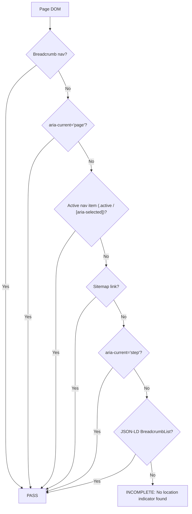
```mermaid
flowchart TD
    PAGE["Page DOM"] --> BRD{"Breadcrumb nav?"}
    BRD -- Yes --> PASS["PASS"]
    BRD -- No --> ARC{"aria-current='page'?"}
    ARC -- Yes --> PASS
    ARC -- No --> ACT{"Active nav item (.active / [aria-selected])?"}
    ACT -- Yes --> PASS
    ACT -- No --> STM{"Sitemap link?"}
    STM -- Yes --> PASS
    STM -- No --> STP{"aria-current='step'?"}
    STP -- Yes --> PASS
    STP -- No --> JSN{"JSON-LD BreadcrumbList?"}
    JSN -- Yes --> PASS
    JSN -- No --> INC["INCOMPLETE: No location indicator found"]
```

#### Cases Covered
- Breadcrumb navigation, `aria-current="page"`, active nav items (`.active`, `[aria-selected]`), sitemap link, table-of-contents signals, `aria-current="step"`, JSON-LD `BreadcrumbList`.

#### Cases Missed
- Implicit location from page title alone.
- Dynamic location updates post-navigation.

---

### 2.4.9 — Link Purpose (Link Only) (Level AAA)
**Check:** `link-purpose.check.js`

#### Flowchart
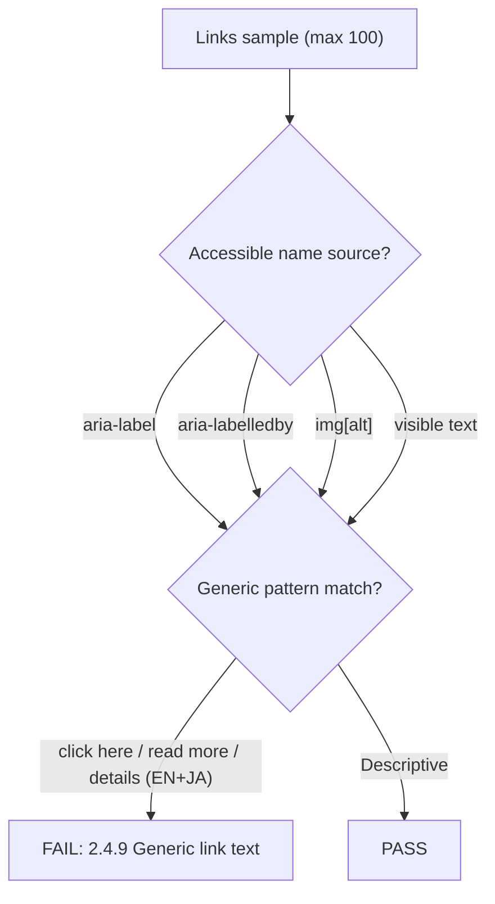
```mermaid
flowchart TD
    LNK["Links sample (max 100)"] --> NAME{"Accessible name source?"}
    NAME -- "aria-label" --> CHK{"Generic pattern match?"}
    NAME -- "aria-labelledby" --> CHK
    NAME -- "img[alt]" --> CHK
    NAME -- "visible text" --> CHK
    CHK -- "click here / read more / details (EN+JA)" --> FAIL["FAIL: 2.4.9 Generic link text"]
    CHK -- "Descriptive" --> PASS["PASS"]
```

#### Cases Covered
| Case | Detection |
|------|-----------|
| Generic EN patterns | "click here", "read more", "details", "more", "learn more" |
| Generic JA patterns | "こちら", "詳細", "もっと見る", "続きを読む" |
| Accessible name resolution | `aria-label` → `aria-labelledby` → `img[alt]` → visible text |

#### Cases Missed
| Case | Why |
|------|-----|
| `title` attribute only | Not in accessible name resolution order |
| Icon-only links with generated labels | Programmatic labels not evaluated |
| Links in hidden content | Hidden content excluded |

---

### 2.4.13 — Focus Appearance (Level AAA)
**Check:** `focus-appearance.check.js` *(Interactive)*

#### Flowchart
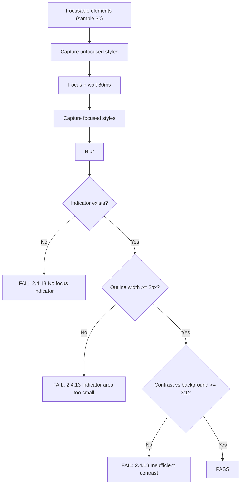
```mermaid
flowchart TD
    ELEM["Focusable elements (sample 30)"] --> CAP1["Capture unfocused styles"]
    CAP1 --> FOC["Focus + wait 80ms"]
    FOC --> CAP2["Capture focused styles"]
    CAP2 --> BLR["Blur"]
    BLR --> IND{"Indicator exists?"}
    IND -- No --> FAIL1["FAIL: 2.4.13 No focus indicator"]
    IND -- Yes --> AREA{"Outline width >= 2px?"}
    AREA -- No --> FAIL2["FAIL: 2.4.13 Indicator area too small"]
    AREA -- Yes --> CONT{"Contrast vs background >= 3:1?"}
    CONT -- No --> FAIL3["FAIL: 2.4.13 Insufficient contrast"]
    CONT -- Yes --> PASS["PASS"]
```

#### Cases Covered
| Case | Detection |
|------|-----------|
| Indicator presence | Style diff after focus |
| Minimum area | `outline-width` ≥ 2px |
| Contrast ratio | Relative luminance vs background ≥ 3:1 |

#### Cases Missed
| Case | Why |
|------|-----|
| Custom pseudo-element indicators | `::before`/`::after` not inspected |
| 3D transform indicators | `transform` not in contrast calculation |
| Blurred focus states | Post-80ms blur states missed |

---

### 2.5.2 — Pointer Cancellation (Level A)
**Check:** `pointer-cancellation.check.js`

#### Flowchart
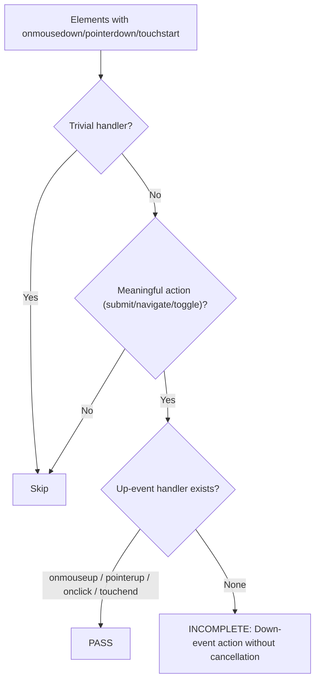
```mermaid
flowchart TD
    ELEM["Elements with onmousedown/pointerdown/touchstart"] --> TRIV{"Trivial handler?"}
    TRIV -- Yes --> SKIP["Skip"]
    TRIV -- No --> ACT{"Meaningful action (submit/navigate/toggle)?"}
    ACT -- No --> SKIP
    ACT -- Yes --> CANCEL{"Up-event handler exists?"}
    CANCEL -- "onmouseup / pointerup / onclick / touchend" --> PASS["PASS"]
    CANCEL -- "None" --> INC["INCOMPLETE: Down-event action without cancellation"]
```

#### Cases Covered
- Pointer-down actions on elements with meaningful handlers.
- Cancellation verification via matching up-event handlers.
- Trivial handler filtering.

#### Cases Missed
- Actions inside event-listener scripts (only inline attributes scanned).
- Touch-specific multi-gesture cancellation strategies.

---

### 2.5.3 — Label in Name (Level A)
*(Covered by axe-core; custom audit reinforces via `label_in_name_auditor`)*

---

### 2.5.7 — Dragging Movements (Level AA)
**Check:** `dragging-movements.check.js`

#### Flowchart
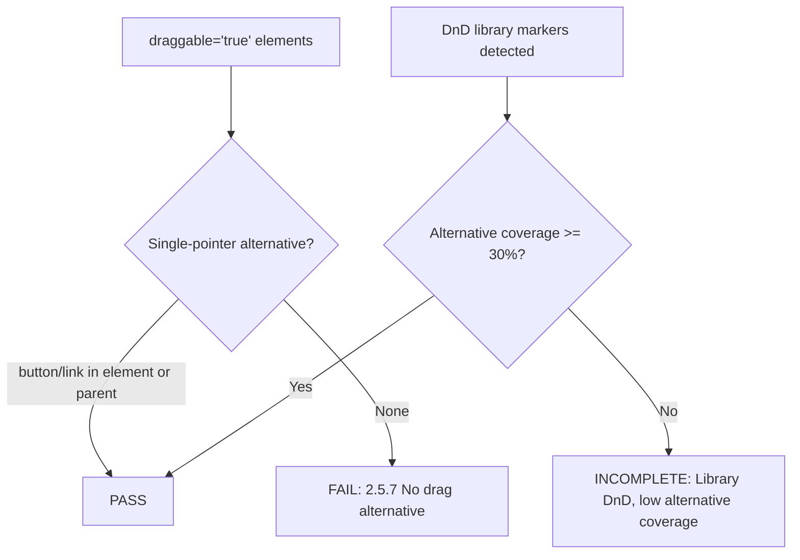
```mermaid
flowchart TD
    DRAG["draggable='true' elements"] --> ALT{"Single-pointer alternative?"}
    ALT -- "button/link in element or parent" --> PASS["PASS"]
    ALT -- "None" --> FAIL["FAIL: 2.5.7 No drag alternative"]
    LIB["DnD library markers detected"] --> COV{"Alternative coverage >= 30%?"}
    COV -- Yes --> PASS
    COV -- No --> INC["INCOMPLETE: Library DnD, low alternative coverage"]
```

#### Cases Covered
| Case | Detection |
|------|-----------|
| Native `draggable="true"` | Direct attribute check |
| react-beautiful-dnd | `[data-rbd-draggable-id]` marker |
| dnd-kit | `[data-dndkit-draggable]` marker |
| Sortable.js / jQuery UI | Class pattern detection |
| Alternative button/link | Sibling/parent `<button>`/`<a>` check |

#### Cases Missed
| Case | Why |
|------|-----|
| Shadow DOM drag handlers | Inaccessible to DOM traversal |
| Pointer-based custom drag (no `draggable` attribute) | Attribute not present |

---

### 3.1.6 — Pronunciation (Level AAA)
**Check:** `pronunciation.check.js` *(Interactive)*

#### Flowchart
```mermaid
flowchart TD
    LANG["page lang attribute"] --> CJK{"CJK language declared?"}
    CJK -- No --> DENS{"CJK char density >= 5%?"}
    DENS -- No --> PASS["PASS"]
    DENS -- Yes --> RUBY["Count ruby elements"]
    CJK -- Yes --> RUBY
    RUBY --> WALK["Walk text nodes, identify kanji outside ruby"]
    WALK --> COV{"Ruby coverage %?"}
    COV -- ">= 30%" --> PASS
    COV -- "< 30%" --> INC["INCOMPLETE: Low ruby annotation coverage"]
    COV -- "0% + high kanji" --> FAIL["FAIL: 3.1.6 No ruby annotations on kanji-heavy page"]
```

#### Cases Covered
| Case | Detection |
|------|-----------|
| CJK language detection | `lang` attribute + character density heuristic |
| Ruby element counting | `<ruby>` element presence |
| Kanji identification | CJK Unified Ideographs Unicode range |
| Coverage calculation | Annotated kanji / total kanji ratio |
| Section-level CJK | `lang` attribute on subsections |

#### Cases Missed
| Case | Why |
|------|-----|
| Phonetic script furigana | Hiragana annotation without `<ruby>` tag |
| Ruby in SVG | SVG not in DOM text walk |
| Dynamic ruby insertion | Post-load injection not captured |

---

### 3.2.1 — On Focus (Level A)
**Check:** `on-focus.check.js` *(Interactive)*

#### Flowchart
```mermaid
flowchart TD
    ELEM["Focusable elements"] --> HOOK["Hook framenavigated + history.pushState/replaceState"]
    HOOK --> FOC["Focus each element, wait 100ms"]
    FOC --> NAV{"URL pathname/search changed?"}
    NAV -- "Hash-only change" --> PASS["PASS (skip link, not violation)"]
    NAV -- "Pathname/search changed" --> FAIL["FAIL: 3.2.1 Context change on focus"]
    NAV -- "No change" --> PASS
```

#### Cases Covered
- Navigation triggered purely by focus events.
- SPA `pushState`/`replaceState` navigation detection.
- Hash-only changes (skip links) correctly exempted.

#### Cases Missed
| Case | Why |
|------|-----|
| Modal open on focus (no URL change) | Not a navigation, not flagged |
| JavaScript-only route changes | Only URL change detected |

---

### 3.2.2 — On Input (Level A)
**Check:** `on-input.check.js` *(Interactive)*

#### Flowchart
```mermaid
flowchart TD
    INP["Input elements (text/number/email/select/checkbox/radio/contenteditable)"] --> TYPE{"Input type?"}
    TYPE -- "text/number/email" --> CHAR["Type type-safe char, wait 120ms"]
    TYPE -- "select" --> CHG["Programmatic option change"]
    TYPE -- "checkbox/radio" --> CLK["Click toggle"]
    TYPE -- "contenteditable" --> CHAR
    CHAR & CHG & CLK --> NAV{"URL/navigation change?"}
    NAV -- Yes --> FAIL["FAIL: 3.2.2 Context change on input"]
    NAV -- No --> REST["Restore original state"]
    REST --> PASS["PASS"]
```

#### Cases Covered
- Text, number, email inputs (type-safe characters).
- Select option change (programmatic).
- Checkbox and radio click toggle.
- `contenteditable` typing.
- SPA navigation detection via URL change.

#### Cases Missed
| Case | Why |
|------|-----|
| Auto-submit on field completion | Not triggered by single character |
| JavaScript-only form submission without URL change | URL change detection only |

---

### 3.2.6 — Consistent Help (Level A)
**Check:** `consistent-help.check.js`

#### Flowchart
```mermaid
flowchart TD
    PAGE["Page content"] --> HLP{"Help link found? (EN+JA+more)"}
    HLP -- Yes --> LOC["Detect location: header/footer/nav/body"]
    LOC --> PASS["PASS"]
    HLP -- No --> CHAT{"Chat widget or chatbot?"}
    CHAT -- Yes --> PASS
    CHAT -- No --> CONT{"Phone / email contact?"}
    CONT -- Yes --> PASS
    CONT -- No --> INC["INCOMPLETE: No help mechanism found"]
```

#### Cases Covered
| Case | Detection |
|------|-----------|
| Help/Contact/Support links | Multi-language keyword patterns |
| FAQ links | "FAQ", "よくある質問" patterns |
| Chat widgets | Common chat SDK class markers |
| Phone/email contact | `href="tel:"`, `href="mailto:"` |
| Location tracking | header, footer, nav, body classification |

#### Cases Missed
| Case | Why |
|------|-----|
| Help inside modals or hidden regions | Not in visible DOM scan |
| Context-sensitive help (per-page) | Only detects global mechanism |

---

### 3.3.3 — Error Suggestion (Level AA)
**Check:** `error-suggestion.check.js`

#### Flowchart
```mermaid
flowchart TD
    ERR["Error elements (role=alert, aria-live=assertive, aria-invalid, aria-errormessage)"] --> MSG{"Error message text?"}
    MSG -- "Terse: 'invalid' / 'error' / 'required'" --> FAIL["FAIL: 3.3.3 No actionable suggestion"]
    MSG -- "Suggestion pattern: 'please enter', 'must be', digit range" --> PASS["PASS"]
    MSG -- "None found" --> INC["INCOMPLETE: No error elements found"]
```

#### Cases Covered
| Case | Detection |
|------|-----------|
| `role="alert"` messages | Direct error element query |
| `aria-live="assertive"` | Live region error detection |
| `aria-invalid` + `aria-describedby` | Linked error message extraction |
| Suggestion patterns | "please enter", "must be", digit ranges |
| Terse error detection | "invalid", "error", "required" only |

#### Cases Missed
| Case | Why |
|------|-----|
| Server-submitted errors | Not in DOM at page load |
| Tooltip-based errors | Dynamic tooltip content |
| Dynamically inserted errors | Not triggered during static check |

---

### 3.3.4 — Error Prevention (Level AA)
**Check:** `error-prevention.check.js`

#### Flowchart
```mermaid
flowchart TD
    FORM["Forms on page"] --> RISK{"High-risk context?"}
    RISK -- "financial / legal / destructive action keywords" --> SAFE{"Safeguards present?"}
    RISK -- "No" --> PASS["PASS"]
    SAFE -- "Review text / confirm checkbox / review button / multi-step indicator / undo-revert signal" --> PASS
    SAFE -- "None" --> FAIL["FAIL: 3.3.4 No error prevention mechanism"]
```

#### Cases Covered
| Case | Detection |
|------|-----------|
| Financial form detection | Heading/button keyword patterns (payment, purchase, checkout) |
| Legal form detection | "agreement", "terms", "contract" patterns |
| Destructive action detection | "delete", "remove", "cancel account" patterns |
| Review/confirm safeguards | "review", "confirm" in text/buttons |
| Confirmation checkboxes | `input[type=checkbox]` near submit |
| Multi-step indicators | Step/progress indicator presence |
| Undo/revert safeguards | "undo", "revert", "restore", `取り消し`, `元に戻す` signals |

#### Cases Missed
| Case | Why |
|------|-----|
| Safeguards inside modals | Not in static DOM scan |
| Time-delayed confirmations | Dynamic confirmation dialogs |

---

### 3.3.7 — Redundant Entry (Level A)
**Check:** `redundant-entry.check.js`

#### Flowchart
```mermaid
flowchart TD
    FORMS["Forms on page"] --> PERS{"Personal data fields with autocomplete?"}
    PERS -- "Multiple forms, same fields, no reuse" --> RED{"Reuse mechanism?"}
    RED -- "same-as / copy-from controls" --> PASS["PASS"]
    RED -- "confirmation fields (confirm/re-enter)" --> PASS
    RED -- "None" --> INC["INCOMPLETE: Possible redundant entry"]
    PERS -- "Single form or distinct fields" --> PASS
```

#### Cases Covered
| Case | Detection |
|------|-----------|
| Multi-form personal data | Autocomplete token matching across forms |
| Reuse controls | "same as billing", "copy from" patterns |
| Confirmation fields | "confirm email", "re-enter password" |
| Process classification | checkout, account, application, booking |

#### Cases Missed
| Case | Why |
|------|-----|
| JavaScript-based prefill | Dynamic population not in static DOM |
| localStorage recovery | Not inspected |

---

### 3.3.8 — Accessible Authentication (Minimum) (Level AA)
**Check:** `accessible-auth.check.js`

#### Flowchart
```mermaid
flowchart TD
    AUTH["Auth form detected (password field / login context)"] --> CAP{"CAPTCHA present?"}
    CAP -- No --> PASTE{"Paste blocked?"}
    CAP -- Yes --> ACAP{"Accessible alternative (audio/link)?"}
    ACAP -- Yes --> PASTE
    ACAP -- No --> FAIL1["FAIL: 3.3.8 CAPTCHA without accessible alternative"]
    PASTE -- "Inline paste-block" --> FAIL2["FAIL: 3.3.8 Paste prevention blocks cognitive function"]
    PASTE -- "addEventListener paste-block" --> FAIL2
    PASTE -- No --> COG{"Cognitive function test?"}
    COG -- "Math / visual puzzle without alternative" --> FAIL3["FAIL: 3.3.8 Cognitive function test"]
    COG -- No --> PK{"Passkey / WebAuthn option?"}
    PK -- Yes --> PASS["PASS (enhanced)"]
    PK -- No --> PASS
```

#### Cases Covered
| Case | Detection |
|------|-----------|
| Google / hCaptcha / Cloudflare CAPTCHA | SDK class/script markers |
| Image-based CAPTCHA | Alt-text pattern detection |
| Audio CAPTCHA alternative | Audio link nearby |
| Paste blocking | Inline handler + addEventListener scan |
| Math / visual puzzles | Regex pattern matching on labels/text |
| Passkey / WebAuthn | `credentials.create()` or passkey keyword |

#### Cases Missed
| Case | Why |
|------|-----|
| Custom obfuscated CAPTCHA | No SDK markers present |
| WebAuthn detection accuracy | JS API calls not always in inline code |

---

### 4.1.1 — Parsing (Level A)
**Check:** `html-parsing.check.js`

#### Flowchart
```mermaid
flowchart TD
    DOM["Page DOM"] --> DUP{"Duplicate IDs?"}
    DUP -- Yes --> FAIL1["FAIL: 4.1.1 Duplicate ID found"]
    DUP -- No --> ARIA{"Broken ARIA references?"}
    ARIA -- "aria-labelledby / aria-describedby / aria-controls / aria-owns pointing to non-existent ID" --> FAIL2["FAIL: 4.1.1 Broken ARIA reference"]
    ARIA -- "OK" --> ORPH{"Orphaned label[for]?"}
    ORPH -- "No matching input" --> FAIL3["FAIL: 4.1.1 Orphaned label"]
    ORPH -- "OK" --> PASS["PASS"]
```

#### Cases Covered
| Case | Detection |
|------|-----------|
| Duplicate `id` attributes | Full DOM `[id]` scan + Map |
| Broken `aria-labelledby` / `aria-describedby` | ID reference validation |
| Broken `aria-controls` / `aria-owns` | ID reference validation |
| Orphaned `<label for>` | Matching input existence check |

#### Cases Missed
| Case | Why |
|------|-----|
| Duplicate ARIA roles | Not in scope |
| Malformed `aria-label` values | Not syntactically validated |

---

### 4.1.3 — Status Messages (Level AA)
**Check:** `status-messages.check.js`

#### Flowchart
```mermaid
flowchart TD
    DOM["Page DOM"] --> LR{"Live regions present? (aria-live, role=status/alert/log/timer)"}
    LR -- Yes --> CTX{"Dynamic contexts detected?"}
    CTX -- Yes --> ATM{"aria-atomic=true on alerts?"}
    ATM -- Yes --> PASS["PASS"]
    ATM -- No --> INC1["INCOMPLETE: aria-atomic missing on alerts"]
    CTX -- No --> PASS
    LR -- No --> DYN{"Dynamic contexts (form, search, cart, notifications)?"}
    DYN -- Yes --> FAIL["FAIL: 4.1.3 No live region for dynamic content"]
    DYN -- No --> PASS
```

#### Cases Covered
| Case | Detection |
|------|-----------|
| Live region presence | `[aria-live]`, `[role="status/alert/log/timer"]` |
| Dynamic context detection | Form, search, cart, notification selectors |
| `aria-atomic` validation | On `role="alert"` elements |
| Inline validation errors | `[aria-invalid]` + message elements |
| Toast containers without ARIA semantics | Emits `custom-status-messages-toast` heuristic finding |

#### Cases Missed
| Case | Why |
|------|-----|
| Runtime-only status updates | Not in DOM at page load |
| Async updates (after page load) | Static scan only |

---

## Coverage Summary

| WCAG SC | Criterion | Check File | Pipeline Stage | Mode | Confidence |
|---------|-----------|------------|----------------|------|------------|
| 1.2.1 | Audio-only / Video-only | audio-transcript.check.js | Static | Static | Medium |
| 1.3.2 | Meaningful Sequence | meaningful-sequence.check.js | Static | Static | Medium |
| 1.3.4 | Orientation | orientation.check.js | Static | Static | High |
| 1.4.1 | Use of Color | use-of-color.check.js | Static | Static | High |
| 1.4.5 | Images of Text | images-of-text.check.js | Static | Static | Medium |
| 2.1.2 | No Keyboard Trap | keyboard-trap.check.js | Interactive | Interactive | High |
| 2.1.4 | Character Key Shortcuts | character-key-shortcuts.check.js | Static | Static | Medium |
| 2.4.5 | Multiple Ways | multiple-ways.check.js | Static | Static | Medium |
| 2.4.7 | Focus Visible | focus-visible.check.js | Interactive | Interactive | High |
| 2.4.8 | Location | location.check.js | Static | Static | Medium |
| 2.4.9 | Link Purpose (Link Only) | link-purpose.check.js | Static | Static | High |
| 2.4.13 | Focus Appearance | focus-appearance.check.js | Interactive | Interactive | High |
| 2.5.1 | Pointer Gestures | src/audits/wcag-2.5.1/ | Static | Static | Medium |
| 2.5.2 | Pointer Cancellation | pointer-cancellation.check.js | Static | Static | Medium |
| 2.5.4 | Motion Actuation | src/audits/wcag-2.5.4/ | Static | Static | Low |
| 2.5.7 | Dragging Movements | dragging-movements.check.js | Static | Static | Medium |
| 3.1.6 | Pronunciation | pronunciation.check.js | Static | Static | High |
| 3.2.1 | On Focus | on-focus.check.js | Interactive | Interactive | High |
| 3.2.2 | On Input | on-input.check.js | Interactive | Interactive | High |
| 3.2.6 | Consistent Help | consistent-help.check.js | Static | Static | Medium |
| 3.3.3 | Error Suggestion | error-suggestion.check.js | Static | Static | High |
| 3.3.4 | Error Prevention | error-prevention.check.js | Static | Static | Medium |
| 3.3.7 | Redundant Entry | redundant-entry.check.js | Static | Static | Medium |
| 3.3.8 | Accessible Authentication | accessible-auth.check.js | Static | Static | High |
| 4.1.1 | Parsing | html-parsing.check.js | Static | Static | High |
| 4.1.3 | Status Messages | status-messages.check.js | Static | Static | High |
