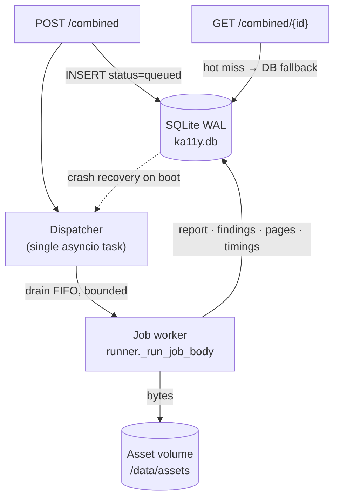

## Why this exists

Earlier, an audit's entire state lived in process memory: a `_jobs` dict with a
1-hour TTL, the report as a JSON file under `output_dir`, images on disk, and
telemetry scattered across four log-file formats. Nothing survived a restart,
there was no run history, and a crash mid-run lost the job.

ka11y now has a **durable store** (single-box SQLite, WAL) that is the source of
truth for run state, reports, findings, assets metadata, and telemetry. The
in-memory `_jobs` dict is now only a **hot cache** in front of it.

## The store (`ka11y/store/`)

| Module | Responsibility |
|--------|----------------|
| `db.py` | SQLite **WAL** connection + a **single serialized writer thread**. All writes funnel through one queue-fed thread, so SQLite never raises *"database is locked."* Reads run concurrently on thread-local connections. |
| `repo.py` | High-level CRUD. Hot-path writes are wrapped — a DB error logs and is swallowed, so **persistence can never fail an audit**. |
| `assets.py` | Content-addressed asset store (see below). |
| `cpu_pool.py` | Shared `ProcessPoolExecutor` for pure-CPU work (opt-in). |
| `retention.py` | Background sweep that deletes runs older than the retention window and prunes their assets. |

### Schema (v1 + v2)

| Table | Holds |
|-------|-------|
| `runs` | One row per audit job — status, params, language, timings (`queue_wait_ms`, `wall_ms`), summary, `attempt` (crash-requeue). |
| `run_pages` | Per-page crawl rows (resolved URL, depth, crawl_ms). |
| `run_reports` | The full report, zlib-compressed JSON. |
| `findings` | Every finding flattened for querying (by SC, status, page, source). |
| `assets` | Asset metadata (kind, rel_path, sha256, mime, bytes). Bytes live on disk. |
| `stage_timings` | One row per fine-grained `(page, stage, sub_stage, rule)` step. |
| `run_events` | Durable lifecycle/SSE log (queued, running, stage events, completion, reviews). |
| `finding_reviews` | Manual-review decisions on `needs_review` items (see [Scoring & Manual Review](/internals/scoring-and-manual-review)). |

## Durable, crash-safe queue

`POST /combined` no longer launches the job in-process. It **persists a `queued`
run** and wakes the **dispatcher** (a singleton background task started in the
FastAPI lifespan):

1. **On boot** the dispatcher runs `repo.requeue_running()` — any run left
   `running` by a crash is moved back to `queued` (or failed if it has exhausted
   `KA11Y_MAX_ATTEMPTS`). Interrupted audits **resume automatically**.
2. It drains `queued` rows **FIFO**, bounded by `KA11Y_MAX_CONCURRENT_JOBS`.
3. A run can be cancelled cooperatively via
   `POST /combined/{id}/cancel`; the worker checks the DB status between stages.

If the store ever fails to initialise, the POST handler transparently falls back
to the legacy in-process launch, so audits still run.

## Content-addressed asset store

Audit images (screenshots, OCR crops, contrast regions) are written to a mounted
volume at a path derived from their **sha256**
(`{run}/{kind}/{sha[:2]}/{sha}.{ext}`), and a row is recorded in `assets`. Because
the path is content-addressed, the same logo across 50 pages is **stored once**.

- Served by id: `GET /api/v1/assets/{id}` (the row is the authority for the
  on-disk location; a containment check blocks path traversal).
- The runner stamps `image_url` / `element.image_src` with `/api/v1/assets/{id}`,
  so the frontend renders assets straight from the store. The legacy
  `?path=` endpoint remains only as a deprecated fallback.

## Telemetry → DB

All four timing sources now mirror into SQLite (files become opt-out via
`KA11Y_TELEMETRY_FILES=0`):

| Source | DB destination |
|--------|----------------|
| `stage_timing` (per-step) | `stage_timings` |
| `crawler_timing` (per-crawler) | `stage_timings` (`sub_stage=crawl`) |
| `run_timing` (per-run aggregate) | `run_events` (`event=run_timing`) |
| lifecycle / SSE events | `run_events` |

This makes the questions the old log files could only hint at queryable:
`GET /api/v1/admin/metrics` returns throughput, failure rate by stage, slowest
stages, and wall-time by crawl depth — all from SQL.

## New & durable API surface

| Endpoint | Purpose |
|----------|---------|
| `GET /combined/history?limit=&offset=&url=&status=` | Paginated run history (survives restart/TTL). |
| `GET /combined/{id}` | Now falls back to the DB when the run has left the hot cache. |
| `GET /combined/{id}/timings` | Rebuilt from `stage_timings` for evicted runs. |
| `GET /combined/{id}/stream` | SSE; replays the terminal state from the store for finished runs. |
| `POST /combined/{id}/cancel` | Cooperative cancel. |
| `GET /api/v1/assets/{id}` | Content-addressed asset serving. |
| `GET /api/v1/admin/metrics` | Telemetry rollups for ops. |

See [Environment Variables](/deployment/environment) for `KA11Y_DB_PATH`,
`KA11Y_ASSET_DIR`, retention, queue, CPU-pool, and the unified-crawl flag.

## Process pool & unified crawl (opt-in)

- `KA11Y_CPU_WORKERS=N` (>0) routes pure-CPU work (report compression, finding
  merge) through a process pool for true multi-core parallelism. Default (`0`)
  keeps the existing thread path — model-based OCR stays on threads by design.
- `KA11Y_UNIFIED_CRAWL=1` runs axe-core **inside the Playwright page** the
  crawler already renders (one page load) instead of a second Puppeteer crawl in
  Node. Default **off** until validated against the Node engine on fixtures.
