> 生成日: 2026-04-06
> 更新日: 2026-04-13
> スコープ: `ka11y-python/ka11y/accessibility/rules/` + `ka11y-python/ka11y/accessibility/rendered/evaluators/` + 統合オーケストレーション（`runner.py`, `stages.py`, `findings.py`）
> スタック: Python 3.10+ + Playwright + OCR（PaddleOCR、未利用時は EasyOCR にフォールバック）+ ML 分類器

---

## アーキテクチャと要求フロー

### 現在の本番経路

現在の本番フローは、旧 `/api/v1/audit` 単体サービスではなく **combined パイプライン** です。

- 1 件の combined リクエストが `ka11y-node` と `ka11y-python` に分岐する
- `ka11y-python` は 7 つの DOM ルール群に対して **1 回の universal static crawl** を共有する
- `AsyncImageCrawler` は画像取得、OCR、コントラスト、画像監査を担当する
- `RenderedLayoutCrawler` は表示方向、リフロー、テキストサイズ変更、ホバー、フォーカス系の評価を担当する
- 最終レポートはマージ、重複排除、warning 付与を行い `combined_report.json` として保存される

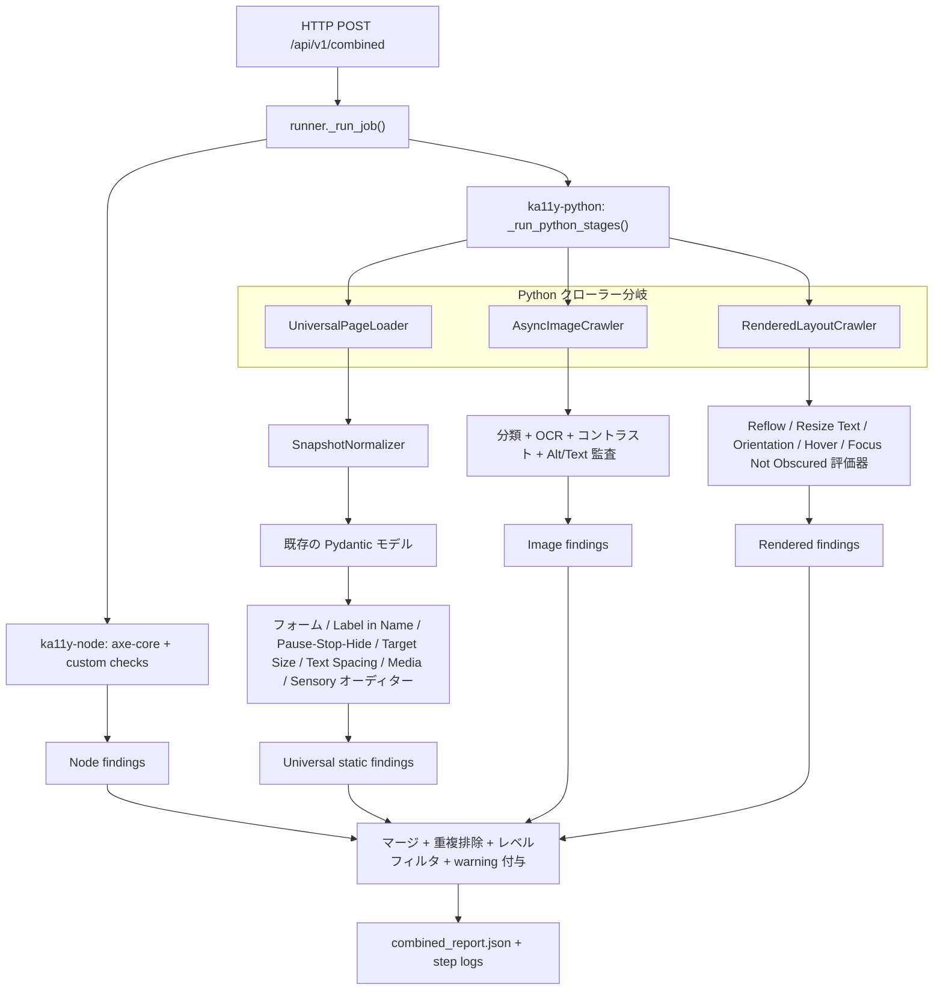
```mermaid
flowchart TD
    A[HTTP POST /api/v1/combined] --> B["runner._run_job()"]
    B --> C["ka11y-node: axe-core + custom checks"]
    B --> D["ka11y-python: _run_python_stages()"]

    subgraph "Python クローラー分岐"
        E["UniversalPageLoader"]
        F["AsyncImageCrawler"]
        G["RenderedLayoutCrawler"]
    end

    D --> E
    D --> F
    D --> G

    E --> H["SnapshotNormalizer"]
    H --> I["既存の Pydantic モデル"]
    I --> J["フォーム / Label in Name / Pause-Stop-Hide / Target Size / Text Spacing / Media / Sensory オーディター"]

    F --> K["分類 + OCR + コントラスト + Alt/Text 監査"]
    G --> L["Reflow / Resize Text / Orientation / Hover / Focus Not Obscured 評価器"]

    C --> M["Node findings"]
    J --> N["Universal static findings"]
    K --> O["Image findings"]
    L --> P["Rendered findings"]

    M & N & O & P --> Q["マージ + 重複排除 + レベルフィルタ + warning 付与"]
    Q --> R["combined_report.json + step logs"]
```

### カスタムチェックの実行モデル

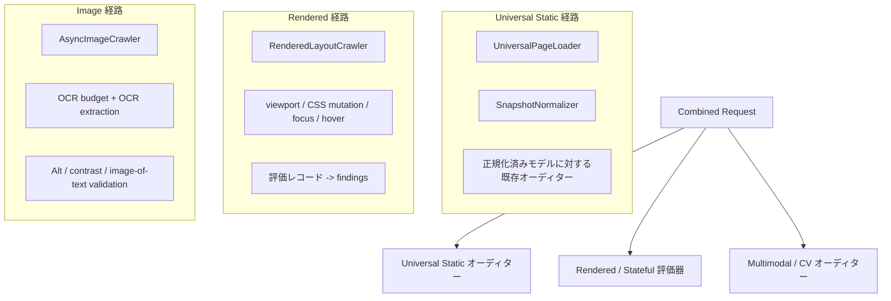
```mermaid
flowchart TD
    Index["Combined Request"] --> Static["Universal Static オーディター"]
    Index --> Rendered["Rendered / Stateful 評価器"]
    Index --> Multi["Multimodal / CV オーディター"]

    subgraph "Universal Static 経路"
        S1["UniversalPageLoader"]
        S2["SnapshotNormalizer"]
        S3["正規化済みモデルに対する既存オーディター"]
    end

    subgraph "Rendered 経路"
        R1["RenderedLayoutCrawler"]
        R2["viewport / CSS mutation / focus / hover"]
        R3["評価レコード -> findings"]
    end

    subgraph "Image 経路"
        M1["AsyncImageCrawler"]
        M2["OCR budget + OCR extraction"]
        M3["Alt / contrast / image-of-text validation"]
    end
```

### 現在の Python ステージ構成

| ステージ | データソース | 監査モード | 備考 |
|------|-------------|------------|------|
| `form_audit` | Universal snapshot -> `FormInputData` | Static | same-origin iframe と open shadow root を universal crawl から継承 |
| `label_in_name` | Universal snapshot -> `InteractiveElementData` | Static | `selector`、`element_ref_id`、`frame_path` の来歴を保持 |
| `pause_stop_hide` | Universal snapshot -> `MovingContentData` | Static | `duration_known` と `applicability_exception=loading_indicator` に対応 |
| `target_size` | Universal snapshot -> `TargetSizeData` | Static | iframe / shadow-root のカバレッジを継承 |
| `text_spacing` | Universal snapshot -> `TextSpacingData` | Static | 構造リスク判定 |
| `media_audit` | Universal snapshot -> `MediaElementData` | Static | transcript / nearby-link 判定 |
| `sensory_audit` | Universal snapshot -> `SensoryElementData` | Static | 日本語 / CJK を含む言語対応 |
| `image_audit` | `AsyncImageCrawler` + OCR | Multimodal | OCR には予算上限があり、大規模ページでも段階的に処理 |
| `rendered_layout_audit` | `RenderedLayoutCrawler` | Rendered | hover / focus の失敗モードを強化済み |

### 直近の強化点

| 領域 | 現在の挙動 |
|------|------------------|
| Universal warnings | cross-origin / failed-frame warning を `warning_details` にサンプリングして出力 |
| Merge dedup | `runner._merge_findings()` は HTML フォールバックより selector / target / ref を優先 |
| OCR budget | `crawler.performance.max_ocr_images_per_run` が OCR 対象数を制限し、選択 / スキップ数をログ出力 |
| Rendered limits | `crawler.performance.max_focus_steps` と `crawler.performance.max_hover_candidates` で探索量を制御 |
| CJK text spacing | `crawler.language.cjk_langs` が日本語など CJK 向け spacing override CSS を決定 |
| Config loading | `load_config()` はキャッシュされるが、防御的コピーを返して共有状態の破壊を防ぐ |

### 日本語化と言語ルーティング

combined リクエストの `lang` は Node と Python の両方に渡されますが、Python 側の finding 文字列は責務によって挙動が分かれます。

- `criterion_name` は共有 i18n ローダーから日本語化される
- `suggested_fix` も同じ shared `rules.yml` + locale overlay から日本語化される
- `reason` は各 Python オーディター / evaluator が返す文言に依存する

現在の実務上の挙動:

- 日本語監査では OCR や sensory / text-spacing 系の一部ヒューリスティックが `lang=ja` に追従する
- Python の `reason` はまだ混在しており、古い converter は英語のままのものがある
- finding テキスト全体の日本語化は、現時点では Python より Node の方が進んでいる

---

## ルール別分析

---

### 1.1.1 — 非テキストコンテンツ (レベル A)
**チェックファイル:** `alttext.py`

#### フローチャート
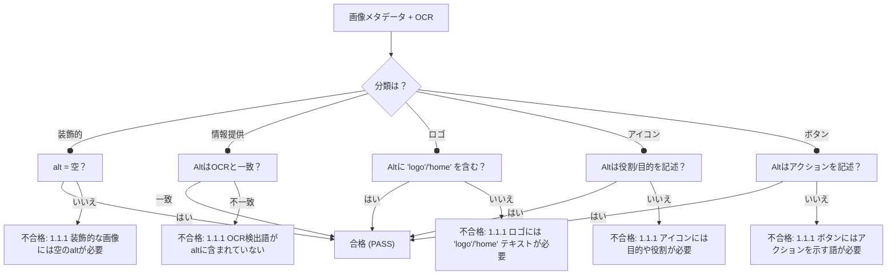
```mermaid
flowchart TD
    START["画像メタデータ + OCR"] --> CLASS{"分類は？"}
    CLASS -- 装飾的 --o DEC["alt = 空？"]
    CLASS -- 情報提供 --o INF["AltはOCRと一致？"]
    CLASS -- ロゴ --o LOG["Altに 'logo'/'home' を含む？"]
    CLASS -- アイコン --o ICO["Altは役割/目的を記述？"]
    CLASS -- ボタン --o BTN["Altはアクションを記述？"]
    
    DEC -- はい --> PASS["合格 (PASS)"]
    DEC -- いいえ --> FAIL1["不合格: 1.1.1 装飾的な画像には空のaltが必要"]
    
    INF -- 一致 --> PASS
    INF -- 不一致 --> FAIL2["不合格: 1.1.1 OCR検出語がaltに含まれていない"]
    
    LOG -- はい --> PASS
    LOG -- いいえ --> FAIL3["不合格: 1.1.1 ロゴには 'logo'/'home' テキストが必要"]
    
    ICO -- はい --> PASS
    ICO -- いいえ --> FAIL4["不合格: 1.1.1 アイコンには目的や役割が必要"]
    
    BTN -- はい --> PASS
    BTN -- いいえ --> FAIL5["不合格: 1.1.1 ボタンにはアクションを示す語が必要"]
```

#### 対象ケース
| ケース | 検出方法 |
|------|-----------------|
| 装飾的なaltの透明性 | `alt=""` を厳格に適用 |
| 情報提供画像の整合性 | OCR単語一致 (3文字以上) |
| ブランド・ロゴタイプ | キーワードチェック ('logo', 'home') |
| ソーシャル/アクションアイコン | "Brand icon" または "Close" などのキーワード一致 |
| ボタンの目的 | アクション語の正規表現 (`_BUTTON_ACTION_WORDS`) |

#### 未対応 / 誤検出(偽陰性)のリスク
| ケース | 理由 |
|------|-----------|
| 短いOCR単語 | ノイズ回避のため3文字未満は無視される |
| 複雑な図表 | altが空でないかどうかのヒューリスティックのみ |
| イメージマップ領域 | `alttext.py` では明示的に監査されていない |

---

### 1.3.4 — 表示の向き (レベル AA)
**チェックファイル:** `orientation.py`

#### フローチャート
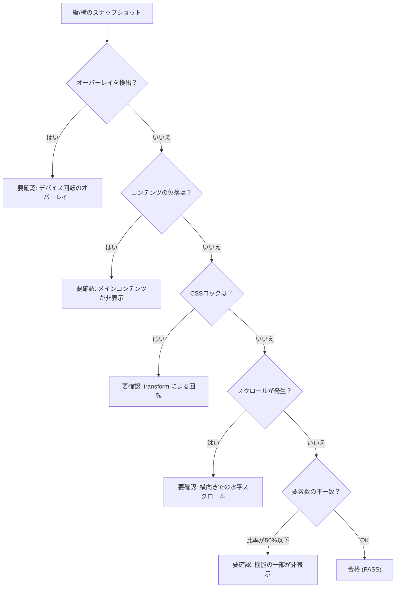
```mermaid
flowchart TD
    SNAP["縦/横のスナップショット"] --> ORE{"オーバーレイを検出？"}
    ORE -- はい --> REV1["要確認: デバイス回転のオーバーレイ"]
    ORE -- いいえ --> CCO{"コンテンツの欠落は？"}
    
    CCO -- はい --> REV2["要確認: メインコンテンツが非表示"]
    CCO -- いいえ --> CLO{"CSSロックは？"}
    
    CLO -- はい --> REV3["要確認: transform による回転"]
    CLO -- いいえ --> SCR{"スクロールが発生？"}
    
    SCR -- はい --> REV4["要確認: 横向きでの水平スクロール"]
    SCR -- いいえ --> CNT{"要素数の不一致？"}
    
    CNT -- "比率が50%以下" --> REV5["要確認: 機能の一部が非表示"]
    CNT -- OK --> PASS["合格 (PASS)"]
```

#### 対象ケース
| ケース | 検出方法 |
|------|-----------|
| デバイス回転オーバーレイ | 正規表現 `detect_rotate_overlay` |
| CSS body ロック | `detect_css_transform_lock` |
| コンテンツのクリッピング | `detect_body_overflow_hidden` |
| レスポンシブの崩れ | `detect_landscape_horizontal_overflow` |
| 機能の損失 | フォーカス可能な要素数の比較 |

#### 未対応ケース
| ケース | 理由 |
|------|-----|
| Meta viewport ロック | レンダリング評価ではチェックされていない |
| JS `orientation.lock()` | サイドチャネル・モニタリングなしでは検出困難 |

---

### 1.4.3 — コントラスト (最低限) (レベル AA)
**チェックファイル:** `contrast_analyser.py` (マルチモーダル)

#### フローチャート

```mermaid
flowchart TD
    IMG["テキスト画像 / 要素のクロップ"] --> SEG["セグメンテーション (大津の二値化)"]
    SEG --> L["相対輝度の計算 (L1, L2)"]
    L --> SIZE{"大きなテキスト？"}
    
    SIZE -- "はい (>=24px/18.5px+太字)" --> L30{"比率が3.0:1以上？"}
    SIZE -- "いいえ" --> L45{"比率が4.5:1以上？"}
    
    L30 -- "はい" --> PASS["合格 (PASS)"]
    L30 -- "いいえ" --> FAIL1["不合格: 1.4.3 コントラストが3:1未満"]
    
    L45 -- "はい" --> PASS
    L45 -- "いいえ" --> FAIL2["不合格: 1.4.3 コントラストが4.5:1未満"]
```

#### 対象ケース
| ケース | 検出方法 |
|------|-----------|
| 画像内のテキスト (OCR主導) | `analyze_text_region` |
| 大きなテキストの免除 | 24px通常 / 18.5px太字の閾値 |
| 色空間の正確性 | sRGBから線形輝度への変換 |

#### 未対応ケース
| ケース | 理由 |
|------|-----|
| 複雑な背景 | ノイズの多いグラデーション等でセグメンテーションが失敗する可能性 |
| 多色のテキスト | 色の平均化では文字ごとのコントラストを捕捉できない |

---

### 1.4.4 — テキストのサイズ変更 (レベル AA)
**チェックファイル:** `resize_text.py`

#### フローチャート
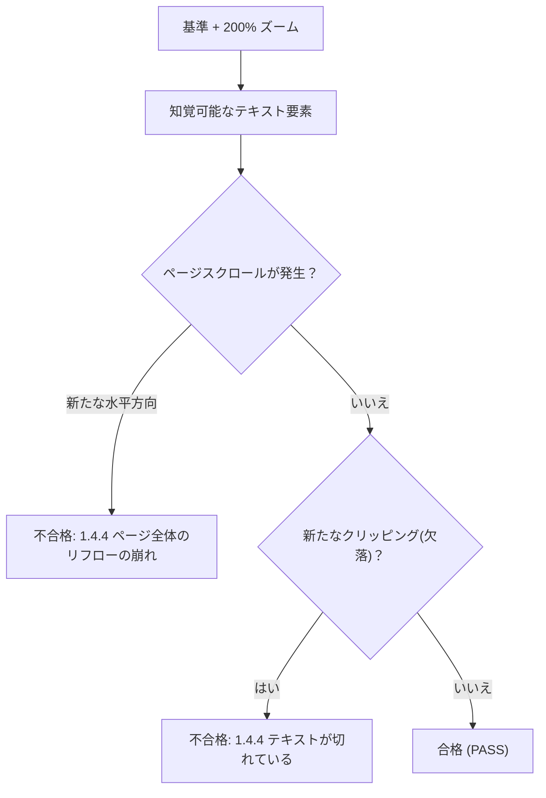
```mermaid
flowchart TD
    BASE["基準 + 200% ズーム"] --> FILT["知覚可能なテキスト要素"]
    FILT --> SCR{"ページスクロールが発生？"}
    SCR -- 新たな水平方向 --> FAIL1["不合格: 1.4.4 ページ全体のリフローの崩れ"]
    SCR -- いいえ --> CLIP{"新たなクリッピング(欠落)？"}
    
    CLIP -- はい --> FAIL2["不合格: 1.4.4 テキストが切れている"]
    CLIP -- いいえ --> PASS["合格 (PASS)"]
```

#### 対象ケース
| ケース | 検出方法 |
|------|-----------|
| テキストコンテナの欠落 | `scrollWidth` と `clientWidth` の差分比較 |
| ページ全体の水平スクロール | `document_scroll_width` の比較 |
| ゴースト/非表示化 | 知覚可能要素のヒューリスティック |

#### 未対応ケース
| ケース | 理由 |
|------|-----|
| 垂直方向のクリッピング | 水平方向およびドキュメント全体のスクロールのみチェック |
| テキストの重なり | 境界ボックスの交差判定は本ルールには含まれない |

---

### 1.4.5 — 文字画像 (レベル AA)
**チェックファイル:** `alttext.py`

#### フローチャート
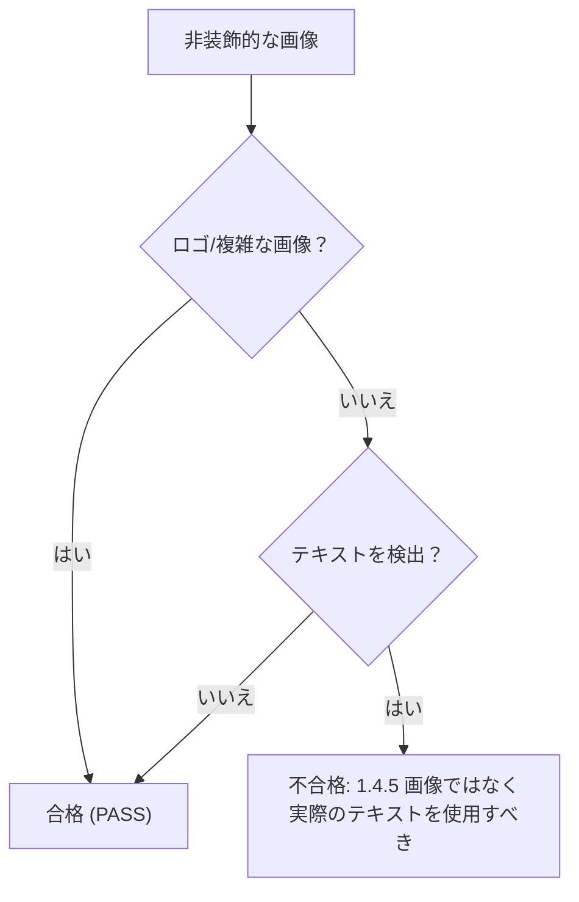
```mermaid
flowchart TD
    IMG["非装飾的な画像"] --> EXEMPT{"ロゴ/複雑な画像？"}
    EXEMPT -- はい --> PASS["合格 (PASS)"]
    EXEMPT -- いいえ --> OCR{"テキストを検出？"}
    OCR -- はい --> FAIL["不合格: 1.4.5 画像ではなく実際のテキストを使用すべき"]
    OCR -- いいえ --> PASS
```

#### 対象ケース
- 情報提供画像内の読み取り可能なテキストのOCR検出。
- ロゴ/ロゴタイプ例外 (`is_logo` と分類された場合)。
- 複雑な画像例外 (地図、グラフ等)。

#### 未対応ケース
- `is_logo` とタグ付けされていないワードマーク・ロゴが不合格になる可能性。
- `<canvas>` 要素内のテキスト (画像として扱われない場合)。

---

### 1.4.6 — コントラスト (強化) (レベル AAA)
**チェックファイル:** `contrast_analyser.py` (マルチモーダル)

#### フローチャート
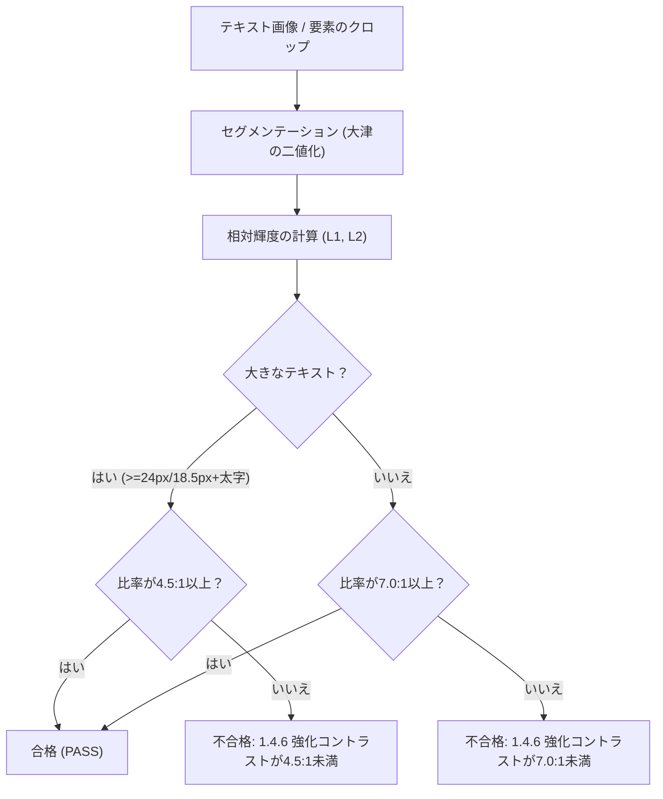
```mermaid
flowchart TD
    IMG["テキスト画像 / 要素のクロップ"] --> SEG["セグメンテーション (大津の二値化)"]
    SEG --> L["相対輝度の計算 (L1, L2)"]
    L --> SIZE{"大きなテキスト？"}
    
    SIZE -- "はい (>=24px/18.5px+太字)" --> L45{"比率が4.5:1以上？"}
    SIZE -- "いいえ" --> L70{"比率が7.0:1以上？"}
    
    L45 -- "はい" --> PASS["合格 (PASS)"]
    L45 -- "いいえ" --> FAIL1["不合格: 1.4.6 強化コントラストが4.5:1未満"]
    
    L70 -- "はい" --> PASS
    L70 -- "いいえ" --> FAIL2["不合格: 1.4.6 強化コントラストが7.0:1未満"]
```

#### 対象ケース
| ケース | 検出方法 |
|------|-----------|
| AAA コントラストレベル | 7:1 (通常) / 4.5:1 (大きなテキスト) の閾値 |
| マルチモーダル検証 | CVベースのセグメンテーションと輝度マッピングを使用 |

#### 未対応ケース
| ケース | 理由 |
|------|-----|
| 1.4.3 と同様 | ノイズの多い背景や多色のグラデーション |

---

### 1.4.10 — リフロー (レベル AA)
**チェックファイル:** `reflow.py`

#### フローチャート
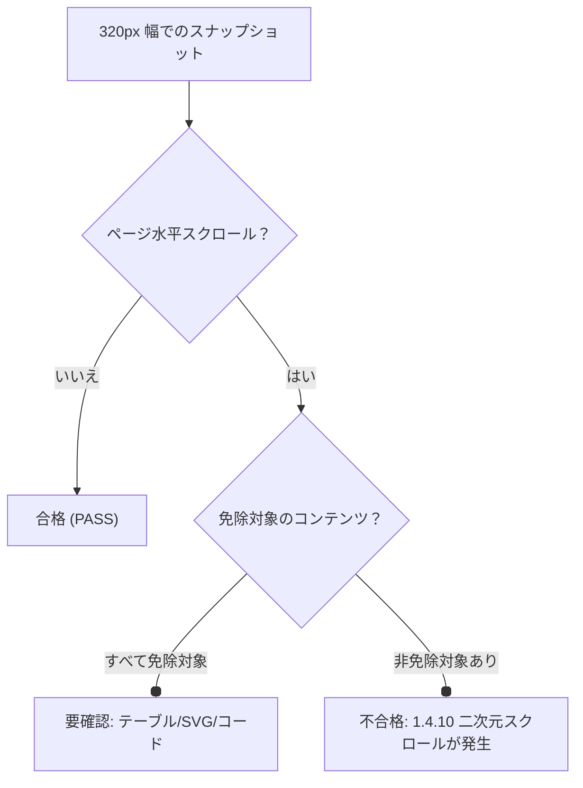
```mermaid
flowchart TD
    W320["320px 幅でのスナップショット"] --> PSCR{"ページ水平スクロール？"}
    PSCR -- いいえ --> PASS["合格 (PASS)"]
    PSCR -- はい --> EX{"免除対象のコンテンツ？"}
    EX -- すべて免除対象 --o REV["要確認: テーブル/SVG/コード"]
    EX -- 非免除対象あり --o FAIL["不合格: 1.4.10 二次元スクロールが発生"]
```

#### 対象ケース
- 320px、ビューポートでのドキュメントレベルの水平スクロール検出。
- タグベースの免除判定 (`table`, `svg`, `pre`, `code`)。

#### 未対応ケース
- 展開時にスクロールを引き起こす隠れたトリガー (オーバーレイ)。

---

### 1.4.11 — 非テキストのコントラスト (レベル AA)
**チェックファイル:** `alttext.py` + `contrast_analyser.py`

#### フローチャート
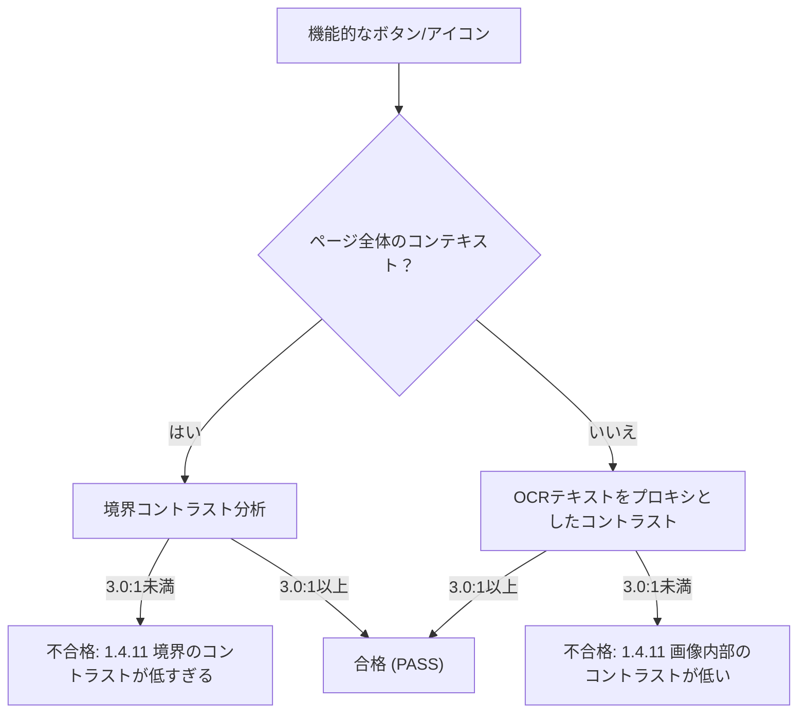
```mermaid
flowchart TD
    UI["機能的なボタン/アイコン"] --> CONTEXT{"ページ全体のコンテキスト？"}
    CONTEXT -- はい --> BOUND["境界コントラスト分析"]
    CONTEXT -- いいえ --> PROXY["OCRテキストをプロキシとしたコントラスト"]
    
    BOUND -- "3.0:1未満" --> FAIL1["不合格: 1.4.11 境界のコントラストが低すぎる"]
    BOUND -- "3.0:1以上" --> PASS["合格 (PASS)"]
    
    PROXY -- "3.0:1未満" --> FAIL2["不合格: 1.4.11 画像内部のコントラストが低い"]
    PROXY -- "3.0:1以上" --> PASS["合格 (PASS)"]
```

#### 対象ケース
- 周囲のピクセルに対するピクセル精度の境界コントラスト計算。
- フォールバックとしてのOCRテキスト・コントラスト比。
- 相対輝度式の実行。

#### 未対応ケース
- ページの端にあるコンポーネント (INCOMPLETE としてフラグ)。
- 複雑なグラデーションやパターンを持つコンポーネント。

---

### 1.4.12 — テキストの間隔 (レベル AA)
**チェックファイル:** `text_spacing.py`

#### フローチャート
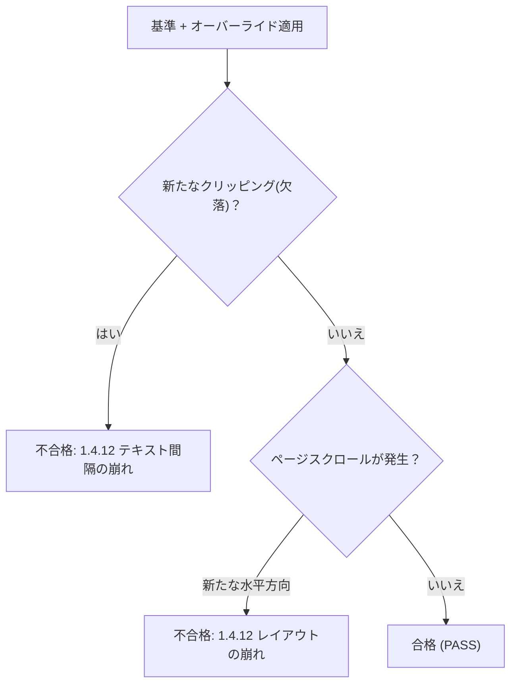
```mermaid
flowchart TD
    BASE["基準 + オーバーライド適用"] --> CLIP{"新たなクリッピング(欠落)？"}
    CLIP -- はい --> FAIL1["不合格: 1.4.12 テキスト間隔の崩れ"]
    CLIP -- いいえ --> SCR{"ページスクロールが発生？"}
    SCR -- 新たな水平方向 --> FAIL2["不合格: 1.4.12 レイアウトの崩れ"]
    SCR -- いいえ --> PASS["合格 (PASS)"]
```

#### 対象ケース
- 必須のオーバーライド: 行間1.5、文字間0.12em、単語間0.16em。
- 一般的なテキストタグにおけるテキストの欠落検出。

#### 未対応ケース
- 要素の重なり (ヒューリスティックは存在するがクリッピング検出より信頼性が低い)。

---

### 1.4.13 — ホバー又はフォーカス時に表示されるコンテンツ (レベル AA)
**チェックファイル:** `hover_focus_content.py`

#### フローチャート
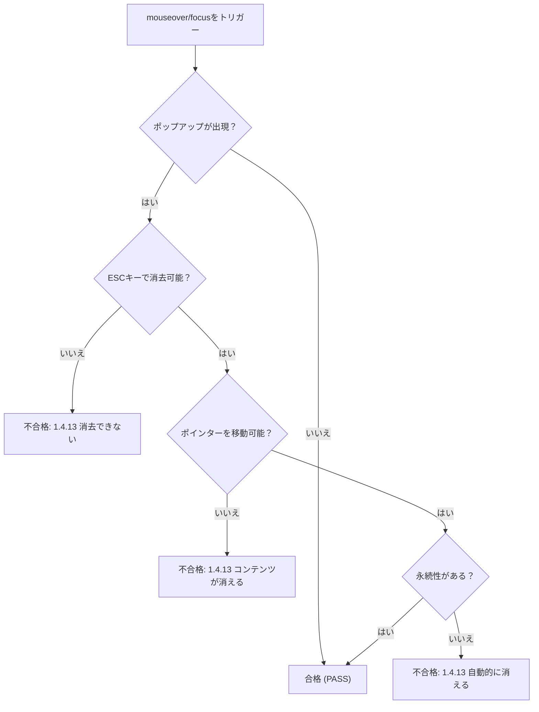
```mermaid
flowchart TD
    TRIG["mouseover/focusをトリガー"] --> POP{"ポップアップが出現？"}
    POP -- いいえ --> PASS["合格 (PASS)"]
    POP -- はい --> ESC{"ESCキーで消去可能？"}
    ESC -- いいえ --> FAIL1["不合格: 1.4.13 消去できない"]
    ESC -- はい --> MOVE{"ポインターを移動可能？"}
    MOVE -- いいえ --> FAIL2["不合格: 1.4.13 コンテンツが消える"]
    MOVE -- はい --> PERS{"永続性がある？"}
    PERS -- いいえ --> FAIL3["不合格: 1.4.13 自動的に消える"]
    PERS -- はい --> PASS["合格 (PASS)"]
```

#### 対象ケース
- ESCキーによる消去のシミュレーション。
- ホバー可能なコンテンツ (トリガーからポップアップへのポインター移動)。
- 明示的な消去操作を行うまでの永続性。

#### 未対応ケース
- ホバー時と異なるフォーカス用のトリガー (現在は mouseover のみのシミュレーション)。

---

### 2.2.2 — 一時停止、停止、非表示 (レベル A)
**チェックファイル:** `pause_stop_hide_auditor.py`

#### フローチャート
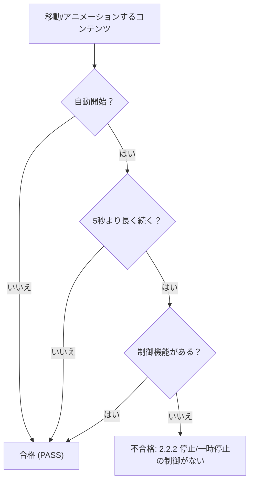
```mermaid
flowchart TD
    MOV["移動/アニメーションするコンテンツ"] --> AUTO{"自動開始？"}
    AUTO -- いいえ --> PASS["合格 (PASS)"]
    AUTO -- はい --> DUR{"5秒より長く続く？"}
    DUR -- いいえ --> PASS
    DUR -- はい --> MEC{"制御機能がある？"}
    MEC -- はい --> PASS
    MEC -- いいえ --> FAIL["不合格: 2.2.2 停止/一時停止の制御がない"]
```

#### 対象ケース
- `<video autoplay>`、アニメーションGIF、CSS/WAAPIアニメーション、カルーセル。
- 5秒間の継続時間判定。
- 制御機能の検出 (キーワード 'Pause'/'Stop' + ARIA属性)。

#### 未対応ケース
- JavaScriptタイマーによるバックグラウンド更新。
- アイコンのみでテキストラベルのない制御ボタン。

---

### 2.4.11 — フォーカスが隠れない (最低限) (レベル AA)
**チェックファイル:** `focus_not_obscured_minimum.py`

#### フローチャート
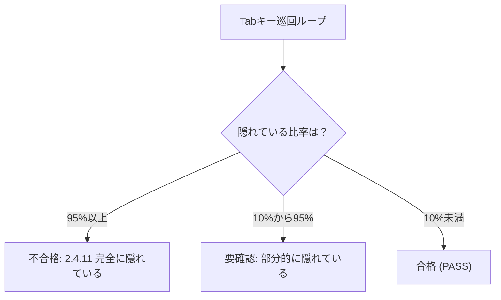
```mermaid
flowchart TD
    TAB["Tabキー巡回ループ"] --> RATIO{"隠れている比率は？"}
    RATIO -- "95%以上" --> FAIL["不合格: 2.4.11 完全に隠れている"]
    RATIO -- "10%から95%" --> REV["要確認: 部分的に隠れている"]
    RATIO -- "10%未満" --> PASS["合格 (PASS)"]
```

#### 対象ケース
- 固定/追従(sticky)ヘッダーやバナーによる完全/部分的な重なり。
- 具体的な重なり要素の特定。

#### 未対応ケース
- 完全に透明な要素による重なり。

---

### 2.4.12 — フォーカスが隠れない (強化) (レベル AAA)
**チェックファイル:** `focus_not_obscured_enhanced.py`

#### フローチャート
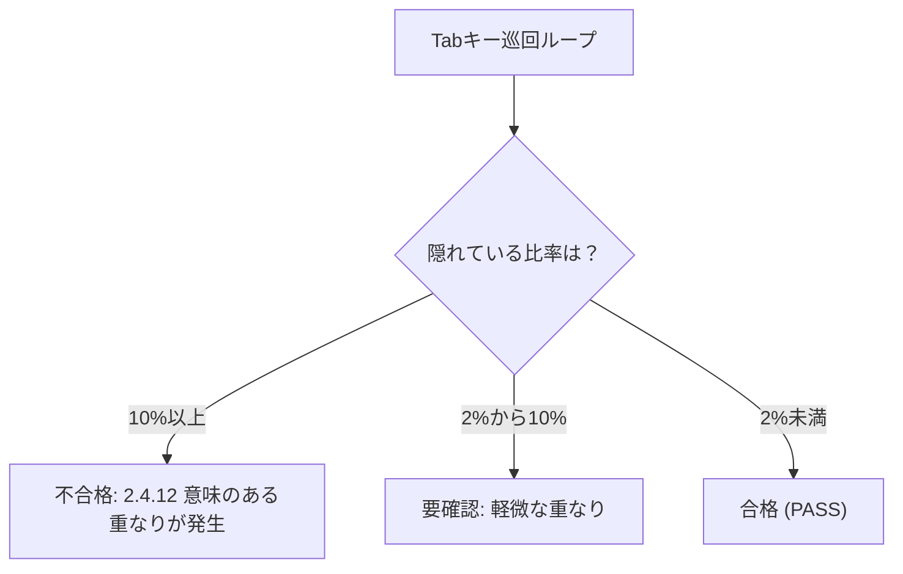
```mermaid
flowchart TD
    TAB["Tabキー巡回ループ"] --> RATIO{"隠れている比率は？"}
    RATIO -- "10%以上" --> FAIL["不合格: 2.4.12 意味のある重なりが発生"]
    RATIO -- "2%から10%" --> REV["要確認: 軽微な重なり"]
    RATIO -- "2%未満" --> PASS["合格 (PASS)"]
```

#### 対象ケース
- 独自に作成されたオーバーレイに対する、より厳格な閾値。
- 2.4.11 と同様のキーボード巡回と重なり要素特定。

#### 未対応ケース
- 2% 未満の重なりであっても、非常に小さなフォーカス・コントロール等では影響が出る可能性。

---

### 2.5.3 — 名前(name)の中のラベル (レベル A)
**チェックファイル:** `label_in_name_auditor.py`

#### フローチャート
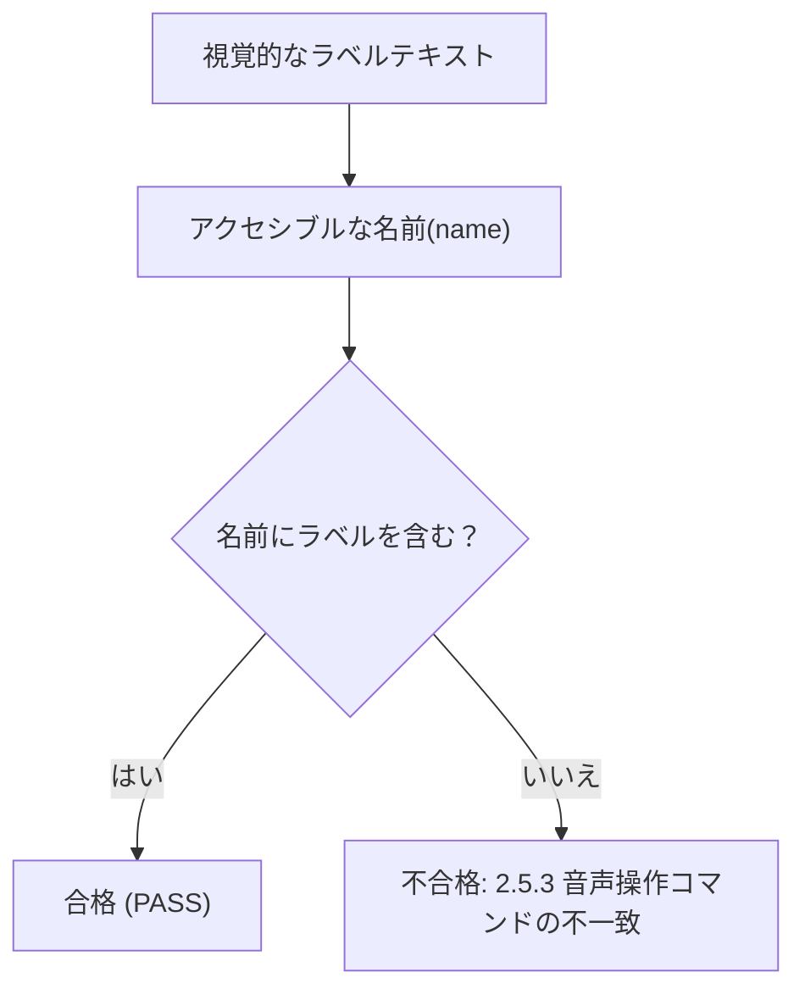
```mermaid
flowchart TD
    VIS["視覚的なラベルテキスト"] --> ACC["アクセシブルな名前(name)"]
    ACC --> MATCH{"名前にラベルを含む？"}
    MATCH -- はい --> PASS["合格 (PASS)"]
    MATCH -- いいえ --> FAIL["不合格: 2.5.3 音声操作コマンドの不一致"]
```

#### 対象ケース
- 大文字小文字を区別しない単語境界一致 (`\b`)。
- NFC正規化 + Casefolding。
- CJK 文字列例外。

#### 未対応ケース
- アイコンや画像が埋め込まれたラベル (textContent に含まれない場合)。

---

### 2.5.8 — ターゲットのサイズ (最低限) (レベル AA)
**チェックファイル:** `target_size_auditor.py`

#### フローチャート
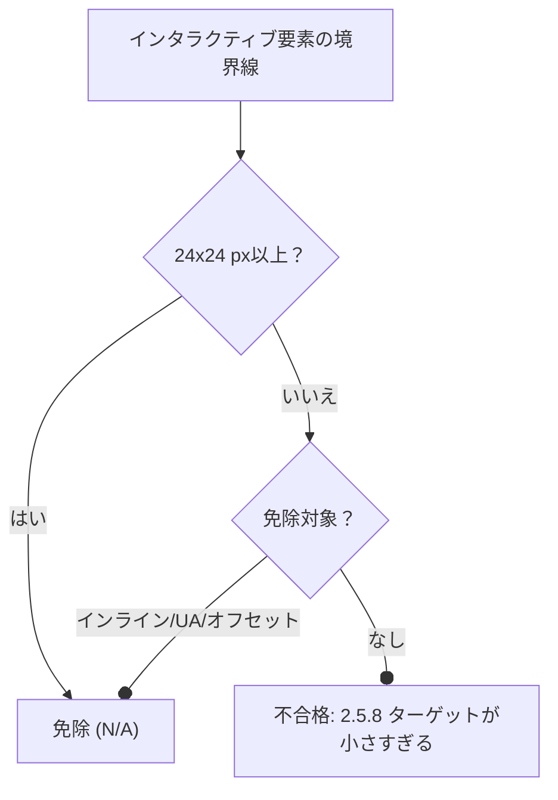
```mermaid
flowchart TD
    RECT["インタラクティブ要素の境界線"] --> SIZE{"24x24 px以上？"}
    SIZE -- はい --> PASS["合格 (PASS)"]
    SIZE -- いいえ --> EX{"免除対象？"}
    EX -- インライン/UA/オフセット --o PASS["免除 (N/A)"]
    EX -- なし --o FAIL["不合格: 2.5.8 ターゲットが小さすぎる"]
```

#### 対象ケース
- 24x24 CSSピクセルの最小値。
- インライン要素、ブラウザ標準要素(User-Agent)、余白(オフセット)による例外判定。

#### 未対応ケース
- 同等の機能を持つ操作ポイントが他にある場合。

---

### 3.3.1 — エラーの特定 (レベル A)
**チェックファイル:** `form_auditor.py`

#### フローチャート
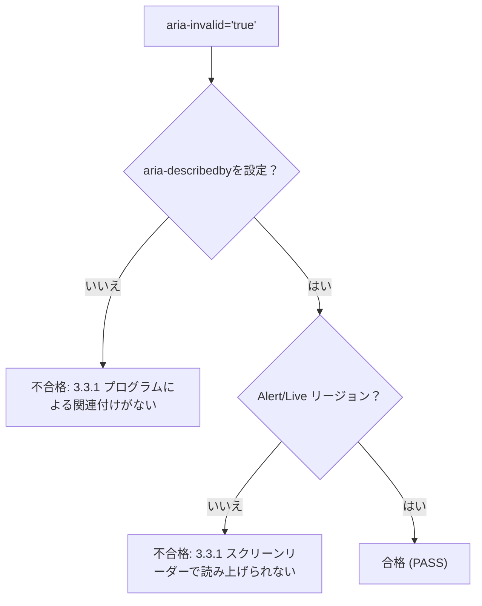
```mermaid
flowchart TD
    INV["aria-invalid='true'"] --> DESC{"aria-describedbyを設定？"}
    DESC -- いいえ --> FAIL1["不合格: 3.3.1 プログラムによる関連付けがない"]
    DESC -- はい --> LIV{"Alert/Live リージョン？"}
    LIV -- いいえ --> FAIL2["不合格: 3.3.1 スクリーンリーダーで読み上げられない"]
    LIV -- はい --> PASS["合格 (PASS)"]
```

#### 対象ケース
- 必須/無効なフィールドにおける `aria-describedby` のリンク。
- `role="alert"` または `aria-live` の存在。

#### 未対応ケース
- ロード時にARIA属性を使用していないクライアントサイドのバリデーションエラー。

---

### 3.3.2 — ラベル又は指示 (レベル A)
**チェックファイル:** `form_auditor.py`

#### フローチャート
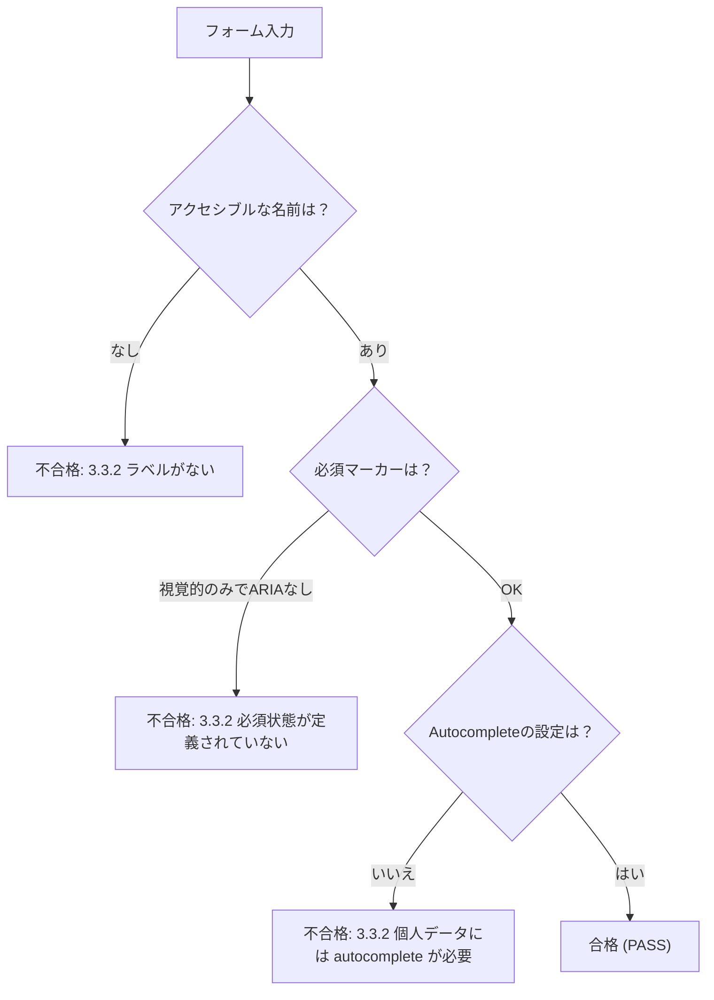
```mermaid
flowchart TD
    INP["フォーム入力"] --> NAME{"アクセシブルな名前は？"}
    NAME -- なし --> FAIL1["不合格: 3.3.2 ラベルがない"]
    NAME -- あり --> REQ{"必須マーカーは？"}
    REQ -- "視覚的のみでARIAなし" --> FAIL2["不合格: 3.3.2 必須状態が定義されていない"]
    REQ -- OK --> AUTO{"Autocompleteの設定は？"}
    AUTO -- いいえ --> FAIL3["不合格: 3.3.2 個人データには autocomplete が必要"]
    AUTO -- はい --> PASS["合格 (PASS)"]
```

#### 対象ケース
- ラベルの関連付け (`<label for>`, `aria-label`)。
- 「必須」の視覚的表現とプログラム定義の不一致チェック。
- プレイスホルダーのみのラベル。
- 個人データフィールドにおける `autocomplete` 属性。

#### 未対応ケース
- 入力に関する詳細な指示 (例: 日付形式など)。

---

### 4.1.2 — 名前(name)、役割(role)及び値(value) (レベル A)
**チェックファイル:** `alttext.py` + `form_auditor.py`

#### フローチャート
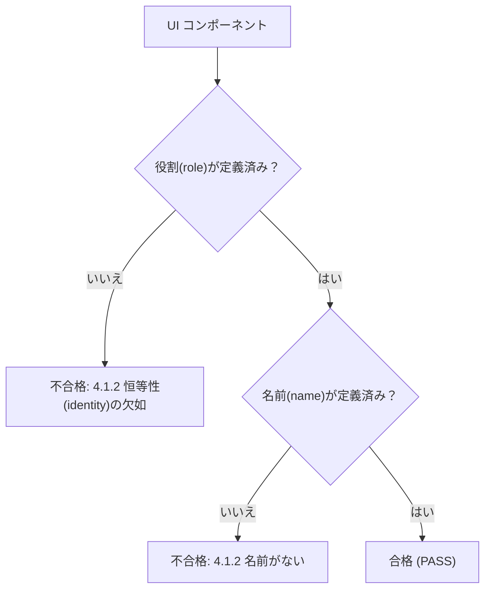
```mermaid
flowchart TD
    COMP["UI コンポーネント"] --> ROLE{"役割(role)が定義済み？"}
    ROLE -- いいえ --> FAIL1["不合格: 4.1.2 恒等性(identity)の欠如"]
    ROLE -- はい --> NAME{"名前(name)が定義済み？"}
    NAME -- いいえ --> FAIL2["不合格: 4.1.2 名前がない"]
    NAME -- はい --> PASS["合格 (PASS)"]
```

#### 対象ケース
- 機能的な画像の役割検証。
- アクセシブルな名前の計算アルゴリズムの遵守。

#### 未対応ケース
- 動的な値の更新 (範囲/進捗など)。

---

## 網羅性サマリー

| WCAG SC | 達成基準 | チェックファイル | パイプライン・ステージ | 信頼度 |
|---------|-----------|------------|----------------|------------|
| 1.1.1 | 非テキストコンテンツ | alttext.py | Multimodal | 高 |
| 1.3.4 | 表示の向き | orientation.py | Rendered | 中 |
| 1.4.3 | コントラスト (最低限) | contrast_analyser.py | Multimodal | 高 |
| 1.4.4 | テキストのサイズ変更 | resize_text.py | Rendered | 高 |
| 1.4.5 | 文字画像 | alttext.py | CV (OCR) | 中 |
| 1.4.6 | コントラスト (強化) | contrast_analyser.py | Multimodal | 高 |
| 1.4.10 | リフロー | reflow.py | Rendered | 高 |
| 1.4.11 | 非テキストのコントラスト | alttext.py | CV (Pixel) | 高 |
| 1.4.12 | テキストの間隔 | text_spacing.py | Rendered | 高 |
| 1.4.13 | ホバー又はフォーカス時のコンテンツ | hover_focus_content.py | Rendered | 中 |
| 2.2.2 | 一時停止、停止、非表示 | pause_stop_hide_auditor.py | Hybrid | 高 |
| 2.4.11 | フォーカスが隠れない (最低限) | focus_not_obscured_minimum.py | Rendered | 高 |
| 2.4.12 | フォーカスが隠れない (強化) | focus_not_obscured_enhanced.py | Rendered | 高 |
| 2.5.3 | 名前の中のラベル | label_in_name_auditor.py | Static | 高 |
| 2.5.8 | ターゲットのサイズ | target_size_auditor.py | Static | 高 |
| 3.3.1 | エラーの特定 | form_auditor.py | Static | 高 |
| 3.3.2 | ラベル又は指示 | form_auditor.py | Static | 高 |
| 4.1.2 | 名前、役割及び値 | alttext.py / form_auditor.py | Hybrid | 高 |
