> Generated: 2026-04-06
> Updated: 2026-04-13
> Scope: `ka11y-python/ka11y/accessibility/rules/` + `ka11y-python/ka11y/accessibility/rendered/evaluators/` + combined orchestration (`runner.py`, `stages.py`, `findings.py`)
> Stack: Python 3.10+ + Playwright + OCR (PaddleOCR with EasyOCR fallback) + ML Classifier

---

## Architecture & Request Flow

### Current Production Path

The current production flow is the combined pipeline, not the older single-service `/api/v1/audit` model.

- One combined request fans out into `ka11y-node` and `ka11y-python`.
- `ka11y-python` now uses **one universal static crawl** for seven DOM rule families.
- `AsyncImageCrawler` now uses an **optimized single-session queue** for image capture, sharing a browser/context and crawl policy.
- `RenderedLayoutCrawler` still owns rendered, focus, hover, orientation, reflow, and resize scenarios.
- Every crawler now shares a central **Navigation Resilience** layer (DNS preflight + backoff) and a **Crawl Policy** (normalization + budgets).
- **Reporting:** Universal stages now hard-fail (mark as `error`) if the crawler extracts 0 pages, preventing false coverage reports.

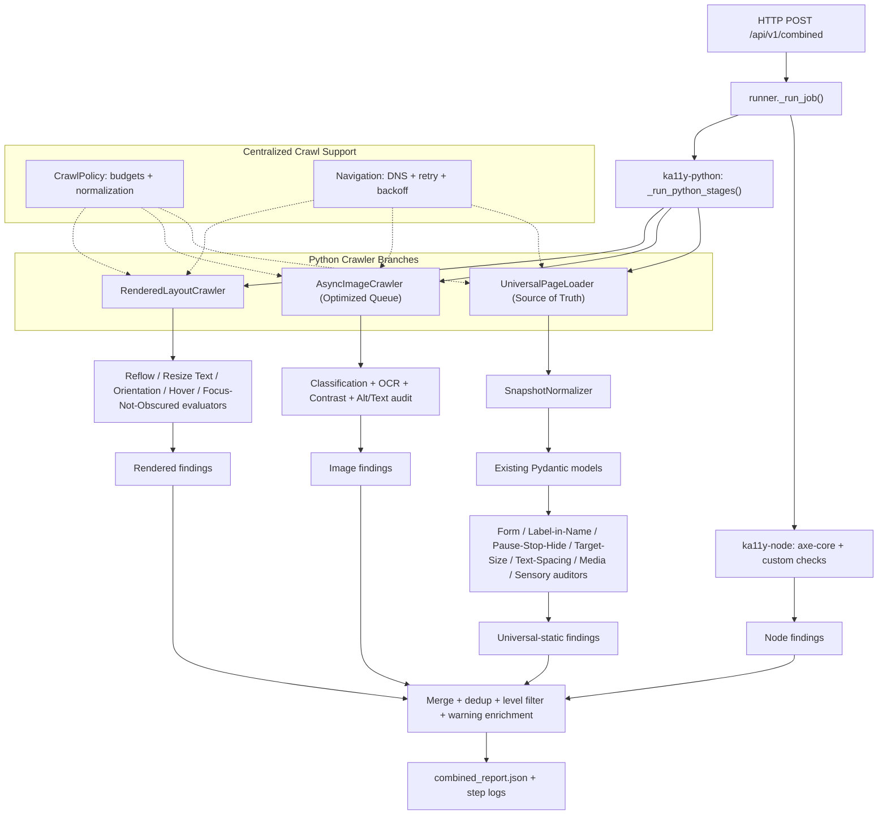
```mermaid
flowchart TD
    A[HTTP POST /api/v1/combined] --> B["runner._run_job()"]
    B --> C["ka11y-node: axe-core + custom checks"]
    B --> D["ka11y-python: _run_python_stages()"]

    subgraph "Centralized Crawl Support"
        CP["CrawlPolicy: budgets + normalization"]
        NR["Navigation: DNS + retry + backoff"]
    end

    subgraph "Python Crawler Branches"
        E["UniversalPageLoader (Source of Truth)"]
        F["AsyncImageCrawler (Optimized Queue)"]
        G["RenderedLayoutCrawler"]
    end

    CP & NR -.-> E & F & G
    D --> E
    D --> F
    D --> G

    E --> H["SnapshotNormalizer"]
    H --> I["Existing Pydantic models"]
    I --> J["Form / Label-in-Name / Pause-Stop-Hide / Target-Size / Text-Spacing / Media / Sensory auditors"]

    F --> K["Classification + OCR + Contrast + Alt/Text audit"]
    G --> L["Reflow / Resize Text / Orientation / Hover / Focus-Not-Obscured evaluators"]

    C --> M["Node findings"]
    J --> N["Universal-static findings"]
    K --> O["Image findings"]
    L --> P["Rendered findings"]

    M & N & O & P --> Q["Merge + dedup + level filter + warning enrichment"]
    Q --> R["combined_report.json + step logs"]
```

### Custom Check Execution Model

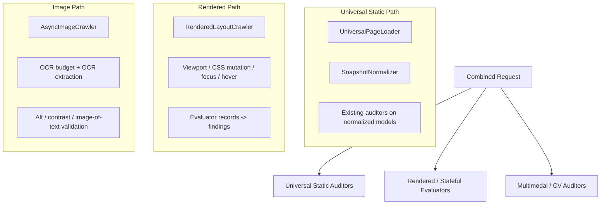
```mermaid
flowchart TD
    Index["Combined Request"] --> Static["Universal Static Auditors"]
    Index --> Rendered["Rendered / Stateful Evaluators"]
    Index --> Multi["Multimodal / CV Auditors"]

    subgraph "Universal Static Path"
        S1["UniversalPageLoader"]
        S2["SnapshotNormalizer"]
        S3["Existing auditors on normalized models"]
    end

    subgraph "Rendered Path"
        R1["RenderedLayoutCrawler"]
        R2["Viewport / CSS mutation / focus / hover"]
        R3["Evaluator records -> findings"]
    end

    subgraph "Image Path"
        M1["AsyncImageCrawler"]
        M2["OCR budget + OCR extraction"]
        M3["Alt / contrast / image-of-text validation"]
    end
```

### Current Python Stage Map

| Stage | Data source | Audit mode | Notes |
|------|-------------|------------|------|
| `form_audit` | Universal snapshot -> `FormInputData` | Static | Same-origin frames and open shadow roots supported through the universal crawl |
| `label_in_name` | Universal snapshot -> `InteractiveElementData` | Static | Provenance carried through `selector`, `element_ref_id`, `frame_path` |
| `pause_stop_hide` | Universal snapshot -> `MovingContentData` | Static | Supports `duration_known` and `applicability_exception=loading_indicator` |
| `target_size` | Universal snapshot -> `TargetSizeData` | Static | Same-origin iframe and shadow-root coverage inherited from universal crawl |
| `text_spacing` | Universal snapshot -> `TextSpacingData` | Static | Structural risk pass |
| `media_audit` | Universal snapshot -> `MediaElementData` | Static | Transcript/nearby-link checks on normalized records |
| `sensory_audit` | Universal snapshot -> `SensoryElementData` | Static | Language-aware, including JP/CJK handling |
| `image_audit` | `AsyncImageCrawler` + OCR | Multimodal | OCR is now budgeted and logged for large pages |
| `rendered_layout_audit` | `RenderedLayoutCrawler` | Rendered | Hover/focus path hardened against stale or invisible boxes |

### Recent Hardening Additions

| Area | Current behavior |
|------|------------------|
| Zero-coverage guard | Universal stages mark themselves `error` if `pages_crawled == 0` instead of emitting false passes |
| Navigation Resilience | Centralized `navigate_with_resilience` (DNS preflight, backoff, retry) shared across all crawlers |
| Crawl Policy | `CrawlPolicy` centralizes URL normalization, same-origin rules, and page/link budgets |
| Image session queue | `AsyncImageCrawler` uses one browser/context for multi-page crawls instead of recursive launches |
| Universal warnings | Cross-origin and failed-frame warnings are sampled into `warning_details` in `combined_report.json` |

### Localization and Language Routing

The combined request `lang` now feeds both stacks, but the Python output contract is still split by responsibility:

- `criterion_name` is localized through the shared i18n loader
- `suggested_fix` is localized through the same shared `rules.yml` + locale overlay path
- `reason` is only localized when the emitting Python auditor/evaluator provides localized text

Practical outcome today:

- Japanese combined runs get JP-aware OCR and JP-aware sensory/text-spacing heuristics where implemented
- Python `reason` strings are still mixed: some newer or config-driven auditors localize, while several older converters remain English
- Node output is more fully localized than Python output at the finding-text layer

---

## Rule-by-Rule Analysis

---

### 1.1.1 — Non-text Content (Level A)
**Check:** `alttext.py`

#### Flowchart
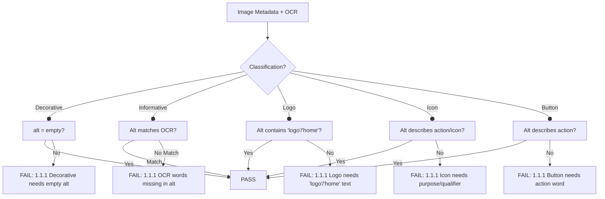
```mermaid
flowchart TD
    START["Image Metadata + OCR"] --> CLASS{"Classification?"}
    CLASS -- Decorative --o DEC["alt = empty?"]
    CLASS -- Informative --o INF["Alt matches OCR?"]
    CLASS -- Logo --o LOG["Alt contains 'logo'/'home'?"]
    CLASS -- Icon --o ICO["Alt describes action/icon?"]
    CLASS -- Button --o BTN["Alt describes action?"]
    
    DEC -- Yes --> PASS["PASS"]
    DEC -- No --> FAIL1["FAIL: 1.1.1 Decorative needs empty alt"]
    
    INF -- Match --> PASS
    INF -- No Match --> FAIL2["FAIL: 1.1.1 OCR words missing in alt"]
    
    LOG -- Yes --> PASS
    LOG -- No --> FAIL3["FAIL: 1.1.1 Logo needs 'logo'/'home' text"]
    
    ICO -- Yes --> PASS
    ICO -- No --> FAIL4["FAIL: 1.1.1 Icon needs purpose/qualifier"]
    
    BTN -- Yes --> PASS
    BTN -- No --> FAIL5["FAIL: 1.1.1 Button needs action word"]
```

#### Cases Covered
| Case | Detection Method |
|------|-----------------|
| Decorative alt transparency | Strictly enforces `alt=""` |
| Informative content parity | OCR word-match (3+ chars) |
| Branding logotypes | Keyword check ('logo', 'home') |
| Social/Action icons | "Brand icon" or "Close" keyword match |
| Button purpose | Action word regex (`_BUTTON_ACTION_WORDS`) |

#### Cases Missed / False Negative Risks
| Case | Why missed |
|------|-----------|
| Short OCR tokens | Tokens < 3 characters are ignored to avoid noise |
| Complex diagrams | Heuristic only checks if alt is non-empty |
| Image-map areas | Not explicitly audited in `alttext.py` |

---

### 1.3.4 — Orientation (Level AA)
**Check:** `orientation.py`

#### Flowchart
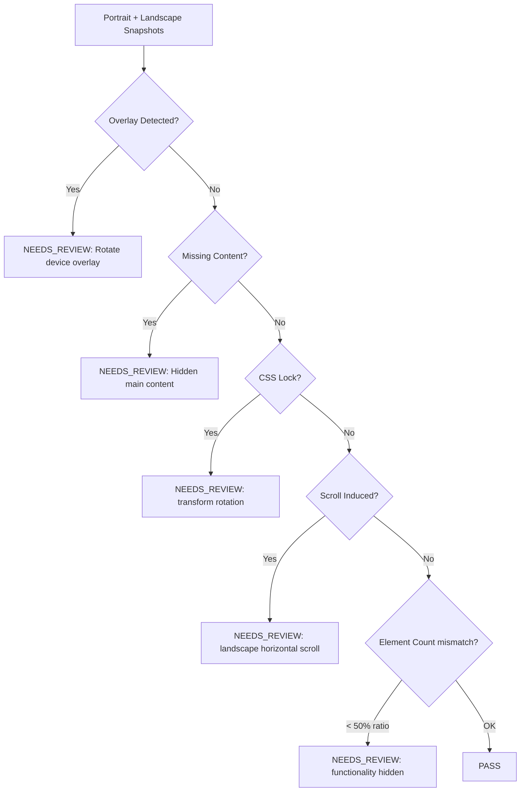
```mermaid
flowchart TD
    SNAP["Portrait + Landscape Snapshots"] --> ORE{"Overlay Detected?"}
    ORE -- Yes --> REV1["NEEDS_REVIEW: Rotate device overlay"]
    ORE -- No --> CCO{"Missing Content?"}
    
    CCO -- Yes --> REV2["NEEDS_REVIEW: Hidden main content"]
    CCO -- No --> CLO{"CSS Lock?"}
    
    CLO -- Yes --> REV3["NEEDS_REVIEW: transform rotation"]
    CLO -- No --> SCR{"Scroll Induced?"}
    
    SCR -- Yes --> REV4["NEEDS_REVIEW: landscape horizontal scroll"]
    SCR -- No --> CNT{"Element Count mismatch?"}
    
    CNT -- "< 50% ratio" --> REV5["NEEDS_REVIEW: functionality hidden"]
    CNT -- OK --> PASS["PASS"]
```

#### Cases Covered
| Case | Detection |
|------|-----------|
| Rotate-device overlays | Regex `detect_rotate_overlay` |
| CSS body locks | `detect_css_transform_lock` |
| Content clipping | `detect_body_overflow_hidden` |
| Responsive breakage | `detect_landscape_horizontal_overflow` |
| Functionality loss | Comparative focusable element count |

#### Cases Missed
| Case | Why |
|------|-----|
| Meta viewport locks | Not checked in rendered evaluator |
| JS `orientation.lock()` | Hard to detect without side-channel monitoring |

---

### 1.4.3 — Contrast (Minimum) (Level AA)
**Check:** `contrast_analyser.py` (Multimodal)

#### Flowchart
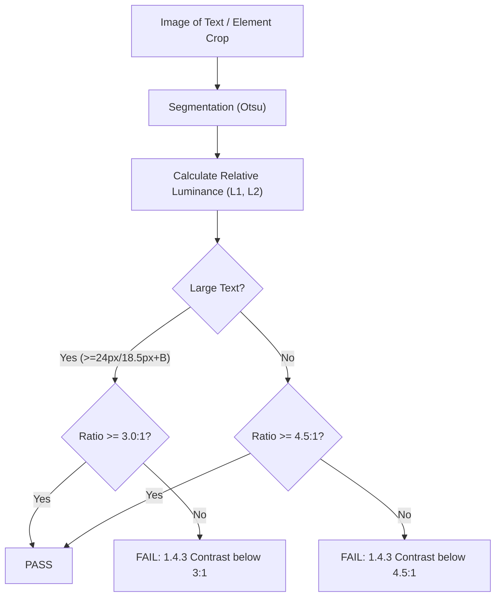
```mermaid
flowchart TD
    IMG["Image of Text / Element Crop"] --> SEG["Segmentation (Otsu)"]
    SEG --> L["Calculate Relative Luminance (L1, L2)"]
    L --> SIZE{"Large Text?"}
    
    SIZE -- "Yes (>=24px/18.5px+B)" --> L30{"Ratio >= 3.0:1?"}
    SIZE -- "No" --> L45{"Ratio >= 4.5:1?"}
    
    L30 -- "Yes" --> PASS["PASS"]
    L30 -- "No" --> FAIL1["FAIL: 1.4.3 Contrast below 3:1"]
    
    L45 -- "Yes" --> PASS
    L45 -- "No" --> FAIL2["FAIL: 1.4.3 Contrast below 4.5:1"]
```

#### Cases Covered
| Case | Detection |
|------|-----------|
| Text in images (OCR-led) | `analyze_text_region` |
| Large text exemption | 24px regular / 18.5px bold threshold |
| Color-space accuracy | sRGB to Linear luminance conversion |

#### Cases Missed
| Case | Why |
|------|-----|
| Complex backgrounds | Segmentation (Otsu) may fail on high-noise gradients |
| Multi-color text | Color averaging doesn't catch per-character contrast |

---

### 1.4.4 — Resize Text (Level AA)
**Check:** `resize_text.py`

#### Flowchart
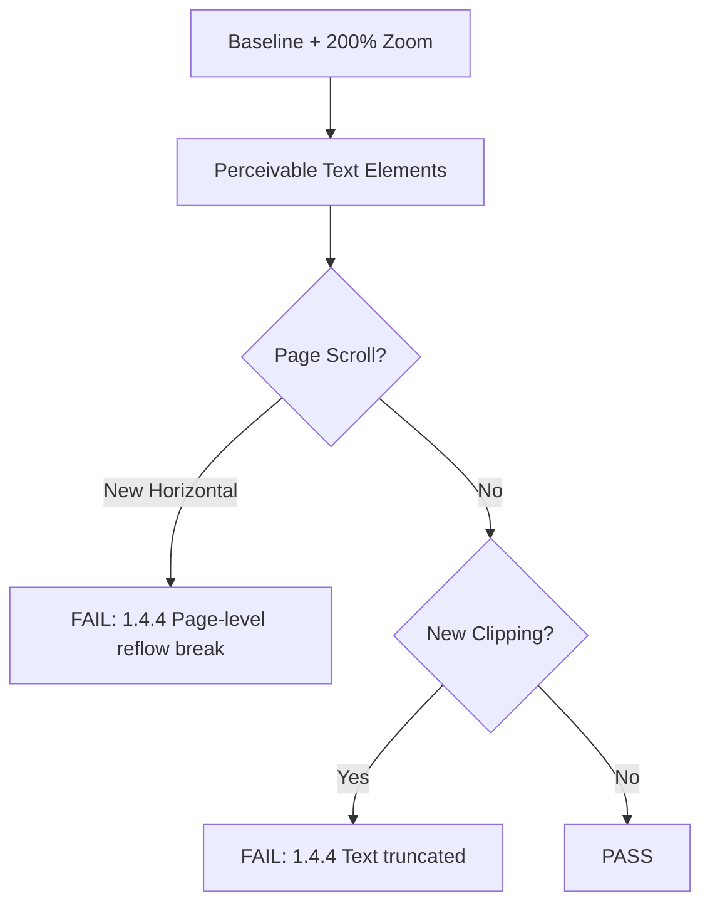
```mermaid
flowchart TD
    BASE["Baseline + 200% Zoom"] --> FILT["Perceivable Text Elements"]
    FILT --> SCR{"Page Scroll?"}
    SCR -- New Horizontal --> FAIL1["FAIL: 1.4.4 Page-level reflow break"]
    SCR -- No --> CLIP{"New Clipping?"}
    
    CLIP -- Yes --> FAIL2["FAIL: 1.4.4 Text truncated"]
    CLIP -- No --> PASS["PASS"]
```

#### Cases Covered
| Case | Detection |
|------|-----------|
| Text container truncation | `scrollWidth` > `clientWidth` diffing |
| Page-level horizontal scroll | `document_scroll_width` comparison |
| Ghosting/Invisibility | Perceivable elements heuristic |

#### Cases Missed
| Case | Why |
|------|-----|
| Vertical clipping | Only horizontal/document scroll checked |
| Overlapping text | Bounding box intersection not in this rule |

---

### 1.4.5 — Images of Text (Level AA)
**Check:** `alttext.py`

#### Flowchart
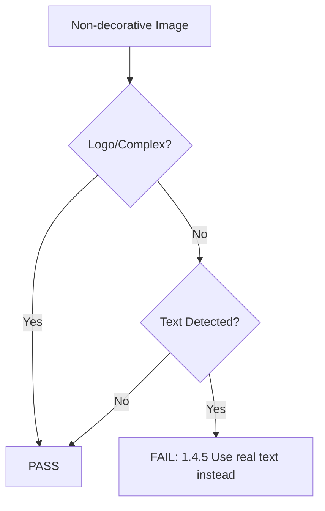
```mermaid
flowchart TD
    IMG["Non-decorative Image"] --> EXEMPT{"Logo/Complex?"}
    EXEMPT -- Yes --> PASS["PASS"]
    EXEMPT -- No --> OCR{"Text Detected?"}
    OCR -- Yes --> FAIL["FAIL: 1.4.5 Use real text instead"]
    OCR -- No --> PASS
```

#### Cases Covered
- OCR-based detection of readable text in informative images.
- Logo/Logotype exception (if classified as `is_logo`).
- Complex image exception (e.g. maps, charts).

#### Cases Missed
- Wordmark logos not tagged as `is_logo` will trigger a Fail.
- Text in `<canvas>` elements (if not treated as images).

---

### 1.4.6 — Contrast (Enhanced) (Level AAA)
**Check:** `contrast_analyser.py` (Multimodal)

#### Flowchart
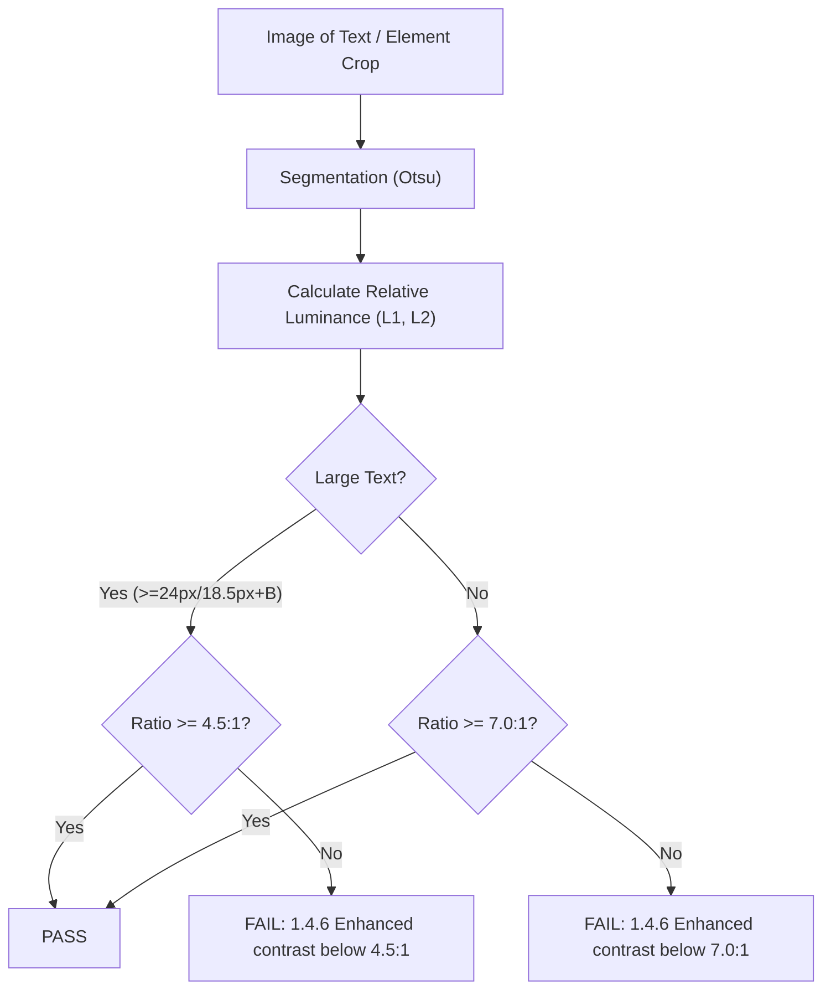
```mermaid
flowchart TD
    IMG["Image of Text / Element Crop"] --> SEG["Segmentation (Otsu)"]
    SEG --> L["Calculate Relative Luminance (L1, L2)"]
    L --> SIZE{"Large Text?"}
    
    SIZE -- "Yes (>=24px/18.5px+B)" --> L45{"Ratio >= 4.5:1?"}
    SIZE -- "No" --> L70{"Ratio >= 7.0:1?"}
    
    L45 -- "Yes" --> PASS["PASS"]
    L45 -- "No" --> FAIL1["FAIL: 1.4.6 Enhanced contrast below 4.5:1"]
    
    L70 -- "Yes" --> PASS
    L70 -- "No" --> FAIL2["FAIL: 1.4.6 Enhanced contrast below 7.0:1"]
```

#### Cases Covered
| Case | Detection |
|------|-----------|
| AAA Contrast levels | 7:1 (normal) / 4.5:1 (large) thresholds |
| Multimodal verification | Uses CV-based segmentation and luminance mapping |

#### Cases Missed
| Case | Why |
|------|-----|
| Same as 1.4.3 | High-noise backgrounds or multi-color gradients |

---

### 1.4.10 — Reflow (Level AA)
**Check:** `reflow.py`

#### Flowchart
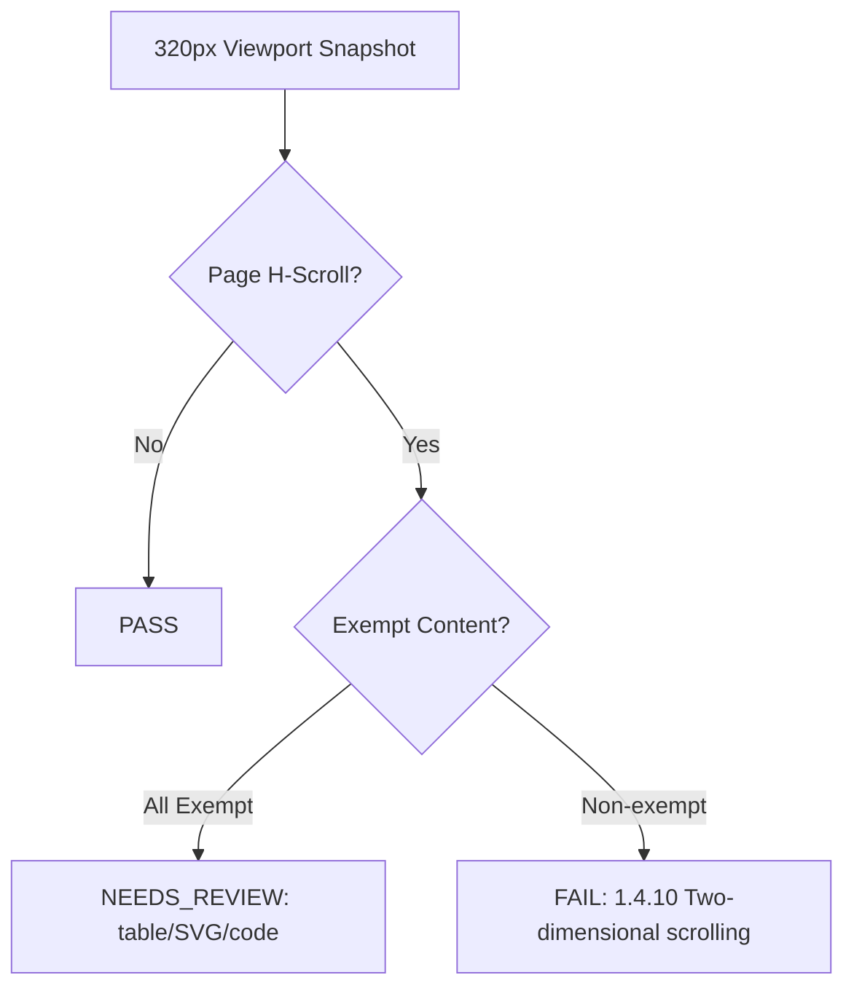
```mermaid
flowchart TD
    W320["320px Viewport Snapshot"] --> PSCR{"Page H-Scroll?"}
    PSCR -- No --> PASS["PASS"]
    PSCR -- Yes --> EX{"Exempt Content?"}
    EX -- All Exempt --> REV["NEEDS_REVIEW: table/SVG/code"]
    EX -- Non-exempt --> FAIL["FAIL: 1.4.10 Two-dimensional scrolling"]
```

#### Cases Covered
- Document-level horizontal scroll detection at 320px.
- Tag-based exemptions (`table`, `svg`, `pre`, `code`).

#### Cases Missed
- Hidden triggers (overlays) that cause scroll when expanded.

---

### 1.4.11 — Non-text Contrast (Level AA)
**Check:** `alttext.py` + `contrast_analyser.py`

#### Flowchart
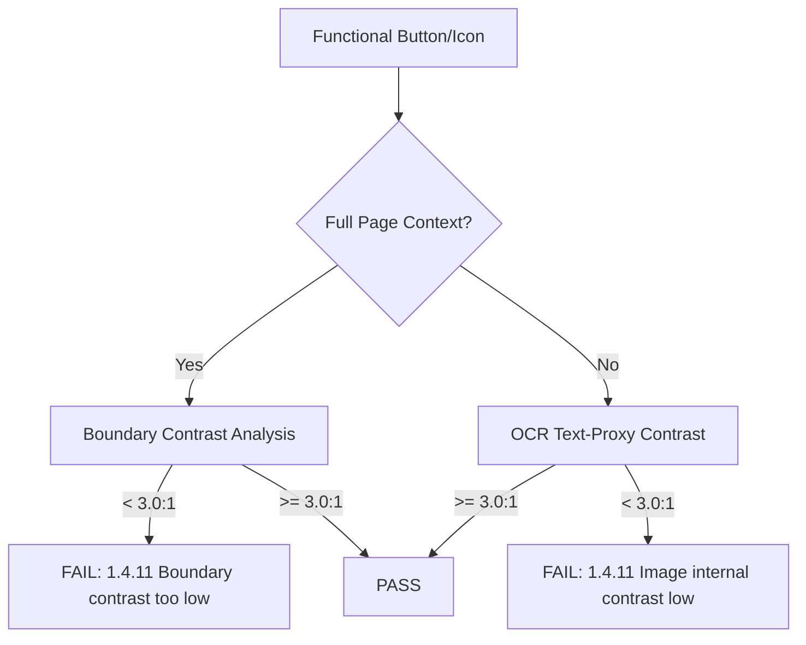
```mermaid
flowchart TD
    UI["Functional Button/Icon"] --> CONTEXT{"Full Page Context?"}
    CONTEXT -- Yes --> BOUND["Boundary Contrast Analysis"]
    CONTEXT -- No --> PROXY["OCR Text-Proxy Contrast"]
    
    BOUND -- "< 3.0:1" --> FAIL1["FAIL: 1.4.11 Boundary contrast too low"]
    BOUND -- ">= 3.0:1" --> PASS["PASS"]
    
    PROXY -- "< 3.0:1" --> FAIL2["FAIL: 1.4.11 Image internal contrast low"]
    PROXY -- ">= 3.0:1" --> PASS["PASS"]
```

#### Cases Covered
- Pixel-accurate boundary contrast (F14 fix) against surrounding page pixels.
- Fallback OCR-text contrast proxy.
- Relative luminance formula execution.

#### Cases Missed
- Components at page edges (flagged as INCOMPLETE).
- Components with complex gradients/patterns.

---

### 1.4.12 — Text Spacing (Level AA)
**Check:** `text_spacing.py`

#### Flowchart
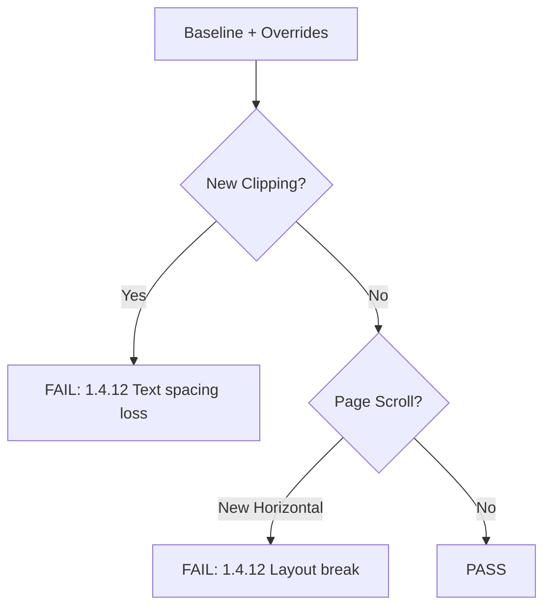
```mermaid
flowchart TD
    BASE["Baseline + Overrides"] --> CLIP{"New Clipping?"}
    CLIP -- Yes --> FAIL1["FAIL: 1.4.12 Text spacing loss"]
    CLIP -- No --> SCR{"Page Scroll?"}
    SCR -- New Horizontal --> FAIL2["FAIL: 1.4.12 Layout break"]
    SCR -- No --> PASS["PASS"]
```

#### Cases Covered
- Mandatory overrides: 1.5 line-height, 0.12em letter-spacing, 0.16em word-spacing.
- Truncation detection in common text tags.

#### Cases Missed
- Overlapping elements (heuristic exists but less reliable than clipping).

---

### 1.4.13 — Content on Hover or Focus (Level AA)
**Check:** `hover_focus_content.py`

#### Flowchart
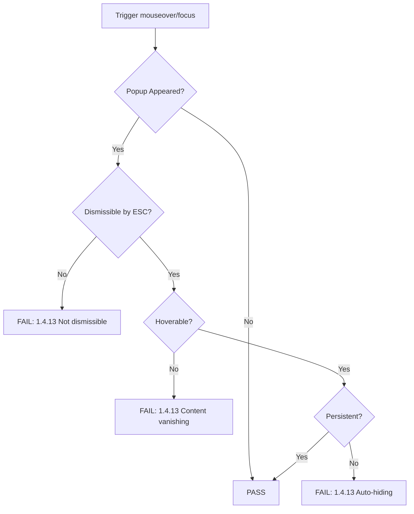
```mermaid
flowchart TD
    TRIG["Trigger mouseover/focus"] --> POP{"Popup Appeared?"}
    POP -- No --> PASS["PASS"]
    POP -- Yes --> ESC{"Dismissible by ESC?"}
    ESC -- No --> FAIL1["FAIL: 1.4.13 Not dismissible"]
    ESC -- Yes --> MOVE{"Hoverable?"}
    MOVE -- No --> FAIL2["FAIL: 1.4.13 Content vanishing"]
    MOVE -- Yes --> PERS{"Persistent?"}
    PERS -- No --> FAIL3["FAIL: 1.4.13 Auto-hiding"]
    PERS -- Yes --> PASS
```

#### Cases Covered
- Escape key dismissal simulation.
- Hoverable content (moving pointer from trigger to popup).
- Persistence until explicit removal.

#### Cases Missed
- Focus triggers that differ from hover (simulated only for mouseover).

---

### 2.2.2 — Pause, Stop, Hide (Level A)
**Check:** `pause_stop_hide_auditor.py`

#### Flowchart
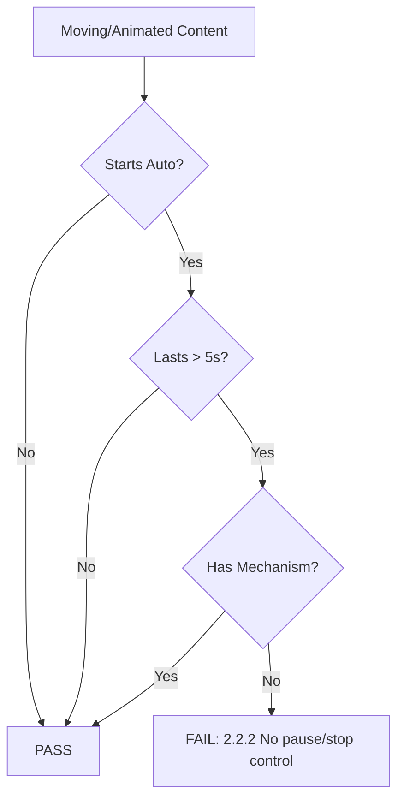
```mermaid
flowchart TD
    MOV["Moving/Animated Content"] --> AUTO{"Starts Auto?"}
    AUTO -- No --> PASS["PASS"]
    AUTO -- Yes --> DUR{"Lasts > 5s?"}
    DUR -- No --> PASS
    DUR -- Yes --> MEC{"Has Mechanism?"}
    MEC -- Yes --> PASS
    MEC -- No --> FAIL["FAIL: 2.2.2 No pause/stop control"]
```

#### Cases Covered
- `<video autoplay>`, Animated GIFs, CSS/WAAPI animations, Carousels.
- 5-second duration gate.
- Control discovery (Pause/Stop keywords + ARIA).

#### Cases Missed
- JavaScript timer-based background updates.
- Control buttons with only icons (no label/text).

---

### 2.4.11 — Focus Not Obscured (Minimum) (Level AA)
**Check:** `focus_not_obscured_minimum.py`

#### Flowchart
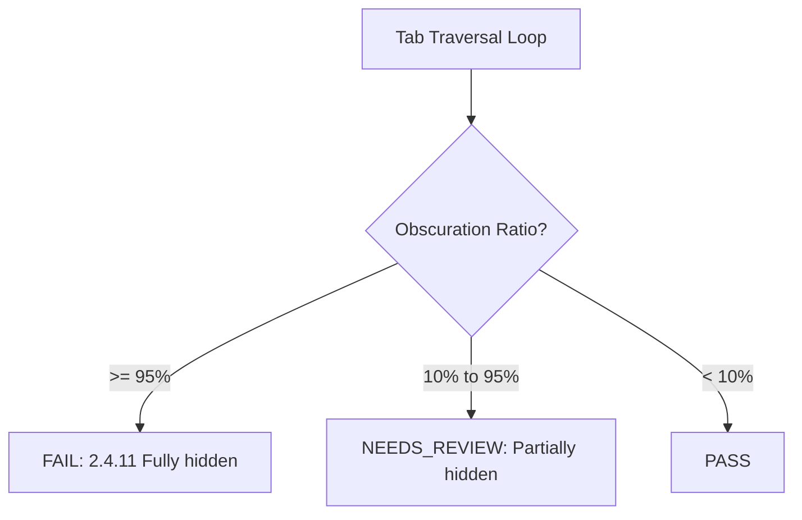
```mermaid
flowchart TD
    TAB["Tab Traversal Loop"] --> RATIO{"Obscuration Ratio?"}
    RATIO -- ">= 95%" --> FAIL["FAIL: 2.4.11 Fully hidden"]
    RATIO -- "10% to 95%" --> REV["NEEDS_REVIEW: Partially hidden"]
    RATIO -- "< 10%" --> PASS["PASS"]
```

#### Cases Covered
- Full/Partial overlap with fixed/sticky headers or banners.
- Identification of specific covering elements.

#### Cases Missed
- Obscuration by 100% transparent elements.

---

### 2.4.12 — Focus Not Obscured (Enhanced) (Level AAA)
**Check:** `focus_not_obscured_enhanced.py`

#### Flowchart
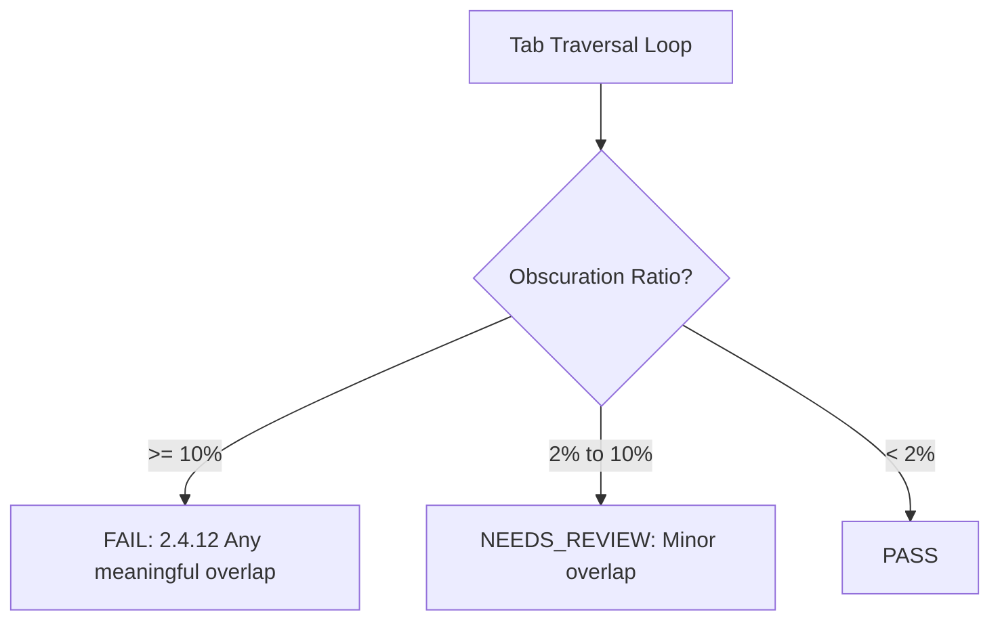
```mermaid
flowchart TD
    TAB["Tab Traversal Loop"] --> RATIO{"Obscuration Ratio?"}
    RATIO -- ">= 10%" --> FAIL["FAIL: 2.4.12 Any meaningful overlap"]
    RATIO -- "2% to 10%" --> REV["NEEDS_REVIEW: Minor overlap"]
    RATIO -- "< 2%" --> PASS["PASS"]
```

#### Cases Covered
- Stricter enhanced threshold for author-created overlays.
- Reuses the same keyboard traversal and covering-element identification as 2.4.11.

#### Cases Missed
- Sub-2% overlap can still matter for very small focused controls.

---

### 2.5.3 — Label in Name (Level A)
**Check:** `label_in_name_auditor.py`

#### Flowchart
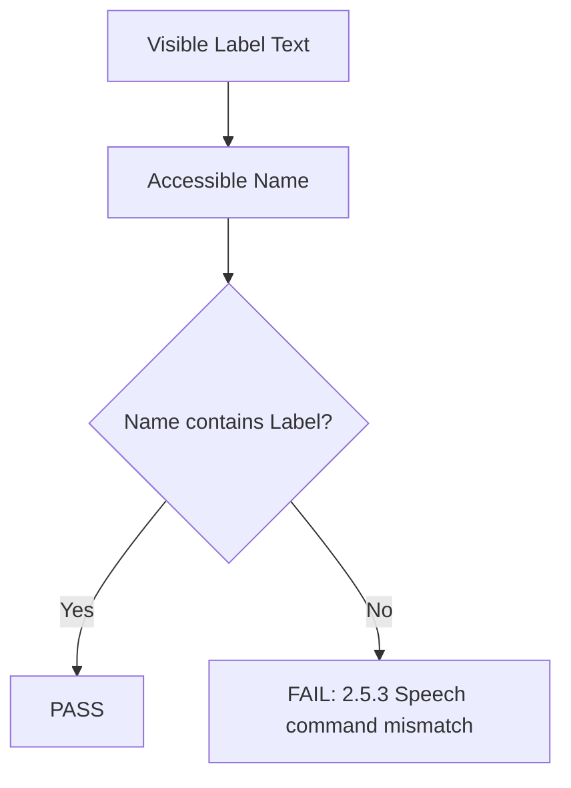
```mermaid
flowchart TD
    VIS["Visible Label Text"] --> ACC["Accessible Name"]
    ACC --> MATCH{"Name contains Label?"}
    MATCH -- Yes --> PASS["PASS"]
    MATCH -- No --> FAIL["FAIL: 2.5.3 Speech command mismatch"]
```

#### Cases Covered
- Case-insensitive word-boundary matching (`\b`).
- NFC Normalization + Casefolding.
- CJK substring exception.

#### Cases Missed
- Labels with embedded icons/images (if not in textContent).

---

### 2.5.8 — Target Size (Minimum) (Level AA)
**Check:** `target_size_auditor.py`

#### Flowchart
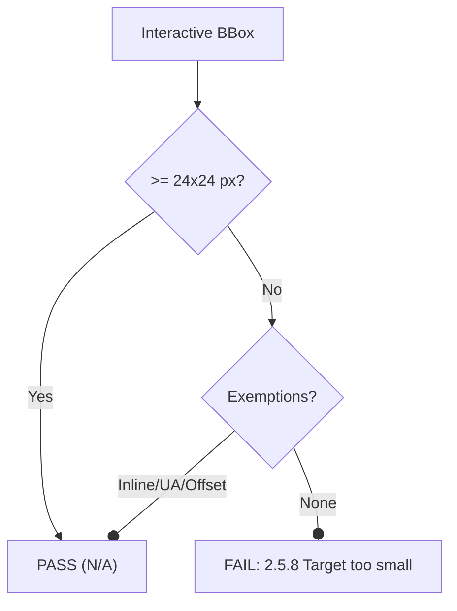
```mermaid
flowchart TD
    RECT["Interactive BBox"] --> SIZE{">= 24x24 px?"}
    SIZE -- Yes --> PASS["PASS"]
    SIZE -- No --> EX{"Exemptions?"}
    EX -- Inline/UA/Offset --o PASS["PASS (N/A)"]
    EX -- None --o FAIL["FAIL: 2.5.8 Target too small"]
```

#### Cases Covered
- 24x24 CSS pixel minimum.
- Inline, User-Agent, and Spacing (Offset) exceptions.

#### Cases Missed
- Equivalent interaction points.

---

### 3.3.1 — Error Identification (Level A)
**Check:** `form_auditor.py`

#### Flowchart
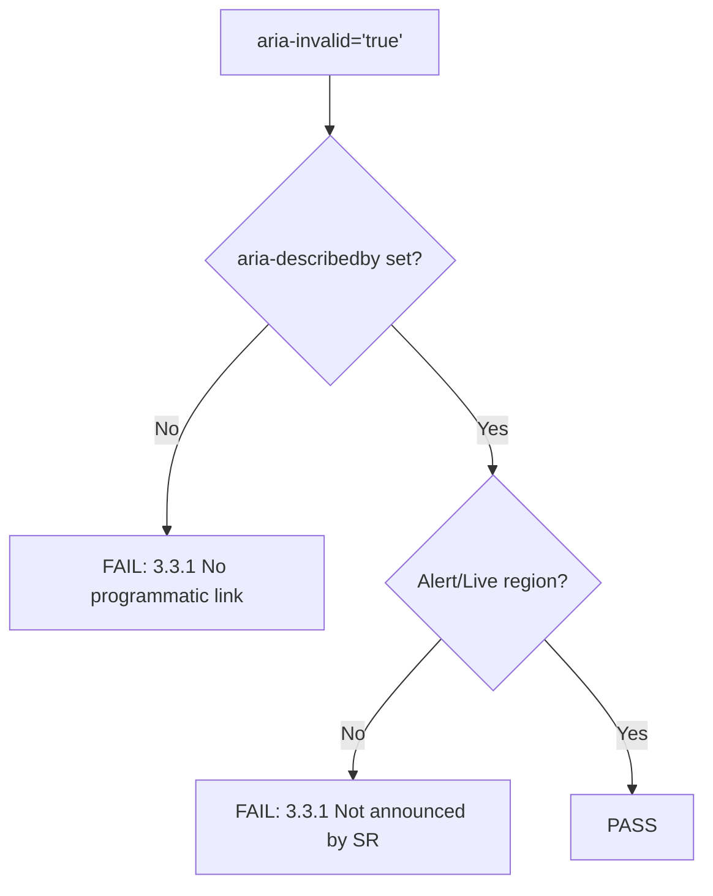
```mermaid
flowchart TD
    INV["aria-invalid='true'"] --> DESC{"aria-describedby set?"}
    DESC -- No --> FAIL1["FAIL: 3.3.1 No programmatic link"]
    DESC -- Yes --> LIV{"Alert/Live region?"}
    LIV -- No --> FAIL2["FAIL: 3.3.1 Not announced by SR"]
    LIV -- Yes --> PASS["PASS"]
```

#### Cases Covered
- `aria-describedby` linkage on required/invalid fields.
- `role="alert"` or `aria-live` presence.

#### Cases Missed
- Client-side validation errors not using ARIA attributes at load.

---

### 3.3.2 — Labels or Instructions (Level A)
**Check:** `form_auditor.py`

#### Flowchart
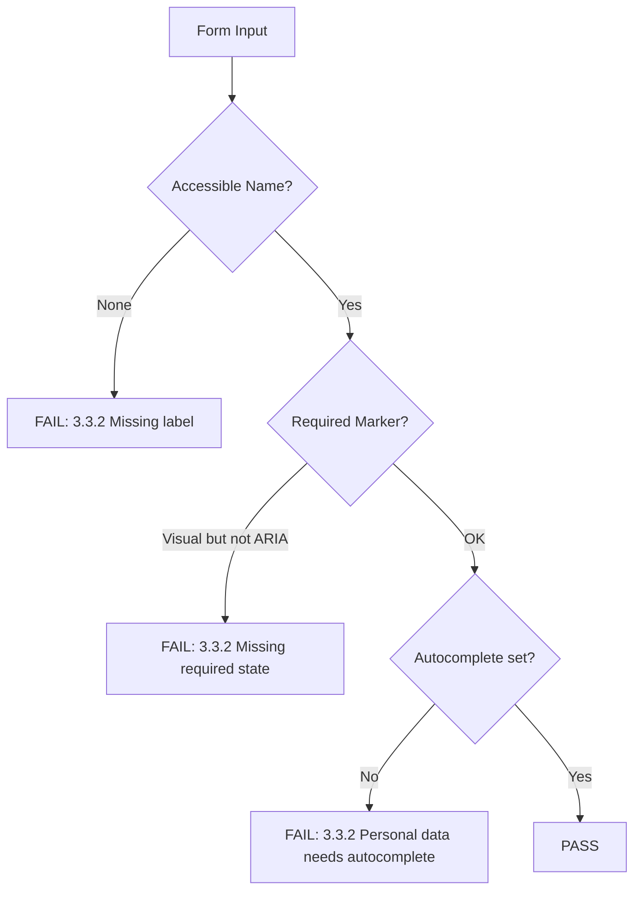
```mermaid
flowchart TD
    INP["Form Input"] --> NAME{"Accessible Name?"}
    NAME -- None --> FAIL1["FAIL: 3.3.2 Missing label"]
    NAME -- Yes --> REQ{"Required Marker?"}
    REQ -- "Visual but not ARIA" --> FAIL2["FAIL: 3.3.2 Missing required state"]
    REQ -- OK --> AUTO{"Autocomplete set?"}
    AUTO -- No --> FAIL3["FAIL: 3.3.2 Personal data needs autocomplete"]
    AUTO -- Yes --> PASS["PASS"]
```

#### Cases Covered
- Label association (`<label for>`, `aria-label`).
- "Required" visual-vs-programmatic check.
- Placeholder-only labels.
- `autocomplete` on personal data fields.

#### Cases Missed
- Detailed instructions for input (e.g. data formats).

---

### 4.1.2 — Name, Role, Value (Level A)
**Check:** `alttext.py` + `form_auditor.py`

#### Flowchart
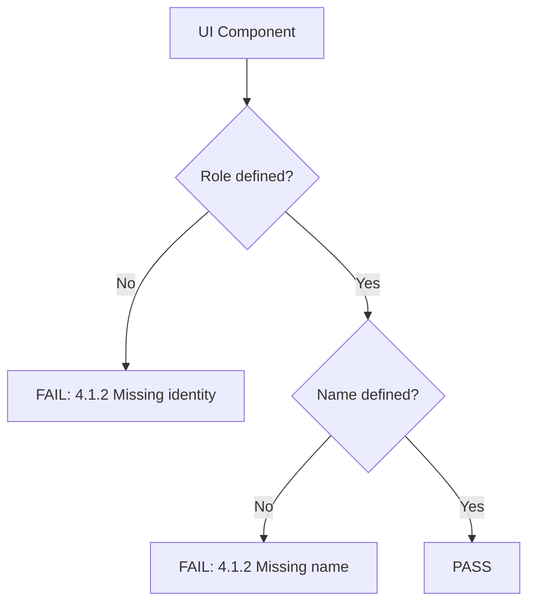
```mermaid
flowchart TD
    COMP["UI Component"] --> ROLE{"Role defined?"}
    ROLE -- No --> FAIL1["FAIL: 4.1.2 Missing identity"]
    ROLE -- Yes --> NAME{"Name defined?"}
    NAME -- No --> FAIL2["FAIL: 4.1.2 Missing name"]
    NAME -- Yes --> PASS["PASS"]
```

#### Cases Covered
- Functional image role verification.
- Accessible name computation algorithm adherence.

#### Cases Missed
- Dynamic value updates (for range/progress).

---

## Coverage Summary

| WCAG SC | Criterion | Check File | Pipeline Stage | Confidence |
|---------|-----------|------------|----------------|------------|
| 1.1.1 | Non-text Content | alttext.py | Multimodal | High |
| 1.3.4 | Orientation | orientation.py | Rendered | Medium |
| 1.4.3 | Contrast (Minimum) | contrast_analyser.py | Multimodal | High |
| 1.4.4 | Resize Text | resize_text.py | Rendered | High |
| 1.4.5 | Images of Text | alttext.py | CV (OCR) | Medium |
| 1.4.6 | Contrast (Enhanced) | contrast_analyser.py | Multimodal | High |
| 1.4.10 | Reflow | reflow.py | Rendered | High |
| 1.4.11 | Non-text Contrast | alttext.py | CV (Pixel) | High |
| 1.4.12 | Text Spacing | text_spacing.py | Rendered | High |
| 1.4.13 | Content on Hover/Focus | hover_focus_content.py | Rendered | Medium |
| 2.2.2 | Pause, Stop, Hide | pause_stop_hide_auditor.py | Hybrid | High |
| 2.4.11 | Focus Not Obscured (Minimum) | focus_not_obscured_minimum.py | Rendered | High |
| 2.4.12 | Focus Not Obscured (Enhanced) | focus_not_obscured_enhanced.py | Rendered | High |
| 2.5.3 | Label in Name | label_in_name_auditor.py | Static | High |
| 2.5.8 | Target Size | target_size_auditor.py | Static | High |
| 3.3.1 | Error Identification | form_auditor.py | Static | High |
| 3.3.2 | Labels or Instructions | form_auditor.py | Static | High |
| 4.1.2 | Name, Role, Value | alttext.py / form_auditor.py | Hybrid | High |
