> Generated: 2026-04-06
> Updated: 2026-04-13
> Scope: `ka11y-python/ka11y/accessibility/rules/` + `ka11y-python/ka11y/accessibility/rendered/evaluators/` + combined orchestration (`runner.py`, `stages.py`, `findings.py`)
> Stack: Python 3.10+ + Playwright + OCR (PaddleOCR with EasyOCR fallback) + ML Classifier

---

## Architecture & Request Flow (Updated April 2026)

### The Unified Accessibility Pipeline

To eliminate false positives caused by evaluating elements in a vacuum, the Python engine was re-architected. Instead of individual rule crawlers (e.g., `LabelInNameAuditor` or `TargetSizeAuditor`) running in isolation, the new architecture uses a **Centralized Context Pipeline**.

1.  **ElementContextExtractor:** A single, unified Playwright script extracts the entire DOM, including computed styles, ARIA attributes, and bounding boxes.
2.  **Semantic Enrichment:**
    *   **SectionAnalyzer:** Determines the macro-context (e.g., `HEADER`, `FORM_REGION`, `DATA_TABLE`).
    *   **SemanticRelationshipEngine:** Resolves ARIA pointers (`aria-describedby`, `aria-labelledby`) and native HTML group mechanics (`<fieldset>`, `<label>`).
3.  **Interaction Simulation:** The `InteractionStateRunner` natively simulates interactions (like `.focus()`) and captures the delta in rendered CSS properties (like `box-shadow` or `background-color`) to prove visible state changes.
4.  **Decision Engine**: Evaluates the rich `ElementContext` against registered `WCAGPolicy` classes:
    *   **Policy111**: 1.1.1 Non-text Content (with functional redundancy check)
    *   **Policy131**: 1.3.1 Info and Relationships (context-aware orphaned input check)
    *   **Policy143 / 146**: 1.4.3 / 1.4.6 Contrast (Minimum/Enhanced) with dynamic font-size thresholds
    *   **Policy145**: 1.4.5 Images of Text (OCR-backed)
    *   **Policy1411**: 1.4.11 Non-text Contrast (rendered boundary check)
    *   **Policy247 / 2413**: 2.4.7 / 2.4.13 Focus Visible and Appearance (visual delta simulation)
    *   **Policy253**: 2.5.3 Label in Name (NFC-normalized substring match)
    *   **Policy258**: 2.5.8 Target Size (effective clickable area calculation)
5.  **Evidence Formatter**: Maps the internal pipeline `RuleVerdict` back to the legacy JSON schema expected by the frontend.

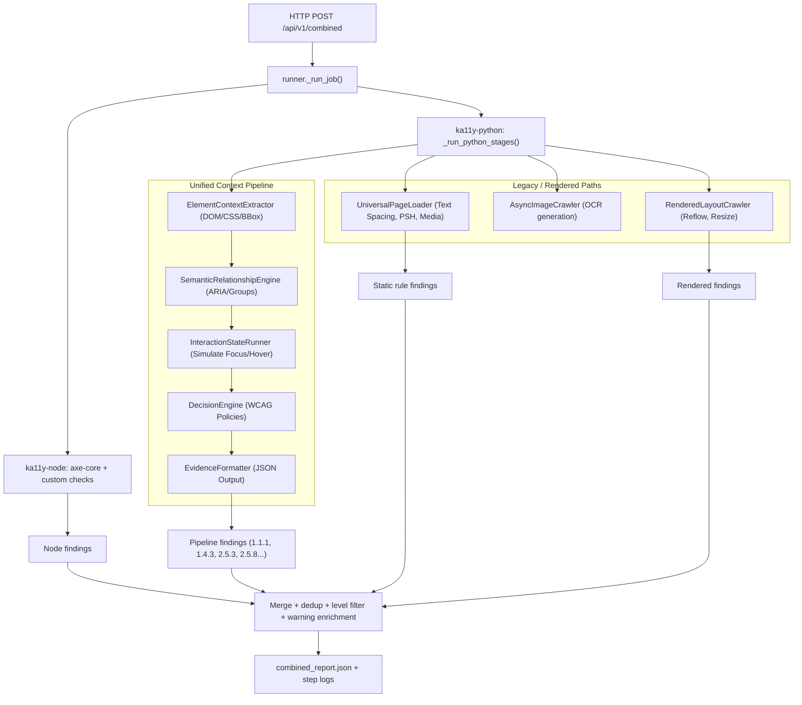
```mermaid
flowchart TD
    A[HTTP POST /api/v1/combined] --> B["runner._run_job()"]
    B --> C["ka11y-node: axe-core + custom checks"]
    B --> D["ka11y-python: _run_python_stages()"]

    subgraph "Unified Context Pipeline"
        UP1["ElementContextExtractor (DOM/CSS/BBox)"]
        UP2["SemanticRelationshipEngine (ARIA/Groups)"]
        UP3["InteractionStateRunner (Simulate Focus/Hover)"]
        UP4["DecisionEngine (WCAG Policies)"]
        UP5["EvidenceFormatter (JSON Output)"]
        
        UP1 --> UP2 --> UP3 --> UP4 --> UP5
    end

    subgraph "Legacy / Rendered Paths"
        E["UniversalPageLoader (Text Spacing, PSH, Media)"]
        F["AsyncImageCrawler (OCR generation)"]
        G["RenderedLayoutCrawler (Reflow, Resize)"]
    end

    D --> UP1
    D --> E
    D --> F
    D --> G

    C --> M["Node findings"]
    E --> N["Static rule findings"]
    UP5 --> O["Pipeline findings (1.1.1, 1.4.3, 2.5.3, 2.5.8...)"]
    G --> P["Rendered findings"]

    M & N & O & P --> Q["Merge + dedup + level filter + warning enrichment"]
    Q --> R["combined_report.json + step logs"]
```

### Rule-by-Rule Analysis

---

### 1.1.1 — Non-text Content (Level A)
**Engine:** Unified Pipeline (`Policy111`)

#### Flowchart
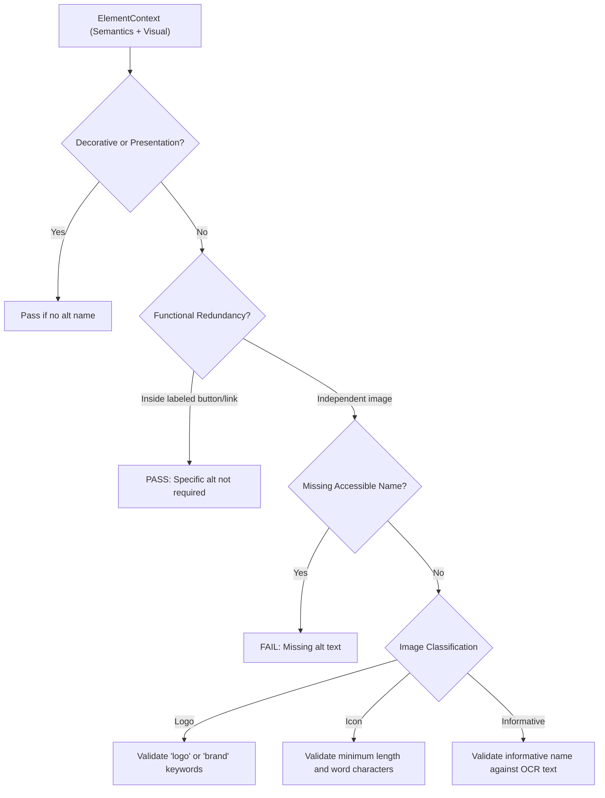
```mermaid
flowchart TD
    START["ElementContext (Semantics + Visual)"] --> EX{"Decorative or Presentation?"}
    EX -- Yes --> PASS_DEC["Pass if no alt name"]
    EX -- No --> FR{"Functional Redundancy?"}
    
    FR -- "Inside labeled button/link" --> PASS_FR["PASS: Specific alt not required"]
    FR -- "Independent image" --> NM{"Missing Accessible Name?"}
    
    NM -- Yes --> FAIL["FAIL: Missing alt text"]
    NM -- No --> CLASS{"Image Classification"}
    
    CLASS -- Logo --> LOG["Validate 'logo' or 'brand' keywords"]
    CLASS -- Icon --> ICO["Validate minimum length and word characters"]
    CLASS -- Informative --> INF["Validate informative name against OCR text"]
```

**Key False Positive Protections:**
- Uses `SemanticRelationshipEngine` to detect if an image is inside an already-labeled `<button>` or `<a>`. If so, it passes as functionally redundant.
- Uses word-boundary regex (`\b`) to validate OCR text, preventing naive substring matches (e.g., passing "research" when OCR found "search").

---

### 1.3.1 — Info and Relationships (Level A)
**Engine:** Unified Pipeline (`Policy131`)

**Key False Positive Protections:**
- Checks the macro-context (e.g., `DATA_TABLE`, `FORM_REGION`) provided by `SectionAnalyzer` before failing orphaned inputs.
- Validates relationships through `aria-describedby` or parent `fieldset` resolution provided by `SemanticRelationshipEngine`.

---

### 1.4.3 & 1.4.6 — Contrast (Minimum & Enhanced) (Level AA / AAA)
**Engine:** Unified Pipeline (`Policy143`, `Policy146`, `ContrastEngine`)

**Key False Positive Protections:**
- **Dynamic Thresholds:** Uses `getComputedStyle` to check `font-size` and `font-weight`. Automatically drops the requirement to `3.0:1` (AA) or `4.5:1` (AAA) for large text.
- **Classification Exemptions:** Ignores images classified as `logo` or `decorative`, complying with WCAG exemptions.
- **Transparent Backgrounds:** Correctly identifies `rgba(..., 0)` backgrounds and marks them as `NEEDS_REVIEW` instead of blindly failing a 1:1 ratio against the DOM body.

---

### 1.4.5 — Images of Text (Level AA)
**Engine:** Unified Pipeline (`Policy145`)

**Key False Positive Protections:**
- **Contextual Exemptions:** Automatically bypasses elements classified as `logo`, `decorative`, `complex`, or `chart`. 
- **Video Thumbnails:** Exempts elements residing inside a `video_context` wrapper (e.g., video posters with burned-in subtitles).
- **Dynamic Reasons:** Fails with a snippet of the exact text detected by OCR, allowing developers to immediately verify the claim.

---

### 2.4.7 — Focus Visible (Level AA)
**Engine:** Unified Pipeline (`Policy247`, `InteractionStateRunner`)

**Key False Positive Protections:**
- **Visual Delta Simulation:** Legacy engines failed elements that used `outline: none`. The new pipeline explicitly `.focus()`es the element and computes the delta in rendered CSS properties. If `box-shadow`, `background-color`, or `border-color` changes upon focus, it correctly passes the rule.

---

### 2.5.3 — Label in Name (Level A)
**Engine:** Unified Pipeline (`Policy253`)

**Key False Positive Protections:**
- Evaluates the **Visible Label** (the raw text nodes visible to the user) against the computed **Accessible Name** (resolving `aria-label`, `aria-labelledby`, `alt`, etc.).
- Normalizes punctuation and casing. Validates that the visible label is a contiguous substring of the accessible name, properly supporting legally compliant variations (e.g., Visible: "Submit", ARIA: "Submit Form").

---

### 2.5.8 — Target Size (Level AA)
**Engine:** Unified Pipeline (`Policy258`)

**Key False Positive Protections:**
- **Effective Clickable Area:** Native `<input type="radio">` tags are often 12x12px, which fails the 24x24px rule. However, the `ElementContextExtractor` merges the bounding box of the input with its parent `<label>` or `<button>`. The rule evaluates this *effective* area, eliminating false positives on properly wrapped inputs.
- **UA-Controlled:** Accurately exempts native inputs where CSS `appearance` has not been overridden.
    DEC -- No --> FAIL1["FAIL: 1.1.1 Decorative needs empty alt"]
    
    INF -- Match --> PASS
    INF -- No Match --> FAIL2["FAIL: 1.1.1 OCR words missing in alt"]
    
    LOG -- Yes --> PASS
    LOG -- No --> FAIL3["FAIL: 1.1.1 Logo needs 'logo'/'home' text"]
    
    ICO -- Yes --> PASS
    ICO -- No --> FAIL4["FAIL: 1.1.1 Icon needs purpose/qualifier"]
    
    BTN -- Yes --> PASS
    BTN -- No --> FAIL5["FAIL: 1.1.1 Button needs action word"]
```

#### Cases Covered
| Case | Detection Method |
|------|-----------------|
| Decorative alt transparency | Strictly enforces `alt=""` |
| Informative content parity | OCR word-match (3+ chars) |
| Branding logotypes | Keyword check ('logo', 'home') |
| Social/Action icons | "Brand icon" or "Close" keyword match |
| Button purpose | Action word regex (`_BUTTON_ACTION_WORDS`) |

#### Cases Missed / False Negative Risks
| Case | Why missed |
|------|-----------|
| Short OCR tokens | Tokens < 3 characters are ignored to avoid noise |
| Complex diagrams | Heuristic only checks if alt is non-empty |
| Image-map areas | Not explicitly audited in `alttext.py` |

---

### 1.3.4 — Orientation (Level AA)
**Check:** `orientation.py`

#### Flowchart
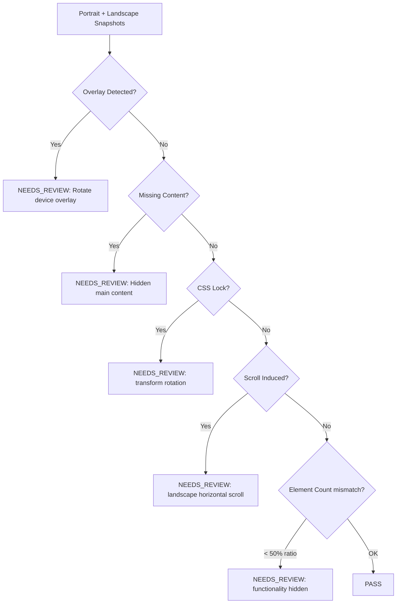
```mermaid
flowchart TD
    SNAP["Portrait + Landscape Snapshots"] --> ORE{"Overlay Detected?"}
    ORE -- Yes --> REV1["NEEDS_REVIEW: Rotate device overlay"]
    ORE -- No --> CCO{"Missing Content?"}
    
    CCO -- Yes --> REV2["NEEDS_REVIEW: Hidden main content"]
    CCO -- No --> CLO{"CSS Lock?"}
    
    CLO -- Yes --> REV3["NEEDS_REVIEW: transform rotation"]
    CLO -- No --> SCR{"Scroll Induced?"}
    
    SCR -- Yes --> REV4["NEEDS_REVIEW: landscape horizontal scroll"]
    SCR -- No --> CNT{"Element Count mismatch?"}
    
    CNT -- "< 50% ratio" --> REV5["NEEDS_REVIEW: functionality hidden"]
    CNT -- OK --> PASS["PASS"]
```

#### Cases Covered
| Case | Detection |
|------|-----------|
| Rotate-device overlays | Regex `detect_rotate_overlay` |
| CSS body locks | `detect_css_transform_lock` |
| Content clipping | `detect_body_overflow_hidden` |
| Responsive breakage | `detect_landscape_horizontal_overflow` |
| Functionality loss | Comparative focusable element count |

#### Cases Missed
| Case | Why |
|------|-----|
| Meta viewport locks | Not checked in rendered evaluator |
| JS `orientation.lock()` | Hard to detect without side-channel monitoring |

---

### 1.4.3 — Contrast (Minimum) (Level AA)
**Check:** `contrast_analyser.py` (Multimodal)

#### Flowchart
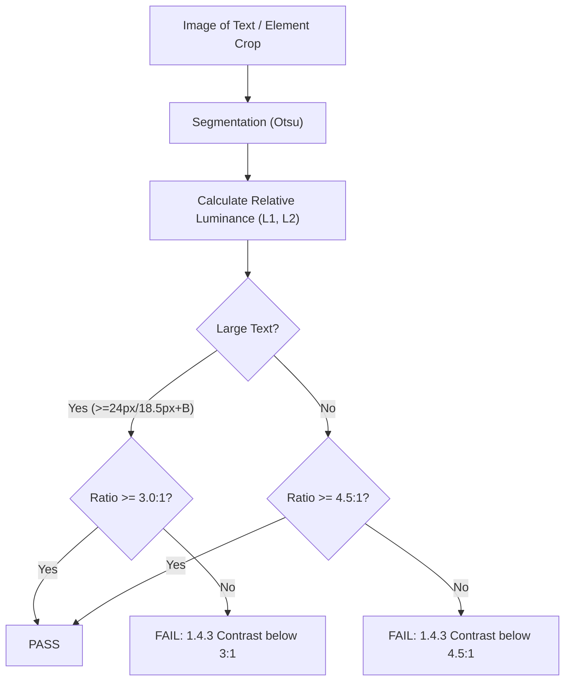
```mermaid
flowchart TD
    IMG["Image of Text / Element Crop"] --> SEG["Segmentation (Otsu)"]
    SEG --> L["Calculate Relative Luminance (L1, L2)"]
    L --> SIZE{"Large Text?"}
    
    SIZE -- "Yes (>=24px/18.5px+B)" --> L30{"Ratio >= 3.0:1?"}
    SIZE -- "No" --> L45{"Ratio >= 4.5:1?"}
    
    L30 -- "Yes" --> PASS["PASS"]
    L30 -- "No" --> FAIL1["FAIL: 1.4.3 Contrast below 3:1"]
    
    L45 -- "Yes" --> PASS
    L45 -- "No" --> FAIL2["FAIL: 1.4.3 Contrast below 4.5:1"]
```

#### Cases Covered
| Case | Detection |
|------|-----------|
| Text in images (OCR-led) | `analyze_text_region` |
| Large text exemption | 24px regular / 18.5px bold threshold |
| Color-space accuracy | sRGB to Linear luminance conversion |

#### Cases Missed
| Case | Why |
|------|-----|
| Complex backgrounds | Segmentation (Otsu) may fail on high-noise gradients |
| Multi-color text | Color averaging doesn't catch per-character contrast |

---

### 1.4.4 — Resize Text (Level AA)
**Check:** `resize_text.py`

#### Flowchart
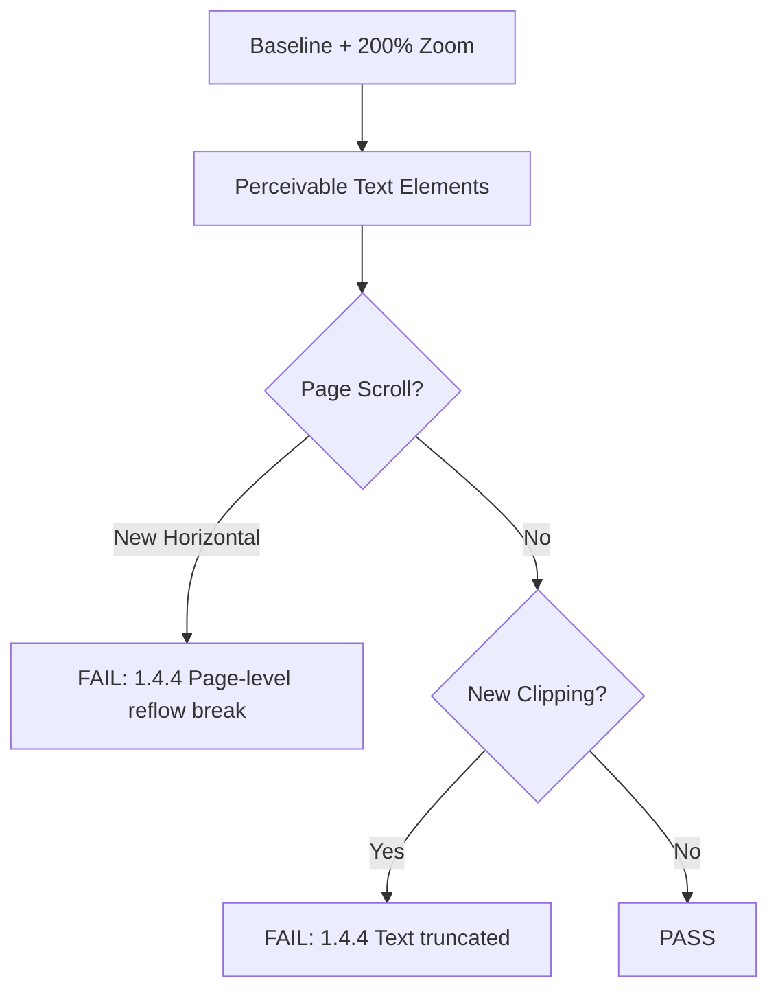
```mermaid
flowchart TD
    BASE["Baseline + 200% Zoom"] --> FILT["Perceivable Text Elements"]
    FILT --> SCR{"Page Scroll?"}
    SCR -- New Horizontal --> FAIL1["FAIL: 1.4.4 Page-level reflow break"]
    SCR -- No --> CLIP{"New Clipping?"}
    
    CLIP -- Yes --> FAIL2["FAIL: 1.4.4 Text truncated"]
    CLIP -- No --> PASS["PASS"]
```

#### Cases Covered
| Case | Detection |
|------|-----------|
| Text container truncation | `scrollWidth` > `clientWidth` diffing |
| Page-level horizontal scroll | `document_scroll_width` comparison |
| Ghosting/Invisibility | Perceivable elements heuristic |

#### Cases Missed
| Case | Why |
|------|-----|
| Vertical clipping | Only horizontal/document scroll checked |
| Overlapping text | Bounding box intersection not in this rule |

---

### 1.4.5 — Images of Text (Level AA)
**Check:** `alttext.py`

#### Flowchart
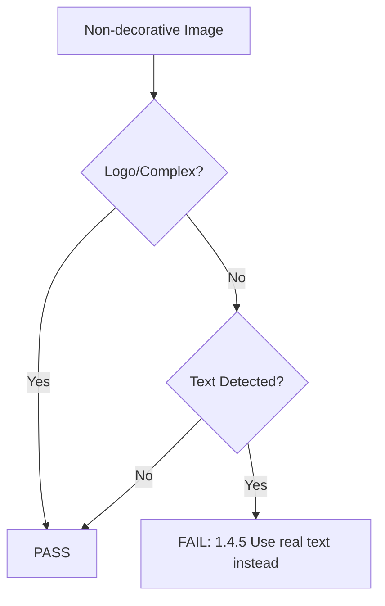
```mermaid
flowchart TD
    IMG["Non-decorative Image"] --> EXEMPT{"Logo/Complex?"}
    EXEMPT -- Yes --> PASS["PASS"]
    EXEMPT -- No --> OCR{"Text Detected?"}
    OCR -- Yes --> FAIL["FAIL: 1.4.5 Use real text instead"]
    OCR -- No --> PASS
```

#### Cases Covered
- OCR-based detection of readable text in informative images.
- Logo/Logotype exception (if classified as `is_logo`).
- Complex image exception (e.g. maps, charts).

#### Cases Missed
- Wordmark logos not tagged as `is_logo` will trigger a Fail.
- Text in `<canvas>` elements (if not treated as images).

---

### 1.4.6 — Contrast (Enhanced) (Level AAA)
**Check:** `contrast_analyser.py` (Multimodal)

#### Flowchart
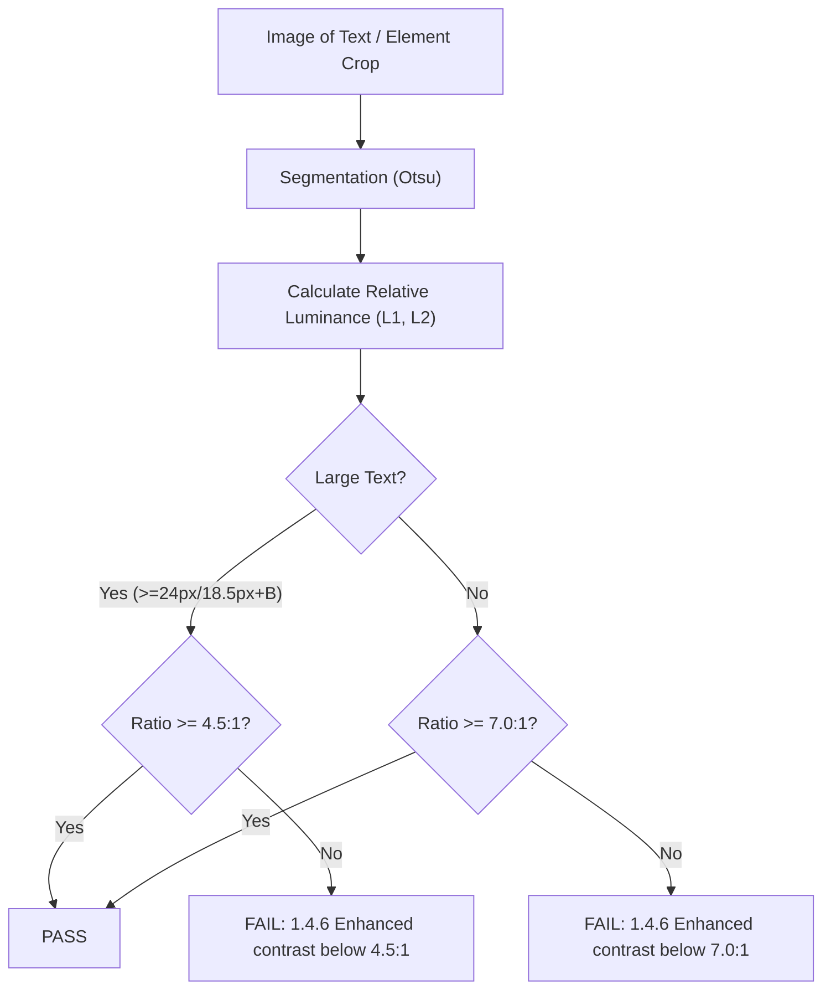
```mermaid
flowchart TD
    IMG["Image of Text / Element Crop"] --> SEG["Segmentation (Otsu)"]
    SEG --> L["Calculate Relative Luminance (L1, L2)"]
    L --> SIZE{"Large Text?"}
    
    SIZE -- "Yes (>=24px/18.5px+B)" --> L45{"Ratio >= 4.5:1?"}
    SIZE -- "No" --> L70{"Ratio >= 7.0:1?"}
    
    L45 -- "Yes" --> PASS["PASS"]
    L45 -- "No" --> FAIL1["FAIL: 1.4.6 Enhanced contrast below 4.5:1"]
    
    L70 -- "Yes" --> PASS
    L70 -- "No" --> FAIL2["FAIL: 1.4.6 Enhanced contrast below 7.0:1"]
```

#### Cases Covered
| Case | Detection |
|------|-----------|
| AAA Contrast levels | 7:1 (normal) / 4.5:1 (large) thresholds |
| Multimodal verification | Uses CV-based segmentation and luminance mapping |

#### Cases Missed
| Case | Why |
|------|-----|
| Same as 1.4.3 | High-noise backgrounds or multi-color gradients |

---

### 1.4.10 — Reflow (Level AA)
**Check:** `reflow.py`

#### Flowchart
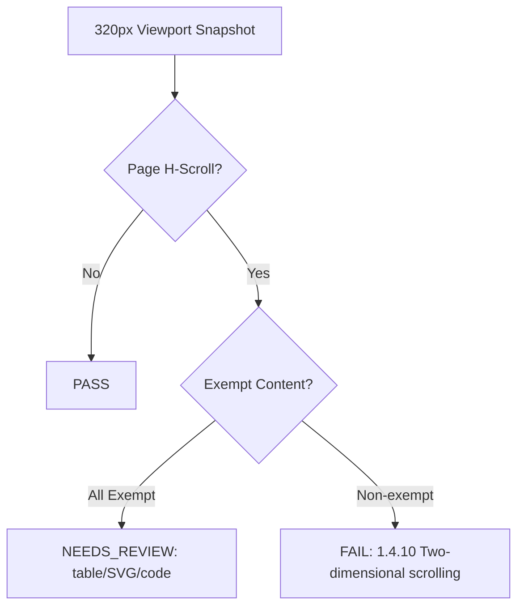
```mermaid
flowchart TD
    W320["320px Viewport Snapshot"] --> PSCR{"Page H-Scroll?"}
    PSCR -- No --> PASS["PASS"]
    PSCR -- Yes --> EX{"Exempt Content?"}
    EX -- All Exempt --> REV["NEEDS_REVIEW: table/SVG/code"]
    EX -- Non-exempt --> FAIL["FAIL: 1.4.10 Two-dimensional scrolling"]
```

#### Cases Covered
- Document-level horizontal scroll detection at 320px.
- Tag-based exemptions (`table`, `svg`, `pre`, `code`).

#### Cases Missed
- Hidden triggers (overlays) that cause scroll when expanded.

---

### 1.4.11 — Non-text Contrast (Level AA)
**Check:** `alttext.py` + `contrast_analyser.py`

#### Flowchart
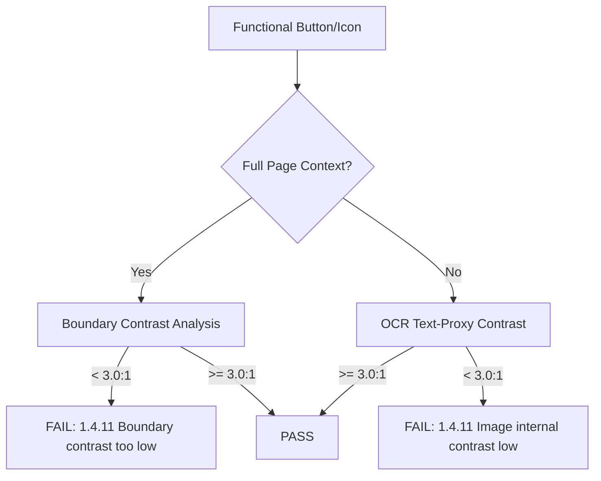
```mermaid
flowchart TD
    UI["Functional Button/Icon"] --> CONTEXT{"Full Page Context?"}
    CONTEXT -- Yes --> BOUND["Boundary Contrast Analysis"]
    CONTEXT -- No --> PROXY["OCR Text-Proxy Contrast"]
    
    BOUND -- "< 3.0:1" --> FAIL1["FAIL: 1.4.11 Boundary contrast too low"]
    BOUND -- ">= 3.0:1" --> PASS["PASS"]
    
    PROXY -- "< 3.0:1" --> FAIL2["FAIL: 1.4.11 Image internal contrast low"]
    PROXY -- ">= 3.0:1" --> PASS["PASS"]
```

#### Cases Covered
- Pixel-accurate boundary contrast (F14 fix) against surrounding page pixels.
- Fallback OCR-text contrast proxy.
- Relative luminance formula execution.

#### Cases Missed
- Components at page edges (flagged as INCOMPLETE).
- Components with complex gradients/patterns.

---

### 1.4.12 — Text Spacing (Level AA)
**Check:** `text_spacing.py`

#### Flowchart
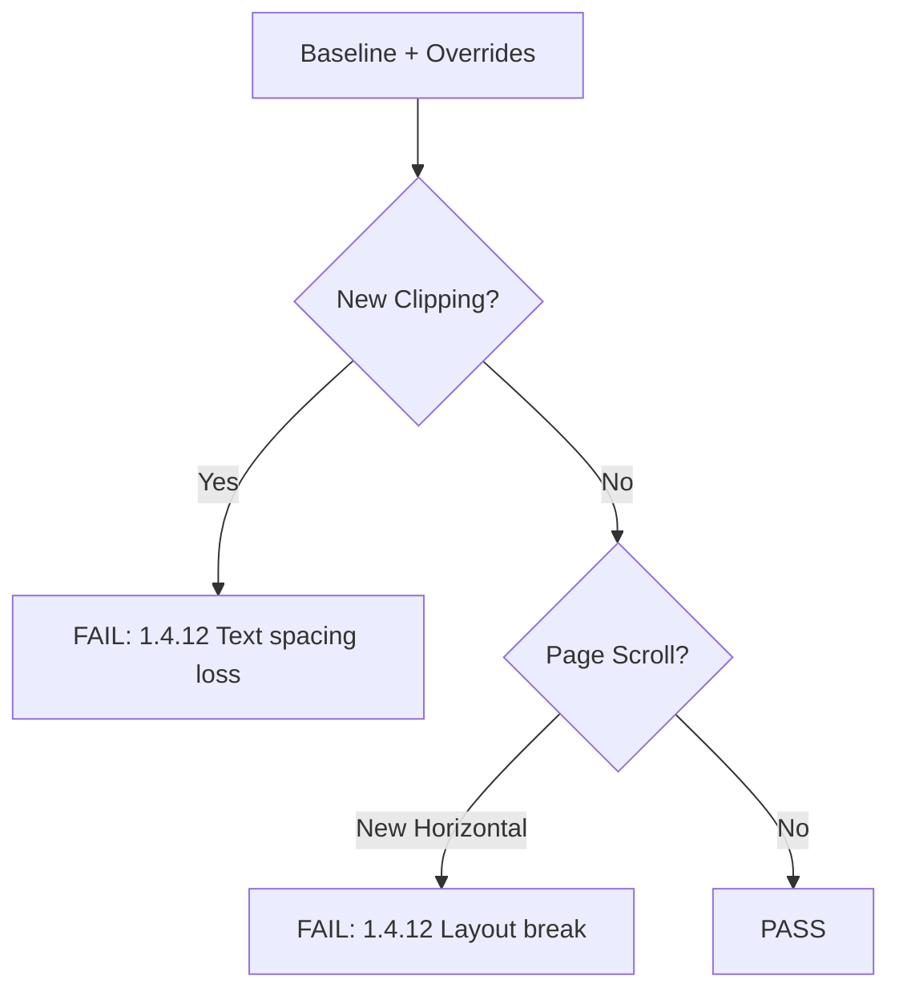
```mermaid
flowchart TD
    BASE["Baseline + Overrides"] --> CLIP{"New Clipping?"}
    CLIP -- Yes --> FAIL1["FAIL: 1.4.12 Text spacing loss"]
    CLIP -- No --> SCR{"Page Scroll?"}
    SCR -- New Horizontal --> FAIL2["FAIL: 1.4.12 Layout break"]
    SCR -- No --> PASS["PASS"]
```

#### Cases Covered
- Mandatory overrides: 1.5 line-height, 0.12em letter-spacing, 0.16em word-spacing.
- Truncation detection in common text tags.

#### Cases Missed
- Overlapping elements (heuristic exists but less reliable than clipping).

---

### 1.4.13 — Content on Hover or Focus (Level AA)
**Check:** `hover_focus_content.py`

#### Flowchart
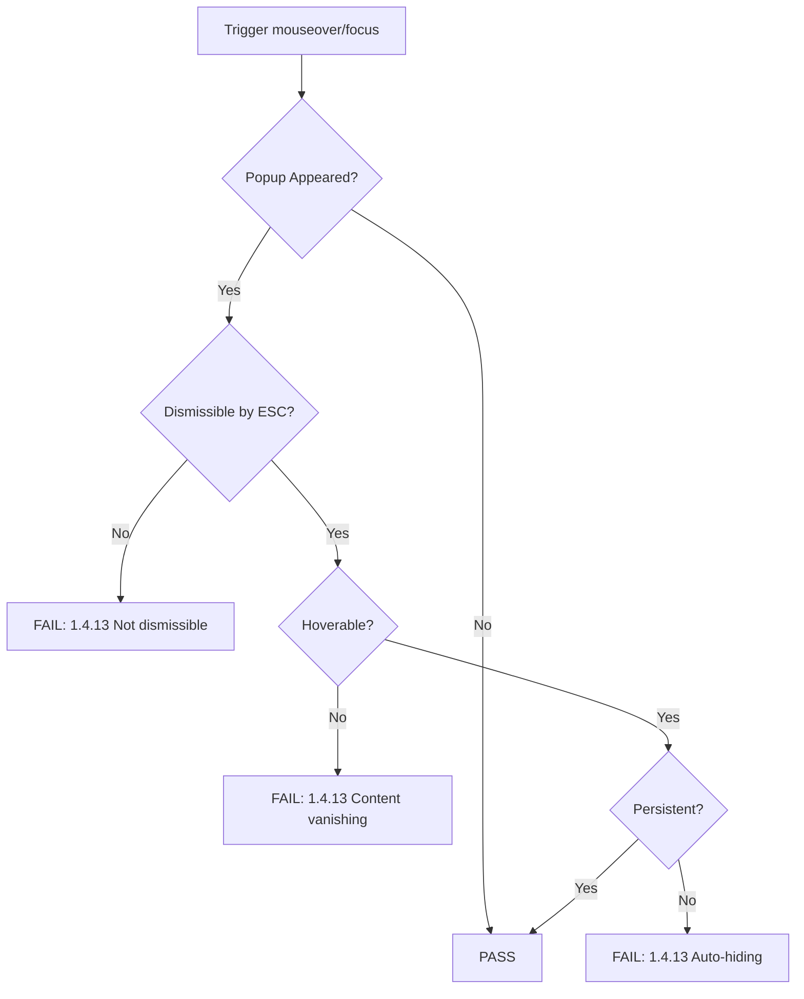
```mermaid
flowchart TD
    TRIG["Trigger mouseover/focus"] --> POP{"Popup Appeared?"}
    POP -- No --> PASS["PASS"]
    POP -- Yes --> ESC{"Dismissible by ESC?"}
    ESC -- No --> FAIL1["FAIL: 1.4.13 Not dismissible"]
    ESC -- Yes --> MOVE{"Hoverable?"}
    MOVE -- No --> FAIL2["FAIL: 1.4.13 Content vanishing"]
    MOVE -- Yes --> PERS{"Persistent?"}
    PERS -- No --> FAIL3["FAIL: 1.4.13 Auto-hiding"]
    PERS -- Yes --> PASS
```

#### Cases Covered
- Escape key dismissal simulation.
- Hoverable content (moving pointer from trigger to popup).
- Persistence until explicit removal.

#### Cases Missed
- Focus triggers that differ from hover (simulated only for mouseover).

---

### 2.2.2 — Pause, Stop, Hide (Level A)
**Check:** `pause_stop_hide_auditor.py`

#### Flowchart
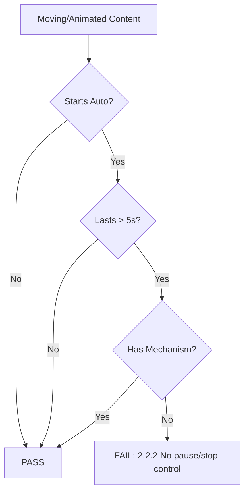
```mermaid
flowchart TD
    MOV["Moving/Animated Content"] --> AUTO{"Starts Auto?"}
    AUTO -- No --> PASS["PASS"]
    AUTO -- Yes --> DUR{"Lasts > 5s?"}
    DUR -- No --> PASS
    DUR -- Yes --> MEC{"Has Mechanism?"}
    MEC -- Yes --> PASS
    MEC -- No --> FAIL["FAIL: 2.2.2 No pause/stop control"]
```

#### Cases Covered
- `<video autoplay>`, Animated GIFs, CSS/WAAPI animations, Carousels.
- 5-second duration gate.
- Control discovery (Pause/Stop keywords + ARIA).

#### Cases Missed
- JavaScript timer-based background updates.
- Control buttons with only icons (no label/text).

---

### 2.4.11 — Focus Not Obscured (Minimum) (Level AA)
**Check:** `focus_not_obscured_minimum.py`

#### Flowchart
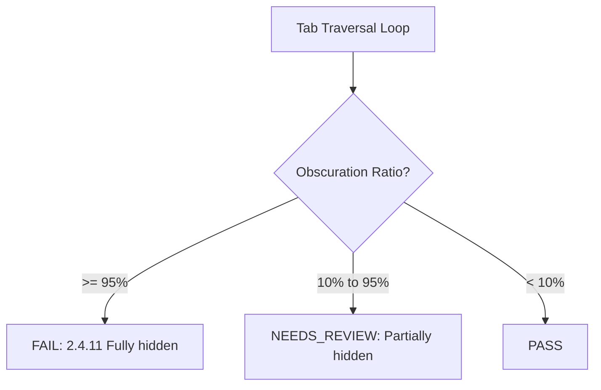
```mermaid
flowchart TD
    TAB["Tab Traversal Loop"] --> RATIO{"Obscuration Ratio?"}
    RATIO -- ">= 95%" --> FAIL["FAIL: 2.4.11 Fully hidden"]
    RATIO -- "10% to 95%" --> REV["NEEDS_REVIEW: Partially hidden"]
    RATIO -- "< 10%" --> PASS["PASS"]
```

#### Cases Covered
- Full/Partial overlap with fixed/sticky headers or banners.
- Identification of specific covering elements.

#### Cases Missed
- Obscuration by 100% transparent elements.

---

### 2.4.12 — Focus Not Obscured (Enhanced) (Level AAA)
**Check:** `focus_not_obscured_enhanced.py`

#### Flowchart
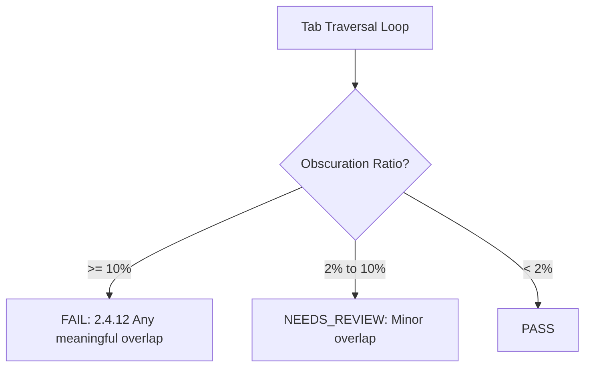
```mermaid
flowchart TD
    TAB["Tab Traversal Loop"] --> RATIO{"Obscuration Ratio?"}
    RATIO -- ">= 10%" --> FAIL["FAIL: 2.4.12 Any meaningful overlap"]
    RATIO -- "2% to 10%" --> REV["NEEDS_REVIEW: Minor overlap"]
    RATIO -- "< 2%" --> PASS["PASS"]
```

#### Cases Covered
- Stricter enhanced threshold for author-created overlays.
- Reuses the same keyboard traversal and covering-element identification as 2.4.11.

#### Cases Missed
- Sub-2% overlap can still matter for very small focused controls.

---

### 2.5.3 — Label in Name (Level A)
**Check:** `label_in_name_auditor.py`

#### Flowchart
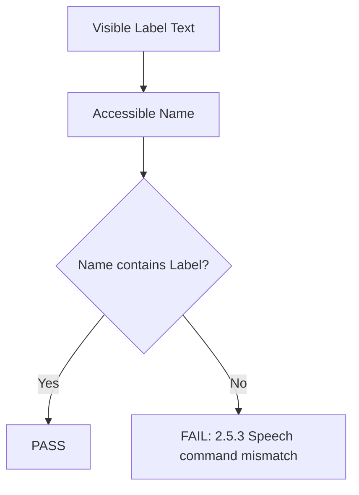
```mermaid
flowchart TD
    VIS["Visible Label Text"] --> ACC["Accessible Name"]
    ACC --> MATCH{"Name contains Label?"}
    MATCH -- Yes --> PASS["PASS"]
    MATCH -- No --> FAIL["FAIL: 2.5.3 Speech command mismatch"]
```

#### Cases Covered
- Case-insensitive word-boundary matching (`\b`).
- NFC Normalization + Casefolding.
- CJK substring exception.

#### Cases Missed
- Labels with embedded icons/images (if not in textContent).

---

### 2.5.8 — Target Size (Minimum) (Level AA)
**Check:** `target_size_auditor.py`

#### Flowchart
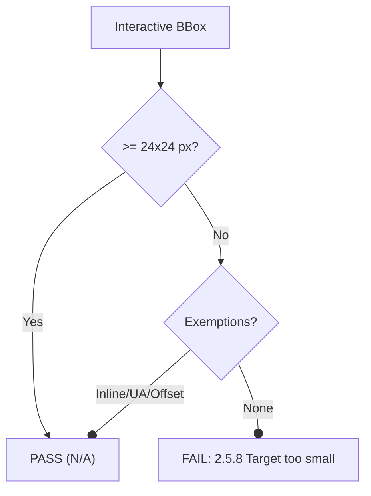
```mermaid
flowchart TD
    RECT["Interactive BBox"] --> SIZE{">= 24x24 px?"}
    SIZE -- Yes --> PASS["PASS"]
    SIZE -- No --> EX{"Exemptions?"}
    EX -- Inline/UA/Offset --o PASS["PASS (N/A)"]
    EX -- None --o FAIL["FAIL: 2.5.8 Target too small"]
```

#### Cases Covered
- 24x24 CSS pixel minimum.
- Inline, User-Agent, and Spacing (Offset) exceptions.

#### Cases Missed
- Equivalent interaction points.

---

### 3.3.1 — Error Identification (Level A)
**Check:** `form_auditor.py`

#### Flowchart
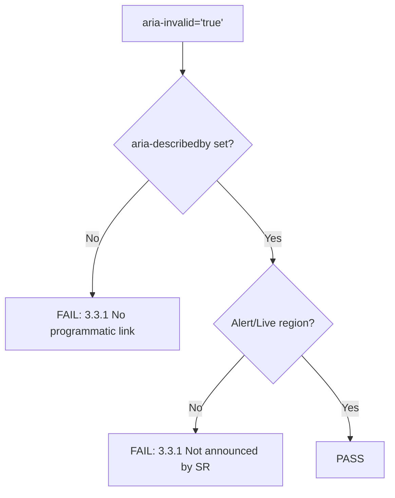
```mermaid
flowchart TD
    INV["aria-invalid='true'"] --> DESC{"aria-describedby set?"}
    DESC -- No --> FAIL1["FAIL: 3.3.1 No programmatic link"]
    DESC -- Yes --> LIV{"Alert/Live region?"}
    LIV -- No --> FAIL2["FAIL: 3.3.1 Not announced by SR"]
    LIV -- Yes --> PASS["PASS"]
```

#### Cases Covered
- `aria-describedby` linkage on required/invalid fields.
- `role="alert"` or `aria-live` presence.

#### Cases Missed
- Client-side validation errors not using ARIA attributes at load.

---

### 3.3.2 — Labels or Instructions (Level A)
**Check:** `form_auditor.py`

#### Flowchart
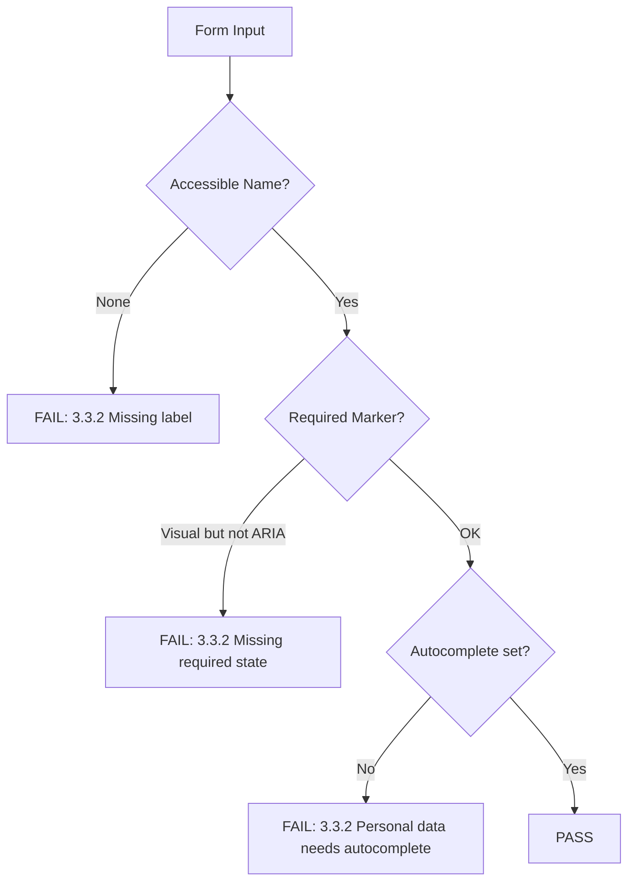
```mermaid
flowchart TD
    INP["Form Input"] --> NAME{"Accessible Name?"}
    NAME -- None --> FAIL1["FAIL: 3.3.2 Missing label"]
    NAME -- Yes --> REQ{"Required Marker?"}
    REQ -- "Visual but not ARIA" --> FAIL2["FAIL: 3.3.2 Missing required state"]
    REQ -- OK --> AUTO{"Autocomplete set?"}
    AUTO -- No --> FAIL3["FAIL: 3.3.2 Personal data needs autocomplete"]
    AUTO -- Yes --> PASS["PASS"]
```

#### Cases Covered
- Label association (`<label for>`, `aria-label`).
- "Required" visual-vs-programmatic check.
- Placeholder-only labels.
- `autocomplete` on personal data fields.

#### Cases Missed
- Detailed instructions for input (e.g. data formats).

---

### 4.1.2 — Name, Role, Value (Level A)
**Check:** `alttext.py` + `form_auditor.py`

#### Flowchart
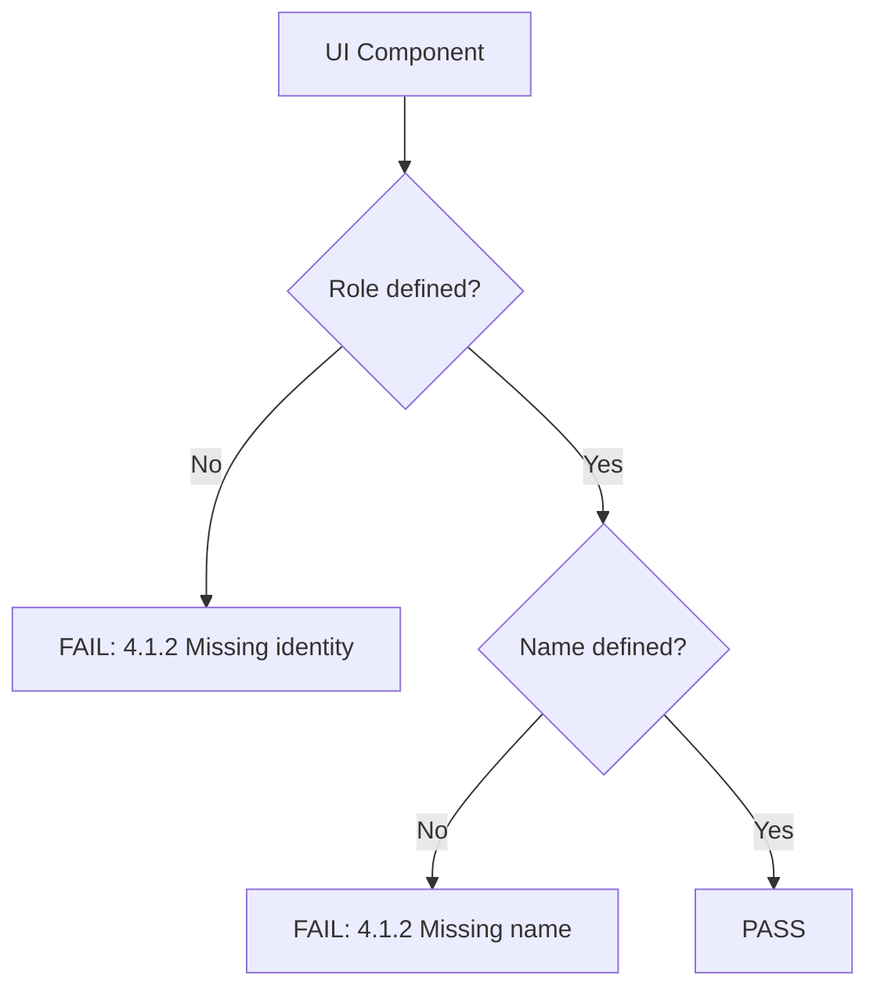
```mermaid
flowchart TD
    COMP["UI Component"] --> ROLE{"Role defined?"}
    ROLE -- No --> FAIL1["FAIL: 4.1.2 Missing identity"]
    ROLE -- Yes --> NAME{"Name defined?"}
    NAME -- No --> FAIL2["FAIL: 4.1.2 Missing name"]
    NAME -- Yes --> PASS["PASS"]
```

#### Cases Covered
- Functional image role verification.
- Accessible name computation algorithm adherence.

#### Cases Missed
- Dynamic value updates (for range/progress).

---

## Coverage Summary

| WCAG SC | Criterion | Check File | Pipeline Stage | Confidence |
|---------|-----------|------------|----------------|------------|
| 1.1.1 | Non-text Content | alttext.py | Multimodal | High |
| 1.3.4 | Orientation | orientation.py | Rendered | Medium |
| 1.4.3 | Contrast (Minimum) | contrast_analyser.py | Multimodal | High |
| 1.4.4 | Resize Text | resize_text.py | Rendered | High |
| 1.4.5 | Images of Text | alttext.py | CV (OCR) | Medium |
| 1.4.6 | Contrast (Enhanced) | contrast_analyser.py | Multimodal | High |
| 1.4.10 | Reflow | reflow.py | Rendered | High |
| 1.4.11 | Non-text Contrast | alttext.py | CV (Pixel) | High |
| 1.4.12 | Text Spacing | text_spacing.py | Rendered | High |
| 1.4.13 | Content on Hover/Focus | hover_focus_content.py | Rendered | Medium |
| 2.2.2 | Pause, Stop, Hide | pause_stop_hide_auditor.py | Hybrid | High |
| 2.4.11 | Focus Not Obscured (Minimum) | focus_not_obscured_minimum.py | Rendered | High |
| 2.4.12 | Focus Not Obscured (Enhanced) | focus_not_obscured_enhanced.py | Rendered | High |
| 2.5.3 | Label in Name | label_in_name_auditor.py | Static | High |
| 2.5.8 | Target Size | target_size_auditor.py | Static | High |
| 3.3.1 | Error Identification | form_auditor.py | Static | High |
| 3.3.2 | Labels or Instructions | form_auditor.py | Static | High |
| 4.1.2 | Name, Role, Value | alttext.py / form_auditor.py | Hybrid | High |
