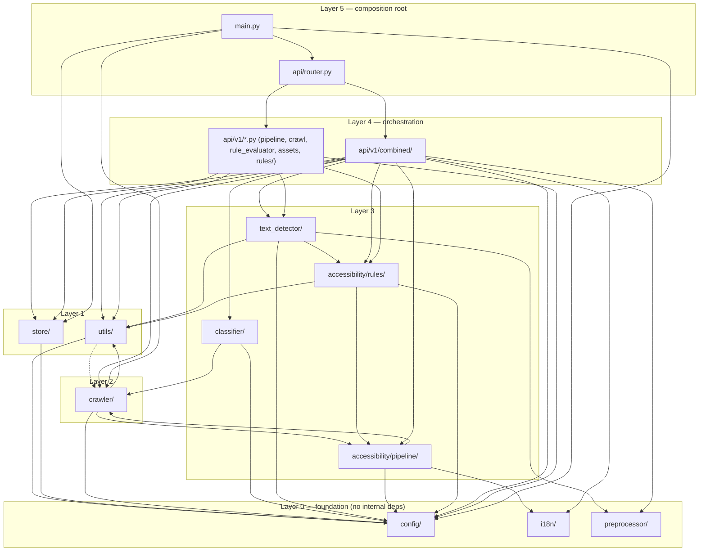

# 3. Architecture Map

## Directory-by-directory breakdown

All paths relative to `ka11y-python/ka11y/`.

| Directory | Responsibility |
|---|---|
| `config/` | Static configuration: the Rich-based structured logger (`logger.py`) and the tunables YAML (`config.yml`). No internal ka11y imports — the foundation layer. |
| `utils/` | Cross-cutting helpers with no single home: config loading, URL canonicalization, crawler timing/settings, per-stage timing instrumentation, step logging, report writers (CSV/PDF/email), Gmail sending, language detection, HTML→soup parsing. |
| `i18n/` | Loads and looks up localized rule metadata (name, description, help text per WCAG success criterion) from YAML locale files, with English fallback. |
| `preprocessor/` | Pure image-processing helpers (crop/pad/color extraction) used before OCR/classification. No internal ka11y imports — a leaf utility layer. |
| `crawler/` | Everything that drives Playwright/Chromium: browser pool, SSRF guard, navigation, cookie/consent handling, the "universal page" DOM/ARIA/style extraction (both a legacy path and an `optimized/` high-throughput path), crawl models, media/link crawling, snapshot normalization. |
| `classifier/` | CLIP-family image classifier: buckets each image as informative/decorative/functional/complex and generates AI alt-text suggestions. |
| `text_detector/` | OCR orchestration: EasyOCR (default) and PaddleOCR (CJK) engines behind a common base interface, plus the `text_detector.py` driver that crops images, runs OCR, and folds results into contrast/alt-text findings. |
| `accessibility/pipeline/` | A **generic, config-driven decision-policy engine**: extracts semantic evidence about a DOM element (context, relationships), routes it to a per-success-criterion "policy" class, and returns a pass/fail/needs-review decision plus human-readable evidence. Used for a subset of criteria (1.1.1, 1.3.1, 1.4.3, 1.4.5, 1.4.6, 1.4.11, 2.4.13, 2.4.7, 2.5.3, 2.5.8 — see `06-MODULES-rules.md` and `13-EXTENSIBILITY.md`). |
| `accessibility/rules/` | Bespoke rule auditors that don't fit the generic policy pipeline. As of this commit only two subpackages actually exist: `media/` (`media_auditor.py` + `quality_engine.py`, WCAG 1.2.x) and `non_text/` (`alttext.py` + `contrast_analyser.py`, WCAG 1.1.1 / 1.4.x). **A larger set of auditors this directory once held — `forms/form_auditor.py`, `input_modalities/target_size_auditor.py` + `label_in_name_auditor.py` + `text_spacing_auditor.py`, `timing/pause_stop_hide_auditor.py`, and a sibling `accessibility/rendered/` package (reflow, resize-text, orientation, focus-not-obscured, hover/focus-content) — was deliberately removed.** `api/v1/combined/constants.py:40-41` documents this explicitly ("weights for removed stages"). Their WCAG SC → flag routing entries in `api/v1/rules/run_router.py` and their request/response model fields in `api/v1/models/pipeline.py` remain as dead references — see `07-MODULES-api.md` and `13-EXTENSIBILITY.md`. |
| `store/` | Durable persistence: a single-writer SQLite (WAL mode) database (`db.py`, `repo.py`), a bounded process pool for CPU-heavy work (`cpu_pool.py`), a blocking-asset store (`assets.py`, documented under `api/v1/assets.py`'s consumer role), and a retention sweep (`retention.py`). |
| `api/` | The FastAPI surface. `router.py` is the top-level `APIRouter` aggregator. `api/v1/` holds versioned route modules; `api/v1/combined/` is the largest subpackage — the orchestrator that ties crawler + rule auditors + OCR + classifier + store into one "combined audit" job with SSE progress events. |
| (root) `main.py` | FastAPI app construction, middleware, lifespan (startup/shutdown) — the composition root. |

## Core components and how they relate

```
FastAPI app (main.py)
 └─ APIRouter (api/router.py)
     ├─ /api/v1/crawl        (api/v1/crawl.py)            → CrawlerService (crawler/)
     ├─ /api/v1/pipeline     (api/v1/pipeline.py)          → crawler/optimized/ + text_detector/ + accessibility/rules/non_text/ (NOT accessibility/pipeline/, despite the name)
     ├─ /api/v1/combined     (api/v1/combined/)            → orchestrates EVERYTHING (see below)
     ├─ /api/v1/assets       (api/v1/assets.py)            → store/assets.py
     ├─ /api/v1/rules        (api/v1/rules/*)              → i18n/ + config metadata
     └─ /api/v1/test         (api/v1/rule_evaluator.py)    → ad-hoc single-rule test harness
```

**Naming trap**: `/api/v1/pipeline` (route module `api/v1/pipeline.py`) does
**not** call the `accessibility/pipeline/` decision-policy package despite
the matching name — it's an independent, older image-crawl+OCR+audit
endpoint. See the correction box at the top of `05-MODULES-pipeline.md` and
`07-MODULES-api.md` (D) for the full trace of why `accessibility/pipeline/`
is not reachable from any live endpoint at all.

The `combined` subpackage is the real "core engine": `runner.py` drives a
stage pipeline (`stages.py`) that in sequence (1) crawls the page via
`crawler/optimized/` and, when a multi-page or media audit is requested,
`crawler/universal_page.py`, (2) hands crawled images to `text_detector/`
(OCR) and runs the rule auditors in `accessibility/rules/` (image + media —
`accessibility/pipeline/` is **not** part of this live path, see above),
(3) merges Python findings with the Node/axe-core service's findings via
`findings.py` + `runner._merge_findings` into a single report shape
(`report.py`), (4) persists it through `store/repo.py`, and (5) streams
progress as Server-Sent Events via `stage_events.py`. `dispatcher.py` is the
durable job queue that lets this run as a background task decoupled from the
initiating HTTP request. Whether `classifier/` (image-type + alt-text
suggestion) is actually invoked in this live path is checked in
`09-MODULES-text-classifier-i18n.md`.

## Module dependency graph (layered)

Derived from `grep -rhoE "^from ka11y\." ka11y/<dir>` across the tree
(commit `b734e3b`). An arrow `A → B` means "package A imports from package
B" (A depends on B).



Two intentional "layering violations" are worth calling out explicitly
(marked with a dotted edge above):

- **`utils/lang_detector.py` imports `crawler/_ssrf_guard.py`**
  (`_host_is_blocked`) — language-detection needs to fetch a small sample of
  a URL to sniff its `lang`, so it reuses the crawler's private-IP blocklist
  rather than duplicating it. This is the one place `utils` reaches "up" into
  `crawler`.
- **`crawler/universal_page.py` imports two extractors from
  `accessibility/pipeline/extractors/`** (`element_context_extractor.py`,
  `semantic_relationship_engine.py`) — the crawler's page-snapshot builder
  calls directly into the policy pipeline's evidence extractors so that
  semantic context (landmark role, heading level, form association, etc.) is
  computed once, at snapshot time, rather than being recomputed per rule.

## Why each group belongs where it does (preview of section 4's grouping)

Section 4 groups files by what they do, not alphabetically:

1. **Config & Utilities** (`config/`, `utils/`) — shared plumbing every other
   layer depends on; documented first because everything else assumes it.
2. **Crawler** (`crawler/`) — the data-acquisition layer; everything
   downstream operates on data this layer produces.
3. **Rendered-state Pipeline** (`accessibility/pipeline/`) — the generic
   decision-policy engine; grouped separately from `rules/` because it's a
   *framework* (extractors → router → policies → engine) rather than a
   collection of independent auditors.
4. **Rule Auditors** (`accessibility/rules/`) — the bespoke, per-criterion
   audit logic (media, non-text content) that doesn't fit the generic
   pipeline framework. (A broader set of rendered-state/input-modality/timing
   auditors that once lived alongside these was removed — see the note above
   and `13-EXTENSIBILITY.md`.)
5. **API Layer** (`api/`) — HTTP surface + the `combined` orchestrator that
   is the de facto "core engine" tying every other layer together.
6. **Store** (`store/`) — persistence, separated from `api/` because it has
   no HTTP awareness and is reused by background tasks (dispatcher,
   retention) that aren't triggered by a request at all.
7. **Text/Classifier/Preprocessor/i18n** — the AI/OCR subsystem
   (`text_detector/`, `classifier/`, `preprocessor/`) plus localization
   (`i18n/`), grouped together as "content understanding" support modules
   consumed by both `combined/` and the rule auditors.
