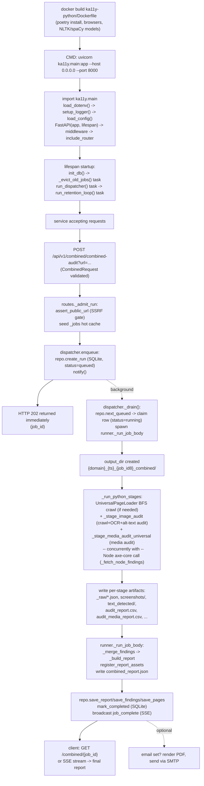

# 9. Output / Termination & 10. Summary Diagrams

## 9. Output / Termination

### How results are generated, formatted, returned

There is no process "exit" in the CLI sense — `ka11y-python` is a
long-running ASGI service (`10-EXECUTION-FLOW.md` Step 0); "termination"
here means **how one audit job concludes**, not how the process ends.

- **Success**: `runner._run_job_body` builds the report dict
  (`report._build_report`), writes it to disk
  (`<output_dir>/combined_report.json`), persists it to SQLite
  (`repo.save_report` — zlib-compressed BLOB; `repo.save_findings` —
  denormalized rows; `repo.save_pages`), marks the run `status="completed"`
  in both the in-memory hot cache and the durable `runs` table, and
  broadcasts a `job_complete` SSE event. The HTTP surface never "returns" a
  result synchronously for this path — the original `POST` already
  responded `202` at submission time; the result is retrieved by a
  **separate** `GET /api/v1/combined/{job_id}` (200, full `JobStatusResponse`
  with `result` populated) or observed as the terminal SSE event on
  `GET /api/v1/combined/{job_id}/stream`.
- **Failure**: the `except Exception` block in `_run_job_body` marks the
  run `status="failed"` with a generic client-facing message + opaque
  `error_id` (full detail logged server-side only), broadcasts
  `job_failed`. No Python exception ever propagates out to an HTTP
  response for a background job — by the time anything could observe an
  exception, it's already been caught, logged, and turned into a `failed`
  row.
- **Synchronous endpoints** (`/crawl`, `/pipeline`) return their result (or
  a `500` with an `error_id`, same masking pattern) directly in the
  original HTTP response — no polling model, no exit code semantics beyond
  the HTTP status.
- **Cancellation**: `POST /{job_id}/cancel` marks the run `cancelled` in
  the DB; the only place `_run_job_body` itself checks for this is once, at
  the very start, before any stage launches — a job already past that
  point runs to completion regardless (a discrepancy from that route's own
  docstring claim, flagged in `07-MODULES-api.md` (D)).
- **Formats produced per run**: JSON (`combined_report.json`, the
  canonical machine-readable result; `text_detection_report.json`,
  `universal_snapshot_*.json`, `images_report.json`), CSV
  (`audit_report.csv`, `audit_media_report.csv`, `contrast_report.csv`,
  `images_with_alt_text.csv`), Markdown (`contrast_report.md`), and, only
  when an audit request includes `email`, an on-the-fly rendered **PDF**
  (`utils/report_pdf.build_report_pdf`) attached to an SMTP email alongside
  a CSV built by `utils/report_csv.build_findings_csv` — the PDF/email CSV
  are never written to disk, only held in memory and streamed into the
  outgoing message.
- **"Exit codes"**: not applicable to the service process. The closest
  equivalent — a job's terminal `status` field — is one of `completed`,
  `failed`, `cancelled` (`store/migrations/0001_init.sql`'s `runs.status`
  check-in-comment: `queued|running|completed|failed|cancelled`).

### Last filesystem-touching call before an audit job concludes

For the success path, in order: `runner.py:507-511` writes
`combined_report.json` → `store.assets.register_report_assets` (called
*before* that write, at `runner.py:478-479`, so asset registration itself
isn't last) → **after** the JSON write, `repo.save_report`/`save_findings`/
`save_pages`/`mark_completed` are SQLite writes (via the single-writer
thread, `store/db.py`), not raw filesystem writes in the same sense, but
they are the last **persistence** operations — `repo.mark_completed`
(`runner.py:534-540`) is the final durable-store call before the job is
considered done. If `payload.email` is set, `utils.report_pdf.build_report_pdf`
(a Chromium PDF render — no file write, returns bytes) and
`utils.report_mail.send_report_email` (an SMTP send — no file write) run
**after** that, as the very last actions of the whole function body, but
neither touches the filesystem; the true last filesystem write specific to
this job is `combined_report.json`, and the true last **persistence**
operation is the `repo.mark_completed` SQLite update. `emit_stage_timing_summary(job_id)`
(§ `03-MODULES-config-utils.md` `stage_timing.emit_summary`) does write one
more file (`logs/timings/<run_id>.summary.log`) even later in the function
— that is, strictly, the actual **last** filesystem write of a successful
run, since it's called at `runner.py:573`, after every report/DB
persistence step and (for a non-email run) after everything else.

## 10. Summary Diagrams

### 10.1 pip install → CLI invocation → core execution → output creation → final output

(Corrected per `01-OVERVIEW-AND-ENTRYPOINT.md`: there is no `pip install`
or CLI invocation for this project — the diagram below reflects what
actually happens, Docker/uvicorn start through to a finished audit.)

### 10.2 Module dependency graph (imports; who calls whom)

A finer-grained version of `02-ARCHITECTURE.md`'s layer diagram, this time
naming the actual files within each package that carry the cross-package
edges, and marking the two now-established dead edges with a dashed arrow.

```mermaid
flowchart TD
    subgraph L0["Foundation"]
        config_logger["config/logger.py"]
        config_yml["config/config.yml, universal.yml"]
        i18n_loader["i18n/loader.py"]
        preprocessor["preprocessor/extract_color.py,\ntext_helper_models.py"]
    end

    subgraph L1["Utils / Store"]
        config_loader["utils/config_loader.py"]
        crawler_settings["utils/crawler_settings.py"]
        url_canonical["utils/url_canonical.py"]
        report_writers["utils/report_csv.py, report_pdf.py,\nreport_mail.py, gmail_sender.py"]
        telemetry["utils/*_timing.py, step_logger.py"]
        lang_detector["utils/lang_detector.py"]
        db["store/db.py"]
        repo["store/repo.py"]
        assets["store/assets.py"]
        cpu_pool["store/cpu_pool.py"]
        retention["store/retention.py"]
    end

    subgraph L2["Crawler"]
        ssrf_guard["crawler/_ssrf_guard.py"]
        browser_pool["crawler/browser_pool.py,\ncontext_factory.py"]
        navigation["crawler/navigation.py, policy.py"]
        cookie_handler["crawler/cookie_handler.py"]
        engine["crawler/optimized/engine.py,\nadapter.py, optimized_crawler.py"]
        universal_page["crawler/universal_page.py"]
        snapshot_normalizer["crawler/snapshot_normalizer.py"]
        crawler_models["crawler/models.py, media_crawler.py"]
    end

    subgraph L3["Content understanding + orphaned engines"]
        text_detector["text_detector/*"]
        classifier_orphan["classifier/classifier.py  (ORPHANED)"]
        pipeline_orphan["accessibility/pipeline/*  (ORPHANED from live flow)"]
        rules["accessibility/rules/non_text/*,\nmedia/*"]
    end

    subgraph L4["API / Orchestration"]
        combined_stages["api/v1/combined/stages.py"]
        combined_runner["api/v1/combined/runner.py"]
        combined_findings["api/v1/combined/findings.py"]
        combined_report["api/v1/combined/report.py"]
        combined_routes["api/v1/combined/routes.py"]
        combined_dispatcher["api/v1/combined/dispatcher.py"]
        combined_store["api/v1/combined/store.py"]
        apiv1_other["api/v1/crawl.py, pipeline.py,\nrule_evaluator.py, rules/*"]
    end

    subgraph L5["Composition root"]
        router["api/router.py"]
        mainpy["main.py"]
    end

    config_loader --> config_yml
    crawler_settings --> config_loader
    lang_detector -.-> ssrf_guard
    repo --> db
    assets --> db
    retention --> repo
    retention --> assets

    browser_pool --> ssrf_guard
    universal_page --> browser_pool
    universal_page --> navigation
    universal_page --> cookie_handler
    universal_page --> url_canonical
    universal_page -.-> pipeline_orphan
    engine --> crawler_models
    snapshot_normalizer --> universal_page
    snapshot_normalizer --> crawler_models

    text_detector --> preprocessor
    text_detector --> rules
    rules --> config_loader
    classifier_orphan --> crawler_models

    combined_stages --> engine
    combined_stages --> universal_page
    combined_stages --> snapshot_normalizer
    combined_stages --> text_detector
    combined_stages --> rules
    combined_stages --> combined_findings
    combined_stages -.dead call.-> pipeline_orphan
    combined_findings --> i18n_loader
    combined_findings --> url_canonical
    combined_report --> i18n_loader
    combined_runner --> combined_stages
    combined_runner --> combined_report
    combined_runner --> cpu_pool
    combined_runner --> assets
    combined_runner --> report_writers
    combined_routes --> combined_dispatcher
    combined_routes --> combined_store
    combined_routes --> repo
    combined_dispatcher --> repo
    combined_dispatcher --> combined_runner
    combined_store --> telemetry

    apiv1_other --> combined_stages
    apiv1_other --> text_detector
    apiv1_other --> rules

    router --> combined_routes
    router --> apiv1_other
    mainpy --> router
    mainpy --> db
    mainpy --> browser_pool
    mainpy --> combined_dispatcher
    mainpy --> retention
```

Dashed edges: `lang_detector -.-> ssrf_guard` (the one documented
`utils`→`crawler` layering exception, `02-ARCHITECTURE.md`),
`universal_page -.-> pipeline_orphan` (the crawler still calls the
pipeline's *extractors* to populate `PageSnapshot.pipeline_pages`, even
though nothing downstream consumes that field for a decision), and
`combined_stages -.dead call.-> pipeline_orphan` (the wrapper function
exists and imports the real one, but is never invoked — the one edge in
this whole graph that is defined in code but never actually traversed at
runtime).
