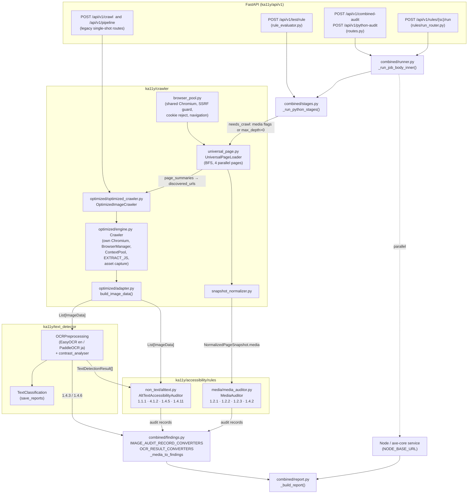
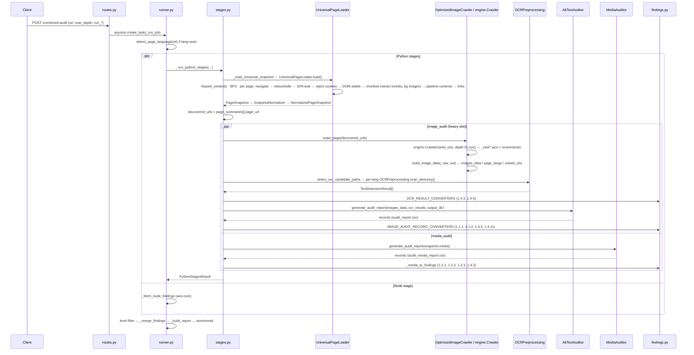

# ka11y-python — Crawlers and How the Python Rules Consume Them

Scope: `ka11y-python/ka11y/crawler/` and every module that turns crawler output
into WCAG findings. All line numbers refer to the working tree on the
`production` branch as of 2026-09-15. For a per-function walkthrough of the
crawler package see `CODEBASE_WALKTHROUGH/04-MODULES-crawler.md`; this document
is the end-to-end *data pathway* view instead.

---

## 1. Crawler inventory

There are exactly **two active crawlers**. Everything else in the package is
shared infrastructure they both lean on.

| # | Crawler | Entry point | Browser ownership | What it produces | Who consumes it |
|---|---------|-------------|-------------------|------------------|-----------------|
| 1 | **Universal page loader** | `ka11y/crawler/universal_page.py:603` `UniversalPageLoader.load()` | Leases one `BrowserContext` from the shared `browser_pool` | `PageSnapshot` (media elements, background images, pipeline contexts, page summaries, warnings, links) | `SnapshotNormalizer` → `MediaAuditor` (1.2.1 / 1.2.2 / 1.2.3 / 1.4.2); also provides the *page list* to crawler #2 |
| 2 | **Optimized image crawler** | `ka11y/crawler/optimized/optimized_crawler.py:60` `OptimizedImageCrawler.crawl_page()` wrapping `ka11y/crawler/optimized/engine.py:1914` `Crawler` | Launches its **own** Chromium via `async_playwright()` (not the pool) with `BrowserManager` + `ContextPool` | One raw JSON per page under `<out>/_raw/` plus screenshots / downloaded assets; the adapter converts these to `List[ImageData]` | OCR (`text_detector`) → `AltTextAccessibilityAuditor` (1.1.1 / 4.1.2 / 1.4.5 / 1.4.11) and OCR converters (1.4.3 / 1.4.6) |

Shared infrastructure inside `ka11y/crawler/`:

| Module | Lines | Role |
|--------|-------|------|
| `browser_pool.py` | 198 | Process-wide Chromium pool (`KA11Y_MAX_BROWSERS`, default 2). `leased_context()` yields a fresh context off one warm browser. Shut down in FastAPI lifespan (`ka11y/main.py:127`). Used by crawler #1, `pipeline_stage.py`, and the PDF renderer. |
| `context_factory.py` | 24 | `new_crawler_context()` sets `ignore_https_errors` from config and installs the SSRF guard on every pooled context. |
| `_ssrf_guard.py` | 210 | Playwright route handler that aborts any request resolving to a private / reserved IP (encoded-IP forms, DNS rebinding with 30 s TTL). Crawler #2 ships its own copy of this logic inside `engine.py:774-860`. |
| `navigation.py` | 169 | `navigate_with_resilience()`: DNS preflight (3 tries) + `page.goto` (3 tries, backoff 1 / 2.5 / 5 s), raises typed `NavigationError`. Used only by crawler #1. |
| `cookie_handler.py` | 227 | `handle_cookies()`: **reject-only** consent handling across main frame + iframes, then strips overlay DOM. Used by crawler #1. Crawler #2 has its own port (`engine.py:508` `reject_cookies`). |
| `policy.py` | 125 | `CrawlPolicy`: max depth / pages / links-per-page, same-origin filter, URL normalisation (drops fragments, trailing slash, tracker query params, userinfo). Used by crawler #1 and by `report.py` for URL dedup. |
| `models.py` | 304 | `ImageData` (the record the image rules consume), `ImageMetadata` (legacy rich record with `compute_violations()`, not on the active path), `WcagViolation`. |
| `media_crawler.py` | 77 | `MediaElementData` Pydantic shape only. Extraction lives in the universal JS loader. |
| `snapshot_normalizer.py` | 131 | Validates `PageSnapshot.media` dicts into `MediaElementData`, writes `universal_snapshot_normalized.json`, records per-record validation warnings. |
| `optimized/adapter.py` | 307 | `build_image_data()`: raw per-page JSON → `List[ImageData]`, copies pixels into `<out>/<classification>/<sub_type>/` with a unique basename (the OCR join key). |

> The `browser_pool.py` docstring lists ten historical crawlers (sensory,
> forms, target-size, text-spacing, rendered-layout, interactive,
> moving-content …). None of those exist in this tree any more; the
> combined runner only wires the two above. Treat that docstring as history.

---

## 2. Architecture diagram

### 2.1 Component view



### 2.2 Job sequence (combined audit, `max_depth > 0` or media enabled)



---

## 3. Pathway A — Universal snapshot → media rules

**Trigger** — `stages.py:780` `_run_python_stages()` computes
`needs_crawl = run_media_audit or run_captions_audit or max_depth > 0`. Only
then does it call `_load_universal_snapshot()` (`stages.py:652`).

**Step-by-step**

1. `_load_universal_snapshot` builds a `CrawlPolicy(max_depth, max_pages,
   max_links_per_page=max(50, max_pages), same_origin=internal_links)` and
   calls `UniversalPageLoader.load()` inside `time_crawler(output_dir,
   "universal_snapshot", url)`.
2. `UniversalPageLoader.load()` (`universal_page.py:611`) leases a context from
   the pool (viewport 1440×900, desktop Chrome UA, optional HAR recording) and
   runs a **parallel BFS**: up to `KA11Y_UNIVERSAL_PARALLEL_PAGES` (default 4)
   `_crawl_one_url` tasks against the same context. Launches are gated by
   `pages_crawled + inflight < policy.max_pages`; `visited` is updated before
   launch so no URL is crawled twice.
3. Per page, `_crawl_one_url_inner` (`universal_page.py:807`):
   - `_prepare_page` (`:946`) → `navigate_with_resilience` → wait
     `networkidle` (15 s cap) → `_wait_for_spa` → `handle_cookies` (reject
     only) → `_DOM_STABILITY_JS`.
   - Resolves the final URL through `canonicalize_url(page.url)` so findings
     are stamped with the redirected identity.
   - `_extract_page_chunked` (`:985`): fires lazy-load events, then up to 4
     scroll passes; each pass runs `_extract_page` (`:1104`), which walks the
     main frame plus same-origin child frames and evaluates
     `_COMBINED_EXTRACT_JS` (media records, shadow-DOM aware) and
     `_BACKGROUND_IMAGES_JS`. Records are de-duplicated by
     `element_ref_id` (`_annotate_records`, capped at 5 000 refs).
   - `_extract_pipeline_contexts` (`:1045`) runs `ElementContextExtractor` +
     `SemanticRelationshipEngine` on the same live page and appends to
     `snapshot.pipeline_pages` (see §7 — nothing consumes this today).
   - `_extract_links` (`:1241`) evaluates `_LINK_EXTRACT_JS`, normalises via
     the policy, drops off-origin hrefs, caps at `max_links_per_page`.
   - Appends a `page_summaries` row `{page_url, depth, media, links_found}` and
     increments `pages_crawled`. `NavigationError` becomes a warning, not a
     failure; any other exception marks `snapshot.partial = True`.
4. Back in `_load_universal_snapshot`: `save_snapshot()` writes
   `universal_snapshot.json`; `SnapshotNormalizer.normalize()` validates each
   media dict into `MediaElementData` and writes
   `universal_snapshot_normalized.json`; warnings are summarised into
   `_jobs[job_id]["warnings"]`. Zero pages crawled raises and aborts the
   Python stages.
5. `_run_python_stages` then derives `discovered_urls` from
   `snapshot.page_summaries` (this list is what feeds crawler #2) and records
   `crawled_pages` (success + failed) for the report.
6. `_stage_media_audit_universal` (`stages.py:732`) awaits the snapshot future
   and calls `MediaAuditor.generate_audit_report([m.model_dump() for m in
   snapshot.media], run_1_2_1, run_1_2_2)` in a thread.
7. `MediaAuditor._audit_single` (`media_auditor.py:604`) runs the 5-gate tree
   per `<audio>/<video>` using exactly these crawler fields: `src`, `tag`,
   `tracks`, `has_autoplay`, `has_controls`, `is_muted`, `aria_label`,
   `aria_describedby_text`, `role`, `nearby_links`, `nearby_text`,
   `nearby_details`, `html_snippet`, `selector`, `element_ref_id`,
   `frame_path`. It fetches `.vtt` tracks over HTTP for the quality engine.
8. `_media_to_findings` (`findings.py:1195`) converts each record into
   finding dicts for 1.2.1 / 1.2.2 / 1.2.3 / 1.4.2.

**What the universal JS extracts per media element** (`universal_page.py:365`):
tag, id, resolved `src` (currentSrc → src → `<source>`), outer HTML (500
chars), autoplay/controls/loop/muted, `<track>` list (kind/src/srclang/label),
aria-hidden/role/aria-label/aria-describedby text, nearby links (3 ancestor
levels), nearby text (parent, 500 chars), nearby `<details>` blocks.

---

## 4. Pathway B — Optimized image crawler → OCR → image rules

**Trigger** — `_stage_image_audit` (`stages.py:359`) runs whenever `run_ocr`
or `run_image_audit` is set. It always runs, even at `max_depth = 0`, and is
wrapped in `_heavy()` so at most `KA11Y_HEAVY_STAGE_CONCURRENCY` (default 2)
browser-heavy stages run process-wide.

**Step-by-step**

1. `OptimizedImageCrawler(base_url, max_depth, max_pages, internal_links,
   job_id)` is built. Its `output_dir` is `<config.input.output_dir>/<domain>_<MMDD_HHMM>` and the
   sub-directories from `config.directories` are pre-created.
2. `crawl_page(discovered_urls)` (`optimized_crawler.py:96`):
   - If `discovered_urls` is given (always the case after a universal crawl),
     the engine is started with `seed_urls=discovered_urls, max_depth=0,
     max_pages=max(max_pages, len(seeds))` → it crawls *exactly* the pages the
     universal loader found and follows no links.
   - Otherwise (single-page run) it uses `max_depth` from the request.
   - Concurrency and politeness delay come from `config.crawler.concurrency`
     (default 4) and `config.crawler.delay` (default 1.0 s).
3. `engine.Crawler.run()` (`engine.py:2713`) opens its **own** Playwright and
   one `BrowserManager` (`:955`) → one Chromium with stealth args / UA / init
   script and a `ContextPool` (`:861`) of `concurrency` contexts, each with a
   route handler that aborts SSRF targets and `media` resource types. Contexts
   recycle every 40 pages; the manager monitors memory / lifetime and restarts
   the browser on crash (`BrowserDown` → requeue up to 3 times).
4. Each `_worker` (`:2667`) pulls `(url, depth)` from the frontier, respects
   `max_pages`, and calls `_process_page_inner` (`:2622`): robots.txt check →
   per-host politeness → up to 2 retries of `_attempt_page`.
5. `_attempt_page` (`:2524`): `goto` (domcontentloaded, 30 s) → 4xx / non-HTML
   short-circuit → `networkidle` (10 s cap) → `reject_cookies` → `SCROLL_JS` →
   `_reveal_hidden_images` (carousel probing) → IntersectionObserver lazy-load
   nudge → **`page.evaluate(EXTRACT_JS)`** (`:1101`).
6. `EXTRACT_JS` does a single `document.querySelectorAll("*")` walk
   (`:1578`) and emits one record per element of interest with a
   `criteria` list. Image-type records (`img`, `svg_via_img`, `svg_inline`,
   `svg_via_use`, `svg_via_object`, `css_background_image`,
   `css_background_svg`, `input_image`, `canvas`, `area`, `video_poster`)
   carry name fields (`alt_present`, `alt_value`, `aria_label`,
   `aria_labelledby_resolved_text`, `title_attr`, `role`, `figcaption_text`,
   `accessibility_snapshot_name`), `image_of_text` signals, and the output
   of `classifyBlock` (`:1524`) — the in-browser decision tree that assigns
   `classification` ∈ {decorative, functional, complex, informative} and
   `sub_type` ∈ {images, buttons, logos, charts, icons} plus `flags`,
   `functional_context` (in_link / in_button / is_in_labeled_control …),
   `decorative_signals`, `complex_signals`. Text-bearing elements get
   colour / font facts tagged 1.4.3 + 1.4.6; native or ARIA controls get
   4.1.2 and (unless presentational) 1.4.11 border / outline / shadow facts.
   Elements inside OneTrust consent DOM are dropped entirely.
7. `_capture_assets` (`:2245`) captures pixels per image record: icons / logos
   are always screenshotted in place (plus a padded *context* screenshot and
   `context_bbox` for 1.4.11); text-overlay containers are screenshotted;
   plain images are downloaded (10 concurrent); inline SVG / `<use>` /
   canvas / failed downloads fall back to an element screenshot; carousel
   members go through `_capture_carousel_slides` (advance + dedup, max 20).
8. The page doc `{page_url, normalized_url, depth, http_status,
   processing_status, elements[], criteria{sc: {applicable, element_ids}},
   links_discovered}` is written atomically to `<out>/_raw/<slug>.json`.
   `crawl_state.jsonl` makes the run resumable.
9. `build_image_data(raw, out)` (`adapter.py:142`) reads every successful page
   JSON and, for each image-type element with a classification, produces an
   `ImageData`:
   - copies the captured file to `<out>/<classification>/<sub_type>/<prefix><md5(src)[:12]>.<ext>`
     where prefix is `svg_` / `btn_` / `img_`; identical bytes share a name,
     different pixels with the same src get a per-element suffix
     (`_unique_basename`). **This basename is the join key between OCR
     results and images.**
   - copies the context screenshot to `ctx_<digest>.png` and rounds
     `context_bbox` into `page_bbox`.
   - maps `accessibility_snapshot_name` / `alt_value` → `alt_text` (None ⇒ no
     accessible name at all), flags → `is_*`, `functional_context` →
     `in_link` / `in_button` / `in_labeled_control`, `complex_signals` →
     `figcaption_text` / `aria_describedby_text` / `has_longdesc` /
     `in_figure`, and sets `capture_status` (`ok` / `dom_missing` / `failed`;
     `area` elements are `ok` with no pixels).
   - returns `(images_data, page_langs, visited_urls)`; zero visited pages
     raises `ImageCrawlerNavigationError("zero_pages_crawled")`.
10. `save_results()` writes `metadata/images_data.json`, `images_report.json`
    and `images_with_alt_text.csv`.
11. **OCR** (only when `run_ocr`): `select_ocr_candidate_paths()`
    (`utils/crawler_settings.py:158`) ranks screenshots, de-duplicates repeated
    decorative / logo assets, and applies the budget
    (`max_ocr_images_per_run` = 60 single-page; `per_page × pages` capped by
    `max_ocr_images_ceiling` = 3000 multi-page, distributed fair per page).
    Paths are grouped by `_ocr_lang_for_page(page_langs[url], run_lang)` — the
    `<html lang>` the engine recorded — so Japanese pages go to PaddleOCR and
    everything else to EasyOCR. Each group runs
    `OCRPreprocessing(source_directory=output_dir, lang, include_paths).scan_directory()`
    in a thread. `_determine_category` keys off the *path* ("button" / "logo"
    / "informative"), which is why the adapter lays files out by
    classification. Results carry text boxes and contrast violations from
    `contrast_analyser`. `TextClassification.save_reports()` writes the
    `text_detected/` tree and contrast CSV / JSON / Markdown.
12. `_build_contrast_report` and `OCR_RESULT_CONVERTERS` (`findings.py:1371`)
    turn OCR results into 1.4.3 / 1.4.6 findings, keyed back to page and src
    through `page_by_filename` / `src_by_filename`.
    `_contrast_capture_failed_to_findings` emits INCOMPLETE findings for
    images whose capture failed.
13. **Alt-text audit** (only when `run_image_audit`):
    `AltTextAccessibilityAuditor.generate_audit_report(images_data,
    ocr_results, output_dir)` (`alttext.py:968`) iterates `ImageData`, looks up
    OCR by `Path(filename).name` (`_build_ocr_index`), and runs
    `_check_1_1_1_*` (decorative / missing alt / informative / logo / icon /
    button, with `_context_exemption` using `element_type`, `alt_present`,
    `in_labeled_control`, `has_own_text_content`, `has_long_description()`),
    `_check_4_1_2`, `_check_1_4_5`, and `_check_1_4_11` (which uses
    `full_page_screenshot_path` + `page_bbox` for real boundary contrast, else
    an OCR proxy). Writes `audit_report.csv`.
14. `IMAGE_AUDIT_RECORD_CONVERTERS` (`findings.py:1362`) map the record's
    `wcag_1_1_1_status`, `wcag_4_1_2_status`, `wcag_1_4_5_status`,
    `wcag_1_4_11_status` columns into findings.

**Budgets** — the crawl is bounded by
`max(300 s, min(20 s × pages, 600 s))` (`_CRAWL_TIMEOUT_SECONDS`,
`KA11Y_IMAGE_CRAWL_PER_PAGE_SECONDS`, `KA11Y_IMAGE_CRAWL_TIMEOUT_CEILING`);
on timeout the stage continues with the partial image set and records a
warning. The whole stage is capped at 1200 s.

---

## 5. Rule → crawler → field map

| WCAG SC | Auditor / converter | Crawler | Crawler-supplied inputs |
|---------|---------------------|---------|--------------------------|
| 1.1.1 Non-text Content | `alttext._check_1_1_1_*` → `_alt_text_to_findings` | #2 image | `alt_text`, `alt_present`, `classification`, `sub_type`, `is_*`, `aria_hidden`, `role`, `element_type`, `in_link`, `in_button`, `in_labeled_control`, `has_own_text_content`, `figcaption_text`, `aria_describedby_text`, `has_longdesc`, `in_figure`, `capture_status`, OCR text by `filename` |
| 4.1.2 Name, Role, Value (images) | `alttext._check_4_1_2` → `_name_role_value_to_findings` | #2 image | functional images only: `alt_text`, `title`, `is_logo` / `is_icon` / `is_button` |
| 1.4.5 Images of Text | `alttext._check_1_4_5` → `_images_of_text_to_findings` | #2 image + OCR | `is_text_image` (from `image_of_text.possible_image_of_text`), OCR detections, `is_logo` |
| 1.4.11 Non-text Contrast | `alttext._check_1_4_11` → `_non_text_contrast_to_findings` | #2 image | icons / buttons: `screenshot_path`, `full_page_screenshot_path` (`ctx_*.png`), `page_bbox`; OCR proxy fallback |
| 1.4.3 Contrast (Minimum) | `text_detector` + `contrast_analyser` → `_contrast_to_findings` | #2 image (screenshots) | screenshot pixels, `page_langs` (OCR engine choice), `filename` join key |
| 1.4.6 Contrast (Enhanced) | same OCR results → `_contrast_enhanced_to_findings` | #2 image | same as 1.4.3 with AAA thresholds |
| 1.2.1 Audio-only / Video-only | `MediaAuditor` gates 1–5 → `_media_to_findings` | #1 universal | `MediaElementData`: `src`, `tag`, `tracks`, `nearby_links`, `nearby_text`, `nearby_details`, `aria_*`, `role` |
| 1.2.2 Captions (Prerecorded) | `MediaAuditor._gate_4_check_captions` | #1 universal | `tracks[kind=captions/subtitles]`, VTT fetched over HTTP |
| 1.2.3 Audio Description | `MediaAuditor._check_1_2_3_audio_description` | #1 universal | `tracks[kind=descriptions]`, nearby text |
| 1.4.2 Audio Control | `MediaAuditor._check_1_4_2_audio_control` | #1 universal | `has_autoplay`, `has_controls`, `is_muted` |

Flags that switch each stage on (`combined/models.py`
`_SC_STAGE_PREREQUISITES` and `rules/run_router.py` `RULE_FLAGS`):
`run_image_audit` → 1.1.1 / 1.4.5 / 1.4.11 / 4.1.2; `run_ocr` → 1.4.3 /
1.4.6; `run_media_audit` → 1.2.1; `run_captions_audit` → 1.2.2.

---

## 6. Entry points that reach the crawlers

| Route | Module | Path into crawlers |
|-------|--------|--------------------|
| `POST /api/v1/combined-audit`, `POST /api/v1/python-audit` | `combined/routes.py:215,231` | `_run_job` → `_run_python_stages` (both crawlers as needed) in parallel with the Node axe-core call |
| `POST /api/v1/rules/{sc}/run`, `/analyse-url` | `rules/run_router.py` | Builds a `CombinedRequest` with only that rule's flag on, then the same `_run_job` with `filter_rule` |
| `POST /api/v1/test/rule` | `rule_evaluator.py` | Calls `_load_universal_snapshot` (cached per URL in `_SNAPSHOT_CACHE`) for 1.2.x, or `_stage_image_audit` directly for the image rules; temp output dir |
| `POST /api/v1/crawl/`, `POST /api/v1/pipeline/` | `crawl.py`, `pipeline.py` | Legacy single-shot routes: `get_image_crawler()` (`dependencies.py:82`) → `crawl_page()` → OCR → `AltTextAccessibilityAuditor`; no universal crawl, no findings converters |
| CLI | `engine.py:2752 main()` | `python -m ka11y.crawler.optimized.engine <url> --max-depth --max-pages --out-dir` runs crawler #2 standalone and writes only the raw JSON |

---

## 7. Dormant or vestigial paths (worth knowing before you extend anything)

- **Unified pipeline (`accessibility/pipeline/`) is not wired in.**
  `universal_page.py` still extracts `pipeline_pages` on every page, and
  `pipeline_stage._run_pipeline_stage` still knows how to run
  `DecisionEngine` + `Policy111/143/145/146/1411` against them, but nothing
  calls `_run_pipeline_stage` (the `stages.py` wrapper at line 90 has no
  callers; the `_run_python_stages` docstring says it was removed). The
  extraction cost is still paid on every universal crawl.
- **`PageSnapshot.background_images`** is populated by
  `_BACKGROUND_IMAGES_JS` but has no consumer.
- **`ImageMetadata.compute_violations()`** (`models.py`) is a legacy
  rule-in-the-crawler design; `OptimizedImageCrawler.images_metadata` is
  always empty and the adapter never builds `ImageMetadata`.
- **`engine.py` duplicates shared infrastructure** (SSRF guard, cookie
  reject, stealth context) instead of using `browser_pool` /
  `_ssrf_guard` / `cookie_handler`. It therefore runs a *second* Chromium
  alongside the pool's browser during a combined job. That is by design
  (the engine's one-browser RAM model with crash recovery) but it means
  `KA11Y_MAX_BROWSERS` does not bound it — `KA11Y_HEAVY_STAGE_CONCURRENCY`
  does.
- **Two crawls of the same pages.** In a multi-page job the universal
  loader visits every page first, then the image crawler re-navigates the
  same list (`seed_urls`). Media data and page list come from the first
  pass, images from the second.
- **Legacy `/crawl` and `/pipeline` routes** bypass `findings.py`, so their
  output shape (CSV + summary) differs from the combined report.

---

## 8. Output directory layout (combined job)

```
<config.input.output_dir>/<domain>_<MMDD_HHMM>_<job8>_combined/
├── universal_session.har                 (only if record_har)
├── universal_snapshot.json               UniversalPageLoader.save_snapshot
├── universal_snapshot_normalized.json    SnapshotNormalizer
├── universal_snapshot_warnings.json      (if any)
├── crawler_timings.log                   utils/crawler_timing (one row per crawler)
├── combined_execution_steps.jsonl        ExecutionStepLogger
├── audit_media_report.csv                MediaAuditor
└── (image crawler output_dir — separate <domain>_<MMDD_HHMM>/ under the same base)
    ├── _raw/<page-slug>.json             engine per-page facts
    ├── _raw/screenshots/<page-slug>/…    element / context / carousel captures
    ├── _raw/crawl_state.jsonl            resumable frontier
    ├── informative/ decorative/ functional/{buttons,icons,logos,images}/ complex/{charts,emojis}/
    │       img_*.png  svg_*.png  btn_*.png  ctx_*.png     adapter copies (OCR join key)
    ├── metadata/images_data.json         ImageData dump
    ├── images_report.json · images_with_alt_text.csv
    ├── text_detected/{button_text,informational_text,logo_text,with_text,contrast}/
    └── audit_report.csv                  AltTextAccessibilityAuditor
```

Note the image crawler writes to its **own** timestamped directory (built in
`OptimizedImageCrawler.__init__`), not the combined job directory; the job
directory holds the universal artefacts and step logs. `routes.py`
`/{job_id}/image` resolves both when serving screenshots.

---

## 9. Tuning knobs

| Knob | Where | Default | Affects |
|------|-------|---------|---------|
| `max_depth`, `max_pages`, `internal_links` | `CombinedRequest` | 0 / 20 / true | Both crawlers (universal BFS; image crawler inherits the page list) |
| `KA11Y_UNIVERSAL_PARALLEL_PAGES` | env | 4 | Universal loader concurrency |
| `KA11Y_MAX_BROWSERS` | env | 2 | Pool browsers (universal, pipeline fallback, PDF) |
| `KA11Y_HEAVY_STAGE_CONCURRENCY` | env | 2 | Concurrent image-audit stages process-wide |
| `crawler.concurrency`, `crawler.delay` | `config.yml` | 4 / 1.0 s | Engine context pool size, per-host politeness |
| `crawler.performance.max_ocr_images_per_run / per_page / ceiling` | `config.yml` | 60 / 60 / 3000 | OCR budget |
| `KA11Y_IMAGE_CRAWL_PER_PAGE_SECONDS`, `KA11Y_IMAGE_CRAWL_TIMEOUT_CEILING` | env | 20 s / 600 s | Image crawl deadline (floor 300 s) |
| `KA11Y_OCR_WORKERS` | env | 4 | OCR thread pool |
| `browser.ignore_https_errors` | `config.yml` | true | Pooled contexts (engine hard-codes true) |
| `CONTEXT_RECYCLE_PAGES`, `MAX_RETRIES`, `MAX_BROWSER_RESTARTS` | `engine.py` constants | 40 / 2 / 3 | Engine resilience |
