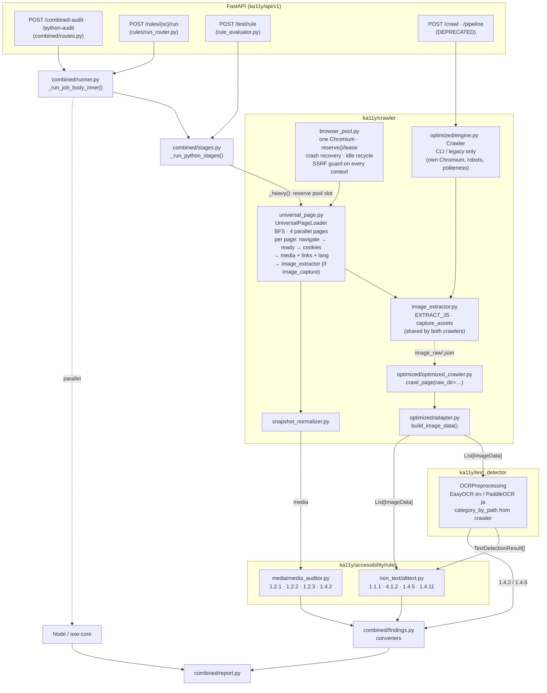
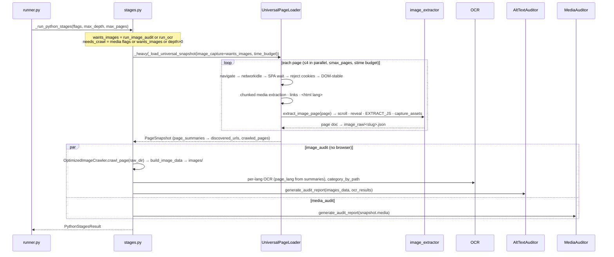

# ka11y-python — Crawlers and How the Python Rules Consume Them

Scope: `ka11y-python/ka11y/crawler/` and every module that turns crawler output
into WCAG findings. Reflects the working tree after the **crawler
consolidation of 2026-09-15** (Phases 0–4 of the improvement plan). For a
per-function walkthrough of the older layout see
`CODEBASE_WALKTHROUGH/04-MODULES-crawler.md`; this document is the end-to-end
*data pathway* view.

---

## 0. What changed in the consolidation (read this first)

| Before | After |
|--------|-------|
| Every default job navigated each page **twice**: the universal loader for media + links, then `optimized/engine.py` again for images, in a **second Chromium** it launched itself. | **One navigation per page.** The universal loader runs the image extractor + asset capture on the page it already loaded and writes engine-shaped page docs; the image stage only reads them. One Chromium, from the shared pool. |
| Two copies each of the SSRF guard, cookie rejection, and stealth context setup (engine vs. shared modules). | One implementation each. The engine imports `cookie_handler.handle_cookies` and `_ssrf_guard._host_is_blocked`; parity is locked in by tests. |
| Two semaphores guarding the same resource (`KA11Y_HEAVY_STAGE_CONCURRENCY` in stages, `KA11Y_MAX_BROWSERS` in the pool). | One knob: `KA11Y_MAX_BROWSER_CONTEXTS` (old names accepted as aliases). Stages reserve a pool slot; leases inside reuse it. |
| Pipeline-context and background-image extraction ran on every page with no consumer. | Off by default (`KA11Y_UNIVERSAL_PIPELINE_CONTEXTS`, `KA11Y_UNIVERSAL_BACKGROUND_IMAGES`). |
| Browser pool had no crash recovery; a dead Chromium failed every crawl until restart. | Pool relaunches a disconnected browser on the next lease and can recycle an oversized/old one between leases. |
| Anti-bot stealth (Chrome UA, locale/timezone, `navigator.webdriver` patch, launch flags) existed only in the engine; pooled contexts were fingerprintable, so the universal crawl could be served a challenge page. | Stealth lives in `context_factory.py` and applies to every pooled context and the pool's launch flags. The engine imports it. Verified on kao.com/global/en/: 356 elements, 50 image elements, 34 captured through the pool. (Cloudflare *managed* challenges, e.g. w3.org, still block any headless browser — same as before.) |
| Image artefacts landed in a sibling `<domain>_<ts>/` folder next to the job dir. | Under the job dir: `<job>/image_raw/` (page docs + captures) and `<job>/images/` (adapter copies, OCR output, `audit_report.csv`). |
| OCR category inferred from folder-name substrings. | Passed explicitly from the crawler's classification (`category_by_path`); the substring heuristic is the fallback only. |
| `ImageMetadata.compute_violations()`, `images_metadata`, an orphaned `_run_pipeline_stage` wrapper, stale tests and docs. | Removed / corrected. |
| No way to prove a refactor didn't change findings. | `scripts/findings_diff.py` + `scripts/fixtures/corpus.json` (capture golden findings, diff a candidate run); per-sub-stage timing rows (`image_crawl`, `ocr_scan`, `alt_audit`). |

Legacy `POST /api/v1/crawl/` and `/api/v1/pipeline/` still exist, are marked
deprecated in OpenAPI, log a warning per call, and still use the standalone
engine. Nothing in the UI or SDK calls them.

---

## 1. Crawler inventory

One crawler is on the combined-audit path. The engine remains for the CLI and
the deprecated routes.

| # | Crawler | Entry point | Browser | Produces | Consumed by |
|---|---------|-------------|---------|----------|-------------|
| 1 | **Universal page loader** (the combined-audit crawler) | `ka11y/crawler/universal_page.py` `UniversalPageLoader.load(image_capture=…)` | One leased context from `browser_pool` | `PageSnapshot` (media, links, page summaries with `<html lang>`, warnings) **plus**, when `image_capture`, one engine-shaped page doc per page under `image_raw/` with screenshots / downloaded assets | `SnapshotNormalizer` → `MediaAuditor` (1.2.1 / 1.2.2 / 1.2.3 / 1.4.2); `optimized/adapter.build_image_data` → OCR → `AltTextAccessibilityAuditor` (1.1.1 / 4.1.2 / 1.4.5 / 1.4.11) and OCR converters (1.4.3 / 1.4.6) |
| 2 | **Optimized image engine** (CLI / legacy only) | `ka11y/crawler/optimized/engine.py` `Crawler` (`python -m ka11y.crawler.optimized.engine <url>`) | Its own Chromium via `BrowserManager` + `ContextPool` | Same page docs, plus robots.txt handling, per-host politeness, resumable frontier | `OptimizedImageCrawler.crawl_page()` without `raw_dir` (legacy `/crawl`, `/pipeline`) |

Shared modules inside `ka11y/crawler/`:

| Module | Role |
|--------|------|
| `image_extractor.py` | **New.** The per-page image pipeline both crawlers call: `extract_image_page(page, url, depth, out_dir)` = scroll → reveal hidden images → lazy-load nudge → `EXTRACT_JS` single DOM walk (classification, accessible-name facts, image-of-text, contrast facts, OneTrust-scope drop) → `capture_assets` (icon/logo in-place screenshots + padded context shot for 1.4.11, overlay screenshots, concurrent downloads, carousel slide capture) → page doc. `write_page_doc` persists it as `<slug>.json`. Also owns `normalize_url`, `url_slug`, `registrable_domain`. No browser ownership, no frontier. |
| `browser_pool.py` | One lazy Playwright + one warm Chromium per process. `leased_context()` yields an isolated context; `reserve()` lets a stage hold one slot across nested leases. Crash recovery (`is_connected()` check → relaunch), idle recycling by RSS / age, `generation` counter. Shut down in FastAPI lifespan. |
| `context_factory.py` | `new_crawler_context()`: `ignore_https_errors` from config + SSRF guard on every pooled context. |
| `_ssrf_guard.py` | Route-level guard: private/reserved IPs, encoded-IP literals, IPv4-mapped IPv6, DNS rebinding with 30 s TTL. **Single implementation** (engine now imports it). |
| `navigation.py` | `navigate_with_resilience()`: DNS preflight + `goto` retries with backoff, typed `NavigationError`. |
| `cookie_handler.py` | Reject-only consent handling across frames + overlay removal. **Single implementation** (engine now imports it). |
| `policy.py` | `CrawlPolicy`: depth / pages / links-per-page, same-origin, URL normalisation. |
| `models.py` | `ImageData` — the record the image rules consume. (Legacy `ImageMetadata` removed.) |
| `media_crawler.py` | `MediaElementData` shape. |
| `snapshot_normalizer.py` | Validates `PageSnapshot.media` → `MediaElementData`, writes `universal_snapshot_normalized.json`. |
| `optimized/adapter.py` | `build_image_data(raw_dir, out_dir)`: page docs → `List[ImageData]`, copies pixels to `out_dir/<classification>/<sub_type>/` with a unique basename (the OCR join key). Unchanged — this is what made the consolidation low-risk. |
| `optimized/optimized_crawler.py` | `OptimizedImageCrawler`: `crawl_page(raw_dir=…)` = adapter only (combined path); `crawl_page()` = run the engine (legacy). `output_dir=` places everything under the job dir. |

---

## 2. Architecture diagram

### 2.1 Component view



### 2.2 Job sequence (combined audit, any depth)



---

## 3. Pathway A — universal snapshot → media rules

Unchanged in substance; the loader now also records `page_lang` and `images`
per page summary.

1. `_run_python_stages` (`stages.py`) computes `wants_images` and `needs_crawl`,
   then awaits `_heavy(_load_universal_snapshot(...))`. `_heavy` reserves one
   browser-pool slot first and arms the stage timeout after, so queueing for a
   slot never counts against the timeout.
2. `_load_universal_snapshot` builds a `CrawlPolicy` and calls
   `UniversalPageLoader.load(image_capture, image_raw_dir, time_budget_s)`.
3. `load()` leases one context, runs the parallel BFS, and stops launching new
   pages when `max_pages` **or** the time budget is hit (`partial=True`,
   `crawl_time_budget_exceeded` warning). In-flight pages finish.
4. Per page: `_prepare_page` (navigate, `networkidle`, SPA wait, cookie reject,
   DOM-stable) → chunked media extraction across same-origin frames → link
   extraction → `<html lang>` → **image step (see B)** → page summary.
   Ordering matters: the image step scrolls and clicks reveal controls, so it
   runs after everything that must see the page in its arrival state.
5. `SnapshotNormalizer` validates media into `MediaElementData`;
   `_stage_media_audit_universal` runs `MediaAuditor` and
   `_media_to_findings`.

---

## 4. Pathway B — image step → adapter → OCR → image rules

1. Inside the same page visit, `UniversalPageLoader._extract_images` calls
   `image_extractor.extract_image_page(page, resolved_url, depth, raw_dir,
   download_sem=shared)` — the exact engine-era sequence (`SCROLL_JS`,
   `reveal_hidden_images`, IntersectionObserver lazy-load nudge, `EXTRACT_JS`,
   `capture_assets`) — and persists the doc with `write_page_doc`. The
   download semaphore is shared across the crawl so 4 parallel pages cannot
   open 40 concurrent asset fetches. Failures become an
   `image_extract_failed` warning; the page's media data is kept.
2. `_stage_image_audit(raw_dir=<job>/image_raw, image_output_dir=<job>/images)`
   constructs `OptimizedImageCrawler(output_dir=…)` and calls
   `crawl_page(raw_dir=…)`, which is `build_image_data` only: copies captured
   pixels to `images/<classification>/<sub_type>/<prefix><md5(src)>.<ext>`
   (unique basenames = OCR join key), copies `ctx_*.png` context shots, maps
   name/context/flags into `ImageData`, returns `page_langs` from each doc's
   `page_lang`. Zero successful docs raises `ImageCrawlerNavigationError`.
3. OCR: `select_ocr_candidate_paths` applies the budget; paths are grouped by
   `_ocr_lang_for_page(page_langs[url], run_lang)`; each group runs
   `OCRPreprocessing(..., category_by_path=...)` in a thread. Sub-stage timing
   rows: `image_crawl`, `ocr_scan`, `ocr_save_reports`, `alt_audit`.
4. `AltTextAccessibilityAuditor.generate_audit_report` and the converters in
   `findings.py` — unchanged.

Direct callers: `rule_evaluator.py` (`POST /test/rule`) now also builds a
snapshot with `image_capture=True` into its temp dir and runs the image stage
from `raw_dir`, so the tester uses the pooled browser too.

---

## 5. Rule → crawler → field map

| WCAG SC | Auditor / converter | Producer | Inputs |
|---------|---------------------|----------|--------|
| 1.1.1 | `alttext._check_1_1_1_*` | universal + image_extractor | `alt_text`, `alt_present`, `classification`, `sub_type`, `is_*`, `aria_hidden`, `role`, `element_type`, `in_link`, `in_button`, `in_labeled_control`, `has_own_text_content`, figure/longdesc fields, `capture_status`, OCR by `filename` |
| 4.1.2 (images) | `alttext._check_4_1_2` | same | functional images: `alt_text`, `title`, `is_logo/icon/button` |
| 1.4.5 | `alttext._check_1_4_5` | same + OCR | `is_text_image`, OCR detections, `is_logo` |
| 1.4.11 | `alttext._check_1_4_11` | same | `screenshot_path`, `full_page_screenshot_path` (`ctx_*.png`), `page_bbox` |
| 1.4.3 / 1.4.6 | OCR + `contrast_analyser` → converters | same (screenshots) | pixels, `page_langs`, `filename` join key, `category_by_path` |
| 1.2.1 / 1.2.2 / 1.2.3 / 1.4.2 | `MediaAuditor` | universal media extractor | `MediaElementData` fields |

---

## 6. Entry points

| Route | Path into crawlers |
|-------|--------------------|
| `POST /api/v1/combined/combined-audit`, `/python-audit` | `_run_job` → `_run_python_stages` → one universal crawl (with images) |
| `POST /api/v1/rules/{sc}/run` | same, with one rule's flag on |
| `POST /api/v1/test/rule` | `_load_universal_snapshot` (media rules: cached per URL; image rules: with `image_capture=True`) |
| `POST /api/v1/crawl/`, `/api/v1/pipeline/` | **Deprecated.** Standalone engine, own Chromium, different output shape. |
| CLI `python -m ka11y.crawler.optimized.engine` | Engine only; writes page docs + `crawl_state.jsonl`. |

---

## 7. Safety net and how to use it

- **Golden findings.** Before touching crawler code:
  `python scripts/findings_diff.py capture --fixtures scripts/fixtures/corpus.json --out scripts/fixtures/golden`
  against a running API. After the change, capture to another dir and
  `python scripts/findings_diff.py diff scripts/fixtures/golden <candidate> -v`.
  Findings are keyed by `(sc, page_url, element key)` and compared on status
  only. Media findings should be zero-delta; image findings need review when
  the readiness protocol changes.
- **Timing.** `crawler_timings.log` (per job) plus `stage_timings` rows with
  sub-stages `image_crawl`, `ocr_scan`, `alt_audit`; `GET /{job_id}/timings`.
- **Live verification (2026-09-15).** `POST /python-audit` on
  `https://www.kao.com/global/en/` through the local API: one universal
  crawl of 29.7 s (356 elements, 50 image elements, 35 captured), image
  stage crawl 0.03 s (adapter only), OCR 102 s on 20 candidates, alt audit
  51 rows; 133 Python findings → 94 after level filter (6 fail, 32 needs
  review, 56 pass) across 1.1.1, 1.2.x, 1.4.3/5/6/11, 4.1.2.
- **Test-suite isolation.** `tests/conftest.py` now points `KA11Y_DB_PATH` /
  `KA11Y_ASSET_DIR` at a temp store. Before that, any test booting the app
  lifespan started a dispatcher on the checkout's real `logs/ka11y.db` and
  crash-recovered (re-ran) whatever a dev server on the same checkout was
  running at the time.
- **Tests that pin the consolidation.** `tests/test_image_extractor.py`
  (doc shape, shared download semaphore, SSRF check, engine re-exports),
  `tests/test_universal_image_capture.py` (real Chromium: one visit → media +
  image docs → adapter), `tests/test_browser_pool.py` (crash relaunch,
  `reserve()` single-slot, idle-only recycle), `tests/test_ssrf_guard.py`
  (engine-era blocklist parity), `tests/test_findings_diff.py`.

---

## 8. Output directory layout (combined job)

```
<config.input.output_dir>/<domain>_<MMDD_HHMM>_<job8>_combined/
├── universal_snapshot_raw.json · universal_snapshot_normalized.json · universal_snapshot_warnings.json
├── crawler_timings.log · combined_execution_steps.jsonl · combined_report.json
├── audit_media_report.csv
├── image_raw/                      ← universal loader + image_extractor
│   ├── <slug>.json                 one engine-shaped doc per page
│   ├── screenshots/<slug>/…        element / context / carousel captures
│   └── assets/<slug>/…             downloaded originals
└── images/                         ← OptimizedImageCrawler(output_dir) + adapter
    ├── informative/ decorative/ functional/{buttons,icons,logos,images}/ complex/{charts,emojis}/
    ├── metadata/images_data.json · images_report.json · images_with_alt_text.csv
    ├── text_detected/{button_text,informational_text,logo_text,with_text,contrast}/
    └── audit_report.csv
```

---

## 9. Tuning knobs

| Knob | Default | Affects |
|------|---------|---------|
| `max_depth`, `max_pages`, `internal_links` (request) | 0 / 20 / true | The one crawl |
| `KA11Y_MAX_BROWSER_CONTEXTS` (aliases `KA11Y_MAX_BROWSERS`, `KA11Y_HEAVY_STAGE_CONCURRENCY`) | 2 | Concurrent contexts on the pooled Chromium = concurrent crawls |
| `KA11Y_BROWSER_MAX_MEMORY_MB`, `KA11Y_BROWSER_MAX_LIFETIME_S` | 0 (off) | Idle recycling of the pooled Chromium |
| `KA11Y_UNIVERSAL_PARALLEL_PAGES` | 4 | Pages in flight per crawl |
| `KA11Y_IMAGE_CRAWL_PER_PAGE_SECONDS`, `KA11Y_IMAGE_CRAWL_TIMEOUT_CEILING` | 20 s / 600 s | Crawl time budget `max(300, min(per_page × pages, ceiling))` |
| `crawler.performance.max_ocr_images_*` (config) | 60 / 60 / 3000 | OCR budget |
| `KA11Y_OCR_WORKERS` | 4 | OCR thread pool |
| `KA11Y_UNIVERSAL_PIPELINE_CONTEXTS`, `KA11Y_UNIVERSAL_BACKGROUND_IMAGES` | 0 | Dormant extractors |
| `crawler.concurrency`, `crawler.delay` (config) | 4 / 1.0 s | Engine only (CLI / deprecated routes) |

---

## 10. Known remaining rough edges

- The engine's `EXTRACT_JS` ran after `domcontentloaded` + its own scroll; it
  now runs after the universal loader's stricter readiness (networkidle + SPA
  wait + DOM-stable) **and** the same scroll/reveal steps. Expect small,
  reviewable deltas in image findings on pages with late-loading content
  (usually more images found, not fewer). Use the golden diff.
- `reveal_hidden_images` clicks `.nav-link` and `[aria-label*="next"]` style
  controls; on a page where such a control is a real link it navigates away,
  exactly as the engine always did. Media/link data is unaffected because it
  is extracted first.
- `accessibility/pipeline/` (DecisionEngine + policies) is still in the tree,
  dormant. Delete it or re-wire it; do not leave it half-on.
- The OCR ↔ image join is still the file basename. It is unique by
  construction (`adapter._unique_basename`) and `category_by_path` removes the
  path-substring dependency, but a stable image id carried end-to-end would be
  cleaner.
